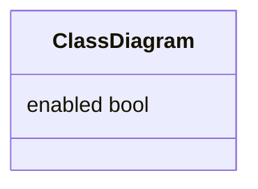
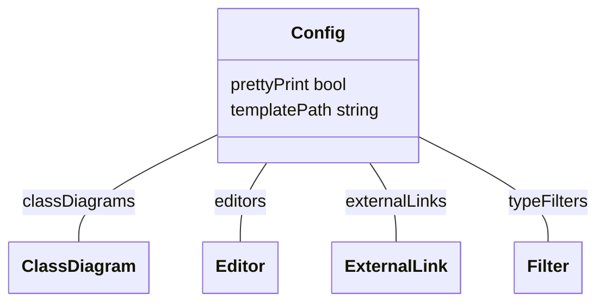
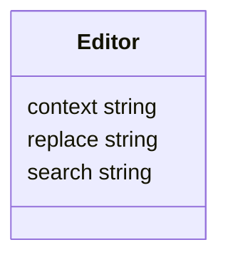
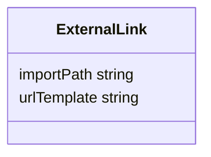
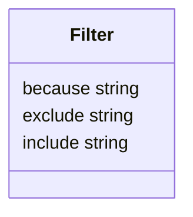

config
======

| Metadata             | Value                                                |
|----------------------|------------------------------------------------------|
| Group                |                                                      |
| Version              |                                                      |
| Module               | github.com/theunrepentantgeek/crddoc/internal/config |
| Property Optionality |                                                      |

ClassDiagram
-------------------------------------

ClassDiagram captures all the configuration available for class diagrams.

Used by: [Config.classDiagrams](#Config).

| Property | Description                                                                                                        | Type |
|----------|--------------------------------------------------------------------------------------------------------------------|------|
| enabled  | Enabled turns class diagram generation on. Defaults to true if any class diagram options are set, false otherwise. | bool |

Config
-------------------------

| Property      | Description                                                                                                                                                  | Type                            |
|---------------|--------------------------------------------------------------------------------------------------------------------------------------------------------------|---------------------------------|
| classDiagrams | ClassDiagrams allow you to add class diagrams to the documentation.                                                                                          | [ClassDiagram](#ClassDiagram)   |
| editors       | Editors allow you to make precision changes to the documentation output. Editors are applied in the order specified.                                         | [Editor[]](#Editor)             |
| externalLinks | ExternalLinks allow you to add links to external documentation.                                                                                              | [ExternalLink[]](#ExternalLink) |
| prettyPrint   | PrettyPrint controls whether the Markdown output is pretty-printed or not. Defaults to true.                                                                 | bool                            |
| templatePath  | TemplatePath is the path to a folder containing templates to use for rendering the documentation.                                                            | string                          |
| typeFilters   | TypeFilters allow you to filter out types from the output. Filters are applied in the order specified, with earlier filters taking priority over later ones. | [Filter[]](#Filter)             |

Editor
-------------------------

Editor represents a point modification to make to exported documentation.

Used by: [Config.editors](#Config).

| Property | Description                                                                                                                                                     | Type   |
|----------|-----------------------------------------------------------------------------------------------------------------------------------------------------------------|--------|
| context  | Context is a regex identifying a substring to modify, limiting the scope of the search and replace. If omitted, the entire string is eligible for modification. | string |
| replace  | Replace is the string to substitute for the search regex.                                                                                                       | string |
| search   | Search is a regex identifying a substring to replace.                                                                                                           | string |

ExternalLink
-------------------------------------

Used by: [Config.externalLinks](#Config).

| Property    | Description                                                            | Type   |
|-------------|------------------------------------------------------------------------|--------|
| importPath  | ImportPath is the import path for the package that the link points to. | string |
| urlTemplate | URLTemplate is a template for the URL to the package documentation.    | string |

Filter
-------------------------

Used by: [Config.typeFilters](#Config).

| Property | Description                                                                     | Type   |
|----------|---------------------------------------------------------------------------------|--------|
| because  | Because is an explanation of why this filter is being applied and what it does. | string |
| exclude  | Exclude is a glob identifying types to exclude from the output.                 | string |
| include  | Include is a glob identifying types to include in the output.                   | string |
