model
=====

| Metadata             | Value                                               |
|----------------------|-----------------------------------------------------|
| Group                |                                                     |
| Version              |                                                     |
| Module               | github.com/theunrepentantgeek/crddoc/internal/model |
| Property Optionality |                                                     |

DeclarationType
-------------------------------------------

| Value      | Description |
|------------|-------------|
| "Resource" |             |
| "Object"   |             |
| "Enum"     |             |

Enum
---------------------

Used by: [Package.enums](#Package), and [PackageBuilder.Enums](#PackageBuilder).

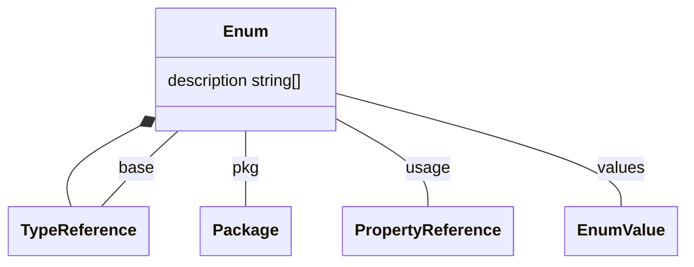

| Property                        | Description | Type                                      |
|---------------------------------|-------------|-------------------------------------------|
| [TypeReference](#TypeReference) |             |                                           |
| base                            |             | [TypeReference](#TypeReference)           |
| description                     |             | string[]                                  |
| pkg                             |             | [Package](#Package)                       |
| usage                           |             | [PropertyReference[]](#PropertyReference) |
| values                          |             | [EnumValue[]](#EnumValue)                 |

EnumValue
-------------------------------

Used by: [Enum.values](#Enum).

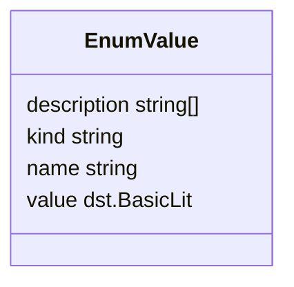

| Property    | Description | Type         |
|-------------|-------------|--------------|
| description |             | string[]     |
| kind        |             | string       |
| name        |             | string       |
| value       |             | dst.BasicLit |

ImportReference
-------------------------------------------

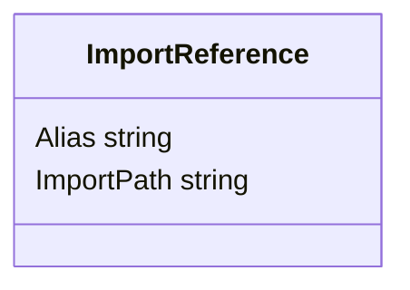

| Property   | Description | Type   |
|------------|-------------|--------|
| Alias      |             | string |
| ImportPath |             | string |

Markers
---------------------------

Used by: [Markers.children](#Markers).

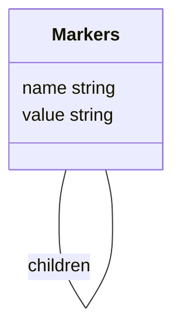

| Property | Description | Type                           |
|----------|-------------|--------------------------------|
| children |             | [map[string]Markers](#Markers) |
| name     |             | string                         |
| value    |             | string                         |

MarkerValue
-----------------------------------

MarkerValue captures the value of a specific marker read from the source code.

Used by: [PackageMarkers.group](#PackageMarkers), and [PackageMarkers.version](#PackageMarkers).

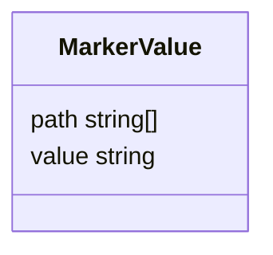

| Property | Description | Type     |
|----------|-------------|----------|
| path     |             | string[] |
| value    |             | string   |

Object
-------------------------

Used by: [Package.objects](#Package), and [PackageBuilder.Objects](#PackageBuilder).

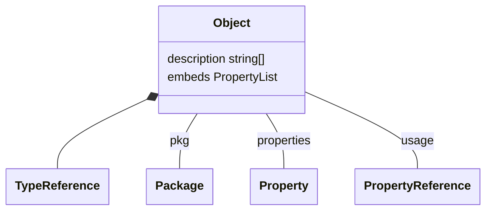

| Property                        | Description | Type                                      |
|---------------------------------|-------------|-------------------------------------------|
| [TypeReference](#TypeReference) |             |                                           |
| description                     |             | string[]                                  |
| embeds                          |             | PropertyList                              |
| pkg                             |             | [Package](#Package)                       |
| properties                      |             | [map[string]Property](#Property)          |
| usage                           |             | [PropertyReference[]](#PropertyReference) |

Order
-----------------------

Package
---------------------------

Package is a struct containing all of the declarations found in a package directory.

Used by: [Enum.pkg](#Enum), and [Object.pkg](#Object).

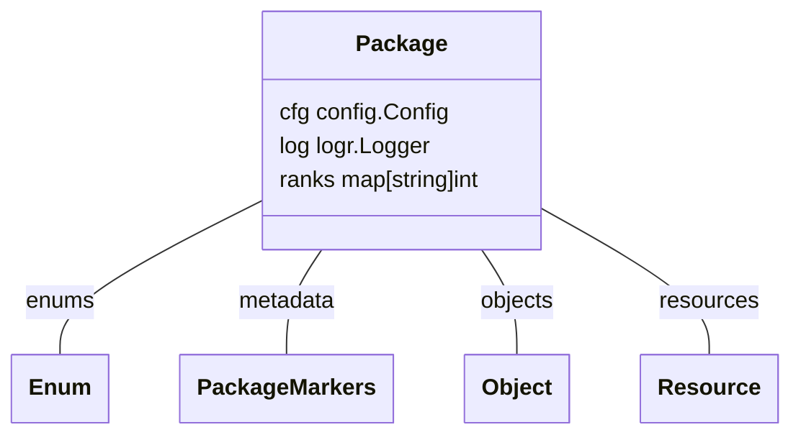

| Property  | Description | Type                              |
|-----------|-------------|-----------------------------------|
| cfg       |             | config.Config                     |
| enums     |             | [map[string]Enum](#Enum)          |
| log       |             | logr.Logger                       |
| metadata  |             | [PackageMarkers](#PackageMarkers) |
| objects   |             | [map[string]Object](#Object)      |
| ranks     |             | map[string]int                    |
| resources |             | [map[string]Resource](#Resource)  |

PackageBuilder
-----------------------------------------

PackageBuilder is a builder for Package instances.

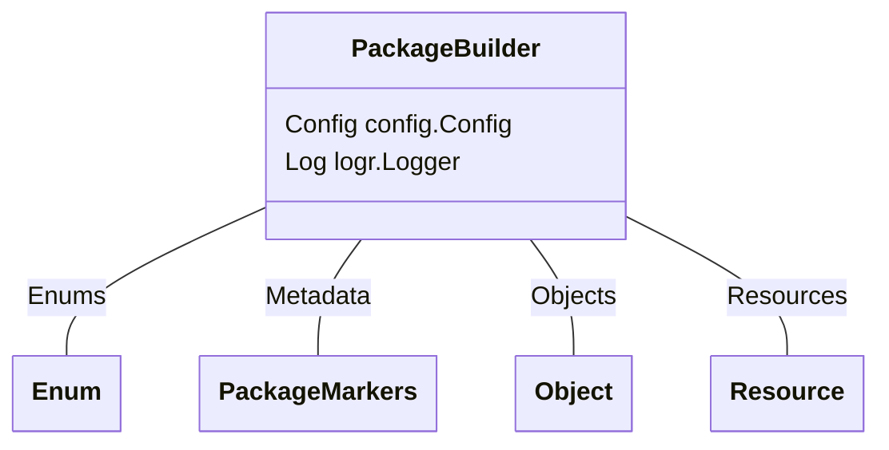

| Property  | Description | Type                              |
|-----------|-------------|-----------------------------------|
| Config    |             | config.Config                     |
| Enums     |             | [Enum[]](#Enum)                   |
| Log       |             | logr.Logger                       |
| Metadata  |             | [PackageMarkers](#PackageMarkers) |
| Objects   |             | [Object[]](#Object)               |
| Resources |             | [Resource[]](#Resource)           |

PackageMarkers
-----------------------------------------

PackageMarkers captures specific package markers read from the source code.

Used by: [Package.metadata](#Package), and [PackageBuilder.Metadata](#PackageBuilder).

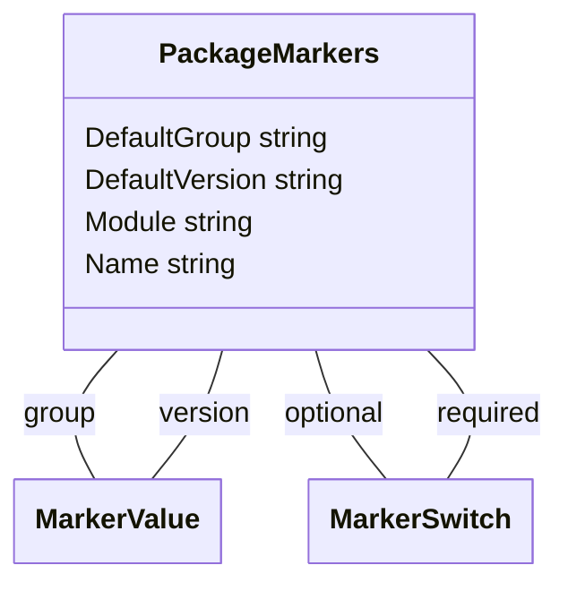

| Property       | Description | Type                          |
|----------------|-------------|-------------------------------|
| DefaultGroup   |             | string                        |
| DefaultVersion |             | string                        |
| group          |             | [MarkerValue](#MarkerValue)   |
| Module         |             | string                        |
| Name           |             | string                        |
| optional       |             | [MarkerSwitch](#MarkerSwitch) |
| required       |             | [MarkerSwitch](#MarkerSwitch) |
| version        |             | [MarkerValue](#MarkerValue)   |

PropertyReference
-----------------------------------------------

Used by: [Enum.usage](#Enum), and [Object.usage](#Object).

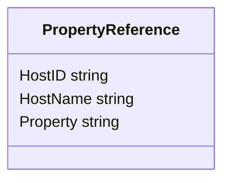

| Property | Description | Type   |
|----------|-------------|--------|
| HostID   |             | string |
| HostName |             | string |
| Property |             | string |

Resource
-----------------------------

Used by: [Package.resources](#Package), and [PackageBuilder.Resources](#PackageBuilder).

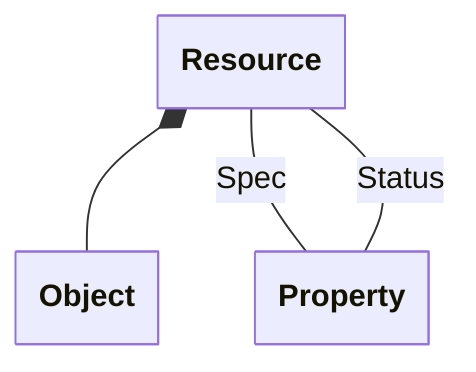

| Property          | Description | Type                  |
|-------------------|-------------|-----------------------|
| [Object](#Object) |             |                       |
| Spec              |             | [Property](#Property) |
| Status            |             | [Property](#Property) |

### Property

| Property    | Description | Type                                |
|-------------|-------------|-------------------------------------|
| DeclaredOn  |             | PropertyContainer                   |
| description |             | string[]                            |
| Field       |             | string                              |
| markers     |             | [PropertyMarkers](#PropertyMarkers) |
| Name        |             | string                              |
| Type        |             | [TypeReference](#TypeReference)     |

### Property

| Property    | Description | Type                                |
|-------------|-------------|-------------------------------------|
| DeclaredOn  |             | PropertyContainer                   |
| description |             | string[]                            |
| Field       |             | string                              |
| markers     |             | [PropertyMarkers](#PropertyMarkers) |
| Name        |             | string                              |
| Type        |             | [TypeReference](#TypeReference)     |

Property
-----------------------------

Used by: [Object.properties](#Object), [Resource.Spec](#Resource), and [Resource.Status](#Resource).

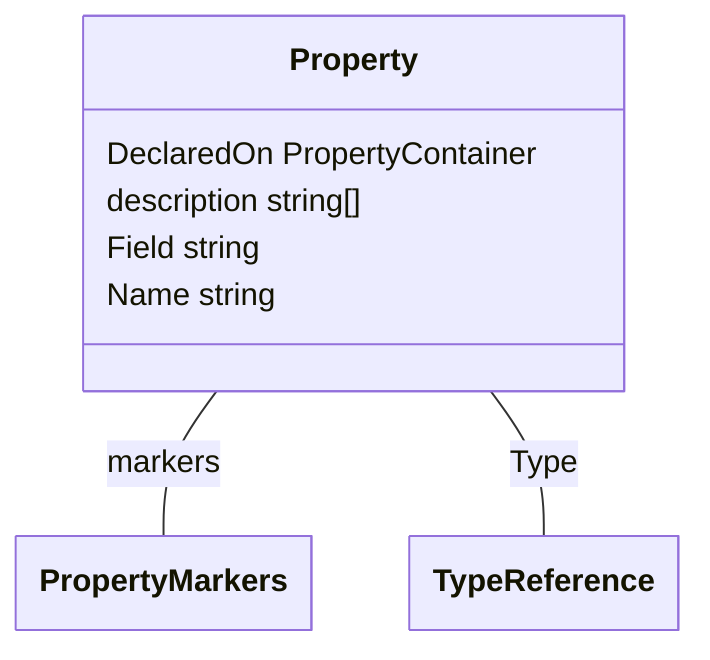

| Property    | Description | Type                                |
|-------------|-------------|-------------------------------------|
| DeclaredOn  |             | PropertyContainer                   |
| description |             | string[]                            |
| Field       |             | string                              |
| markers     |             | [PropertyMarkers](#PropertyMarkers) |
| Name        |             | string                              |
| Type        |             | [TypeReference](#TypeReference)     |

PropertyMarkers
-------------------------------------------

Used by: [Property.markers](#Property).

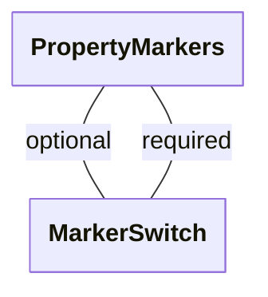

| Property | Description | Type                          |
|----------|-------------|-------------------------------|
| optional |             | [MarkerSwitch](#MarkerSwitch) |
| required |             | [MarkerSwitch](#MarkerSwitch) |

TypeReference
---------------------------------------

Used by: [Enum.base](#Enum), and [Property.Type](#Property).

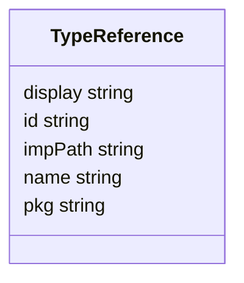

| Property | Description | Type   |
|----------|-------------|--------|
| display  |             | string |
| id       |             | string |
| impPath  |             | string |
| name     |             | string |
| pkg      |             | string |

MarkerSwitch
-------------------------------------

MarkerSwitch captures the presence of a specific marker read from the source code.

Used by: [PackageMarkers.optional](#PackageMarkers), [PackageMarkers.required](#PackageMarkers), [PropertyMarkers.optional](#PropertyMarkers), and [PropertyMarkers.required](#PropertyMarkers).

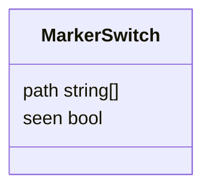

| Property | Description | Type     |
|----------|-------------|----------|
| path     |             | string[] |
| seen     |             | bool     |
