model
=====

| Metadata             | Value                                               |
|----------------------|-----------------------------------------------------|
| Group                |                                                     |
| Version              |                                                     |
| Module               | github.com/theunrepentantgeek/crddoc/internal/model |
| Property Optionality |                                                     |

DeclarationType
-------------------------------------------

| Value      | Description |
|------------|-------------|
| "Resource" |             |
| "Object"   |             |
| "Enum"     |             |

Enum
---------------------

Used by: [Package.enums](#Package), and [PackageBuilder.Enums](#PackageBuilder).

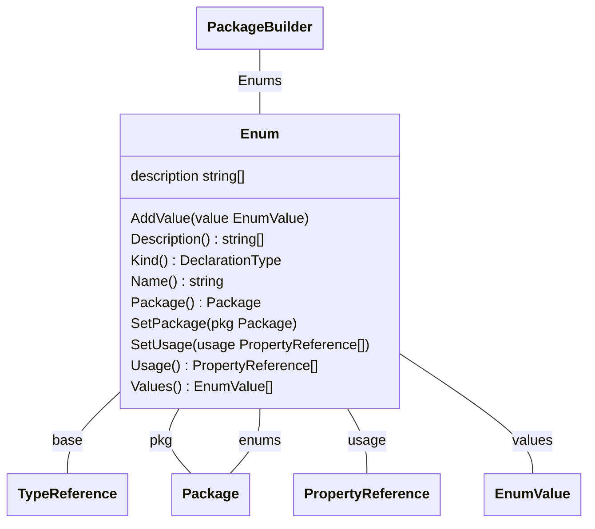

| Property                        | Description | Type                                      |
|---------------------------------|-------------|-------------------------------------------|
| [TypeReference](#TypeReference) |             |                                           |
| base                            |             | [TypeReference](#TypeReference)           |
| description                     |             | string[]                                  |
| pkg                             |             | [Package](#Package)                       |
| usage                           |             | [PropertyReference[]](#PropertyReference) |
| values                          |             | [EnumValue[]](#EnumValue)                 |

### Functions

| Function    | Description | Parameters                | Returns             |
|-------------|-------------|---------------------------|---------------------|
| AddValue    |             | value EnumValue           |                     |
| Description |             |                           | string[]            |
| Kind        |             |                           | DeclarationType     |
| Name        |             |                           | string              |
| Package     |             |                           | Package             |
| SetPackage  |             | pkg Package               |                     |
| SetUsage    |             | usage PropertyReference[] |                     |
| Usage       |             |                           | PropertyReference[] |
| Values      |             |                           | EnumValue[]         |

EnumValue
-------------------------------

Used by: [Enum.values](#Enum).

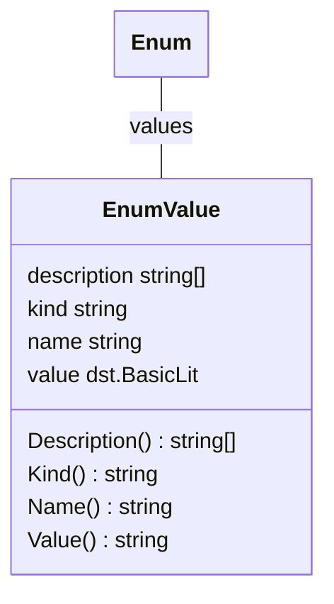

| Property    | Description | Type         |
|-------------|-------------|--------------|
| description |             | string[]     |
| kind        |             | string       |
| name        |             | string       |
| value       |             | dst.BasicLit |

### Functions

| Function    | Description | Parameters | Returns  |
|-------------|-------------|------------|----------|
| Description |             |            | string[] |
| Kind        |             |            | string   |
| Name        |             |            | string   |
| Value       |             |            | string   |

Function
-----------------------------

Function represents a method declared on a struct type.

Used by: [Object.functions](#Object).

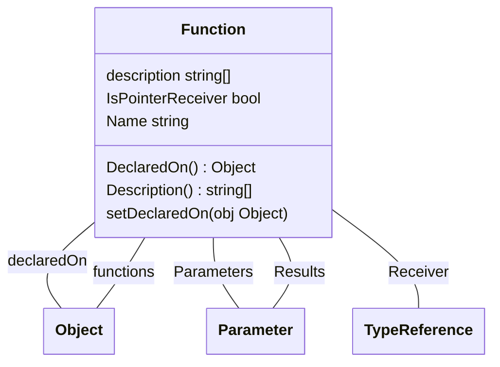

| Property          | Description | Type                            |
|-------------------|-------------|---------------------------------|
| declaredOn        |             | [Object](#Object)               |
| description       |             | string[]                        |
| IsPointerReceiver |             | bool                            |
| Name              |             | string                          |
| Parameters        |             | [Parameter[]](#Parameter)       |
| Receiver          |             | [TypeReference](#TypeReference) |
| Results           |             | [Parameter[]](#Parameter)       |

### Functions

| Function      | Description                                                 | Parameters | Returns  |
|---------------|-------------------------------------------------------------|------------|----------|
| DeclaredOn    | DeclaredOn returns the object this function is declared on. |            | Object   |
| Description   | Description returns the description of the function.        |            | string[] |
| setDeclaredOn | setDeclaredOn sets the object this function is declared on. | obj Object |          |

ImportReference
-------------------------------------------

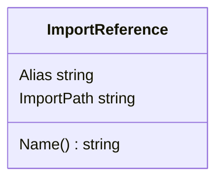

| Property   | Description | Type   |
|------------|-------------|--------|
| Alias      |             | string |
| ImportPath |             | string |

### Functions

| Function | Description | Parameters | Returns |
|----------|-------------|------------|---------|
| Name     |             |            | string  |

Markers
---------------------------

Used by: [Markers.children](#Markers).

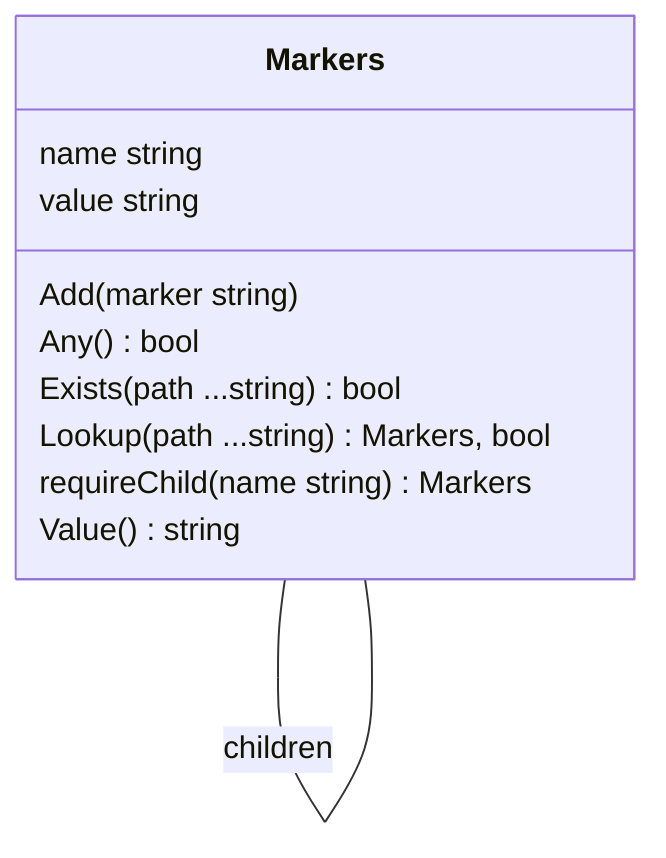

| Property | Description | Type                           |
|----------|-------------|--------------------------------|
| children |             | [map[string]Markers](#Markers) |
| name     |             | string                         |
| value    |             | string                         |

### Functions

| Function     | Description                                                | Parameters     | Returns       |
|--------------|------------------------------------------------------------|----------------|---------------|
| Add          | Add a marker to the list.                                  | marker string  |               |
| Any          |                                                            |                | bool          |
| Exists       | Exists returns true if the marker exists.                  | path ...string | bool          |
| Lookup       | Lookup a marker value by path, returning the final marker. | path ...string | Markers, bool |
| requireChild |                                                            | name string    | Markers       |
| Value        |                                                            |                | string        |

MarkerValue
-----------------------------------

MarkerValue captures the value of a specific marker read from the source code.

Used by: [PackageMarkers.group](#PackageMarkers), and [PackageMarkers.version](#PackageMarkers).

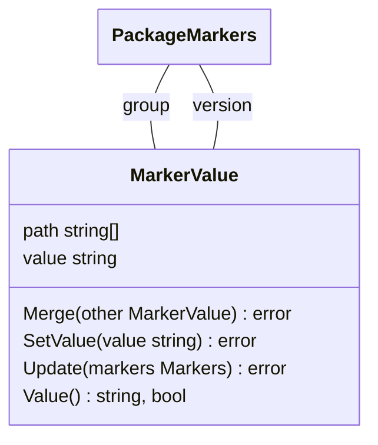

| Property | Description | Type     |
|----------|-------------|----------|
| path     |             | string[] |
| value    |             | string   |

### Functions

| Function | Description                                                                                                                                                              | Parameters        | Returns      |
|----------|--------------------------------------------------------------------------------------------------------------------------------------------------------------------------|-------------------|--------------|
| Merge    | Merge combines the supplied MetadataValue with the current one, returning an error if the values differ.                                                                 | other MarkerValue | error        |
| SetValue |                                                                                                                                                                          | value string      | error        |
| Update   | Update reads the value from the passed set of markers, updating the value if found. If a new value is found that's different from the current value, we return an error. | markers Markers   | error        |
| Value    | Value returns the current value of the metadata, if known.                                                                                                               |                   | string, bool |

Object
-------------------------

Used by: [Function.declaredOn](#Function), [Package.objects](#Package), and [PackageBuilder.Objects](#PackageBuilder).

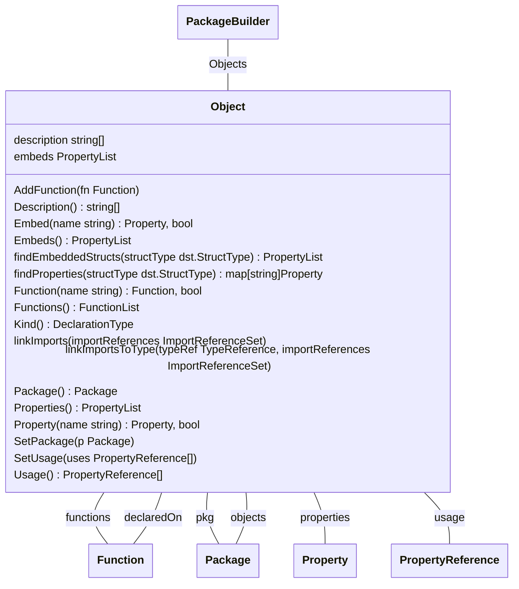

| Property                        | Description | Type                                      |
|---------------------------------|-------------|-------------------------------------------|
| [TypeReference](#TypeReference) |             |                                           |
| description                     |             | string[]                                  |
| embeds                          |             | PropertyList                              |
| functions                       |             | [map[string]Function](#Function)          |
| pkg                             |             | [Package](#Package)                       |
| properties                      |             | [map[string]Property](#Property)          |
| usage                           |             | [PropertyReference[]](#PropertyReference) |

### Functions

| Function            | Description                                                                                | Parameters                                                     | Returns             |
|---------------------|--------------------------------------------------------------------------------------------|----------------------------------------------------------------|---------------------|
| AddFunction         | AddFunction adds a function to the object.                                                 | fn Function                                                    |                     |
| Description         |                                                                                            |                                                                | string[]            |
| Embed               | Embed returns the embed with the given name and true, or nil and false if not found.       | name string                                                    | Property, bool      |
| Embeds              | Embeds returns all of the embeds of the object, in alphabetical order.                     |                                                                | PropertyList        |
| findEmbeddedStructs |                                                                                            | structType dst.StructType                                      | PropertyList        |
| findProperties      |                                                                                            | structType dst.StructType                                      | map[string]Property |
| Function            | Function returns the function with the given name and true, or nil and false if not found. | name string                                                    | Function, bool      |
| Functions           | Functions returns all the functions/methods of the object, in alphabetical order.          |                                                                | FunctionList        |
| Kind                |                                                                                            |                                                                | DeclarationType     |
| linkImports         |                                                                                            | importReferences ImportReferenceSet                            |                     |
| linkImportsToType   | linkImportsToType links a single TypeReference to its import path if available.            | typeRef TypeReference, importReferences ImportReferenceSet |                     |
| Package             |                                                                                            |                                                                | Package             |
| Properties          | Properties returns all the properties of the object, in alphabetical order.                |                                                                | PropertyList        |
| Property            | Property returns the property with the given name and true, or nil and false if not found. | name string                                                    | Property, bool      |
| SetPackage          |                                                                                            | p Package                                                      |                     |
| SetUsage            |                                                                                            | uses PropertyReference[]                                       |                     |
| Usage               |                                                                                            |                                                                | PropertyReference[] |

Order
-----------------------

Package
---------------------------

Package is a struct containing all of the declarations found in a package directory.

Used by: [Enum.pkg](#Enum), and [Object.pkg](#Object).

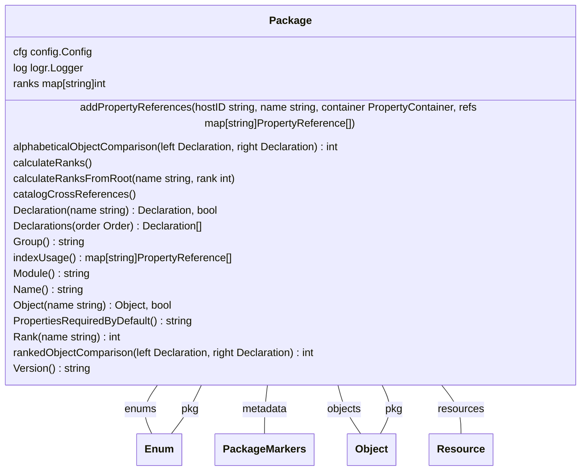

| Property  | Description | Type                              |
|-----------|-------------|-----------------------------------|
| cfg       |             | config.Config                     |
| enums     |             | [map[string]Enum](#Enum)          |
| log       |             | logr.Logger                       |
| metadata  |             | [PackageMarkers](#PackageMarkers) |
| objects   |             | [map[string]Object](#Object)      |
| ranks     |             | map[string]int                    |
| resources |             | [map[string]Resource](#Resource)  |

### Functions

| Function                     | Description                                                                                                                                              | Parameters                                                                                               | Returns                        |
|------------------------------|----------------------------------------------------------------------------------------------------------------------------------------------------------|----------------------------------------------------------------------------------------------------------|--------------------------------|
| addPropertyReferences        |                                                                                                                                                          | hostID string, name string, container PropertyContainer, refs map[string]PropertyReference[] |                                |
| alphabeticalObjectComparison |                                                                                                                                                          | left Declaration, right Declaration                                                                  | int                            |
| calculateRanks               | calculateRanks calculates the ranks of all declarations in the package. The rank is the depth from the root resource, with resources having a rank of 0. |                                                                                                          |                                |
| calculateRanksFromRoot       |                                                                                                                                                          | name string, rank int                                                                                |                                |
| catalogCrossReferences       |                                                                                                                                                          |                                                                                                          |                                |
| Declaration                  | Declaration returns the declaration with the given name, if found.                                                                                       | name string                                                                                              | Declaration, bool              |
| Declarations                 |                                                                                                                                                          | order Order                                                                                              | Declaration[]                  |
| Group                        | Group returns the group of the package, if known.                                                                                                        |                                                                                                          | string                         |
| indexUsage                   |                                                                                                                                                          |                                                                                                          | map[string]PropertyReference[] |
| Module                       | Module returns the module of the package.                                                                                                                |                                                                                                          | string                         |
| Name                         |                                                                                                                                                          |                                                                                                          | string                         |
| Object                       | Object returns the object with the given name, if there is one.                                                                                          | name string                                                                                              | Object, bool                   |
| PropertiesRequiredByDefault  |                                                                                                                                                          |                                                                                                          | string                         |
| Rank                         | Rank returns the usage rank (depth from the root resource) of the given declaration.                                                                     | name string                                                                                              | int                            |
| rankedObjectComparison       |                                                                                                                                                          | left Declaration, right Declaration                                                                  | int                            |
| Version                      | Version returns the version of the package, if known.                                                                                                    |                                                                                                          | string                         |

PackageBuilder
-----------------------------------------

PackageBuilder is a builder for Package instances.

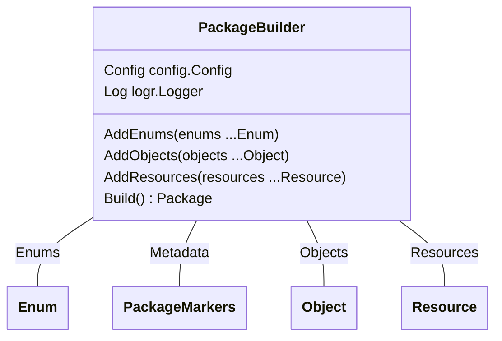

| Property  | Description | Type                              |
|-----------|-------------|-----------------------------------|
| Config    |             | config.Config                     |
| Enums     |             | [Enum[]](#Enum)                   |
| Log       |             | logr.Logger                       |
| Metadata  |             | [PackageMarkers](#PackageMarkers) |
| Objects   |             | [map[string]Object](#Object)      |
| Resources |             | [Resource[]](#Resource)           |

### Functions

| Function     | Description                                   | Parameters            | Returns |
|--------------|-----------------------------------------------|-----------------------|---------|
| AddEnums     | AddEnums adds enums to the builder.           | enums ...Enum         |         |
| AddObjects   | AddObjects adds objects to the builder.       | objects ...Object     |         |
| AddResources | AddResources adds resources to the builder.   | resources ...Resource |         |
| Build        | Build creates a new Package from the builder. |                       | Package |

PackageMarkers
-----------------------------------------

PackageMarkers captures specific package markers read from the source code.

Used by: [Package.metadata](#Package), and [PackageBuilder.Metadata](#PackageBuilder).

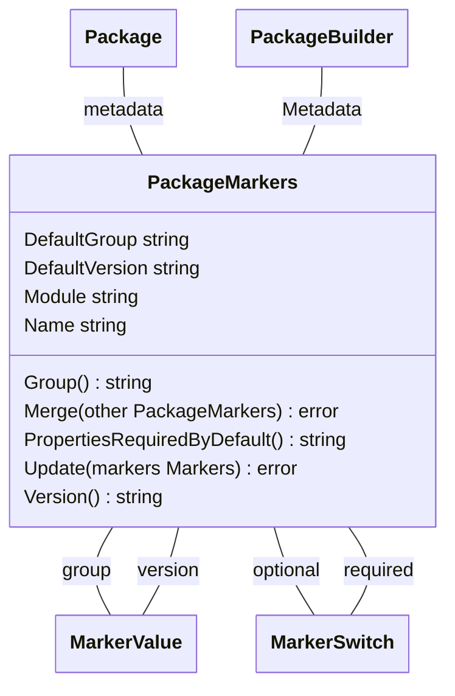

| Property       | Description | Type                          |
|----------------|-------------|-------------------------------|
| DefaultGroup   |             | string                        |
| DefaultVersion |             | string                        |
| group          |             | [MarkerValue](#MarkerValue)   |
| Module         |             | string                        |
| Name           |             | string                        |
| optional       |             | [MarkerSwitch](#MarkerSwitch) |
| required       |             | [MarkerSwitch](#MarkerSwitch) |
| version        |             | [MarkerValue](#MarkerValue)   |

### Functions

| Function                    | Description                                                                                                                      | Parameters           | Returns |
|-----------------------------|----------------------------------------------------------------------------------------------------------------------------------|----------------------|---------|
| Group                       | Group returns the group of the package, using the configured controller-runtime marker if set, or the directory name if not.     |                      | string  |
| Merge                       |                                                                                                                                  | other PackageMarkers | error   |
| PropertiesRequiredByDefault |                                                                                                                                  |                      | string  |
| Update                      |                                                                                                                                  | markers Markers      | error   |
| Version                     | Version returns the version of the package, using the configured controller-runtime marker if set, or the directory name if not. |                      | string  |

Parameter
-------------------------------

Parameter represents a function parameter or return value.

Used by: [Function.Parameters](#Function), and [Function.Results](#Function).

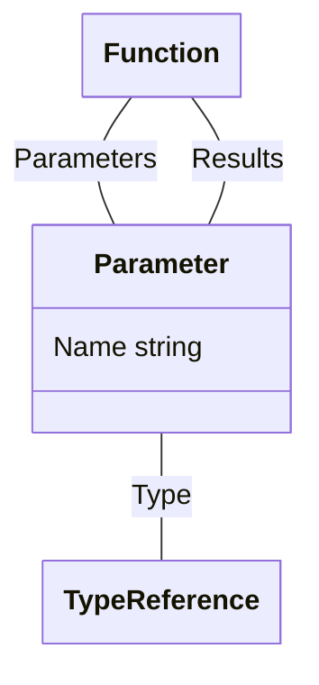

| Property | Description | Type                            |
|----------|-------------|---------------------------------|
| Name     |             | string                          |
| Type     |             | [TypeReference](#TypeReference) |

PropertyReference
-----------------------------------------------

Used by: [Enum.usage](#Enum), and [Object.usage](#Object).

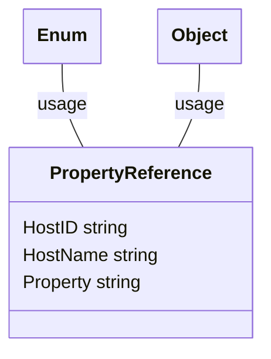

| Property | Description | Type   |
|----------|-------------|--------|
| HostID   |             | string |
| HostName |             | string |
| Property |             | string |

Resource
-----------------------------

Used by: [Package.resources](#Package), and [PackageBuilder.Resources](#PackageBuilder).

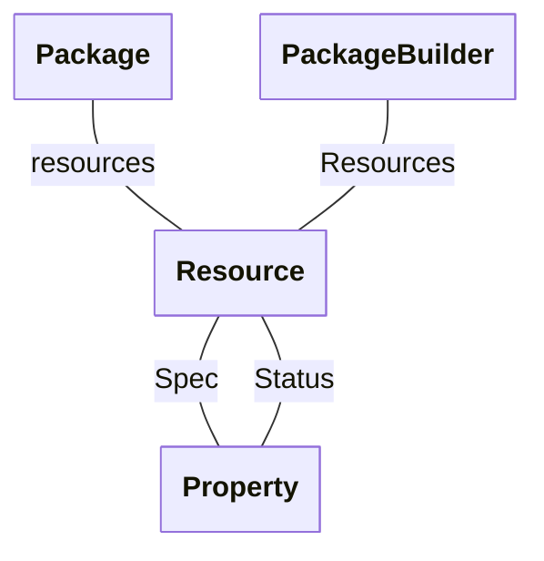

| Property          | Description | Type                  |
|-------------------|-------------|-----------------------|
| [Object](#Object) |             |                       |
| Spec              |             | [Property](#Property) |
| Status            |             | [Property](#Property) |

### Property

| Property    | Description | Type                                |
|-------------|-------------|-------------------------------------|
| DeclaredOn  |             | PropertyContainer                   |
| description |             | string[]                            |
| Field       |             | string                              |
| markers     |             | [PropertyMarkers](#PropertyMarkers) |
| Name        |             | string                              |
| Type        |             | [TypeReference](#TypeReference)     |

### Property

| Property    | Description | Type                                |
|-------------|-------------|-------------------------------------|
| DeclaredOn  |             | PropertyContainer                   |
| description |             | string[]                            |
| Field       |             | string                              |
| markers     |             | [PropertyMarkers](#PropertyMarkers) |
| Name        |             | string                              |
| Type        |             | [TypeReference](#TypeReference)     |

Property
-----------------------------

Used by: [Object.properties](#Object), [Resource.Spec](#Resource), and [Resource.Status](#Resource).

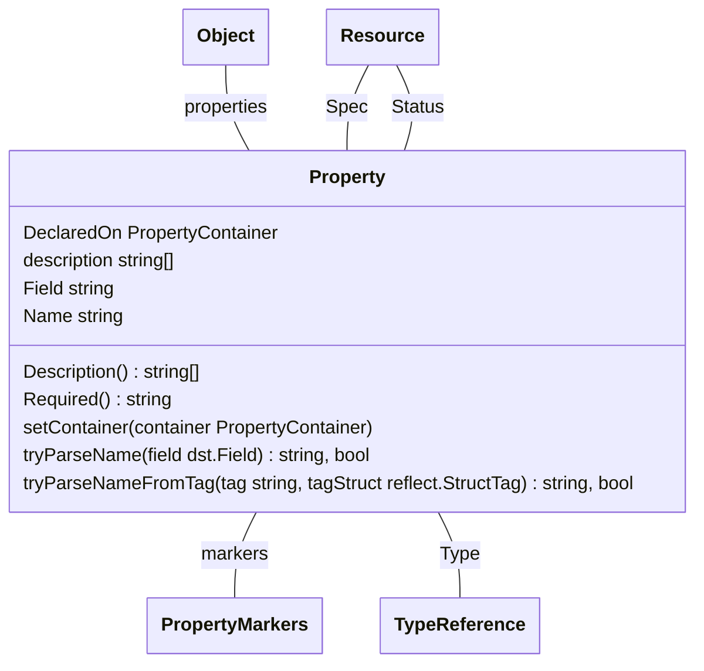

| Property    | Description | Type                                |
|-------------|-------------|-------------------------------------|
| DeclaredOn  |             | PropertyContainer                   |
| description |             | string[]                            |
| Field       |             | string                              |
| markers     |             | [PropertyMarkers](#PropertyMarkers) |
| Name        |             | string                              |
| Type        |             | [TypeReference](#TypeReference)     |

### Functions

| Function            | Description | Parameters                                  | Returns      |
|---------------------|-------------|---------------------------------------------|--------------|
| Description         |             |                                             | string[]     |
| Required            |             |                                             | string       |
| setContainer        |             | container PropertyContainer                 |              |
| tryParseName        |             | field dst.Field                             | string, bool |
| tryParseNameFromTag |             | tag string, tagStruct reflect.StructTag | string, bool |

PropertyMarkers
-------------------------------------------

Used by: [Property.markers](#Property).

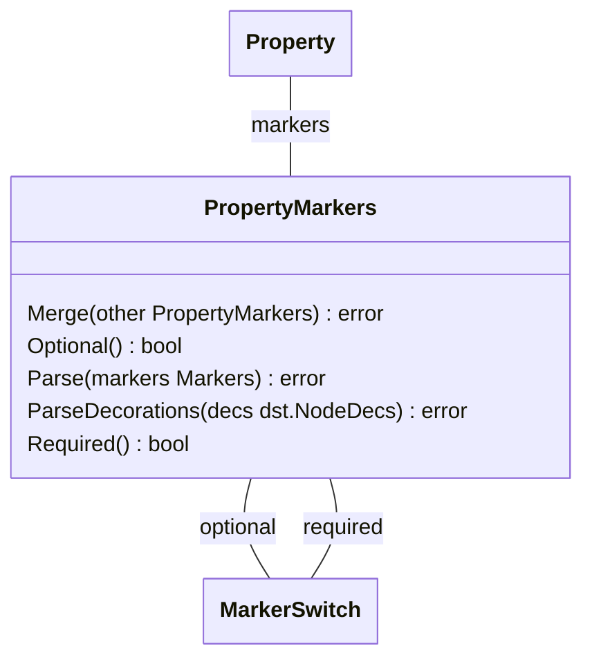

| Property | Description | Type                          |
|----------|-------------|-------------------------------|
| optional |             | [MarkerSwitch](#MarkerSwitch) |
| required |             | [MarkerSwitch](#MarkerSwitch) |

### Functions

| Function         | Description | Parameters            | Returns |
|------------------|-------------|-----------------------|---------|
| Merge            |             | other PropertyMarkers | error   |
| Optional         |             |                       | bool    |
| Parse            |             | markers Markers       | error   |
| ParseDecorations |             | decs dst.NodeDecs     | error   |
| Required         |             |                       | bool    |

TypeReference
---------------------------------------

Used by: [Enum.base](#Enum), [Function.Receiver](#Function), [Parameter.Type](#Parameter), and [Property.Type](#Property).

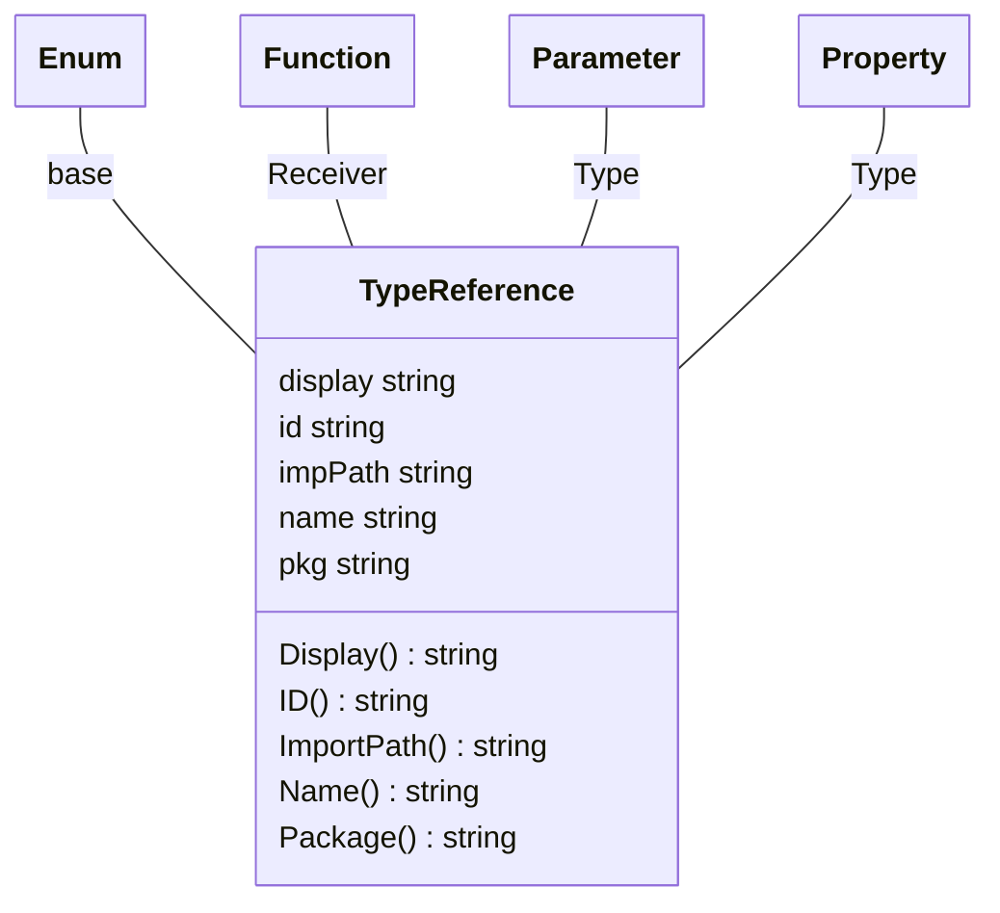

| Property | Description | Type   |
|----------|-------------|--------|
| display  |             | string |
| id       |             | string |
| impPath  |             | string |
| name     |             | string |
| pkg      |             | string |

### Functions

| Function   | Description | Parameters | Returns |
|------------|-------------|------------|---------|
| Display    |             |            | string  |
| ID         |             |            | string  |
| ImportPath |             |            | string  |
| Name       |             |            | string  |
| Package    |             |            | string  |

MarkerSwitch
-------------------------------------

MarkerSwitch captures the presence of a specific marker read from the source code.

Used by: [PackageMarkers.optional](#PackageMarkers), [PackageMarkers.required](#PackageMarkers), [PropertyMarkers.optional](#PropertyMarkers), and [PropertyMarkers.required](#PropertyMarkers).

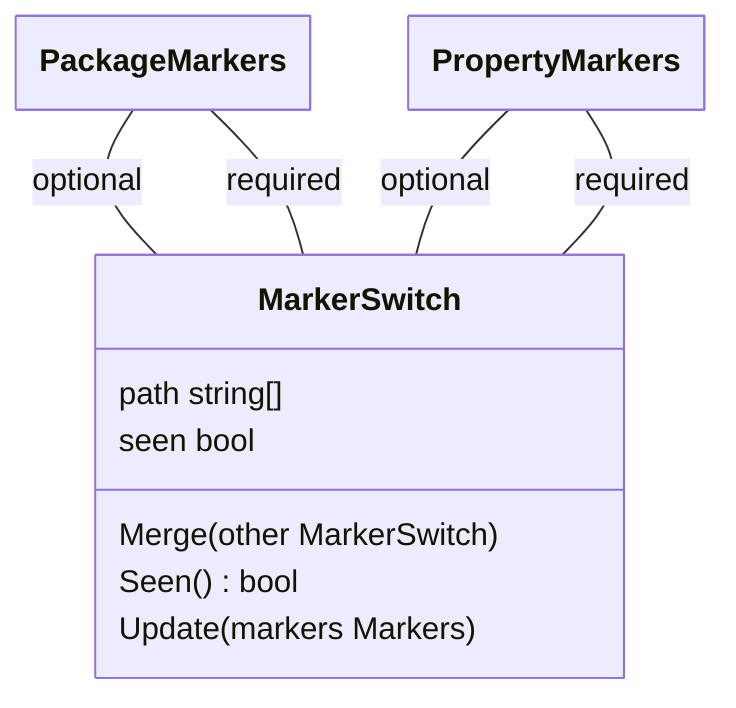

| Property | Description | Type     |
|----------|-------------|----------|
| path     |             | string[] |
| seen     |             | bool     |

### Functions

| Function | Description                                                                                               | Parameters         | Returns |
|----------|-----------------------------------------------------------------------------------------------------------|--------------------|---------|
| Merge    | Merge combines the supplied MetadataSwitch with the current one, returning an error if the values differ. | other MarkerSwitch |         |
| Seen     | Seen returns true if this marker has been seen, false otherwise.                                          |                    | bool    |
| Update   | Update checks for the desired marker in passed set of markers, updating the value if found.               | markers Markers    |         |
