v1api20210501
=============

| Metadata             | Value                                                                         |
|----------------------|-------------------------------------------------------------------------------|
| Group                | containerservice.azure.com                                                    |
| Version              | v1api20210501                                                                 |
| Module               | github.com/Azure/azure-service-operator/v2/api/containerservice/v1api20210501 |
| Property Optionality | Optional                                                                      |

<a id="APIVersion"></a>APIVersion
---------------------------------

| Value        | Description |
|--------------|-------------|
| "2021-05-01" |             |

<a id="ManagedCluster"></a>ManagedCluster
-----------------------------------------

Used by: [ManagedClusterList.items](#ManagedClusterList).


| Property                                                                                | Description | Type                                                                        |
|-----------------------------------------------------------------------------------------|-------------|-----------------------------------------------------------------------------|
| [metav1.TypeMeta](https://pkg.go.dev/k8s.io/apimachinery/pkg/apis/meta/v1#TypeMeta)     |             |                                                                             |
| [metav1.ObjectMeta](https://pkg.go.dev/k8s.io/apimachinery/pkg/apis/meta/v1#ObjectMeta) |             |                                                                             |
| spec                                                                                    |             | [ManagedCluster_Spec](#ManagedCluster_Spec)<br/><small>Optional</small>     |
| status                                                                                  |             | [ManagedCluster_STATUS](#ManagedCluster_STATUS)<br/><small>Optional</small> |

### <a id="ManagedCluster_Spec"></a>ManagedCluster_Spec

| Property                     | Description                                                                                                                                                                                                                                                                                  | Type                                                                                                                                                                 |
|------------------------------|----------------------------------------------------------------------------------------------------------------------------------------------------------------------------------------------------------------------------------------------------------------------------------------------|----------------------------------------------------------------------------------------------------------------------------------------------------------------------|
| aadProfile                   |                                                                                                                                                                                                                                                                                              | [ManagedClusterAADProfile](#ManagedClusterAADProfile)<br/><small>Optional</small>                                                                                    |
| addonProfiles                |                                                                                                                                                                                                                                                                                              | [map[string]ManagedClusterAddonProfile](#ManagedClusterAddonProfile)<br/><small>Optional</small>                                                                     |
| agentPoolProfiles            |                                                                                                                                                                                                                                                                                              | [ManagedClusterAgentPoolProfile[]](#ManagedClusterAgentPoolProfile)<br/><small>Optional</small>                                                                      |
| apiServerAccessProfile       |                                                                                                                                                                                                                                                                                              | [ManagedClusterAPIServerAccessProfile](#ManagedClusterAPIServerAccessProfile)<br/><small>Optional</small>                                                            |
| autoScalerProfile            |                                                                                                                                                                                                                                                                                              | [ManagedClusterProperties_AutoScalerProfile](#ManagedClusterProperties_AutoScalerProfile)<br/><small>Optional</small>                                                |
| autoUpgradeProfile           |                                                                                                                                                                                                                                                                                              | [ManagedClusterAutoUpgradeProfile](#ManagedClusterAutoUpgradeProfile)<br/><small>Optional</small>                                                                    |
| azureName                    | The name of the resource in Azure. This is often the same as the name of the resource in Kubernetes but it doesn't have to be.                                                                                                                                                               | string<br/><small>Optional</small>                                                                                                                                   |
| disableLocalAccounts         |                                                                                                                                                                                                                                                                                              | bool<br/><small>Optional</small>                                                                                                                                     |
| diskEncryptionSetIDReference |                                                                                                                                                                                                                                                                                              | [genruntime.ResourceReference](https://pkg.go.dev/github.com/Azure/azure-service-operator/v2/pkg/genruntime#ResourceReference)<br/><small>Optional</small>           |
| dnsPrefix                    |                                                                                                                                                                                                                                                                                              | string<br/><small>Optional</small>                                                                                                                                   |
| enablePodSecurityPolicy      |                                                                                                                                                                                                                                                                                              | bool<br/><small>Optional</small>                                                                                                                                     |
| enableRBAC                   |                                                                                                                                                                                                                                                                                              | bool<br/><small>Optional</small>                                                                                                                                     |
| extendedLocation             |                                                                                                                                                                                                                                                                                              | [ExtendedLocation](#ExtendedLocation)<br/><small>Optional</small>                                                                                                    |
| fqdnSubdomain                |                                                                                                                                                                                                                                                                                              | string<br/><small>Optional</small>                                                                                                                                   |
| httpProxyConfig              |                                                                                                                                                                                                                                                                                              | [ManagedClusterHTTPProxyConfig](#ManagedClusterHTTPProxyConfig)<br/><small>Optional</small>                                                                          |
| identity                     |                                                                                                                                                                                                                                                                                              | [ManagedClusterIdentity](#ManagedClusterIdentity)<br/><small>Optional</small>                                                                                        |
| identityProfile              |                                                                                                                                                                                                                                                                                              | [map[string]UserAssignedIdentity](#UserAssignedIdentity)<br/><small>Optional</small>                                                                                 |
| kubernetesVersion            |                                                                                                                                                                                                                                                                                              | string<br/><small>Optional</small>                                                                                                                                   |
| linuxProfile                 |                                                                                                                                                                                                                                                                                              | [ContainerServiceLinuxProfile](#ContainerServiceLinuxProfile)<br/><small>Optional</small>                                                                            |
| location                     |                                                                                                                                                                                                                                                                                              | string<br/><small>Required</small>                                                                                                                                   |
| networkProfile               |                                                                                                                                                                                                                                                                                              | [ContainerServiceNetworkProfile](#ContainerServiceNetworkProfile)<br/><small>Optional</small>                                                                        |
| nodeResourceGroup            |                                                                                                                                                                                                                                                                                              | string<br/><small>Optional</small>                                                                                                                                   |
| operatorSpec                 | The specification for configuring operator behavior. This field is interpreted by the operator and not passed directly to Azure                                                                                                                                                              | [ManagedClusterOperatorSpec](#ManagedClusterOperatorSpec)<br/><small>Optional</small>                                                                                |
| owner                        | The owner of the resource. The owner controls where the resource goes when it is deployed. The owner also controls the resources lifecycle. When the owner is deleted the resource will also be deleted. Owner is expected to be a reference to a resources.azure.com/ResourceGroup resource | [genruntime.KnownResourceReference](https://pkg.go.dev/github.com/Azure/azure-service-operator/v2/pkg/genruntime#KnownResourceReference)<br/><small>Required</small> |
| podIdentityProfile           |                                                                                                                                                                                                                                                                                              | [ManagedClusterPodIdentityProfile](#ManagedClusterPodIdentityProfile)<br/><small>Optional</small>                                                                    |
| privateLinkResources         |                                                                                                                                                                                                                                                                                              | [PrivateLinkResource[]](#PrivateLinkResource)<br/><small>Optional</small>                                                                                            |
| servicePrincipalProfile      |                                                                                                                                                                                                                                                                                              | [ManagedClusterServicePrincipalProfile](#ManagedClusterServicePrincipalProfile)<br/><small>Optional</small>                                                          |
| sku                          |                                                                                                                                                                                                                                                                                              | [ManagedClusterSKU](#ManagedClusterSKU)<br/><small>Optional</small>                                                                                                  |
| tags                         |                                                                                                                                                                                                                                                                                              | map[string]string<br/><small>Optional</small>                                                                                                                        |
| windowsProfile               |                                                                                                                                                                                                                                                                                              | [ManagedClusterWindowsProfile](#ManagedClusterWindowsProfile)<br/><small>Optional</small>                                                                            |

### <a id="ManagedCluster_STATUS"></a>ManagedCluster_STATUS

| Property                | Description                        | Type                                                                                                                                                    |
|-------------------------|------------------------------------|---------------------------------------------------------------------------------------------------------------------------------------------------------|
| aadProfile              |                                    | [ManagedClusterAADProfile_STATUS](#ManagedClusterAADProfile_STATUS)<br/><small>Optional</small>                                                         |
| addonProfiles           |                                    | [map[string]ManagedClusterAddonProfile_STATUS](#ManagedClusterAddonProfile_STATUS)<br/><small>Optional</small>                                          |
| agentPoolProfiles       |                                    | [ManagedClusterAgentPoolProfile_STATUS[]](#ManagedClusterAgentPoolProfile_STATUS)<br/><small>Optional</small>                                           |
| apiServerAccessProfile  |                                    | [ManagedClusterAPIServerAccessProfile_STATUS](#ManagedClusterAPIServerAccessProfile_STATUS)<br/><small>Optional</small>                                 |
| autoScalerProfile       |                                    | [ManagedClusterProperties_AutoScalerProfile_STATUS](#ManagedClusterProperties_AutoScalerProfile_STATUS)<br/><small>Optional</small>                     |
| autoUpgradeProfile      |                                    | [ManagedClusterAutoUpgradeProfile_STATUS](#ManagedClusterAutoUpgradeProfile_STATUS)<br/><small>Optional</small>                                         |
| azurePortalFQDN         |                                    | string<br/><small>Optional</small>                                                                                                                      |
| conditions              | The observed state of the resource | [conditions.Condition[]](https://pkg.go.dev/github.com/Azure/azure-service-operator/v2/pkg/genruntime/conditions#Condition)<br/><small>Optional</small> |
| disableLocalAccounts    |                                    | bool<br/><small>Optional</small>                                                                                                                        |
| diskEncryptionSetID     |                                    | string<br/><small>Optional</small>                                                                                                                      |
| dnsPrefix               |                                    | string<br/><small>Optional</small>                                                                                                                      |
| enablePodSecurityPolicy |                                    | bool<br/><small>Optional</small>                                                                                                                        |
| enableRBAC              |                                    | bool<br/><small>Optional</small>                                                                                                                        |
| extendedLocation        |                                    | [ExtendedLocation_STATUS](#ExtendedLocation_STATUS)<br/><small>Optional</small>                                                                         |
| fqdn                    |                                    | string<br/><small>Optional</small>                                                                                                                      |
| fqdnSubdomain           |                                    | string<br/><small>Optional</small>                                                                                                                      |
| httpProxyConfig         |                                    | [ManagedClusterHTTPProxyConfig_STATUS](#ManagedClusterHTTPProxyConfig_STATUS)<br/><small>Optional</small>                                               |
| id                      |                                    | string<br/><small>Optional</small>                                                                                                                      |
| identity                |                                    | [ManagedClusterIdentity_STATUS](#ManagedClusterIdentity_STATUS)<br/><small>Optional</small>                                                             |
| identityProfile         |                                    | [map[string]UserAssignedIdentity_STATUS](#UserAssignedIdentity_STATUS)<br/><small>Optional</small>                                                      |
| kubernetesVersion       |                                    | string<br/><small>Optional</small>                                                                                                                      |
| linuxProfile            |                                    | [ContainerServiceLinuxProfile_STATUS](#ContainerServiceLinuxProfile_STATUS)<br/><small>Optional</small>                                                 |
| location                |                                    | string<br/><small>Optional</small>                                                                                                                      |
| maxAgentPools           |                                    | int<br/><small>Optional</small>                                                                                                                         |
| name                    |                                    | string<br/><small>Optional</small>                                                                                                                      |
| networkProfile          |                                    | [ContainerServiceNetworkProfile_STATUS](#ContainerServiceNetworkProfile_STATUS)<br/><small>Optional</small>                                             |
| nodeResourceGroup       |                                    | string<br/><small>Optional</small>                                                                                                                      |
| podIdentityProfile      |                                    | [ManagedClusterPodIdentityProfile_STATUS](#ManagedClusterPodIdentityProfile_STATUS)<br/><small>Optional</small>                                         |
| powerState              |                                    | [PowerState_STATUS](#PowerState_STATUS)<br/><small>Optional</small>                                                                                     |
| privateFQDN             |                                    | string<br/><small>Optional</small>                                                                                                                      |
| privateLinkResources    |                                    | [PrivateLinkResource_STATUS[]](#PrivateLinkResource_STATUS)<br/><small>Optional</small>                                                                 |
| provisioningState       |                                    | string<br/><small>Optional</small>                                                                                                                      |
| servicePrincipalProfile |                                    | [ManagedClusterServicePrincipalProfile_STATUS](#ManagedClusterServicePrincipalProfile_STATUS)<br/><small>Optional</small>                               |
| sku                     |                                    | [ManagedClusterSKU_STATUS](#ManagedClusterSKU_STATUS)<br/><small>Optional</small>                                                                       |
| tags                    |                                    | map[string]string<br/><small>Optional</small>                                                                                                           |
| type                    |                                    | string<br/><small>Optional</small>                                                                                                                      |
| windowsProfile          |                                    | [ManagedClusterWindowsProfile_STATUS](#ManagedClusterWindowsProfile_STATUS)<br/><small>Optional</small>                                                 |

<a id="ManagedClusterList"></a>ManagedClusterList
-------------------------------------------------


| Property                                                                            | Description | Type                                                            |
|-------------------------------------------------------------------------------------|-------------|-----------------------------------------------------------------|
| [metav1.TypeMeta](https://pkg.go.dev/k8s.io/apimachinery/pkg/apis/meta/v1#TypeMeta) |             |                                                                 |
| [metav1.ListMeta](https://pkg.go.dev/k8s.io/apimachinery/pkg/apis/meta/v1#ListMeta) |             |                                                                 |
| items                                                                               |             | [ManagedCluster[]](#ManagedCluster)<br/><small>Optional</small> |

<a id="ManagedClustersAgentPool"></a>ManagedClustersAgentPool
-------------------------------------------------------------

Generator information: - Generated from: /containerservice/resource-manager/Microsoft.ContainerService/aks/stable/2021-05-01/managedClusters.json - ARM URI: /&ZeroWidthSpace;subscriptions/&ZeroWidthSpace;{subscriptionId}/&ZeroWidthSpace;resourceGroups/&ZeroWidthSpace;{resourceGroupName}/&ZeroWidthSpace;providers/&ZeroWidthSpace;Microsoft.ContainerService/managedClusters/{resourceName}/agentPools/{agentPoolName}

Used by: [ManagedClustersAgentPoolList.items](#ManagedClustersAgentPoolList).


| Property                                                                                | Description | Type                                                                                            |
|-----------------------------------------------------------------------------------------|-------------|-------------------------------------------------------------------------------------------------|
| [metav1.TypeMeta](https://pkg.go.dev/k8s.io/apimachinery/pkg/apis/meta/v1#TypeMeta)     |             |                                                                                                 |
| [metav1.ObjectMeta](https://pkg.go.dev/k8s.io/apimachinery/pkg/apis/meta/v1#ObjectMeta) |             |                                                                                                 |
| spec                                                                                    |             | [ManagedClustersAgentPool_Spec](#ManagedClustersAgentPool_Spec)<br/><small>Optional</small>     |
| status                                                                                  |             | [ManagedClustersAgentPool_STATUS](#ManagedClustersAgentPool_STATUS)<br/><small>Optional</small> |

### <a id="ManagedClustersAgentPool_Spec"></a>ManagedClustersAgentPool_Spec

| Property                      | Description                                                                                                                                                                                                                                                                                                                                                                                                                                                                                  | Type                                                                                                                                                                 |
|-------------------------------|----------------------------------------------------------------------------------------------------------------------------------------------------------------------------------------------------------------------------------------------------------------------------------------------------------------------------------------------------------------------------------------------------------------------------------------------------------------------------------------------|----------------------------------------------------------------------------------------------------------------------------------------------------------------------|
| availabilityZones             | The list of Availability zones to use for nodes. This can only be specified if the AgentPoolType property is 'VirtualMachineScaleSets'.                                                                                                                                                                                                                                                                                                                                                      | string[]<br/><small>Optional</small>                                                                                                                                 |
| azureName                     | The name of the resource in Azure. This is often the same as the name of the resource in Kubernetes but it doesn't have to be.                                                                                                                                                                                                                                                                                                                                                               | string<br/><small>Optional</small>                                                                                                                                   |
| count                         | Number of agents (VMs) to host docker containers. Allowed values must be in the range of 0 to 1000 (inclusive) for user pools and in the range of 1 to 1000 (inclusive) for system pools. The default value is 1.                                                                                                                                                                                                                                                                            | int<br/><small>Optional</small>                                                                                                                                      |
| enableAutoScaling             | Whether to enable auto-scaler                                                                                                                                                                                                                                                                                                                                                                                                                                                                | bool<br/><small>Optional</small>                                                                                                                                     |
| enableEncryptionAtHost        | This is only supported on certain VM sizes and in certain Azure regions. For more information, see: https://docs.microsoft.com/azure/aks/enable-host-encryption                                                                                                                                                                                                                                                                                                                              | bool<br/><small>Optional</small>                                                                                                                                     |
| enableFIPS                    | See [Add a FIPS-enabled node pool](https://docs.microsoft.com/azure/aks/use-multiple-node-pools#add-a-fips-enabled-node-pool-preview) for more details.                                                                                                                                                                                                                                                                                                                                      | bool<br/><small>Optional</small>                                                                                                                                     |
| enableNodePublicIP            | Some scenarios may require nodes in a node pool to receive their own dedicated public IP addresses. A common scenario is for gaming workloads, where a console needs to make a direct connection to a cloud virtual machine to minimize hops. For more information see [assigning a public IP per node](https://docs.microsoft.com/azure/aks/use-multiple-node-pools#assign-a-public-ip-per-node-for-your-node-pools). The default is false.                                                 | bool<br/><small>Optional</small>                                                                                                                                     |
| enableUltraSSD                | Whether to enable UltraSSD                                                                                                                                                                                                                                                                                                                                                                                                                                                                   | bool<br/><small>Optional</small>                                                                                                                                     |
| gpuInstanceProfile            | GPUInstanceProfile to be used to specify GPU MIG instance profile for supported GPU VM SKU.                                                                                                                                                                                                                                                                                                                                                                                                  | [GPUInstanceProfile](#GPUInstanceProfile)<br/><small>Optional</small>                                                                                                |
| kubeletConfig                 | The Kubelet configuration on the agent pool nodes.                                                                                                                                                                                                                                                                                                                                                                                                                                           | [KubeletConfig](#KubeletConfig)<br/><small>Optional</small>                                                                                                          |
| kubeletDiskType               | Determines the placement of emptyDir volumes, container runtime data root, and Kubelet ephemeral storage.                                                                                                                                                                                                                                                                                                                                                                                    | [KubeletDiskType](#KubeletDiskType)<br/><small>Optional</small>                                                                                                      |
| linuxOSConfig                 | The OS configuration of Linux agent nodes.                                                                                                                                                                                                                                                                                                                                                                                                                                                   | [LinuxOSConfig](#LinuxOSConfig)<br/><small>Optional</small>                                                                                                          |
| maxCount                      | The maximum number of nodes for auto-scaling                                                                                                                                                                                                                                                                                                                                                                                                                                                 | int<br/><small>Optional</small>                                                                                                                                      |
| maxPods                       | The maximum number of pods that can run on a node.                                                                                                                                                                                                                                                                                                                                                                                                                                           | int<br/><small>Optional</small>                                                                                                                                      |
| minCount                      | The minimum number of nodes for auto-scaling                                                                                                                                                                                                                                                                                                                                                                                                                                                 | int<br/><small>Optional</small>                                                                                                                                      |
| mode                          | A cluster must have at least one 'System' Agent Pool at all times. For additional information on agent pool restrictions and best practices, see: https://docs.microsoft.com/azure/aks/use-system-pools                                                                                                                                                                                                                                                                                      | [AgentPoolMode](#AgentPoolMode)<br/><small>Optional</small>                                                                                                          |
| nodeLabels                    | The node labels to be persisted across all nodes in agent pool.                                                                                                                                                                                                                                                                                                                                                                                                                              | map[string]string<br/><small>Optional</small>                                                                                                                        |
| nodePublicIPPrefixIDReference | This is of the form: /&ZeroWidthSpace;subscriptions/&ZeroWidthSpace;{subscriptionId}/&ZeroWidthSpace;resourceGroups/&ZeroWidthSpace;{resourceGroupName}/&ZeroWidthSpace;providers/&ZeroWidthSpace;Microsoft.Network/publicIPPrefixes/{publicIPPrefixName}                                                                                                                                                                                                                                    | [genruntime.ResourceReference](https://pkg.go.dev/github.com/Azure/azure-service-operator/v2/pkg/genruntime#ResourceReference)<br/><small>Optional</small>           |
| nodeTaints                    | The taints added to new nodes during node pool create and scale. For example, key=value:NoSchedule.                                                                                                                                                                                                                                                                                                                                                                                          | string[]<br/><small>Optional</small>                                                                                                                                 |
| operatorSpec                  | The specification for configuring operator behavior. This field is interpreted by the operator and not passed directly to Azure                                                                                                                                                                                                                                                                                                                                                              | [ManagedClustersAgentPoolOperatorSpec](#ManagedClustersAgentPoolOperatorSpec)<br/><small>Optional</small>                                                            |
| orchestratorVersion           | As a best practice, you should upgrade all node pools in an AKS cluster to the same Kubernetes version. The node pool version must have the same major version as the control plane. The node pool minor version must be within two minor versions of the control plane version. The node pool version cannot be greater than the control plane version. For more information see [upgrading a node pool](https://docs.microsoft.com/azure/aks/use-multiple-node-pools#upgrade-a-node-pool). | string<br/><small>Optional</small>                                                                                                                                   |
| osDiskSizeGB                  |                                                                                                                                                                                                                                                                                                                                                                                                                                                                                              | [ContainerServiceOSDisk](#ContainerServiceOSDisk)<br/><small>Optional</small>                                                                                        |
| osDiskType                    | The default is 'Ephemeral' if the VM supports it and has a cache disk larger than the requested OSDiskSizeGB. Otherwise, defaults to 'Managed'. May not be changed after creation. For more information see [Ephemeral OS](https://docs.microsoft.com/azure/aks/cluster-configuration#ephemeral-os).                                                                                                                                                                                         | [OSDiskType](#OSDiskType)<br/><small>Optional</small>                                                                                                                |
| osSKU                         | Specifies an OS SKU. This value must not be specified if OSType is Windows.                                                                                                                                                                                                                                                                                                                                                                                                                  | [OSSKU](#OSSKU)<br/><small>Optional</small>                                                                                                                          |
| osType                        | The operating system type. The default is Linux.                                                                                                                                                                                                                                                                                                                                                                                                                                             | [OSType](#OSType)<br/><small>Optional</small>                                                                                                                        |
| owner                         | The owner of the resource. The owner controls where the resource goes when it is deployed. The owner also controls the resources lifecycle. When the owner is deleted the resource will also be deleted. Owner is expected to be a reference to a containerservice.azure.com/ManagedCluster resource                                                                                                                                                                                         | [genruntime.KnownResourceReference](https://pkg.go.dev/github.com/Azure/azure-service-operator/v2/pkg/genruntime#KnownResourceReference)<br/><small>Required</small> |
| podSubnetIDReference          | If omitted, pod IPs are statically assigned on the node subnet (see vnetSubnetID for more details). This is of the form: /&ZeroWidthSpace;subscriptions/&ZeroWidthSpace;{subscriptionId}/&ZeroWidthSpace;resourceGroups/&ZeroWidthSpace;{resourceGroupName}/&ZeroWidthSpace;providers/&ZeroWidthSpace;Microsoft.Network/virtualNetworks/{virtualNetworkName}/subnets/{subnetName}                                                                                                            | [genruntime.ResourceReference](https://pkg.go.dev/github.com/Azure/azure-service-operator/v2/pkg/genruntime#ResourceReference)<br/><small>Optional</small>           |
| proximityPlacementGroupID     | The ID for Proximity Placement Group.                                                                                                                                                                                                                                                                                                                                                                                                                                                        | string<br/><small>Optional</small>                                                                                                                                   |
| scaleSetEvictionPolicy        | This cannot be specified unless the scaleSetPriority is 'Spot'. If not specified, the default is 'Delete'.                                                                                                                                                                                                                                                                                                                                                                                   | [ScaleSetEvictionPolicy](#ScaleSetEvictionPolicy)<br/><small>Optional</small>                                                                                        |
| scaleSetPriority              | The Virtual Machine Scale Set priority. If not specified, the default is 'Regular'.                                                                                                                                                                                                                                                                                                                                                                                                          | [ScaleSetPriority](#ScaleSetPriority)<br/><small>Optional</small>                                                                                                    |
| spotMaxPrice                  | Possible values are any decimal value greater than zero or -1 which indicates the willingness to pay any on-demand price. For more details on spot pricing, see [spot VMs pricing](https://docs.microsoft.com/azure/virtual-machines/spot-vms#pricing)                                                                                                                                                                                                                                       | float64<br/><small>Optional</small>                                                                                                                                  |
| tags                          | The tags to be persisted on the agent pool virtual machine scale set.                                                                                                                                                                                                                                                                                                                                                                                                                        | map[string]string<br/><small>Optional</small>                                                                                                                        |
| type                          | The type of Agent Pool.                                                                                                                                                                                                                                                                                                                                                                                                                                                                      | [AgentPoolType](#AgentPoolType)<br/><small>Optional</small>                                                                                                          |
| upgradeSettings               | Settings for upgrading the agentpool                                                                                                                                                                                                                                                                                                                                                                                                                                                         | [AgentPoolUpgradeSettings](#AgentPoolUpgradeSettings)<br/><small>Optional</small>                                                                                    |
| vmSize                        | VM size availability varies by region. If a node contains insufficient compute resources (memory, cpu, etc) pods might fail to run correctly. For more details on restricted VM sizes, see: https://docs.microsoft.com/azure/aks/quotas-skus-regions                                                                                                                                                                                                                                         | string<br/><small>Optional</small>                                                                                                                                   |
| vnetSubnetIDReference         | If this is not specified, a VNET and subnet will be generated and used. If no podSubnetID is specified, this applies to nodes and pods, otherwise it applies to just nodes. This is of the form: /&ZeroWidthSpace;subscriptions/&ZeroWidthSpace;{subscriptionId}/&ZeroWidthSpace;resourceGroups/&ZeroWidthSpace;{resourceGroupName}/&ZeroWidthSpace;providers/&ZeroWidthSpace;Microsoft.Network/virtualNetworks/{virtualNetworkName}/subnets/{subnetName}                                    | [genruntime.ResourceReference](https://pkg.go.dev/github.com/Azure/azure-service-operator/v2/pkg/genruntime#ResourceReference)<br/><small>Optional</small>           |

### <a id="ManagedClustersAgentPool_STATUS"></a>ManagedClustersAgentPool_STATUS

| Property                  | Description                                                                                                                                                                                                                                                                                                                                                                                                                                                                                  | Type                                                                                                                                                    |
|---------------------------|----------------------------------------------------------------------------------------------------------------------------------------------------------------------------------------------------------------------------------------------------------------------------------------------------------------------------------------------------------------------------------------------------------------------------------------------------------------------------------------------|---------------------------------------------------------------------------------------------------------------------------------------------------------|
| availabilityZones         | The list of Availability zones to use for nodes. This can only be specified if the AgentPoolType property is 'VirtualMachineScaleSets'.                                                                                                                                                                                                                                                                                                                                                      | string[]<br/><small>Optional</small>                                                                                                                    |
| conditions                | The observed state of the resource                                                                                                                                                                                                                                                                                                                                                                                                                                                           | [conditions.Condition[]](https://pkg.go.dev/github.com/Azure/azure-service-operator/v2/pkg/genruntime/conditions#Condition)<br/><small>Optional</small> |
| count                     | Number of agents (VMs) to host docker containers. Allowed values must be in the range of 0 to 1000 (inclusive) for user pools and in the range of 1 to 1000 (inclusive) for system pools. The default value is 1.                                                                                                                                                                                                                                                                            | int<br/><small>Optional</small>                                                                                                                         |
| enableAutoScaling         | Whether to enable auto-scaler                                                                                                                                                                                                                                                                                                                                                                                                                                                                | bool<br/><small>Optional</small>                                                                                                                        |
| enableEncryptionAtHost    | This is only supported on certain VM sizes and in certain Azure regions. For more information, see: https://docs.microsoft.com/azure/aks/enable-host-encryption                                                                                                                                                                                                                                                                                                                              | bool<br/><small>Optional</small>                                                                                                                        |
| enableFIPS                | See [Add a FIPS-enabled node pool](https://docs.microsoft.com/azure/aks/use-multiple-node-pools#add-a-fips-enabled-node-pool-preview) for more details.                                                                                                                                                                                                                                                                                                                                      | bool<br/><small>Optional</small>                                                                                                                        |
| enableNodePublicIP        | Some scenarios may require nodes in a node pool to receive their own dedicated public IP addresses. A common scenario is for gaming workloads, where a console needs to make a direct connection to a cloud virtual machine to minimize hops. For more information see [assigning a public IP per node](https://docs.microsoft.com/azure/aks/use-multiple-node-pools#assign-a-public-ip-per-node-for-your-node-pools). The default is false.                                                 | bool<br/><small>Optional</small>                                                                                                                        |
| enableUltraSSD            | Whether to enable UltraSSD                                                                                                                                                                                                                                                                                                                                                                                                                                                                   | bool<br/><small>Optional</small>                                                                                                                        |
| gpuInstanceProfile        | GPUInstanceProfile to be used to specify GPU MIG instance profile for supported GPU VM SKU.                                                                                                                                                                                                                                                                                                                                                                                                  | [GPUInstanceProfile_STATUS](#GPUInstanceProfile_STATUS)<br/><small>Optional</small>                                                                     |
| id                        | Resource ID.                                                                                                                                                                                                                                                                                                                                                                                                                                                                                 | string<br/><small>Optional</small>                                                                                                                      |
| kubeletConfig             | The Kubelet configuration on the agent pool nodes.                                                                                                                                                                                                                                                                                                                                                                                                                                           | [KubeletConfig_STATUS](#KubeletConfig_STATUS)<br/><small>Optional</small>                                                                               |
| kubeletDiskType           | Determines the placement of emptyDir volumes, container runtime data root, and Kubelet ephemeral storage.                                                                                                                                                                                                                                                                                                                                                                                    | [KubeletDiskType_STATUS](#KubeletDiskType_STATUS)<br/><small>Optional</small>                                                                           |
| linuxOSConfig             | The OS configuration of Linux agent nodes.                                                                                                                                                                                                                                                                                                                                                                                                                                                   | [LinuxOSConfig_STATUS](#LinuxOSConfig_STATUS)<br/><small>Optional</small>                                                                               |
| maxCount                  | The maximum number of nodes for auto-scaling                                                                                                                                                                                                                                                                                                                                                                                                                                                 | int<br/><small>Optional</small>                                                                                                                         |
| maxPods                   | The maximum number of pods that can run on a node.                                                                                                                                                                                                                                                                                                                                                                                                                                           | int<br/><small>Optional</small>                                                                                                                         |
| minCount                  | The minimum number of nodes for auto-scaling                                                                                                                                                                                                                                                                                                                                                                                                                                                 | int<br/><small>Optional</small>                                                                                                                         |
| mode                      | A cluster must have at least one 'System' Agent Pool at all times. For additional information on agent pool restrictions and best practices, see: https://docs.microsoft.com/azure/aks/use-system-pools                                                                                                                                                                                                                                                                                      | [AgentPoolMode_STATUS](#AgentPoolMode_STATUS)<br/><small>Optional</small>                                                                               |
| name                      | The name of the resource that is unique within a resource group. This name can be used to access the resource.                                                                                                                                                                                                                                                                                                                                                                               | string<br/><small>Optional</small>                                                                                                                      |
| nodeImageVersion          | The version of node image                                                                                                                                                                                                                                                                                                                                                                                                                                                                    | string<br/><small>Optional</small>                                                                                                                      |
| nodeLabels                | The node labels to be persisted across all nodes in agent pool.                                                                                                                                                                                                                                                                                                                                                                                                                              | map[string]string<br/><small>Optional</small>                                                                                                           |
| nodePublicIPPrefixID      | This is of the form: /&ZeroWidthSpace;subscriptions/&ZeroWidthSpace;{subscriptionId}/&ZeroWidthSpace;resourceGroups/&ZeroWidthSpace;{resourceGroupName}/&ZeroWidthSpace;providers/&ZeroWidthSpace;Microsoft.Network/publicIPPrefixes/{publicIPPrefixName}                                                                                                                                                                                                                                    | string<br/><small>Optional</small>                                                                                                                      |
| nodeTaints                | The taints added to new nodes during node pool create and scale. For example, key=value:NoSchedule.                                                                                                                                                                                                                                                                                                                                                                                          | string[]<br/><small>Optional</small>                                                                                                                    |
| orchestratorVersion       | As a best practice, you should upgrade all node pools in an AKS cluster to the same Kubernetes version. The node pool version must have the same major version as the control plane. The node pool minor version must be within two minor versions of the control plane version. The node pool version cannot be greater than the control plane version. For more information see [upgrading a node pool](https://docs.microsoft.com/azure/aks/use-multiple-node-pools#upgrade-a-node-pool). | string<br/><small>Optional</small>                                                                                                                      |
| osDiskSizeGB              |                                                                                                                                                                                                                                                                                                                                                                                                                                                                                              | int<br/><small>Optional</small>                                                                                                                         |
| osDiskType                | The default is 'Ephemeral' if the VM supports it and has a cache disk larger than the requested OSDiskSizeGB. Otherwise, defaults to 'Managed'. May not be changed after creation. For more information see [Ephemeral OS](https://docs.microsoft.com/azure/aks/cluster-configuration#ephemeral-os).                                                                                                                                                                                         | [OSDiskType_STATUS](#OSDiskType_STATUS)<br/><small>Optional</small>                                                                                     |
| osSKU                     | Specifies an OS SKU. This value must not be specified if OSType is Windows.                                                                                                                                                                                                                                                                                                                                                                                                                  | [OSSKU_STATUS](#OSSKU_STATUS)<br/><small>Optional</small>                                                                                               |
| osType                    | The operating system type. The default is Linux.                                                                                                                                                                                                                                                                                                                                                                                                                                             | [OSType_STATUS](#OSType_STATUS)<br/><small>Optional</small>                                                                                             |
| podSubnetID               | If omitted, pod IPs are statically assigned on the node subnet (see vnetSubnetID for more details). This is of the form: /&ZeroWidthSpace;subscriptions/&ZeroWidthSpace;{subscriptionId}/&ZeroWidthSpace;resourceGroups/&ZeroWidthSpace;{resourceGroupName}/&ZeroWidthSpace;providers/&ZeroWidthSpace;Microsoft.Network/virtualNetworks/{virtualNetworkName}/subnets/{subnetName}                                                                                                            | string<br/><small>Optional</small>                                                                                                                      |
| powerState                | Describes whether the Agent Pool is Running or Stopped                                                                                                                                                                                                                                                                                                                                                                                                                                       | [PowerState_STATUS](#PowerState_STATUS)<br/><small>Optional</small>                                                                                     |
| properties_type           | The type of Agent Pool.                                                                                                                                                                                                                                                                                                                                                                                                                                                                      | [AgentPoolType_STATUS](#AgentPoolType_STATUS)<br/><small>Optional</small>                                                                               |
| provisioningState         | The current deployment or provisioning state.                                                                                                                                                                                                                                                                                                                                                                                                                                                | string<br/><small>Optional</small>                                                                                                                      |
| proximityPlacementGroupID | The ID for Proximity Placement Group.                                                                                                                                                                                                                                                                                                                                                                                                                                                        | string<br/><small>Optional</small>                                                                                                                      |
| scaleSetEvictionPolicy    | This cannot be specified unless the scaleSetPriority is 'Spot'. If not specified, the default is 'Delete'.                                                                                                                                                                                                                                                                                                                                                                                   | [ScaleSetEvictionPolicy_STATUS](#ScaleSetEvictionPolicy_STATUS)<br/><small>Optional</small>                                                             |
| scaleSetPriority          | The Virtual Machine Scale Set priority. If not specified, the default is 'Regular'.                                                                                                                                                                                                                                                                                                                                                                                                          | [ScaleSetPriority_STATUS](#ScaleSetPriority_STATUS)<br/><small>Optional</small>                                                                         |
| spotMaxPrice              | Possible values are any decimal value greater than zero or -1 which indicates the willingness to pay any on-demand price. For more details on spot pricing, see [spot VMs pricing](https://docs.microsoft.com/azure/virtual-machines/spot-vms#pricing)                                                                                                                                                                                                                                       | float64<br/><small>Optional</small>                                                                                                                     |
| tags                      | The tags to be persisted on the agent pool virtual machine scale set.                                                                                                                                                                                                                                                                                                                                                                                                                        | map[string]string<br/><small>Optional</small>                                                                                                           |
| type                      | Resource type                                                                                                                                                                                                                                                                                                                                                                                                                                                                                | string<br/><small>Optional</small>                                                                                                                      |
| upgradeSettings           | Settings for upgrading the agentpool                                                                                                                                                                                                                                                                                                                                                                                                                                                         | [AgentPoolUpgradeSettings_STATUS](#AgentPoolUpgradeSettings_STATUS)<br/><small>Optional</small>                                                         |
| vmSize                    | VM size availability varies by region. If a node contains insufficient compute resources (memory, cpu, etc) pods might fail to run correctly. For more details on restricted VM sizes, see: https://docs.microsoft.com/azure/aks/quotas-skus-regions                                                                                                                                                                                                                                         | string<br/><small>Optional</small>                                                                                                                      |
| vnetSubnetID              | If this is not specified, a VNET and subnet will be generated and used. If no podSubnetID is specified, this applies to nodes and pods, otherwise it applies to just nodes. This is of the form: /&ZeroWidthSpace;subscriptions/&ZeroWidthSpace;{subscriptionId}/&ZeroWidthSpace;resourceGroups/&ZeroWidthSpace;{resourceGroupName}/&ZeroWidthSpace;providers/&ZeroWidthSpace;Microsoft.Network/virtualNetworks/{virtualNetworkName}/subnets/{subnetName}                                    | string<br/><small>Optional</small>                                                                                                                      |

<a id="ManagedClustersAgentPoolList"></a>ManagedClustersAgentPoolList
---------------------------------------------------------------------

Generator information: - Generated from: /containerservice/resource-manager/Microsoft.ContainerService/aks/stable/2021-05-01/managedClusters.json - ARM URI: /&ZeroWidthSpace;subscriptions/&ZeroWidthSpace;{subscriptionId}/&ZeroWidthSpace;resourceGroups/&ZeroWidthSpace;{resourceGroupName}/&ZeroWidthSpace;providers/&ZeroWidthSpace;Microsoft.ContainerService/managedClusters/{resourceName}/agentPools/{agentPoolName}


| Property                                                                            | Description | Type                                                                                |
|-------------------------------------------------------------------------------------|-------------|-------------------------------------------------------------------------------------|
| [metav1.TypeMeta](https://pkg.go.dev/k8s.io/apimachinery/pkg/apis/meta/v1#TypeMeta) |             |                                                                                     |
| [metav1.ListMeta](https://pkg.go.dev/k8s.io/apimachinery/pkg/apis/meta/v1#ListMeta) |             |                                                                                     |
| items                                                                               |             | [ManagedClustersAgentPool[]](#ManagedClustersAgentPool)<br/><small>Optional</small> |

<a id="ManagedCluster_Spec"></a>ManagedCluster_Spec
---------------------------------------------------

Used by: [ManagedCluster.spec](#ManagedCluster).

```mermaid
---
  config:
    class:
      hideEmptyMembersBox: true
---
classDiagram
class ManagedCluster_Spec["ManagedCluster_Spec"] {
    azureName string
    disableLocalAccounts bool
    diskEncryptionSetIDReference genruntime.ResourceReference
    dnsPrefix string
    enablePodSecurityPolicy bool
    enableRBAC bool
    fqdnSubdomain string
    kubernetesVersion string
    location string
    nodeResourceGroup string
    owner genruntime.KnownResourceReference
    tags map[string]string
}


ManagedCluster_Spec -- ManagedClusterAADProfile : aadProfile
ManagedCluster_Spec -- ManagedClusterAddonProfile : addonProfiles
ManagedCluster_Spec -- ManagedClusterAgentPoolProfile : agentPoolProfiles
ManagedCluster_Spec -- ManagedClusterAPIServerAccessProfile : apiServerAccessProfile
ManagedCluster_Spec -- ManagedClusterProperties_AutoScalerProfile : autoScalerProfile
ManagedCluster_Spec -- ManagedClusterAutoUpgradeProfile : autoUpgradeProfile
ManagedCluster_Spec -- ExtendedLocation : extendedLocation
ManagedCluster_Spec -- ManagedClusterHTTPProxyConfig : httpProxyConfig
ManagedCluster_Spec -- ManagedClusterIdentity : identity
ManagedCluster_Spec -- UserAssignedIdentity : identityProfile
ManagedCluster_Spec -- ContainerServiceLinuxProfile : linuxProfile
ManagedCluster_Spec -- ContainerServiceNetworkProfile : networkProfile
ManagedCluster_Spec -- ManagedClusterOperatorSpec : operatorSpec
ManagedCluster_Spec -- ManagedClusterPodIdentityProfile : podIdentityProfile
ManagedCluster_Spec -- PrivateLinkResource : privateLinkResources
ManagedCluster_Spec -- ManagedClusterServicePrincipalProfile : servicePrincipalProfile
ManagedCluster_Spec -- ManagedClusterSKU : sku
ManagedCluster_Spec -- ManagedClusterWindowsProfile : windowsProfile
class ManagedClusterAADProfile["ManagedClusterAADProfile"] 
class ManagedClusterAddonProfile["ManagedClusterAddonProfile"] 
class ManagedClusterAgentPoolProfile["ManagedClusterAgentPoolProfile"] 
class ManagedClusterAPIServerAccessProfile["ManagedClusterAPIServerAccessProfile"] 
class ManagedClusterProperties_AutoScalerProfile["ManagedClusterProperties_AutoScalerProfile"] 
class ManagedClusterAutoUpgradeProfile["ManagedClusterAutoUpgradeProfile"] 
class ExtendedLocation["ExtendedLocation"] 
class ManagedClusterHTTPProxyConfig["ManagedClusterHTTPProxyConfig"] 
class ManagedClusterIdentity["ManagedClusterIdentity"] 
class UserAssignedIdentity["UserAssignedIdentity"] 
class ContainerServiceLinuxProfile["ContainerServiceLinuxProfile"] 
class ContainerServiceNetworkProfile["ContainerServiceNetworkProfile"] 
class ManagedClusterOperatorSpec["ManagedClusterOperatorSpec"] 
class ManagedClusterPodIdentityProfile["ManagedClusterPodIdentityProfile"] 
class PrivateLinkResource["PrivateLinkResource"] 
class ManagedClusterServicePrincipalProfile["ManagedClusterServicePrincipalProfile"] 
class ManagedClusterSKU["ManagedClusterSKU"] 
class ManagedClusterWindowsProfile["ManagedClusterWindowsProfile"] 
```



| Property                     | Description                                                                                                                                                                                                                                                                                  | Type                                                                                                                                                                 |
|------------------------------|----------------------------------------------------------------------------------------------------------------------------------------------------------------------------------------------------------------------------------------------------------------------------------------------|----------------------------------------------------------------------------------------------------------------------------------------------------------------------|
| aadProfile                   |                                                                                                                                                                                                                                                                                              | [ManagedClusterAADProfile](#ManagedClusterAADProfile)<br/><small>Optional</small>                                                                                    |
| addonProfiles                |                                                                                                                                                                                                                                                                                              | [map[string]ManagedClusterAddonProfile](#ManagedClusterAddonProfile)<br/><small>Optional</small>                                                                     |
| agentPoolProfiles            |                                                                                                                                                                                                                                                                                              | [ManagedClusterAgentPoolProfile[]](#ManagedClusterAgentPoolProfile)<br/><small>Optional</small>                                                                      |
| apiServerAccessProfile       |                                                                                                                                                                                                                                                                                              | [ManagedClusterAPIServerAccessProfile](#ManagedClusterAPIServerAccessProfile)<br/><small>Optional</small>                                                            |
| autoScalerProfile            |                                                                                                                                                                                                                                                                                              | [ManagedClusterProperties_AutoScalerProfile](#ManagedClusterProperties_AutoScalerProfile)<br/><small>Optional</small>                                                |
| autoUpgradeProfile           |                                                                                                                                                                                                                                                                                              | [ManagedClusterAutoUpgradeProfile](#ManagedClusterAutoUpgradeProfile)<br/><small>Optional</small>                                                                    |
| azureName                    | The name of the resource in Azure. This is often the same as the name of the resource in Kubernetes but it doesn't have to be.                                                                                                                                                               | string<br/><small>Optional</small>                                                                                                                                   |
| disableLocalAccounts         |                                                                                                                                                                                                                                                                                              | bool<br/><small>Optional</small>                                                                                                                                     |
| diskEncryptionSetIDReference |                                                                                                                                                                                                                                                                                              | [genruntime.ResourceReference](https://pkg.go.dev/github.com/Azure/azure-service-operator/v2/pkg/genruntime#ResourceReference)<br/><small>Optional</small>           |
| dnsPrefix                    |                                                                                                                                                                                                                                                                                              | string<br/><small>Optional</small>                                                                                                                                   |
| enablePodSecurityPolicy      |                                                                                                                                                                                                                                                                                              | bool<br/><small>Optional</small>                                                                                                                                     |
| enableRBAC                   |                                                                                                                                                                                                                                                                                              | bool<br/><small>Optional</small>                                                                                                                                     |
| extendedLocation             |                                                                                                                                                                                                                                                                                              | [ExtendedLocation](#ExtendedLocation)<br/><small>Optional</small>                                                                                                    |
| fqdnSubdomain                |                                                                                                                                                                                                                                                                                              | string<br/><small>Optional</small>                                                                                                                                   |
| httpProxyConfig              |                                                                                                                                                                                                                                                                                              | [ManagedClusterHTTPProxyConfig](#ManagedClusterHTTPProxyConfig)<br/><small>Optional</small>                                                                          |
| identity                     |                                                                                                                                                                                                                                                                                              | [ManagedClusterIdentity](#ManagedClusterIdentity)<br/><small>Optional</small>                                                                                        |
| identityProfile              |                                                                                                                                                                                                                                                                                              | [map[string]UserAssignedIdentity](#UserAssignedIdentity)<br/><small>Optional</small>                                                                                 |
| kubernetesVersion            |                                                                                                                                                                                                                                                                                              | string<br/><small>Optional</small>                                                                                                                                   |
| linuxProfile                 |                                                                                                                                                                                                                                                                                              | [ContainerServiceLinuxProfile](#ContainerServiceLinuxProfile)<br/><small>Optional</small>                                                                            |
| location                     |                                                                                                                                                                                                                                                                                              | string<br/><small>Required</small>                                                                                                                                   |
| networkProfile               |                                                                                                                                                                                                                                                                                              | [ContainerServiceNetworkProfile](#ContainerServiceNetworkProfile)<br/><small>Optional</small>                                                                        |
| nodeResourceGroup            |                                                                                                                                                                                                                                                                                              | string<br/><small>Optional</small>                                                                                                                                   |
| operatorSpec                 | The specification for configuring operator behavior. This field is interpreted by the operator and not passed directly to Azure                                                                                                                                                              | [ManagedClusterOperatorSpec](#ManagedClusterOperatorSpec)<br/><small>Optional</small>                                                                                |
| owner                        | The owner of the resource. The owner controls where the resource goes when it is deployed. The owner also controls the resources lifecycle. When the owner is deleted the resource will also be deleted. Owner is expected to be a reference to a resources.azure.com/ResourceGroup resource | [genruntime.KnownResourceReference](https://pkg.go.dev/github.com/Azure/azure-service-operator/v2/pkg/genruntime#KnownResourceReference)<br/><small>Required</small> |
| podIdentityProfile           |                                                                                                                                                                                                                                                                                              | [ManagedClusterPodIdentityProfile](#ManagedClusterPodIdentityProfile)<br/><small>Optional</small>                                                                    |
| privateLinkResources         |                                                                                                                                                                                                                                                                                              | [PrivateLinkResource[]](#PrivateLinkResource)<br/><small>Optional</small>                                                                                            |
| servicePrincipalProfile      |                                                                                                                                                                                                                                                                                              | [ManagedClusterServicePrincipalProfile](#ManagedClusterServicePrincipalProfile)<br/><small>Optional</small>                                                          |
| sku                          |                                                                                                                                                                                                                                                                                              | [ManagedClusterSKU](#ManagedClusterSKU)<br/><small>Optional</small>                                                                                                  |
| tags                         |                                                                                                                                                                                                                                                                                              | map[string]string<br/><small>Optional</small>                                                                                                                        |
| windowsProfile               |                                                                                                                                                                                                                                                                                              | [ManagedClusterWindowsProfile](#ManagedClusterWindowsProfile)<br/><small>Optional</small>                                                                            |

<a id="ManagedCluster_STATUS"></a>ManagedCluster_STATUS
-------------------------------------------------------

Used by: [ManagedCluster.status](#ManagedCluster).

```mermaid
---
  config:
    class:
      hideEmptyMembersBox: true
---
classDiagram
class ManagedCluster_STATUS["ManagedCluster_STATUS"] {
    azurePortalFQDN string
    conditions conditions.Condition[]
    disableLocalAccounts bool
    diskEncryptionSetID string
    dnsPrefix string
    enablePodSecurityPolicy bool
    enableRBAC bool
    fqdn string
    fqdnSubdomain string
    id string
    kubernetesVersion string
    location string
    maxAgentPools int
    name string
    nodeResourceGroup string
    privateFQDN string
    provisioningState string
    tags map[string]string
    type string
}


ManagedCluster_STATUS -- ManagedClusterAADProfile_STATUS : aadProfile
ManagedCluster_STATUS -- ManagedClusterAddonProfile_STATUS : addonProfiles
ManagedCluster_STATUS -- ManagedClusterAgentPoolProfile_STATUS : agentPoolProfiles
ManagedCluster_STATUS -- ManagedClusterAPIServerAccessProfile_STATUS : apiServerAccessProfile
ManagedCluster_STATUS -- ManagedClusterProperties_AutoScalerProfile_STATUS : autoScalerProfile
ManagedCluster_STATUS -- ManagedClusterAutoUpgradeProfile_STATUS : autoUpgradeProfile
ManagedCluster_STATUS -- ExtendedLocation_STATUS : extendedLocation
ManagedCluster_STATUS -- ManagedClusterHTTPProxyConfig_STATUS : httpProxyConfig
ManagedCluster_STATUS -- ManagedClusterIdentity_STATUS : identity
ManagedCluster_STATUS -- UserAssignedIdentity_STATUS : identityProfile
ManagedCluster_STATUS -- ContainerServiceLinuxProfile_STATUS : linuxProfile
ManagedCluster_STATUS -- ContainerServiceNetworkProfile_STATUS : networkProfile
ManagedCluster_STATUS -- ManagedClusterPodIdentityProfile_STATUS : podIdentityProfile
ManagedCluster_STATUS -- PowerState_STATUS : powerState
ManagedCluster_STATUS -- PrivateLinkResource_STATUS : privateLinkResources
ManagedCluster_STATUS -- ManagedClusterServicePrincipalProfile_STATUS : servicePrincipalProfile
ManagedCluster_STATUS -- ManagedClusterSKU_STATUS : sku
ManagedCluster_STATUS -- ManagedClusterWindowsProfile_STATUS : windowsProfile
class ManagedClusterAADProfile_STATUS["ManagedClusterAADProfile_STATUS"] 
class ManagedClusterAddonProfile_STATUS["ManagedClusterAddonProfile_STATUS"] 
class ManagedClusterAgentPoolProfile_STATUS["ManagedClusterAgentPoolProfile_STATUS"] 
class ManagedClusterAPIServerAccessProfile_STATUS["ManagedClusterAPIServerAccessProfile_STATUS"] 
class ManagedClusterProperties_AutoScalerProfile_STATUS["ManagedClusterProperties_AutoScalerProfile_STATUS"] 
class ManagedClusterAutoUpgradeProfile_STATUS["ManagedClusterAutoUpgradeProfile_STATUS"] 
class ExtendedLocation_STATUS["ExtendedLocation_STATUS"] 
class ManagedClusterHTTPProxyConfig_STATUS["ManagedClusterHTTPProxyConfig_STATUS"] 
class ManagedClusterIdentity_STATUS["ManagedClusterIdentity_STATUS"] 
class UserAssignedIdentity_STATUS["UserAssignedIdentity_STATUS"] 
class ContainerServiceLinuxProfile_STATUS["ContainerServiceLinuxProfile_STATUS"] 
class ContainerServiceNetworkProfile_STATUS["ContainerServiceNetworkProfile_STATUS"] 
class ManagedClusterPodIdentityProfile_STATUS["ManagedClusterPodIdentityProfile_STATUS"] 
class PowerState_STATUS["PowerState_STATUS"] 
class PrivateLinkResource_STATUS["PrivateLinkResource_STATUS"] 
class ManagedClusterServicePrincipalProfile_STATUS["ManagedClusterServicePrincipalProfile_STATUS"] 
class ManagedClusterSKU_STATUS["ManagedClusterSKU_STATUS"] 
class ManagedClusterWindowsProfile_STATUS["ManagedClusterWindowsProfile_STATUS"] 
```



| Property                | Description                        | Type                                                                                                                                                    |
|-------------------------|------------------------------------|---------------------------------------------------------------------------------------------------------------------------------------------------------|
| aadProfile              |                                    | [ManagedClusterAADProfile_STATUS](#ManagedClusterAADProfile_STATUS)<br/><small>Optional</small>                                                         |
| addonProfiles           |                                    | [map[string]ManagedClusterAddonProfile_STATUS](#ManagedClusterAddonProfile_STATUS)<br/><small>Optional</small>                                          |
| agentPoolProfiles       |                                    | [ManagedClusterAgentPoolProfile_STATUS[]](#ManagedClusterAgentPoolProfile_STATUS)<br/><small>Optional</small>                                           |
| apiServerAccessProfile  |                                    | [ManagedClusterAPIServerAccessProfile_STATUS](#ManagedClusterAPIServerAccessProfile_STATUS)<br/><small>Optional</small>                                 |
| autoScalerProfile       |                                    | [ManagedClusterProperties_AutoScalerProfile_STATUS](#ManagedClusterProperties_AutoScalerProfile_STATUS)<br/><small>Optional</small>                     |
| autoUpgradeProfile      |                                    | [ManagedClusterAutoUpgradeProfile_STATUS](#ManagedClusterAutoUpgradeProfile_STATUS)<br/><small>Optional</small>                                         |
| azurePortalFQDN         |                                    | string<br/><small>Optional</small>                                                                                                                      |
| conditions              | The observed state of the resource | [conditions.Condition[]](https://pkg.go.dev/github.com/Azure/azure-service-operator/v2/pkg/genruntime/conditions#Condition)<br/><small>Optional</small> |
| disableLocalAccounts    |                                    | bool<br/><small>Optional</small>                                                                                                                        |
| diskEncryptionSetID     |                                    | string<br/><small>Optional</small>                                                                                                                      |
| dnsPrefix               |                                    | string<br/><small>Optional</small>                                                                                                                      |
| enablePodSecurityPolicy |                                    | bool<br/><small>Optional</small>                                                                                                                        |
| enableRBAC              |                                    | bool<br/><small>Optional</small>                                                                                                                        |
| extendedLocation        |                                    | [ExtendedLocation_STATUS](#ExtendedLocation_STATUS)<br/><small>Optional</small>                                                                         |
| fqdn                    |                                    | string<br/><small>Optional</small>                                                                                                                      |
| fqdnSubdomain           |                                    | string<br/><small>Optional</small>                                                                                                                      |
| httpProxyConfig         |                                    | [ManagedClusterHTTPProxyConfig_STATUS](#ManagedClusterHTTPProxyConfig_STATUS)<br/><small>Optional</small>                                               |
| id                      |                                    | string<br/><small>Optional</small>                                                                                                                      |
| identity                |                                    | [ManagedClusterIdentity_STATUS](#ManagedClusterIdentity_STATUS)<br/><small>Optional</small>                                                             |
| identityProfile         |                                    | [map[string]UserAssignedIdentity_STATUS](#UserAssignedIdentity_STATUS)<br/><small>Optional</small>                                                      |
| kubernetesVersion       |                                    | string<br/><small>Optional</small>                                                                                                                      |
| linuxProfile            |                                    | [ContainerServiceLinuxProfile_STATUS](#ContainerServiceLinuxProfile_STATUS)<br/><small>Optional</small>                                                 |
| location                |                                    | string<br/><small>Optional</small>                                                                                                                      |
| maxAgentPools           |                                    | int<br/><small>Optional</small>                                                                                                                         |
| name                    |                                    | string<br/><small>Optional</small>                                                                                                                      |
| networkProfile          |                                    | [ContainerServiceNetworkProfile_STATUS](#ContainerServiceNetworkProfile_STATUS)<br/><small>Optional</small>                                             |
| nodeResourceGroup       |                                    | string<br/><small>Optional</small>                                                                                                                      |
| podIdentityProfile      |                                    | [ManagedClusterPodIdentityProfile_STATUS](#ManagedClusterPodIdentityProfile_STATUS)<br/><small>Optional</small>                                         |
| powerState              |                                    | [PowerState_STATUS](#PowerState_STATUS)<br/><small>Optional</small>                                                                                     |
| privateFQDN             |                                    | string<br/><small>Optional</small>                                                                                                                      |
| privateLinkResources    |                                    | [PrivateLinkResource_STATUS[]](#PrivateLinkResource_STATUS)<br/><small>Optional</small>                                                                 |
| provisioningState       |                                    | string<br/><small>Optional</small>                                                                                                                      |
| servicePrincipalProfile |                                    | [ManagedClusterServicePrincipalProfile_STATUS](#ManagedClusterServicePrincipalProfile_STATUS)<br/><small>Optional</small>                               |
| sku                     |                                    | [ManagedClusterSKU_STATUS](#ManagedClusterSKU_STATUS)<br/><small>Optional</small>                                                                       |
| tags                    |                                    | map[string]string<br/><small>Optional</small>                                                                                                           |
| type                    |                                    | string<br/><small>Optional</small>                                                                                                                      |
| windowsProfile          |                                    | [ManagedClusterWindowsProfile_STATUS](#ManagedClusterWindowsProfile_STATUS)<br/><small>Optional</small>                                                 |

<a id="ManagedClustersAgentPool_Spec"></a>ManagedClustersAgentPool_Spec
-----------------------------------------------------------------------

Used by: [ManagedClustersAgentPool.spec](#ManagedClustersAgentPool).


| Property                      | Description                                                                                                                                                                                                                                                                                                                                                                                                                                                                                  | Type                                                                                                                                                                 |
|-------------------------------|----------------------------------------------------------------------------------------------------------------------------------------------------------------------------------------------------------------------------------------------------------------------------------------------------------------------------------------------------------------------------------------------------------------------------------------------------------------------------------------------|----------------------------------------------------------------------------------------------------------------------------------------------------------------------|
| availabilityZones             | The list of Availability zones to use for nodes. This can only be specified if the AgentPoolType property is 'VirtualMachineScaleSets'.                                                                                                                                                                                                                                                                                                                                                      | string[]<br/><small>Optional</small>                                                                                                                                 |
| azureName                     | The name of the resource in Azure. This is often the same as the name of the resource in Kubernetes but it doesn't have to be.                                                                                                                                                                                                                                                                                                                                                               | string<br/><small>Optional</small>                                                                                                                                   |
| count                         | Number of agents (VMs) to host docker containers. Allowed values must be in the range of 0 to 1000 (inclusive) for user pools and in the range of 1 to 1000 (inclusive) for system pools. The default value is 1.                                                                                                                                                                                                                                                                            | int<br/><small>Optional</small>                                                                                                                                      |
| enableAutoScaling             | Whether to enable auto-scaler                                                                                                                                                                                                                                                                                                                                                                                                                                                                | bool<br/><small>Optional</small>                                                                                                                                     |
| enableEncryptionAtHost        | This is only supported on certain VM sizes and in certain Azure regions. For more information, see: https://docs.microsoft.com/azure/aks/enable-host-encryption                                                                                                                                                                                                                                                                                                                              | bool<br/><small>Optional</small>                                                                                                                                     |
| enableFIPS                    | See [Add a FIPS-enabled node pool](https://docs.microsoft.com/azure/aks/use-multiple-node-pools#add-a-fips-enabled-node-pool-preview) for more details.                                                                                                                                                                                                                                                                                                                                      | bool<br/><small>Optional</small>                                                                                                                                     |
| enableNodePublicIP            | Some scenarios may require nodes in a node pool to receive their own dedicated public IP addresses. A common scenario is for gaming workloads, where a console needs to make a direct connection to a cloud virtual machine to minimize hops. For more information see [assigning a public IP per node](https://docs.microsoft.com/azure/aks/use-multiple-node-pools#assign-a-public-ip-per-node-for-your-node-pools). The default is false.                                                 | bool<br/><small>Optional</small>                                                                                                                                     |
| enableUltraSSD                | Whether to enable UltraSSD                                                                                                                                                                                                                                                                                                                                                                                                                                                                   | bool<br/><small>Optional</small>                                                                                                                                     |
| gpuInstanceProfile            | GPUInstanceProfile to be used to specify GPU MIG instance profile for supported GPU VM SKU.                                                                                                                                                                                                                                                                                                                                                                                                  | [GPUInstanceProfile](#GPUInstanceProfile)<br/><small>Optional</small>                                                                                                |
| kubeletConfig                 | The Kubelet configuration on the agent pool nodes.                                                                                                                                                                                                                                                                                                                                                                                                                                           | [KubeletConfig](#KubeletConfig)<br/><small>Optional</small>                                                                                                          |
| kubeletDiskType               | Determines the placement of emptyDir volumes, container runtime data root, and Kubelet ephemeral storage.                                                                                                                                                                                                                                                                                                                                                                                    | [KubeletDiskType](#KubeletDiskType)<br/><small>Optional</small>                                                                                                      |
| linuxOSConfig                 | The OS configuration of Linux agent nodes.                                                                                                                                                                                                                                                                                                                                                                                                                                                   | [LinuxOSConfig](#LinuxOSConfig)<br/><small>Optional</small>                                                                                                          |
| maxCount                      | The maximum number of nodes for auto-scaling                                                                                                                                                                                                                                                                                                                                                                                                                                                 | int<br/><small>Optional</small>                                                                                                                                      |
| maxPods                       | The maximum number of pods that can run on a node.                                                                                                                                                                                                                                                                                                                                                                                                                                           | int<br/><small>Optional</small>                                                                                                                                      |
| minCount                      | The minimum number of nodes for auto-scaling                                                                                                                                                                                                                                                                                                                                                                                                                                                 | int<br/><small>Optional</small>                                                                                                                                      |
| mode                          | A cluster must have at least one 'System' Agent Pool at all times. For additional information on agent pool restrictions and best practices, see: https://docs.microsoft.com/azure/aks/use-system-pools                                                                                                                                                                                                                                                                                      | [AgentPoolMode](#AgentPoolMode)<br/><small>Optional</small>                                                                                                          |
| nodeLabels                    | The node labels to be persisted across all nodes in agent pool.                                                                                                                                                                                                                                                                                                                                                                                                                              | map[string]string<br/><small>Optional</small>                                                                                                                        |
| nodePublicIPPrefixIDReference | This is of the form: /&ZeroWidthSpace;subscriptions/&ZeroWidthSpace;{subscriptionId}/&ZeroWidthSpace;resourceGroups/&ZeroWidthSpace;{resourceGroupName}/&ZeroWidthSpace;providers/&ZeroWidthSpace;Microsoft.Network/publicIPPrefixes/{publicIPPrefixName}                                                                                                                                                                                                                                    | [genruntime.ResourceReference](https://pkg.go.dev/github.com/Azure/azure-service-operator/v2/pkg/genruntime#ResourceReference)<br/><small>Optional</small>           |
| nodeTaints                    | The taints added to new nodes during node pool create and scale. For example, key=value:NoSchedule.                                                                                                                                                                                                                                                                                                                                                                                          | string[]<br/><small>Optional</small>                                                                                                                                 |
| operatorSpec                  | The specification for configuring operator behavior. This field is interpreted by the operator and not passed directly to Azure                                                                                                                                                                                                                                                                                                                                                              | [ManagedClustersAgentPoolOperatorSpec](#ManagedClustersAgentPoolOperatorSpec)<br/><small>Optional</small>                                                            |
| orchestratorVersion           | As a best practice, you should upgrade all node pools in an AKS cluster to the same Kubernetes version. The node pool version must have the same major version as the control plane. The node pool minor version must be within two minor versions of the control plane version. The node pool version cannot be greater than the control plane version. For more information see [upgrading a node pool](https://docs.microsoft.com/azure/aks/use-multiple-node-pools#upgrade-a-node-pool). | string<br/><small>Optional</small>                                                                                                                                   |
| osDiskSizeGB                  |                                                                                                                                                                                                                                                                                                                                                                                                                                                                                              | [ContainerServiceOSDisk](#ContainerServiceOSDisk)<br/><small>Optional</small>                                                                                        |
| osDiskType                    | The default is 'Ephemeral' if the VM supports it and has a cache disk larger than the requested OSDiskSizeGB. Otherwise, defaults to 'Managed'. May not be changed after creation. For more information see [Ephemeral OS](https://docs.microsoft.com/azure/aks/cluster-configuration#ephemeral-os).                                                                                                                                                                                         | [OSDiskType](#OSDiskType)<br/><small>Optional</small>                                                                                                                |
| osSKU                         | Specifies an OS SKU. This value must not be specified if OSType is Windows.                                                                                                                                                                                                                                                                                                                                                                                                                  | [OSSKU](#OSSKU)<br/><small>Optional</small>                                                                                                                          |
| osType                        | The operating system type. The default is Linux.                                                                                                                                                                                                                                                                                                                                                                                                                                             | [OSType](#OSType)<br/><small>Optional</small>                                                                                                                        |
| owner                         | The owner of the resource. The owner controls where the resource goes when it is deployed. The owner also controls the resources lifecycle. When the owner is deleted the resource will also be deleted. Owner is expected to be a reference to a containerservice.azure.com/ManagedCluster resource                                                                                                                                                                                         | [genruntime.KnownResourceReference](https://pkg.go.dev/github.com/Azure/azure-service-operator/v2/pkg/genruntime#KnownResourceReference)<br/><small>Required</small> |
| podSubnetIDReference          | If omitted, pod IPs are statically assigned on the node subnet (see vnetSubnetID for more details). This is of the form: /&ZeroWidthSpace;subscriptions/&ZeroWidthSpace;{subscriptionId}/&ZeroWidthSpace;resourceGroups/&ZeroWidthSpace;{resourceGroupName}/&ZeroWidthSpace;providers/&ZeroWidthSpace;Microsoft.Network/virtualNetworks/{virtualNetworkName}/subnets/{subnetName}                                                                                                            | [genruntime.ResourceReference](https://pkg.go.dev/github.com/Azure/azure-service-operator/v2/pkg/genruntime#ResourceReference)<br/><small>Optional</small>           |
| proximityPlacementGroupID     | The ID for Proximity Placement Group.                                                                                                                                                                                                                                                                                                                                                                                                                                                        | string<br/><small>Optional</small>                                                                                                                                   |
| scaleSetEvictionPolicy        | This cannot be specified unless the scaleSetPriority is 'Spot'. If not specified, the default is 'Delete'.                                                                                                                                                                                                                                                                                                                                                                                   | [ScaleSetEvictionPolicy](#ScaleSetEvictionPolicy)<br/><small>Optional</small>                                                                                        |
| scaleSetPriority              | The Virtual Machine Scale Set priority. If not specified, the default is 'Regular'.                                                                                                                                                                                                                                                                                                                                                                                                          | [ScaleSetPriority](#ScaleSetPriority)<br/><small>Optional</small>                                                                                                    |
| spotMaxPrice                  | Possible values are any decimal value greater than zero or -1 which indicates the willingness to pay any on-demand price. For more details on spot pricing, see [spot VMs pricing](https://docs.microsoft.com/azure/virtual-machines/spot-vms#pricing)                                                                                                                                                                                                                                       | float64<br/><small>Optional</small>                                                                                                                                  |
| tags                          | The tags to be persisted on the agent pool virtual machine scale set.                                                                                                                                                                                                                                                                                                                                                                                                                        | map[string]string<br/><small>Optional</small>                                                                                                                        |
| type                          | The type of Agent Pool.                                                                                                                                                                                                                                                                                                                                                                                                                                                                      | [AgentPoolType](#AgentPoolType)<br/><small>Optional</small>                                                                                                          |
| upgradeSettings               | Settings for upgrading the agentpool                                                                                                                                                                                                                                                                                                                                                                                                                                                         | [AgentPoolUpgradeSettings](#AgentPoolUpgradeSettings)<br/><small>Optional</small>                                                                                    |
| vmSize                        | VM size availability varies by region. If a node contains insufficient compute resources (memory, cpu, etc) pods might fail to run correctly. For more details on restricted VM sizes, see: https://docs.microsoft.com/azure/aks/quotas-skus-regions                                                                                                                                                                                                                                         | string<br/><small>Optional</small>                                                                                                                                   |
| vnetSubnetIDReference         | If this is not specified, a VNET and subnet will be generated and used. If no podSubnetID is specified, this applies to nodes and pods, otherwise it applies to just nodes. This is of the form: /&ZeroWidthSpace;subscriptions/&ZeroWidthSpace;{subscriptionId}/&ZeroWidthSpace;resourceGroups/&ZeroWidthSpace;{resourceGroupName}/&ZeroWidthSpace;providers/&ZeroWidthSpace;Microsoft.Network/virtualNetworks/{virtualNetworkName}/subnets/{subnetName}                                    | [genruntime.ResourceReference](https://pkg.go.dev/github.com/Azure/azure-service-operator/v2/pkg/genruntime#ResourceReference)<br/><small>Optional</small>           |

<a id="ManagedClustersAgentPool_STATUS"></a>ManagedClustersAgentPool_STATUS
---------------------------------------------------------------------------

Used by: [ManagedClustersAgentPool.status](#ManagedClustersAgentPool).


| Property                  | Description                                                                                                                                                                                                                                                                                                                                                                                                                                                                                  | Type                                                                                                                                                    |
|---------------------------|----------------------------------------------------------------------------------------------------------------------------------------------------------------------------------------------------------------------------------------------------------------------------------------------------------------------------------------------------------------------------------------------------------------------------------------------------------------------------------------------|---------------------------------------------------------------------------------------------------------------------------------------------------------|
| availabilityZones         | The list of Availability zones to use for nodes. This can only be specified if the AgentPoolType property is 'VirtualMachineScaleSets'.                                                                                                                                                                                                                                                                                                                                                      | string[]<br/><small>Optional</small>                                                                                                                    |
| conditions                | The observed state of the resource                                                                                                                                                                                                                                                                                                                                                                                                                                                           | [conditions.Condition[]](https://pkg.go.dev/github.com/Azure/azure-service-operator/v2/pkg/genruntime/conditions#Condition)<br/><small>Optional</small> |
| count                     | Number of agents (VMs) to host docker containers. Allowed values must be in the range of 0 to 1000 (inclusive) for user pools and in the range of 1 to 1000 (inclusive) for system pools. The default value is 1.                                                                                                                                                                                                                                                                            | int<br/><small>Optional</small>                                                                                                                         |
| enableAutoScaling         | Whether to enable auto-scaler                                                                                                                                                                                                                                                                                                                                                                                                                                                                | bool<br/><small>Optional</small>                                                                                                                        |
| enableEncryptionAtHost    | This is only supported on certain VM sizes and in certain Azure regions. For more information, see: https://docs.microsoft.com/azure/aks/enable-host-encryption                                                                                                                                                                                                                                                                                                                              | bool<br/><small>Optional</small>                                                                                                                        |
| enableFIPS                | See [Add a FIPS-enabled node pool](https://docs.microsoft.com/azure/aks/use-multiple-node-pools#add-a-fips-enabled-node-pool-preview) for more details.                                                                                                                                                                                                                                                                                                                                      | bool<br/><small>Optional</small>                                                                                                                        |
| enableNodePublicIP        | Some scenarios may require nodes in a node pool to receive their own dedicated public IP addresses. A common scenario is for gaming workloads, where a console needs to make a direct connection to a cloud virtual machine to minimize hops. For more information see [assigning a public IP per node](https://docs.microsoft.com/azure/aks/use-multiple-node-pools#assign-a-public-ip-per-node-for-your-node-pools). The default is false.                                                 | bool<br/><small>Optional</small>                                                                                                                        |
| enableUltraSSD            | Whether to enable UltraSSD                                                                                                                                                                                                                                                                                                                                                                                                                                                                   | bool<br/><small>Optional</small>                                                                                                                        |
| gpuInstanceProfile        | GPUInstanceProfile to be used to specify GPU MIG instance profile for supported GPU VM SKU.                                                                                                                                                                                                                                                                                                                                                                                                  | [GPUInstanceProfile_STATUS](#GPUInstanceProfile_STATUS)<br/><small>Optional</small>                                                                     |
| id                        | Resource ID.                                                                                                                                                                                                                                                                                                                                                                                                                                                                                 | string<br/><small>Optional</small>                                                                                                                      |
| kubeletConfig             | The Kubelet configuration on the agent pool nodes.                                                                                                                                                                                                                                                                                                                                                                                                                                           | [KubeletConfig_STATUS](#KubeletConfig_STATUS)<br/><small>Optional</small>                                                                               |
| kubeletDiskType           | Determines the placement of emptyDir volumes, container runtime data root, and Kubelet ephemeral storage.                                                                                                                                                                                                                                                                                                                                                                                    | [KubeletDiskType_STATUS](#KubeletDiskType_STATUS)<br/><small>Optional</small>                                                                           |
| linuxOSConfig             | The OS configuration of Linux agent nodes.                                                                                                                                                                                                                                                                                                                                                                                                                                                   | [LinuxOSConfig_STATUS](#LinuxOSConfig_STATUS)<br/><small>Optional</small>                                                                               |
| maxCount                  | The maximum number of nodes for auto-scaling                                                                                                                                                                                                                                                                                                                                                                                                                                                 | int<br/><small>Optional</small>                                                                                                                         |
| maxPods                   | The maximum number of pods that can run on a node.                                                                                                                                                                                                                                                                                                                                                                                                                                           | int<br/><small>Optional</small>                                                                                                                         |
| minCount                  | The minimum number of nodes for auto-scaling                                                                                                                                                                                                                                                                                                                                                                                                                                                 | int<br/><small>Optional</small>                                                                                                                         |
| mode                      | A cluster must have at least one 'System' Agent Pool at all times. For additional information on agent pool restrictions and best practices, see: https://docs.microsoft.com/azure/aks/use-system-pools                                                                                                                                                                                                                                                                                      | [AgentPoolMode_STATUS](#AgentPoolMode_STATUS)<br/><small>Optional</small>                                                                               |
| name                      | The name of the resource that is unique within a resource group. This name can be used to access the resource.                                                                                                                                                                                                                                                                                                                                                                               | string<br/><small>Optional</small>                                                                                                                      |
| nodeImageVersion          | The version of node image                                                                                                                                                                                                                                                                                                                                                                                                                                                                    | string<br/><small>Optional</small>                                                                                                                      |
| nodeLabels                | The node labels to be persisted across all nodes in agent pool.                                                                                                                                                                                                                                                                                                                                                                                                                              | map[string]string<br/><small>Optional</small>                                                                                                           |
| nodePublicIPPrefixID      | This is of the form: /&ZeroWidthSpace;subscriptions/&ZeroWidthSpace;{subscriptionId}/&ZeroWidthSpace;resourceGroups/&ZeroWidthSpace;{resourceGroupName}/&ZeroWidthSpace;providers/&ZeroWidthSpace;Microsoft.Network/publicIPPrefixes/{publicIPPrefixName}                                                                                                                                                                                                                                    | string<br/><small>Optional</small>                                                                                                                      |
| nodeTaints                | The taints added to new nodes during node pool create and scale. For example, key=value:NoSchedule.                                                                                                                                                                                                                                                                                                                                                                                          | string[]<br/><small>Optional</small>                                                                                                                    |
| orchestratorVersion       | As a best practice, you should upgrade all node pools in an AKS cluster to the same Kubernetes version. The node pool version must have the same major version as the control plane. The node pool minor version must be within two minor versions of the control plane version. The node pool version cannot be greater than the control plane version. For more information see [upgrading a node pool](https://docs.microsoft.com/azure/aks/use-multiple-node-pools#upgrade-a-node-pool). | string<br/><small>Optional</small>                                                                                                                      |
| osDiskSizeGB              |                                                                                                                                                                                                                                                                                                                                                                                                                                                                                              | int<br/><small>Optional</small>                                                                                                                         |
| osDiskType                | The default is 'Ephemeral' if the VM supports it and has a cache disk larger than the requested OSDiskSizeGB. Otherwise, defaults to 'Managed'. May not be changed after creation. For more information see [Ephemeral OS](https://docs.microsoft.com/azure/aks/cluster-configuration#ephemeral-os).                                                                                                                                                                                         | [OSDiskType_STATUS](#OSDiskType_STATUS)<br/><small>Optional</small>                                                                                     |
| osSKU                     | Specifies an OS SKU. This value must not be specified if OSType is Windows.                                                                                                                                                                                                                                                                                                                                                                                                                  | [OSSKU_STATUS](#OSSKU_STATUS)<br/><small>Optional</small>                                                                                               |
| osType                    | The operating system type. The default is Linux.                                                                                                                                                                                                                                                                                                                                                                                                                                             | [OSType_STATUS](#OSType_STATUS)<br/><small>Optional</small>                                                                                             |
| podSubnetID               | If omitted, pod IPs are statically assigned on the node subnet (see vnetSubnetID for more details). This is of the form: /&ZeroWidthSpace;subscriptions/&ZeroWidthSpace;{subscriptionId}/&ZeroWidthSpace;resourceGroups/&ZeroWidthSpace;{resourceGroupName}/&ZeroWidthSpace;providers/&ZeroWidthSpace;Microsoft.Network/virtualNetworks/{virtualNetworkName}/subnets/{subnetName}                                                                                                            | string<br/><small>Optional</small>                                                                                                                      |
| powerState                | Describes whether the Agent Pool is Running or Stopped                                                                                                                                                                                                                                                                                                                                                                                                                                       | [PowerState_STATUS](#PowerState_STATUS)<br/><small>Optional</small>                                                                                     |
| properties_type           | The type of Agent Pool.                                                                                                                                                                                                                                                                                                                                                                                                                                                                      | [AgentPoolType_STATUS](#AgentPoolType_STATUS)<br/><small>Optional</small>                                                                               |
| provisioningState         | The current deployment or provisioning state.                                                                                                                                                                                                                                                                                                                                                                                                                                                | string<br/><small>Optional</small>                                                                                                                      |
| proximityPlacementGroupID | The ID for Proximity Placement Group.                                                                                                                                                                                                                                                                                                                                                                                                                                                        | string<br/><small>Optional</small>                                                                                                                      |
| scaleSetEvictionPolicy    | This cannot be specified unless the scaleSetPriority is 'Spot'. If not specified, the default is 'Delete'.                                                                                                                                                                                                                                                                                                                                                                                   | [ScaleSetEvictionPolicy_STATUS](#ScaleSetEvictionPolicy_STATUS)<br/><small>Optional</small>                                                             |
| scaleSetPriority          | The Virtual Machine Scale Set priority. If not specified, the default is 'Regular'.                                                                                                                                                                                                                                                                                                                                                                                                          | [ScaleSetPriority_STATUS](#ScaleSetPriority_STATUS)<br/><small>Optional</small>                                                                         |
| spotMaxPrice              | Possible values are any decimal value greater than zero or -1 which indicates the willingness to pay any on-demand price. For more details on spot pricing, see [spot VMs pricing](https://docs.microsoft.com/azure/virtual-machines/spot-vms#pricing)                                                                                                                                                                                                                                       | float64<br/><small>Optional</small>                                                                                                                     |
| tags                      | The tags to be persisted on the agent pool virtual machine scale set.                                                                                                                                                                                                                                                                                                                                                                                                                        | map[string]string<br/><small>Optional</small>                                                                                                           |
| type                      | Resource type                                                                                                                                                                                                                                                                                                                                                                                                                                                                                | string<br/><small>Optional</small>                                                                                                                      |
| upgradeSettings           | Settings for upgrading the agentpool                                                                                                                                                                                                                                                                                                                                                                                                                                                         | [AgentPoolUpgradeSettings_STATUS](#AgentPoolUpgradeSettings_STATUS)<br/><small>Optional</small>                                                         |
| vmSize                    | VM size availability varies by region. If a node contains insufficient compute resources (memory, cpu, etc) pods might fail to run correctly. For more details on restricted VM sizes, see: https://docs.microsoft.com/azure/aks/quotas-skus-regions                                                                                                                                                                                                                                         | string<br/><small>Optional</small>                                                                                                                      |
| vnetSubnetID              | If this is not specified, a VNET and subnet will be generated and used. If no podSubnetID is specified, this applies to nodes and pods, otherwise it applies to just nodes. This is of the form: /&ZeroWidthSpace;subscriptions/&ZeroWidthSpace;{subscriptionId}/&ZeroWidthSpace;resourceGroups/&ZeroWidthSpace;{resourceGroupName}/&ZeroWidthSpace;providers/&ZeroWidthSpace;Microsoft.Network/virtualNetworks/{virtualNetworkName}/subnets/{subnetName}                                    | string<br/><small>Optional</small>                                                                                                                      |

<a id="AgentPoolMode"></a>AgentPoolMode
---------------------------------------

Used by: [ManagedClusterAgentPoolProfile.mode](#ManagedClusterAgentPoolProfile), and [ManagedClustersAgentPool_Spec.mode](#ManagedClustersAgentPool_Spec).

| Value    | Description |
|----------|-------------|
| "System" |             |
| "User"   |             |

<a id="AgentPoolMode_STATUS"></a>AgentPoolMode_STATUS
-----------------------------------------------------

Used by: [ManagedClusterAgentPoolProfile_STATUS.mode](#ManagedClusterAgentPoolProfile_STATUS), and [ManagedClustersAgentPool_STATUS.mode](#ManagedClustersAgentPool_STATUS).

| Value    | Description |
|----------|-------------|
| "System" |             |
| "User"   |             |

<a id="AgentPoolType"></a>AgentPoolType
---------------------------------------

Used by: [ManagedClusterAgentPoolProfile.type](#ManagedClusterAgentPoolProfile), and [ManagedClustersAgentPool_Spec.type](#ManagedClustersAgentPool_Spec).

| Value                     | Description |
|---------------------------|-------------|
| "AvailabilitySet"         |             |
| "VirtualMachineScaleSets" |             |

<a id="AgentPoolType_STATUS"></a>AgentPoolType_STATUS
-----------------------------------------------------

Used by: [ManagedClusterAgentPoolProfile_STATUS.type](#ManagedClusterAgentPoolProfile_STATUS), and [ManagedClustersAgentPool_STATUS.properties_type](#ManagedClustersAgentPool_STATUS).

| Value                     | Description |
|---------------------------|-------------|
| "AvailabilitySet"         |             |
| "VirtualMachineScaleSets" |             |

<a id="AgentPoolUpgradeSettings"></a>AgentPoolUpgradeSettings
-------------------------------------------------------------

Used by: [ManagedClusterAgentPoolProfile.upgradeSettings](#ManagedClusterAgentPoolProfile), and [ManagedClustersAgentPool_Spec.upgradeSettings](#ManagedClustersAgentPool_Spec).


| Property | Description | Type                               |
|----------|-------------|------------------------------------|
| maxSurge |             | string<br/><small>Optional</small> |

<a id="AgentPoolUpgradeSettings_STATUS"></a>AgentPoolUpgradeSettings_STATUS
---------------------------------------------------------------------------

Used by: [ManagedClusterAgentPoolProfile_STATUS.upgradeSettings](#ManagedClusterAgentPoolProfile_STATUS), and [ManagedClustersAgentPool_STATUS.upgradeSettings](#ManagedClustersAgentPool_STATUS).


| Property | Description | Type                               |
|----------|-------------|------------------------------------|
| maxSurge |             | string<br/><small>Optional</small> |

<a id="ContainerServiceLinuxProfile"></a>ContainerServiceLinuxProfile
---------------------------------------------------------------------

Used by: [ManagedCluster_Spec.linuxProfile](#ManagedCluster_Spec).


| Property      | Description | Type                                                                                              |
|---------------|-------------|---------------------------------------------------------------------------------------------------|
| adminUsername |             | string<br/><small>Required</small>                                                                |
| ssh           |             | [ContainerServiceSshConfiguration](#ContainerServiceSshConfiguration)<br/><small>Required</small> |

<a id="ContainerServiceLinuxProfile_STATUS"></a>ContainerServiceLinuxProfile_STATUS
-----------------------------------------------------------------------------------

Used by: [ManagedCluster_STATUS.linuxProfile](#ManagedCluster_STATUS).


| Property      | Description | Type                                                                                                            |
|---------------|-------------|-----------------------------------------------------------------------------------------------------------------|
| adminUsername |             | string<br/><small>Optional</small>                                                                              |
| ssh           |             | [ContainerServiceSshConfiguration_STATUS](#ContainerServiceSshConfiguration_STATUS)<br/><small>Optional</small> |

<a id="ContainerServiceNetworkProfile"></a>ContainerServiceNetworkProfile
-------------------------------------------------------------------------

Used by: [ManagedCluster_Spec.networkProfile](#ManagedCluster_Spec).


| Property            | Description | Type                                                                                                                          |
|---------------------|-------------|-------------------------------------------------------------------------------------------------------------------------------|
| dnsServiceIP        |             | string<br/><small>Optional</small>                                                                                            |
| dockerBridgeCidr    |             | string<br/><small>Optional</small>                                                                                            |
| loadBalancerProfile |             | [ManagedClusterLoadBalancerProfile](#ManagedClusterLoadBalancerProfile)<br/><small>Optional</small>                           |
| loadBalancerSku     |             | [ContainerServiceNetworkProfile_LoadBalancerSku](#ContainerServiceNetworkProfile_LoadBalancerSku)<br/><small>Optional</small> |
| networkMode         |             | [ContainerServiceNetworkProfile_NetworkMode](#ContainerServiceNetworkProfile_NetworkMode)<br/><small>Optional</small>         |
| networkPlugin       |             | [ContainerServiceNetworkProfile_NetworkPlugin](#ContainerServiceNetworkProfile_NetworkPlugin)<br/><small>Optional</small>     |
| networkPolicy       |             | [ContainerServiceNetworkProfile_NetworkPolicy](#ContainerServiceNetworkProfile_NetworkPolicy)<br/><small>Optional</small>     |
| outboundType        |             | [ContainerServiceNetworkProfile_OutboundType](#ContainerServiceNetworkProfile_OutboundType)<br/><small>Optional</small>       |
| podCidr             |             | string<br/><small>Optional</small>                                                                                            |
| serviceCidr         |             | string<br/><small>Optional</small>                                                                                            |

<a id="ContainerServiceNetworkProfile_STATUS"></a>ContainerServiceNetworkProfile_STATUS
---------------------------------------------------------------------------------------

Used by: [ManagedCluster_STATUS.networkProfile](#ManagedCluster_STATUS).


| Property            | Description | Type                                                                                                                                        |
|---------------------|-------------|---------------------------------------------------------------------------------------------------------------------------------------------|
| dnsServiceIP        |             | string<br/><small>Optional</small>                                                                                                          |
| dockerBridgeCidr    |             | string<br/><small>Optional</small>                                                                                                          |
| loadBalancerProfile |             | [ManagedClusterLoadBalancerProfile_STATUS](#ManagedClusterLoadBalancerProfile_STATUS)<br/><small>Optional</small>                           |
| loadBalancerSku     |             | [ContainerServiceNetworkProfile_LoadBalancerSku_STATUS](#ContainerServiceNetworkProfile_LoadBalancerSku_STATUS)<br/><small>Optional</small> |
| networkMode         |             | [ContainerServiceNetworkProfile_NetworkMode_STATUS](#ContainerServiceNetworkProfile_NetworkMode_STATUS)<br/><small>Optional</small>         |
| networkPlugin       |             | [ContainerServiceNetworkProfile_NetworkPlugin_STATUS](#ContainerServiceNetworkProfile_NetworkPlugin_STATUS)<br/><small>Optional</small>     |
| networkPolicy       |             | [ContainerServiceNetworkProfile_NetworkPolicy_STATUS](#ContainerServiceNetworkProfile_NetworkPolicy_STATUS)<br/><small>Optional</small>     |
| outboundType        |             | [ContainerServiceNetworkProfile_OutboundType_STATUS](#ContainerServiceNetworkProfile_OutboundType_STATUS)<br/><small>Optional</small>       |
| podCidr             |             | string<br/><small>Optional</small>                                                                                                          |
| serviceCidr         |             | string<br/><small>Optional</small>                                                                                                          |

<a id="ContainerServiceOSDisk"></a>ContainerServiceOSDisk
---------------------------------------------------------

Used by: [ManagedClusterAgentPoolProfile.osDiskSizeGB](#ManagedClusterAgentPoolProfile), and [ManagedClustersAgentPool_Spec.osDiskSizeGB](#ManagedClustersAgentPool_Spec).

<a id="ExtendedLocation"></a>ExtendedLocation
---------------------------------------------

Used by: [ManagedCluster_Spec.extendedLocation](#ManagedCluster_Spec).


| Property | Description | Type                                                                      |
|----------|-------------|---------------------------------------------------------------------------|
| name     |             | string<br/><small>Optional</small>                                        |
| type     |             | [ExtendedLocationType](#ExtendedLocationType)<br/><small>Optional</small> |

<a id="ExtendedLocation_STATUS"></a>ExtendedLocation_STATUS
-----------------------------------------------------------

Used by: [ManagedCluster_STATUS.extendedLocation](#ManagedCluster_STATUS).


| Property | Description | Type                                                                                    |
|----------|-------------|-----------------------------------------------------------------------------------------|
| name     |             | string<br/><small>Optional</small>                                                      |
| type     |             | [ExtendedLocationType_STATUS](#ExtendedLocationType_STATUS)<br/><small>Optional</small> |

<a id="GPUInstanceProfile"></a>GPUInstanceProfile
-------------------------------------------------

Used by: [ManagedClusterAgentPoolProfile.gpuInstanceProfile](#ManagedClusterAgentPoolProfile), and [ManagedClustersAgentPool_Spec.gpuInstanceProfile](#ManagedClustersAgentPool_Spec).

| Value   | Description |
|---------|-------------|
| "MIG1g" |             |
| "MIG2g" |             |
| "MIG3g" |             |
| "MIG4g" |             |
| "MIG7g" |             |

<a id="GPUInstanceProfile_STATUS"></a>GPUInstanceProfile_STATUS
---------------------------------------------------------------

Used by: [ManagedClusterAgentPoolProfile_STATUS.gpuInstanceProfile](#ManagedClusterAgentPoolProfile_STATUS), and [ManagedClustersAgentPool_STATUS.gpuInstanceProfile](#ManagedClustersAgentPool_STATUS).

| Value   | Description |
|---------|-------------|
| "MIG1g" |             |
| "MIG2g" |             |
| "MIG3g" |             |
| "MIG4g" |             |
| "MIG7g" |             |

<a id="KubeletConfig"></a>KubeletConfig
---------------------------------------

Used by: [ManagedClusterAgentPoolProfile.kubeletConfig](#ManagedClusterAgentPoolProfile), and [ManagedClustersAgentPool_Spec.kubeletConfig](#ManagedClustersAgentPool_Spec).


| Property              | Description | Type                                 |
|-----------------------|-------------|--------------------------------------|
| allowedUnsafeSysctls  |             | string[]<br/><small>Optional</small> |
| containerLogMaxFiles  |             | int<br/><small>Optional</small>      |
| containerLogMaxSizeMB |             | int<br/><small>Optional</small>      |
| cpuCfsQuota           |             | bool<br/><small>Optional</small>     |
| cpuCfsQuotaPeriod     |             | string<br/><small>Optional</small>   |
| cpuManagerPolicy      |             | string<br/><small>Optional</small>   |
| failSwapOn            |             | bool<br/><small>Optional</small>     |
| imageGcHighThreshold  |             | int<br/><small>Optional</small>      |
| imageGcLowThreshold   |             | int<br/><small>Optional</small>      |
| podMaxPids            |             | int<br/><small>Optional</small>      |
| topologyManagerPolicy |             | string<br/><small>Optional</small>   |

<a id="KubeletConfig_STATUS"></a>KubeletConfig_STATUS
-----------------------------------------------------

Used by: [ManagedClusterAgentPoolProfile_STATUS.kubeletConfig](#ManagedClusterAgentPoolProfile_STATUS), and [ManagedClustersAgentPool_STATUS.kubeletConfig](#ManagedClustersAgentPool_STATUS).


| Property              | Description | Type                                 |
|-----------------------|-------------|--------------------------------------|
| allowedUnsafeSysctls  |             | string[]<br/><small>Optional</small> |
| containerLogMaxFiles  |             | int<br/><small>Optional</small>      |
| containerLogMaxSizeMB |             | int<br/><small>Optional</small>      |
| cpuCfsQuota           |             | bool<br/><small>Optional</small>     |
| cpuCfsQuotaPeriod     |             | string<br/><small>Optional</small>   |
| cpuManagerPolicy      |             | string<br/><small>Optional</small>   |
| failSwapOn            |             | bool<br/><small>Optional</small>     |
| imageGcHighThreshold  |             | int<br/><small>Optional</small>      |
| imageGcLowThreshold   |             | int<br/><small>Optional</small>      |
| podMaxPids            |             | int<br/><small>Optional</small>      |
| topologyManagerPolicy |             | string<br/><small>Optional</small>   |

<a id="KubeletDiskType"></a>KubeletDiskType
-------------------------------------------

Used by: [ManagedClusterAgentPoolProfile.kubeletDiskType](#ManagedClusterAgentPoolProfile), and [ManagedClustersAgentPool_Spec.kubeletDiskType](#ManagedClustersAgentPool_Spec).

| Value       | Description |
|-------------|-------------|
| "OS"        |             |
| "Temporary" |             |

<a id="KubeletDiskType_STATUS"></a>KubeletDiskType_STATUS
---------------------------------------------------------

Used by: [ManagedClusterAgentPoolProfile_STATUS.kubeletDiskType](#ManagedClusterAgentPoolProfile_STATUS), and [ManagedClustersAgentPool_STATUS.kubeletDiskType](#ManagedClustersAgentPool_STATUS).

| Value       | Description |
|-------------|-------------|
| "OS"        |             |
| "Temporary" |             |

<a id="LinuxOSConfig"></a>LinuxOSConfig
---------------------------------------

Used by: [ManagedClusterAgentPoolProfile.linuxOSConfig](#ManagedClusterAgentPoolProfile), and [ManagedClustersAgentPool_Spec.linuxOSConfig](#ManagedClustersAgentPool_Spec).


| Property                   | Description | Type                                                      |
|----------------------------|-------------|-----------------------------------------------------------|
| swapFileSizeMB             |             | int<br/><small>Optional</small>                           |
| sysctls                    |             | [SysctlConfig](#SysctlConfig)<br/><small>Optional</small> |
| transparentHugePageDefrag  |             | string<br/><small>Optional</small>                        |
| transparentHugePageEnabled |             | string<br/><small>Optional</small>                        |

<a id="LinuxOSConfig_STATUS"></a>LinuxOSConfig_STATUS
-----------------------------------------------------

Used by: [ManagedClusterAgentPoolProfile_STATUS.linuxOSConfig](#ManagedClusterAgentPoolProfile_STATUS), and [ManagedClustersAgentPool_STATUS.linuxOSConfig](#ManagedClustersAgentPool_STATUS).


| Property                   | Description | Type                                                                    |
|----------------------------|-------------|-------------------------------------------------------------------------|
| swapFileSizeMB             |             | int<br/><small>Optional</small>                                         |
| sysctls                    |             | [SysctlConfig_STATUS](#SysctlConfig_STATUS)<br/><small>Optional</small> |
| transparentHugePageDefrag  |             | string<br/><small>Optional</small>                                      |
| transparentHugePageEnabled |             | string<br/><small>Optional</small>                                      |

<a id="ManagedClusterAADProfile"></a>ManagedClusterAADProfile
-------------------------------------------------------------

Used by: [ManagedCluster_Spec.aadProfile](#ManagedCluster_Spec).

```mermaid
---
  config:
    class:
      hideEmptyMembersBox: true
---
classDiagram
class ManagedClusterAADProfile["ManagedClusterAADProfile"] {
    adminGroupObjectIDs string[]
    clientAppID string
    enableAzureRBAC bool
    managed bool
    serverAppID string
    serverAppSecret string
    tenantID string
}


```

| Property            | Description | Type                                 |
|---------------------|-------------|--------------------------------------|
| adminGroupObjectIDs |             | string[]<br/><small>Optional</small> |
| clientAppID         |             | string<br/><small>Optional</small>   |
| enableAzureRBAC     |             | bool<br/><small>Optional</small>     |
| managed             |             | bool<br/><small>Optional</small>     |
| serverAppID         |             | string<br/><small>Optional</small>   |
| serverAppSecret     |             | string<br/><small>Optional</small>   |
| tenantID            |             | string<br/><small>Optional</small>   |

<a id="ManagedClusterAADProfile_STATUS"></a>ManagedClusterAADProfile_STATUS
---------------------------------------------------------------------------

Used by: [ManagedCluster_STATUS.aadProfile](#ManagedCluster_STATUS).

```mermaid
---
  config:
    class:
      hideEmptyMembersBox: true
---
classDiagram
class ManagedClusterAADProfile_STATUS["ManagedClusterAADProfile_STATUS"] {
    adminGroupObjectIDs string[]
    clientAppID string
    enableAzureRBAC bool
    managed bool
    serverAppID string
    serverAppSecret string
    tenantID string
}


```

| Property            | Description | Type                                 |
|---------------------|-------------|--------------------------------------|
| adminGroupObjectIDs |             | string[]<br/><small>Optional</small> |
| clientAppID         |             | string<br/><small>Optional</small>   |
| enableAzureRBAC     |             | bool<br/><small>Optional</small>     |
| managed             |             | bool<br/><small>Optional</small>     |
| serverAppID         |             | string<br/><small>Optional</small>   |
| serverAppSecret     |             | string<br/><small>Optional</small>   |
| tenantID            |             | string<br/><small>Optional</small>   |

<a id="ManagedClusterAddonProfile"></a>ManagedClusterAddonProfile
-----------------------------------------------------------------

Used by: [ManagedCluster_Spec.addonProfiles](#ManagedCluster_Spec).

```mermaid
---
  config:
    class:
      hideEmptyMembersBox: true
---
classDiagram
class ManagedClusterAddonProfile["ManagedClusterAddonProfile"] {
    config map[string]string
    enabled bool
}


```

| Property | Description | Type                                          |
|----------|-------------|-----------------------------------------------|
| config   |             | map[string]string<br/><small>Optional</small> |
| enabled  |             | bool<br/><small>Required</small>              |

<a id="ManagedClusterAddonProfile_STATUS"></a>ManagedClusterAddonProfile_STATUS
-------------------------------------------------------------------------------

Used by: [ManagedCluster_STATUS.addonProfiles](#ManagedCluster_STATUS).

```mermaid
---
  config:
    class:
      hideEmptyMembersBox: true
---
classDiagram
class ManagedClusterAddonProfile_STATUS["ManagedClusterAddonProfile_STATUS"] {
    config map[string]string
    enabled bool
}


ManagedClusterAddonProfile_STATUS -- UserAssignedIdentity_STATUS : identity
class UserAssignedIdentity_STATUS["UserAssignedIdentity_STATUS"] 
```

| Property | Description | Type                                                                                    |
|----------|-------------|-----------------------------------------------------------------------------------------|
| config   |             | map[string]string<br/><small>Optional</small>                                           |
| enabled  |             | bool<br/><small>Optional</small>                                                        |
| identity |             | [UserAssignedIdentity_STATUS](#UserAssignedIdentity_STATUS)<br/><small>Optional</small> |

<a id="ManagedClusterAgentPoolProfile"></a>ManagedClusterAgentPoolProfile
-------------------------------------------------------------------------

Used by: [ManagedCluster_Spec.agentPoolProfiles](#ManagedCluster_Spec).

```mermaid
---
  config:
    class:
      hideEmptyMembersBox: true
---
classDiagram
class ManagedClusterAgentPoolProfile["ManagedClusterAgentPoolProfile"] {
    availabilityZones string[]
    count int
    enableAutoScaling bool
    enableEncryptionAtHost bool
    enableFIPS bool
    enableNodePublicIP bool
    enableUltraSSD bool
    maxCount int
    maxPods int
    minCount int
    name string
    nodeLabels map[string]string
    nodePublicIPPrefixIDReference genruntime.ResourceReference
    nodeTaints string[]
    orchestratorVersion string
    podSubnetIDReference genruntime.ResourceReference
    proximityPlacementGroupID string
    spotMaxPrice float64
    tags map[string]string
    vmSize string
    vnetSubnetIDReference genruntime.ResourceReference
}


ManagedClusterAgentPoolProfile -- GPUInstanceProfile : gpuInstanceProfile
ManagedClusterAgentPoolProfile -- KubeletConfig : kubeletConfig
ManagedClusterAgentPoolProfile -- KubeletDiskType : kubeletDiskType
ManagedClusterAgentPoolProfile -- LinuxOSConfig : linuxOSConfig
ManagedClusterAgentPoolProfile -- AgentPoolMode : mode
ManagedClusterAgentPoolProfile -- ContainerServiceOSDisk : osDiskSizeGB
ManagedClusterAgentPoolProfile -- OSDiskType : osDiskType
ManagedClusterAgentPoolProfile -- OSSKU : osSKU
ManagedClusterAgentPoolProfile -- OSType : osType
ManagedClusterAgentPoolProfile -- ScaleSetEvictionPolicy : scaleSetEvictionPolicy
ManagedClusterAgentPoolProfile -- ScaleSetPriority : scaleSetPriority
ManagedClusterAgentPoolProfile -- AgentPoolType : type
ManagedClusterAgentPoolProfile -- AgentPoolUpgradeSettings : upgradeSettings
class GPUInstanceProfile["GPUInstanceProfile"] 
class KubeletConfig["KubeletConfig"] 
class KubeletDiskType["KubeletDiskType"] 
class LinuxOSConfig["LinuxOSConfig"] 
class AgentPoolMode["AgentPoolMode"] 
class ContainerServiceOSDisk["ContainerServiceOSDisk"] 
class OSDiskType["OSDiskType"] 
class OSSKU["OSSKU"] 
class OSType["OSType"] 
class ScaleSetEvictionPolicy["ScaleSetEvictionPolicy"] 
class ScaleSetPriority["ScaleSetPriority"] 
class AgentPoolType["AgentPoolType"] 
class AgentPoolUpgradeSettings["AgentPoolUpgradeSettings"] 
```

| Property                      | Description | Type                                                                                                                                                       |
|-------------------------------|-------------|------------------------------------------------------------------------------------------------------------------------------------------------------------|
| availabilityZones             |             | string[]<br/><small>Optional</small>                                                                                                                       |
| count                         |             | int<br/><small>Optional</small>                                                                                                                            |
| enableAutoScaling             |             | bool<br/><small>Optional</small>                                                                                                                           |
| enableEncryptionAtHost        |             | bool<br/><small>Optional</small>                                                                                                                           |
| enableFIPS                    |             | bool<br/><small>Optional</small>                                                                                                                           |
| enableNodePublicIP            |             | bool<br/><small>Optional</small>                                                                                                                           |
| enableUltraSSD                |             | bool<br/><small>Optional</small>                                                                                                                           |
| gpuInstanceProfile            |             | [GPUInstanceProfile](#GPUInstanceProfile)<br/><small>Optional</small>                                                                                      |
| kubeletConfig                 |             | [KubeletConfig](#KubeletConfig)<br/><small>Optional</small>                                                                                                |
| kubeletDiskType               |             | [KubeletDiskType](#KubeletDiskType)<br/><small>Optional</small>                                                                                            |
| linuxOSConfig                 |             | [LinuxOSConfig](#LinuxOSConfig)<br/><small>Optional</small>                                                                                                |
| maxCount                      |             | int<br/><small>Optional</small>                                                                                                                            |
| maxPods                       |             | int<br/><small>Optional</small>                                                                                                                            |
| minCount                      |             | int<br/><small>Optional</small>                                                                                                                            |
| mode                          |             | [AgentPoolMode](#AgentPoolMode)<br/><small>Optional</small>                                                                                                |
| name                          |             | string<br/><small>Optional</small>                                                                                                                         |
| nodeLabels                    |             | map[string]string<br/><small>Optional</small>                                                                                                              |
| nodePublicIPPrefixIDReference |             | [genruntime.ResourceReference](https://pkg.go.dev/github.com/Azure/azure-service-operator/v2/pkg/genruntime#ResourceReference)<br/><small>Optional</small> |
| nodeTaints                    |             | string[]<br/><small>Optional</small>                                                                                                                       |
| orchestratorVersion           |             | string<br/><small>Optional</small>                                                                                                                         |
| osDiskSizeGB                  |             | [ContainerServiceOSDisk](#ContainerServiceOSDisk)<br/><small>Optional</small>                                                                              |
| osDiskType                    |             | [OSDiskType](#OSDiskType)<br/><small>Optional</small>                                                                                                      |
| osSKU                         |             | [OSSKU](#OSSKU)<br/><small>Optional</small>                                                                                                                |
| osType                        |             | [OSType](#OSType)<br/><small>Optional</small>                                                                                                              |
| podSubnetIDReference          |             | [genruntime.ResourceReference](https://pkg.go.dev/github.com/Azure/azure-service-operator/v2/pkg/genruntime#ResourceReference)<br/><small>Optional</small> |
| proximityPlacementGroupID     |             | string<br/><small>Optional</small>                                                                                                                         |
| scaleSetEvictionPolicy        |             | [ScaleSetEvictionPolicy](#ScaleSetEvictionPolicy)<br/><small>Optional</small>                                                                              |
| scaleSetPriority              |             | [ScaleSetPriority](#ScaleSetPriority)<br/><small>Optional</small>                                                                                          |
| spotMaxPrice                  |             | float64<br/><small>Optional</small>                                                                                                                        |
| tags                          |             | map[string]string<br/><small>Optional</small>                                                                                                              |
| type                          |             | [AgentPoolType](#AgentPoolType)<br/><small>Optional</small>                                                                                                |
| upgradeSettings               |             | [AgentPoolUpgradeSettings](#AgentPoolUpgradeSettings)<br/><small>Optional</small>                                                                          |
| vmSize                        |             | string<br/><small>Optional</small>                                                                                                                         |
| vnetSubnetIDReference         |             | [genruntime.ResourceReference](https://pkg.go.dev/github.com/Azure/azure-service-operator/v2/pkg/genruntime#ResourceReference)<br/><small>Optional</small> |

<a id="ManagedClusterAgentPoolProfile_STATUS"></a>ManagedClusterAgentPoolProfile_STATUS
---------------------------------------------------------------------------------------

Used by: [ManagedCluster_STATUS.agentPoolProfiles](#ManagedCluster_STATUS).

```mermaid
---
  config:
    class:
      hideEmptyMembersBox: true
---
classDiagram
class ManagedClusterAgentPoolProfile_STATUS["ManagedClusterAgentPoolProfile_STATUS"] {
    availabilityZones string[]
    count int
    enableAutoScaling bool
    enableEncryptionAtHost bool
    enableFIPS bool
    enableNodePublicIP bool
    enableUltraSSD bool
    maxCount int
    maxPods int
    minCount int
    name string
    nodeImageVersion string
    nodeLabels map[string]string
    nodePublicIPPrefixID string
    nodeTaints string[]
    orchestratorVersion string
    osDiskSizeGB int
    podSubnetID string
    provisioningState string
    proximityPlacementGroupID string
    spotMaxPrice float64
    tags map[string]string
    vmSize string
    vnetSubnetID string
}


ManagedClusterAgentPoolProfile_STATUS -- GPUInstanceProfile_STATUS : gpuInstanceProfile
ManagedClusterAgentPoolProfile_STATUS -- KubeletConfig_STATUS : kubeletConfig
ManagedClusterAgentPoolProfile_STATUS -- KubeletDiskType_STATUS : kubeletDiskType
ManagedClusterAgentPoolProfile_STATUS -- LinuxOSConfig_STATUS : linuxOSConfig
ManagedClusterAgentPoolProfile_STATUS -- AgentPoolMode_STATUS : mode
ManagedClusterAgentPoolProfile_STATUS -- OSDiskType_STATUS : osDiskType
ManagedClusterAgentPoolProfile_STATUS -- OSSKU_STATUS : osSKU
ManagedClusterAgentPoolProfile_STATUS -- OSType_STATUS : osType
ManagedClusterAgentPoolProfile_STATUS -- PowerState_STATUS : powerState
ManagedClusterAgentPoolProfile_STATUS -- ScaleSetEvictionPolicy_STATUS : scaleSetEvictionPolicy
ManagedClusterAgentPoolProfile_STATUS -- ScaleSetPriority_STATUS : scaleSetPriority
ManagedClusterAgentPoolProfile_STATUS -- AgentPoolType_STATUS : type
ManagedClusterAgentPoolProfile_STATUS -- AgentPoolUpgradeSettings_STATUS : upgradeSettings
class GPUInstanceProfile_STATUS["GPUInstanceProfile_STATUS"] 
class KubeletConfig_STATUS["KubeletConfig_STATUS"] 
class KubeletDiskType_STATUS["KubeletDiskType_STATUS"] 
class LinuxOSConfig_STATUS["LinuxOSConfig_STATUS"] 
class AgentPoolMode_STATUS["AgentPoolMode_STATUS"] 
class OSDiskType_STATUS["OSDiskType_STATUS"] 
class OSSKU_STATUS["OSSKU_STATUS"] 
class OSType_STATUS["OSType_STATUS"] 
class PowerState_STATUS["PowerState_STATUS"] 
class ScaleSetEvictionPolicy_STATUS["ScaleSetEvictionPolicy_STATUS"] 
class ScaleSetPriority_STATUS["ScaleSetPriority_STATUS"] 
class AgentPoolType_STATUS["AgentPoolType_STATUS"] 
class AgentPoolUpgradeSettings_STATUS["AgentPoolUpgradeSettings_STATUS"] 
```

| Property                  | Description | Type                                                                                            |
|---------------------------|-------------|-------------------------------------------------------------------------------------------------|
| availabilityZones         |             | string[]<br/><small>Optional</small>                                                            |
| count                     |             | int<br/><small>Optional</small>                                                                 |
| enableAutoScaling         |             | bool<br/><small>Optional</small>                                                                |
| enableEncryptionAtHost    |             | bool<br/><small>Optional</small>                                                                |
| enableFIPS                |             | bool<br/><small>Optional</small>                                                                |
| enableNodePublicIP        |             | bool<br/><small>Optional</small>                                                                |
| enableUltraSSD            |             | bool<br/><small>Optional</small>                                                                |
| gpuInstanceProfile        |             | [GPUInstanceProfile_STATUS](#GPUInstanceProfile_STATUS)<br/><small>Optional</small>             |
| kubeletConfig             |             | [KubeletConfig_STATUS](#KubeletConfig_STATUS)<br/><small>Optional</small>                       |
| kubeletDiskType           |             | [KubeletDiskType_STATUS](#KubeletDiskType_STATUS)<br/><small>Optional</small>                   |
| linuxOSConfig             |             | [LinuxOSConfig_STATUS](#LinuxOSConfig_STATUS)<br/><small>Optional</small>                       |
| maxCount                  |             | int<br/><small>Optional</small>                                                                 |
| maxPods                   |             | int<br/><small>Optional</small>                                                                 |
| minCount                  |             | int<br/><small>Optional</small>                                                                 |
| mode                      |             | [AgentPoolMode_STATUS](#AgentPoolMode_STATUS)<br/><small>Optional</small>                       |
| name                      |             | string<br/><small>Optional</small>                                                              |
| nodeImageVersion          |             | string<br/><small>Optional</small>                                                              |
| nodeLabels                |             | map[string]string<br/><small>Optional</small>                                                   |
| nodePublicIPPrefixID      |             | string<br/><small>Optional</small>                                                              |
| nodeTaints                |             | string[]<br/><small>Optional</small>                                                            |
| orchestratorVersion       |             | string<br/><small>Optional</small>                                                              |
| osDiskSizeGB              |             | int<br/><small>Optional</small>                                                                 |
| osDiskType                |             | [OSDiskType_STATUS](#OSDiskType_STATUS)<br/><small>Optional</small>                             |
| osSKU                     |             | [OSSKU_STATUS](#OSSKU_STATUS)<br/><small>Optional</small>                                       |
| osType                    |             | [OSType_STATUS](#OSType_STATUS)<br/><small>Optional</small>                                     |
| podSubnetID               |             | string<br/><small>Optional</small>                                                              |
| powerState                |             | [PowerState_STATUS](#PowerState_STATUS)<br/><small>Optional</small>                             |
| provisioningState         |             | string<br/><small>Optional</small>                                                              |
| proximityPlacementGroupID |             | string<br/><small>Optional</small>                                                              |
| scaleSetEvictionPolicy    |             | [ScaleSetEvictionPolicy_STATUS](#ScaleSetEvictionPolicy_STATUS)<br/><small>Optional</small>     |
| scaleSetPriority          |             | [ScaleSetPriority_STATUS](#ScaleSetPriority_STATUS)<br/><small>Optional</small>                 |
| spotMaxPrice              |             | float64<br/><small>Optional</small>                                                             |
| tags                      |             | map[string]string<br/><small>Optional</small>                                                   |
| type                      |             | [AgentPoolType_STATUS](#AgentPoolType_STATUS)<br/><small>Optional</small>                       |
| upgradeSettings           |             | [AgentPoolUpgradeSettings_STATUS](#AgentPoolUpgradeSettings_STATUS)<br/><small>Optional</small> |
| vmSize                    |             | string<br/><small>Optional</small>                                                              |
| vnetSubnetID              |             | string<br/><small>Optional</small>                                                              |

<a id="ManagedClusterAPIServerAccessProfile"></a>ManagedClusterAPIServerAccessProfile
-------------------------------------------------------------------------------------

Used by: [ManagedCluster_Spec.apiServerAccessProfile](#ManagedCluster_Spec).

```mermaid
---
  config:
    class:
      hideEmptyMembersBox: true
---
classDiagram
class ManagedClusterAPIServerAccessProfile["ManagedClusterAPIServerAccessProfile"] {
    authorizedIPRanges string[]
    enablePrivateCluster bool
    enablePrivateClusterPublicFQDN bool
    privateDNSZone string
}


```

| Property                       | Description | Type                                 |
|--------------------------------|-------------|--------------------------------------|
| authorizedIPRanges             |             | string[]<br/><small>Optional</small> |
| enablePrivateCluster           |             | bool<br/><small>Optional</small>     |
| enablePrivateClusterPublicFQDN |             | bool<br/><small>Optional</small>     |
| privateDNSZone                 |             | string<br/><small>Optional</small>   |

<a id="ManagedClusterAPIServerAccessProfile_STATUS"></a>ManagedClusterAPIServerAccessProfile_STATUS
---------------------------------------------------------------------------------------------------

Used by: [ManagedCluster_STATUS.apiServerAccessProfile](#ManagedCluster_STATUS).

```mermaid
---
  config:
    class:
      hideEmptyMembersBox: true
---
classDiagram
class ManagedClusterAPIServerAccessProfile_STATUS["ManagedClusterAPIServerAccessProfile_STATUS"] {
    authorizedIPRanges string[]
    enablePrivateCluster bool
    enablePrivateClusterPublicFQDN bool
    privateDNSZone string
}


```

| Property                       | Description | Type                                 |
|--------------------------------|-------------|--------------------------------------|
| authorizedIPRanges             |             | string[]<br/><small>Optional</small> |
| enablePrivateCluster           |             | bool<br/><small>Optional</small>     |
| enablePrivateClusterPublicFQDN |             | bool<br/><small>Optional</small>     |
| privateDNSZone                 |             | string<br/><small>Optional</small>   |

<a id="ManagedClusterAutoUpgradeProfile"></a>ManagedClusterAutoUpgradeProfile
-----------------------------------------------------------------------------

Used by: [ManagedCluster_Spec.autoUpgradeProfile](#ManagedCluster_Spec).

```mermaid
---
  config:
    class:
      hideEmptyMembersBox: true
---
classDiagram
class ManagedClusterAutoUpgradeProfile["ManagedClusterAutoUpgradeProfile"]

ManagedClusterAutoUpgradeProfile -- ManagedClusterAutoUpgradeProfile_UpgradeChannel : upgradeChannel
class ManagedClusterAutoUpgradeProfile_UpgradeChannel["ManagedClusterAutoUpgradeProfile_UpgradeChannel"] 
```

| Property       | Description | Type                                                                                                                            |
|----------------|-------------|---------------------------------------------------------------------------------------------------------------------------------|
| upgradeChannel |             | [ManagedClusterAutoUpgradeProfile_UpgradeChannel](#ManagedClusterAutoUpgradeProfile_UpgradeChannel)<br/><small>Optional</small> |

<a id="ManagedClusterAutoUpgradeProfile_STATUS"></a>ManagedClusterAutoUpgradeProfile_STATUS
-------------------------------------------------------------------------------------------

Used by: [ManagedCluster_STATUS.autoUpgradeProfile](#ManagedCluster_STATUS).

```mermaid
---
  config:
    class:
      hideEmptyMembersBox: true
---
classDiagram
class ManagedClusterAutoUpgradeProfile_STATUS["ManagedClusterAutoUpgradeProfile_STATUS"]

ManagedClusterAutoUpgradeProfile_STATUS -- ManagedClusterAutoUpgradeProfile_UpgradeChannel_STATUS : upgradeChannel
class ManagedClusterAutoUpgradeProfile_UpgradeChannel_STATUS["ManagedClusterAutoUpgradeProfile_UpgradeChannel_STATUS"] 
```

| Property       | Description | Type                                                                                                                                          |
|----------------|-------------|-----------------------------------------------------------------------------------------------------------------------------------------------|
| upgradeChannel |             | [ManagedClusterAutoUpgradeProfile_UpgradeChannel_STATUS](#ManagedClusterAutoUpgradeProfile_UpgradeChannel_STATUS)<br/><small>Optional</small> |

<a id="ManagedClusterHTTPProxyConfig"></a>ManagedClusterHTTPProxyConfig
-----------------------------------------------------------------------

Used by: [ManagedCluster_Spec.httpProxyConfig](#ManagedCluster_Spec).

```mermaid
---
  config:
    class:
      hideEmptyMembersBox: true
---
classDiagram
class ManagedClusterHTTPProxyConfig["ManagedClusterHTTPProxyConfig"] {
    httpProxy string
    httpsProxy string
    noProxy string[]
    trustedCa string
}


```

| Property   | Description | Type                                 |
|------------|-------------|--------------------------------------|
| httpProxy  |             | string<br/><small>Optional</small>   |
| httpsProxy |             | string<br/><small>Optional</small>   |
| noProxy    |             | string[]<br/><small>Optional</small> |
| trustedCa  |             | string<br/><small>Optional</small>   |

<a id="ManagedClusterHTTPProxyConfig_STATUS"></a>ManagedClusterHTTPProxyConfig_STATUS
-------------------------------------------------------------------------------------

Used by: [ManagedCluster_STATUS.httpProxyConfig](#ManagedCluster_STATUS).

```mermaid
---
  config:
    class:
      hideEmptyMembersBox: true
---
classDiagram
class ManagedClusterHTTPProxyConfig_STATUS["ManagedClusterHTTPProxyConfig_STATUS"] {
    httpProxy string
    httpsProxy string
    noProxy string[]
    trustedCa string
}


```

| Property   | Description | Type                                 |
|------------|-------------|--------------------------------------|
| httpProxy  |             | string<br/><small>Optional</small>   |
| httpsProxy |             | string<br/><small>Optional</small>   |
| noProxy    |             | string[]<br/><small>Optional</small> |
| trustedCa  |             | string<br/><small>Optional</small>   |

<a id="ManagedClusterIdentity"></a>ManagedClusterIdentity
---------------------------------------------------------

Used by: [ManagedCluster_Spec.identity](#ManagedCluster_Spec).

```mermaid
---
  config:
    class:
      hideEmptyMembersBox: true
---
classDiagram
class ManagedClusterIdentity["ManagedClusterIdentity"]

ManagedClusterIdentity -- ManagedClusterIdentity_Type : type
ManagedClusterIdentity -- UserAssignedIdentityDetails : userAssignedIdentities
class ManagedClusterIdentity_Type["ManagedClusterIdentity_Type"] 
class UserAssignedIdentityDetails["UserAssignedIdentityDetails"] 
```

| Property               | Description | Type                                                                                      |
|------------------------|-------------|-------------------------------------------------------------------------------------------|
| type                   |             | [ManagedClusterIdentity_Type](#ManagedClusterIdentity_Type)<br/><small>Optional</small>   |
| userAssignedIdentities |             | [UserAssignedIdentityDetails[]](#UserAssignedIdentityDetails)<br/><small>Optional</small> |

<a id="ManagedClusterIdentity_STATUS"></a>ManagedClusterIdentity_STATUS
-----------------------------------------------------------------------

Used by: [ManagedCluster_STATUS.identity](#ManagedCluster_STATUS).

```mermaid
---
  config:
    class:
      hideEmptyMembersBox: true
---
classDiagram
class ManagedClusterIdentity_STATUS["ManagedClusterIdentity_STATUS"] {
    principalId string
    tenantId string
}


ManagedClusterIdentity_STATUS -- ManagedClusterIdentity_Type_STATUS : type
ManagedClusterIdentity_STATUS -- ManagedClusterIdentity_UserAssignedIdentities_STATUS : userAssignedIdentities
class ManagedClusterIdentity_Type_STATUS["ManagedClusterIdentity_Type_STATUS"] 
class ManagedClusterIdentity_UserAssignedIdentities_STATUS["ManagedClusterIdentity_UserAssignedIdentities_STATUS"] 
```

| Property               | Description | Type                                                                                                                                                 |
|------------------------|-------------|------------------------------------------------------------------------------------------------------------------------------------------------------|
| principalId            |             | string<br/><small>Optional</small>                                                                                                                   |
| tenantId               |             | string<br/><small>Optional</small>                                                                                                                   |
| type                   |             | [ManagedClusterIdentity_Type_STATUS](#ManagedClusterIdentity_Type_STATUS)<br/><small>Optional</small>                                                |
| userAssignedIdentities |             | [map[string]ManagedClusterIdentity_UserAssignedIdentities_STATUS](#ManagedClusterIdentity_UserAssignedIdentities_STATUS)<br/><small>Optional</small> |

<a id="ManagedClusterOperatorSpec"></a>ManagedClusterOperatorSpec
-----------------------------------------------------------------

Details for configuring operator behavior. Fields in this struct are interpreted by the operator directly rather than being passed to Azure

Used by: [ManagedCluster_Spec.operatorSpec](#ManagedCluster_Spec).

```mermaid
---
  config:
    class:
      hideEmptyMembersBox: true
---
classDiagram
class ManagedClusterOperatorSpec["ManagedClusterOperatorSpec"] {
    configMapExpressions core.DestinationExpression[]
    secretExpressions core.DestinationExpression[]
}


ManagedClusterOperatorSpec -- ManagedClusterOperatorSecrets : secrets
class ManagedClusterOperatorSecrets["ManagedClusterOperatorSecrets"] 
```

| Property             | Description                                                                                   | Type                                                                                                                                                                |
|----------------------|-----------------------------------------------------------------------------------------------|---------------------------------------------------------------------------------------------------------------------------------------------------------------------|
| configMapExpressions | configures where to place operator written dynamic ConfigMaps (created with CEL expressions). | [core.DestinationExpression[]](https://pkg.go.dev/github.com/Azure/azure-service-operator/v2/pkg/genruntime/core#DestinationExpression)<br/><small>Optional</small> |
| secretExpressions    | configures where to place operator written dynamic secrets (created with CEL expressions).    | [core.DestinationExpression[]](https://pkg.go.dev/github.com/Azure/azure-service-operator/v2/pkg/genruntime/core#DestinationExpression)<br/><small>Optional</small> |
| secrets              | configures where to place Azure generated secrets.                                            | [ManagedClusterOperatorSecrets](#ManagedClusterOperatorSecrets)<br/><small>Optional</small>                                                                         |

<a id="ManagedClusterPodIdentityProfile"></a>ManagedClusterPodIdentityProfile
-----------------------------------------------------------------------------

Used by: [ManagedCluster_Spec.podIdentityProfile](#ManagedCluster_Spec).

```mermaid
---
  config:
    class:
      hideEmptyMembersBox: true
---
classDiagram
class ManagedClusterPodIdentityProfile["ManagedClusterPodIdentityProfile"] {
    allowNetworkPluginKubenet bool
    enabled bool
}


ManagedClusterPodIdentityProfile -- ManagedClusterPodIdentity : userAssignedIdentities
ManagedClusterPodIdentityProfile -- ManagedClusterPodIdentityException : userAssignedIdentityExceptions
class ManagedClusterPodIdentity["ManagedClusterPodIdentity"] 
class ManagedClusterPodIdentityException["ManagedClusterPodIdentityException"] 
```

| Property                       | Description | Type                                                                                                    |
|--------------------------------|-------------|---------------------------------------------------------------------------------------------------------|
| allowNetworkPluginKubenet      |             | bool<br/><small>Optional</small>                                                                        |
| enabled                        |             | bool<br/><small>Optional</small>                                                                        |
| userAssignedIdentities         |             | [ManagedClusterPodIdentity[]](#ManagedClusterPodIdentity)<br/><small>Optional</small>                   |
| userAssignedIdentityExceptions |             | [ManagedClusterPodIdentityException[]](#ManagedClusterPodIdentityException)<br/><small>Optional</small> |

<a id="ManagedClusterPodIdentityProfile_STATUS"></a>ManagedClusterPodIdentityProfile_STATUS
-------------------------------------------------------------------------------------------

Used by: [ManagedCluster_STATUS.podIdentityProfile](#ManagedCluster_STATUS).

```mermaid
---
  config:
    class:
      hideEmptyMembersBox: true
---
classDiagram
class ManagedClusterPodIdentityProfile_STATUS["ManagedClusterPodIdentityProfile_STATUS"] {
    allowNetworkPluginKubenet bool
    enabled bool
}


ManagedClusterPodIdentityProfile_STATUS -- ManagedClusterPodIdentity_STATUS : userAssignedIdentities
ManagedClusterPodIdentityProfile_STATUS -- ManagedClusterPodIdentityException_STATUS : userAssignedIdentityExceptions
class ManagedClusterPodIdentity_STATUS["ManagedClusterPodIdentity_STATUS"] 
class ManagedClusterPodIdentityException_STATUS["ManagedClusterPodIdentityException_STATUS"] 
```

| Property                       | Description | Type                                                                                                                  |
|--------------------------------|-------------|-----------------------------------------------------------------------------------------------------------------------|
| allowNetworkPluginKubenet      |             | bool<br/><small>Optional</small>                                                                                      |
| enabled                        |             | bool<br/><small>Optional</small>                                                                                      |
| userAssignedIdentities         |             | [ManagedClusterPodIdentity_STATUS[]](#ManagedClusterPodIdentity_STATUS)<br/><small>Optional</small>                   |
| userAssignedIdentityExceptions |             | [ManagedClusterPodIdentityException_STATUS[]](#ManagedClusterPodIdentityException_STATUS)<br/><small>Optional</small> |

<a id="ManagedClusterProperties_AutoScalerProfile"></a>ManagedClusterProperties_AutoScalerProfile
-------------------------------------------------------------------------------------------------

Used by: [ManagedCluster_Spec.autoScalerProfile](#ManagedCluster_Spec).

```mermaid
---
  config:
    class:
      hideEmptyMembersBox: true
---
classDiagram
class ManagedClusterProperties_AutoScalerProfile["ManagedClusterProperties_AutoScalerProfile"] {
    balance-similar-node-groups string
    max-empty-bulk-delete string
    max-graceful-termination-sec string
    max-node-provision-time string
    max-total-unready-percentage string
    new-pod-scale-up-delay string
    ok-total-unready-count string
    scale-down-delay-after-add string
    scale-down-delay-after-delete string
    scale-down-delay-after-failure string
    scale-down-unneeded-time string
    scale-down-unready-time string
    scale-down-utilization-threshold string
    scan-interval string
    skip-nodes-with-local-storage string
    skip-nodes-with-system-pods string
}


ManagedClusterProperties_AutoScalerProfile -- ManagedClusterProperties_AutoScalerProfile_Expander : expander
class ManagedClusterProperties_AutoScalerProfile_Expander["ManagedClusterProperties_AutoScalerProfile_Expander"] 
```

| Property                         | Description | Type                                                                                                                                    |
|----------------------------------|-------------|-----------------------------------------------------------------------------------------------------------------------------------------|
| balance-similar-node-groups      |             | string<br/><small>Optional</small>                                                                                                      |
| expander                         |             | [ManagedClusterProperties_AutoScalerProfile_Expander](#ManagedClusterProperties_AutoScalerProfile_Expander)<br/><small>Optional</small> |
| max-empty-bulk-delete            |             | string<br/><small>Optional</small>                                                                                                      |
| max-graceful-termination-sec     |             | string<br/><small>Optional</small>                                                                                                      |
| max-node-provision-time          |             | string<br/><small>Optional</small>                                                                                                      |
| max-total-unready-percentage     |             | string<br/><small>Optional</small>                                                                                                      |
| new-pod-scale-up-delay           |             | string<br/><small>Optional</small>                                                                                                      |
| ok-total-unready-count           |             | string<br/><small>Optional</small>                                                                                                      |
| scale-down-delay-after-add       |             | string<br/><small>Optional</small>                                                                                                      |
| scale-down-delay-after-delete    |             | string<br/><small>Optional</small>                                                                                                      |
| scale-down-delay-after-failure   |             | string<br/><small>Optional</small>                                                                                                      |
| scale-down-unneeded-time         |             | string<br/><small>Optional</small>                                                                                                      |
| scale-down-unready-time          |             | string<br/><small>Optional</small>                                                                                                      |
| scale-down-utilization-threshold |             | string<br/><small>Optional</small>                                                                                                      |
| scan-interval                    |             | string<br/><small>Optional</small>                                                                                                      |
| skip-nodes-with-local-storage    |             | string<br/><small>Optional</small>                                                                                                      |
| skip-nodes-with-system-pods      |             | string<br/><small>Optional</small>                                                                                                      |

<a id="ManagedClusterProperties_AutoScalerProfile_STATUS"></a>ManagedClusterProperties_AutoScalerProfile_STATUS
---------------------------------------------------------------------------------------------------------------

Used by: [ManagedCluster_STATUS.autoScalerProfile](#ManagedCluster_STATUS).

```mermaid
---
  config:
    class:
      hideEmptyMembersBox: true
---
classDiagram
class ManagedClusterProperties_AutoScalerProfile_STATUS["ManagedClusterProperties_AutoScalerProfile_STATUS"] {
    balance-similar-node-groups string
    max-empty-bulk-delete string
    max-graceful-termination-sec string
    max-node-provision-time string
    max-total-unready-percentage string
    new-pod-scale-up-delay string
    ok-total-unready-count string
    scale-down-delay-after-add string
    scale-down-delay-after-delete string
    scale-down-delay-after-failure string
    scale-down-unneeded-time string
    scale-down-unready-time string
    scale-down-utilization-threshold string
    scan-interval string
    skip-nodes-with-local-storage string
    skip-nodes-with-system-pods string
}


ManagedClusterProperties_AutoScalerProfile_STATUS -- ManagedClusterProperties_AutoScalerProfile_Expander_STATUS : expander
class ManagedClusterProperties_AutoScalerProfile_Expander_STATUS["ManagedClusterProperties_AutoScalerProfile_Expander_STATUS"] 
```

| Property                         | Description | Type                                                                                                                                                  |
|----------------------------------|-------------|-------------------------------------------------------------------------------------------------------------------------------------------------------|
| balance-similar-node-groups      |             | string<br/><small>Optional</small>                                                                                                                    |
| expander                         |             | [ManagedClusterProperties_AutoScalerProfile_Expander_STATUS](#ManagedClusterProperties_AutoScalerProfile_Expander_STATUS)<br/><small>Optional</small> |
| max-empty-bulk-delete            |             | string<br/><small>Optional</small>                                                                                                                    |
| max-graceful-termination-sec     |             | string<br/><small>Optional</small>                                                                                                                    |
| max-node-provision-time          |             | string<br/><small>Optional</small>                                                                                                                    |
| max-total-unready-percentage     |             | string<br/><small>Optional</small>                                                                                                                    |
| new-pod-scale-up-delay           |             | string<br/><small>Optional</small>                                                                                                                    |
| ok-total-unready-count           |             | string<br/><small>Optional</small>                                                                                                                    |
| scale-down-delay-after-add       |             | string<br/><small>Optional</small>                                                                                                                    |
| scale-down-delay-after-delete    |             | string<br/><small>Optional</small>                                                                                                                    |
| scale-down-delay-after-failure   |             | string<br/><small>Optional</small>                                                                                                                    |
| scale-down-unneeded-time         |             | string<br/><small>Optional</small>                                                                                                                    |
| scale-down-unready-time          |             | string<br/><small>Optional</small>                                                                                                                    |
| scale-down-utilization-threshold |             | string<br/><small>Optional</small>                                                                                                                    |
| scan-interval                    |             | string<br/><small>Optional</small>                                                                                                                    |
| skip-nodes-with-local-storage    |             | string<br/><small>Optional</small>                                                                                                                    |
| skip-nodes-with-system-pods      |             | string<br/><small>Optional</small>                                                                                                                    |

<a id="ManagedClustersAgentPoolOperatorSpec"></a>ManagedClustersAgentPoolOperatorSpec
-------------------------------------------------------------------------------------

Details for configuring operator behavior. Fields in this struct are interpreted by the operator directly rather than being passed to Azure

Used by: [ManagedClustersAgentPool_Spec.operatorSpec](#ManagedClustersAgentPool_Spec).

```mermaid
---
  config:
    class:
      hideEmptyMembersBox: true
---
classDiagram
class ManagedClustersAgentPoolOperatorSpec["ManagedClustersAgentPoolOperatorSpec"] {
    configMapExpressions core.DestinationExpression[]
    secretExpressions core.DestinationExpression[]
}


```

| Property             | Description                                                                                   | Type                                                                                                                                                                |
|----------------------|-----------------------------------------------------------------------------------------------|---------------------------------------------------------------------------------------------------------------------------------------------------------------------|
| configMapExpressions | configures where to place operator written dynamic ConfigMaps (created with CEL expressions). | [core.DestinationExpression[]](https://pkg.go.dev/github.com/Azure/azure-service-operator/v2/pkg/genruntime/core#DestinationExpression)<br/><small>Optional</small> |
| secretExpressions    | configures where to place operator written dynamic secrets (created with CEL expressions).    | [core.DestinationExpression[]](https://pkg.go.dev/github.com/Azure/azure-service-operator/v2/pkg/genruntime/core#DestinationExpression)<br/><small>Optional</small> |

<a id="ManagedClusterServicePrincipalProfile"></a>ManagedClusterServicePrincipalProfile
---------------------------------------------------------------------------------------

Used by: [ManagedCluster_Spec.servicePrincipalProfile](#ManagedCluster_Spec).

```mermaid
---
  config:
    class:
      hideEmptyMembersBox: true
---
classDiagram
class ManagedClusterServicePrincipalProfile["ManagedClusterServicePrincipalProfile"] {
    clientId string
    secret genruntime.SecretReference
}


```

| Property | Description | Type                                                                                                                                                   |
|----------|-------------|--------------------------------------------------------------------------------------------------------------------------------------------------------|
| clientId |             | string<br/><small>Required</small>                                                                                                                     |
| secret   |             | [genruntime.SecretReference](https://pkg.go.dev/github.com/Azure/azure-service-operator/v2/pkg/genruntime#SecretReference)<br/><small>Optional</small> |

<a id="ManagedClusterServicePrincipalProfile_STATUS"></a>ManagedClusterServicePrincipalProfile_STATUS
-----------------------------------------------------------------------------------------------------

Used by: [ManagedCluster_STATUS.servicePrincipalProfile](#ManagedCluster_STATUS).

```mermaid
---
  config:
    class:
      hideEmptyMembersBox: true
---
classDiagram
class ManagedClusterServicePrincipalProfile_STATUS["ManagedClusterServicePrincipalProfile_STATUS"] {
    clientId string
}


```

| Property | Description | Type                               |
|----------|-------------|------------------------------------|
| clientId |             | string<br/><small>Optional</small> |

<a id="ManagedClusterSKU"></a>ManagedClusterSKU
-----------------------------------------------

Used by: [ManagedCluster_Spec.sku](#ManagedCluster_Spec).

```mermaid
---
  config:
    class:
      hideEmptyMembersBox: true
---
classDiagram
class ManagedClusterSKU["ManagedClusterSKU"]

ManagedClusterSKU -- ManagedClusterSKU_Name : name
ManagedClusterSKU -- ManagedClusterSKU_Tier : tier
class ManagedClusterSKU_Name["ManagedClusterSKU_Name"] 
class ManagedClusterSKU_Tier["ManagedClusterSKU_Tier"] 
```

| Property | Description | Type                                                                          |
|----------|-------------|-------------------------------------------------------------------------------|
| name     |             | [ManagedClusterSKU_Name](#ManagedClusterSKU_Name)<br/><small>Optional</small> |
| tier     |             | [ManagedClusterSKU_Tier](#ManagedClusterSKU_Tier)<br/><small>Optional</small> |

<a id="ManagedClusterSKU_STATUS"></a>ManagedClusterSKU_STATUS
-------------------------------------------------------------

Used by: [ManagedCluster_STATUS.sku](#ManagedCluster_STATUS).

```mermaid
---
  config:
    class:
      hideEmptyMembersBox: true
---
classDiagram
class ManagedClusterSKU_STATUS["ManagedClusterSKU_STATUS"]

ManagedClusterSKU_STATUS -- ManagedClusterSKU_Name_STATUS : name
ManagedClusterSKU_STATUS -- ManagedClusterSKU_Tier_STATUS : tier
class ManagedClusterSKU_Name_STATUS["ManagedClusterSKU_Name_STATUS"] 
class ManagedClusterSKU_Tier_STATUS["ManagedClusterSKU_Tier_STATUS"] 
```

| Property | Description | Type                                                                                        |
|----------|-------------|---------------------------------------------------------------------------------------------|
| name     |             | [ManagedClusterSKU_Name_STATUS](#ManagedClusterSKU_Name_STATUS)<br/><small>Optional</small> |
| tier     |             | [ManagedClusterSKU_Tier_STATUS](#ManagedClusterSKU_Tier_STATUS)<br/><small>Optional</small> |

<a id="ManagedClusterWindowsProfile"></a>ManagedClusterWindowsProfile
---------------------------------------------------------------------

Used by: [ManagedCluster_Spec.windowsProfile](#ManagedCluster_Spec).

```mermaid
---
  config:
    class:
      hideEmptyMembersBox: true
---
classDiagram
class ManagedClusterWindowsProfile["ManagedClusterWindowsProfile"] {
    adminPassword genruntime.SecretReference
    adminUsername string
    enableCSIProxy bool
}


ManagedClusterWindowsProfile -- ManagedClusterWindowsProfile_LicenseType : licenseType
class ManagedClusterWindowsProfile_LicenseType["ManagedClusterWindowsProfile_LicenseType"] 
```

| Property       | Description | Type                                                                                                                                                   |
|----------------|-------------|--------------------------------------------------------------------------------------------------------------------------------------------------------|
| adminPassword  |             | [genruntime.SecretReference](https://pkg.go.dev/github.com/Azure/azure-service-operator/v2/pkg/genruntime#SecretReference)<br/><small>Optional</small> |
| adminUsername  |             | string<br/><small>Required</small>                                                                                                                     |
| enableCSIProxy |             | bool<br/><small>Optional</small>                                                                                                                       |
| licenseType    |             | [ManagedClusterWindowsProfile_LicenseType](#ManagedClusterWindowsProfile_LicenseType)<br/><small>Optional</small>                                      |

<a id="ManagedClusterWindowsProfile_STATUS"></a>ManagedClusterWindowsProfile_STATUS
-----------------------------------------------------------------------------------

Used by: [ManagedCluster_STATUS.windowsProfile](#ManagedCluster_STATUS).

```mermaid
---
  config:
    class:
      hideEmptyMembersBox: true
---
classDiagram
class ManagedClusterWindowsProfile_STATUS["ManagedClusterWindowsProfile_STATUS"] {
    adminUsername string
    enableCSIProxy bool
}


ManagedClusterWindowsProfile_STATUS -- ManagedClusterWindowsProfile_LicenseType_STATUS : licenseType
class ManagedClusterWindowsProfile_LicenseType_STATUS["ManagedClusterWindowsProfile_LicenseType_STATUS"] 
```

| Property       | Description | Type                                                                                                                            |
|----------------|-------------|---------------------------------------------------------------------------------------------------------------------------------|
| adminUsername  |             | string<br/><small>Optional</small>                                                                                              |
| enableCSIProxy |             | bool<br/><small>Optional</small>                                                                                                |
| licenseType    |             | [ManagedClusterWindowsProfile_LicenseType_STATUS](#ManagedClusterWindowsProfile_LicenseType_STATUS)<br/><small>Optional</small> |

<a id="OSDiskType"></a>OSDiskType
---------------------------------

Used by: [ManagedClusterAgentPoolProfile.osDiskType](#ManagedClusterAgentPoolProfile), and [ManagedClustersAgentPool_Spec.osDiskType](#ManagedClustersAgentPool_Spec).

| Value       | Description |
|-------------|-------------|
| "Ephemeral" |             |
| "Managed"   |             |

<a id="OSDiskType_STATUS"></a>OSDiskType_STATUS
-----------------------------------------------

Used by: [ManagedClusterAgentPoolProfile_STATUS.osDiskType](#ManagedClusterAgentPoolProfile_STATUS), and [ManagedClustersAgentPool_STATUS.osDiskType](#ManagedClustersAgentPool_STATUS).

| Value       | Description |
|-------------|-------------|
| "Ephemeral" |             |
| "Managed"   |             |

<a id="OSSKU"></a>OSSKU
-----------------------

Used by: [ManagedClusterAgentPoolProfile.osSKU](#ManagedClusterAgentPoolProfile), and [ManagedClustersAgentPool_Spec.osSKU](#ManagedClustersAgentPool_Spec).

| Value        | Description |
|--------------|-------------|
| "CBLMariner" |             |
| "Ubuntu"     |             |

<a id="OSSKU_STATUS"></a>OSSKU_STATUS
-------------------------------------

Used by: [ManagedClusterAgentPoolProfile_STATUS.osSKU](#ManagedClusterAgentPoolProfile_STATUS), and [ManagedClustersAgentPool_STATUS.osSKU](#ManagedClustersAgentPool_STATUS).

| Value        | Description |
|--------------|-------------|
| "CBLMariner" |             |
| "Ubuntu"     |             |

<a id="OSType"></a>OSType
-------------------------

Used by: [ManagedClusterAgentPoolProfile.osType](#ManagedClusterAgentPoolProfile), and [ManagedClustersAgentPool_Spec.osType](#ManagedClustersAgentPool_Spec).

| Value     | Description |
|-----------|-------------|
| "Linux"   |             |
| "Windows" |             |

<a id="OSType_STATUS"></a>OSType_STATUS
---------------------------------------

Used by: [ManagedClusterAgentPoolProfile_STATUS.osType](#ManagedClusterAgentPoolProfile_STATUS), and [ManagedClustersAgentPool_STATUS.osType](#ManagedClustersAgentPool_STATUS).

| Value     | Description |
|-----------|-------------|
| "Linux"   |             |
| "Windows" |             |

<a id="PowerState_STATUS"></a>PowerState_STATUS
-----------------------------------------------

Used by: [ManagedCluster_STATUS.powerState](#ManagedCluster_STATUS), [ManagedClusterAgentPoolProfile_STATUS.powerState](#ManagedClusterAgentPoolProfile_STATUS), and [ManagedClustersAgentPool_STATUS.powerState](#ManagedClustersAgentPool_STATUS).

```mermaid
---
  config:
    class:
      hideEmptyMembersBox: true
---
classDiagram
class PowerState_STATUS["PowerState_STATUS"]

PowerState_STATUS -- PowerState_Code_STATUS : code
class PowerState_Code_STATUS["PowerState_Code_STATUS"] 
```

| Property | Description | Type                                                                          |
|----------|-------------|-------------------------------------------------------------------------------|
| code     |             | [PowerState_Code_STATUS](#PowerState_Code_STATUS)<br/><small>Optional</small> |

<a id="PrivateLinkResource"></a>PrivateLinkResource
---------------------------------------------------

Used by: [ManagedCluster_Spec.privateLinkResources](#ManagedCluster_Spec).

```mermaid
---
  config:
    class:
      hideEmptyMembersBox: true
---
classDiagram
class PrivateLinkResource["PrivateLinkResource"] {
    groupId string
    name string
    reference genruntime.ResourceReference
    requiredMembers string[]
    type string
}


```

| Property        | Description | Type                                                                                                                                                       |
|-----------------|-------------|------------------------------------------------------------------------------------------------------------------------------------------------------------|
| groupId         |             | string<br/><small>Optional</small>                                                                                                                         |
| name            |             | string<br/><small>Optional</small>                                                                                                                         |
| reference       |             | [genruntime.ResourceReference](https://pkg.go.dev/github.com/Azure/azure-service-operator/v2/pkg/genruntime#ResourceReference)<br/><small>Optional</small> |
| requiredMembers |             | string[]<br/><small>Optional</small>                                                                                                                       |
| type            |             | string<br/><small>Optional</small>                                                                                                                         |

<a id="PrivateLinkResource_STATUS"></a>PrivateLinkResource_STATUS
-----------------------------------------------------------------

Used by: [ManagedCluster_STATUS.privateLinkResources](#ManagedCluster_STATUS).

```mermaid
---
  config:
    class:
      hideEmptyMembersBox: true
---
classDiagram
class PrivateLinkResource_STATUS["PrivateLinkResource_STATUS"] {
    groupId string
    id string
    name string
    privateLinkServiceID string
    requiredMembers string[]
    type string
}


```

| Property             | Description | Type                                 |
|----------------------|-------------|--------------------------------------|
| groupId              |             | string<br/><small>Optional</small>   |
| id                   |             | string<br/><small>Optional</small>   |
| name                 |             | string<br/><small>Optional</small>   |
| privateLinkServiceID |             | string<br/><small>Optional</small>   |
| requiredMembers      |             | string[]<br/><small>Optional</small> |
| type                 |             | string<br/><small>Optional</small>   |

<a id="ScaleSetEvictionPolicy"></a>ScaleSetEvictionPolicy
---------------------------------------------------------

Used by: [ManagedClusterAgentPoolProfile.scaleSetEvictionPolicy](#ManagedClusterAgentPoolProfile), and [ManagedClustersAgentPool_Spec.scaleSetEvictionPolicy](#ManagedClustersAgentPool_Spec).

| Value        | Description |
|--------------|-------------|
| "Deallocate" |             |
| "Delete"     |             |

<a id="ScaleSetEvictionPolicy_STATUS"></a>ScaleSetEvictionPolicy_STATUS
-----------------------------------------------------------------------

Used by: [ManagedClusterAgentPoolProfile_STATUS.scaleSetEvictionPolicy](#ManagedClusterAgentPoolProfile_STATUS), and [ManagedClustersAgentPool_STATUS.scaleSetEvictionPolicy](#ManagedClustersAgentPool_STATUS).

| Value        | Description |
|--------------|-------------|
| "Deallocate" |             |
| "Delete"     |             |

<a id="ScaleSetPriority"></a>ScaleSetPriority
---------------------------------------------

Used by: [ManagedClusterAgentPoolProfile.scaleSetPriority](#ManagedClusterAgentPoolProfile), and [ManagedClustersAgentPool_Spec.scaleSetPriority](#ManagedClustersAgentPool_Spec).

| Value     | Description |
|-----------|-------------|
| "Regular" |             |
| "Spot"    |             |

<a id="ScaleSetPriority_STATUS"></a>ScaleSetPriority_STATUS
-----------------------------------------------------------

Used by: [ManagedClusterAgentPoolProfile_STATUS.scaleSetPriority](#ManagedClusterAgentPoolProfile_STATUS), and [ManagedClustersAgentPool_STATUS.scaleSetPriority](#ManagedClustersAgentPool_STATUS).

| Value     | Description |
|-----------|-------------|
| "Regular" |             |
| "Spot"    |             |

<a id="UserAssignedIdentity"></a>UserAssignedIdentity
-----------------------------------------------------

Used by: [ManagedCluster_Spec.identityProfile](#ManagedCluster_Spec), and [ManagedClusterPodIdentity.identity](#ManagedClusterPodIdentity).

```mermaid
---
  config:
    class:
      hideEmptyMembersBox: true
---
classDiagram
class UserAssignedIdentity["UserAssignedIdentity"] {
    clientId string
    objectId string
    resourceReference genruntime.ResourceReference
}


```

| Property          | Description | Type                                                                                                                                                       |
|-------------------|-------------|------------------------------------------------------------------------------------------------------------------------------------------------------------|
| clientId          |             | string<br/><small>Optional</small>                                                                                                                         |
| objectId          |             | string<br/><small>Optional</small>                                                                                                                         |
| resourceReference |             | [genruntime.ResourceReference](https://pkg.go.dev/github.com/Azure/azure-service-operator/v2/pkg/genruntime#ResourceReference)<br/><small>Optional</small> |

<a id="UserAssignedIdentity_STATUS"></a>UserAssignedIdentity_STATUS
-------------------------------------------------------------------

Used by: [ManagedCluster_STATUS.identityProfile](#ManagedCluster_STATUS), [ManagedClusterAddonProfile_STATUS.identity](#ManagedClusterAddonProfile_STATUS), and [ManagedClusterPodIdentity_STATUS.identity](#ManagedClusterPodIdentity_STATUS).

```mermaid
---
  config:
    class:
      hideEmptyMembersBox: true
---
classDiagram
class UserAssignedIdentity_STATUS["UserAssignedIdentity_STATUS"] {
    clientId string
    objectId string
    resourceId string
}


```

| Property   | Description | Type                               |
|------------|-------------|------------------------------------|
| clientId   |             | string<br/><small>Optional</small> |
| objectId   |             | string<br/><small>Optional</small> |
| resourceId |             | string<br/><small>Optional</small> |

<a id="ContainerServiceNetworkProfile_LoadBalancerSku"></a>ContainerServiceNetworkProfile_LoadBalancerSku
---------------------------------------------------------------------------------------------------------

Used by: [ContainerServiceNetworkProfile.loadBalancerSku](#ContainerServiceNetworkProfile).

| Value      | Description |
|------------|-------------|
| "basic"    |             |
| "standard" |             |

<a id="ContainerServiceNetworkProfile_LoadBalancerSku_STATUS"></a>ContainerServiceNetworkProfile_LoadBalancerSku_STATUS
-----------------------------------------------------------------------------------------------------------------------

Used by: [ContainerServiceNetworkProfile_STATUS.loadBalancerSku](#ContainerServiceNetworkProfile_STATUS).

| Value      | Description |
|------------|-------------|
| "basic"    |             |
| "standard" |             |

<a id="ContainerServiceNetworkProfile_NetworkMode"></a>ContainerServiceNetworkProfile_NetworkMode
-------------------------------------------------------------------------------------------------

Used by: [ContainerServiceNetworkProfile.networkMode](#ContainerServiceNetworkProfile).

| Value         | Description |
|---------------|-------------|
| "bridge"      |             |
| "transparent" |             |

<a id="ContainerServiceNetworkProfile_NetworkMode_STATUS"></a>ContainerServiceNetworkProfile_NetworkMode_STATUS
---------------------------------------------------------------------------------------------------------------

Used by: [ContainerServiceNetworkProfile_STATUS.networkMode](#ContainerServiceNetworkProfile_STATUS).

| Value         | Description |
|---------------|-------------|
| "bridge"      |             |
| "transparent" |             |

<a id="ContainerServiceNetworkProfile_NetworkPlugin"></a>ContainerServiceNetworkProfile_NetworkPlugin
-----------------------------------------------------------------------------------------------------

Used by: [ContainerServiceNetworkProfile.networkPlugin](#ContainerServiceNetworkProfile).

| Value     | Description |
|-----------|-------------|
| "azure"   |             |
| "kubenet" |             |

<a id="ContainerServiceNetworkProfile_NetworkPlugin_STATUS"></a>ContainerServiceNetworkProfile_NetworkPlugin_STATUS
-------------------------------------------------------------------------------------------------------------------

Used by: [ContainerServiceNetworkProfile_STATUS.networkPlugin](#ContainerServiceNetworkProfile_STATUS).

| Value     | Description |
|-----------|-------------|
| "azure"   |             |
| "kubenet" |             |

<a id="ContainerServiceNetworkProfile_NetworkPolicy"></a>ContainerServiceNetworkProfile_NetworkPolicy
-----------------------------------------------------------------------------------------------------

Used by: [ContainerServiceNetworkProfile.networkPolicy](#ContainerServiceNetworkProfile).

| Value    | Description |
|----------|-------------|
| "azure"  |             |
| "calico" |             |

<a id="ContainerServiceNetworkProfile_NetworkPolicy_STATUS"></a>ContainerServiceNetworkProfile_NetworkPolicy_STATUS
-------------------------------------------------------------------------------------------------------------------

Used by: [ContainerServiceNetworkProfile_STATUS.networkPolicy](#ContainerServiceNetworkProfile_STATUS).

| Value    | Description |
|----------|-------------|
| "azure"  |             |
| "calico" |             |

<a id="ContainerServiceNetworkProfile_OutboundType"></a>ContainerServiceNetworkProfile_OutboundType
---------------------------------------------------------------------------------------------------

Used by: [ContainerServiceNetworkProfile.outboundType](#ContainerServiceNetworkProfile).

| Value                | Description |
|----------------------|-------------|
| "loadBalancer"       |             |
| "userDefinedRouting" |             |

<a id="ContainerServiceNetworkProfile_OutboundType_STATUS"></a>ContainerServiceNetworkProfile_OutboundType_STATUS
-----------------------------------------------------------------------------------------------------------------

Used by: [ContainerServiceNetworkProfile_STATUS.outboundType](#ContainerServiceNetworkProfile_STATUS).

| Value                | Description |
|----------------------|-------------|
| "loadBalancer"       |             |
| "userDefinedRouting" |             |

<a id="ContainerServiceSshConfiguration"></a>ContainerServiceSshConfiguration
-----------------------------------------------------------------------------

Used by: [ContainerServiceLinuxProfile.ssh](#ContainerServiceLinuxProfile).

```mermaid
---
  config:
    class:
      hideEmptyMembersBox: true
---
classDiagram
class ContainerServiceSshConfiguration["ContainerServiceSshConfiguration"]

ContainerServiceSshConfiguration -- ContainerServiceSshPublicKey : publicKeys
class ContainerServiceSshPublicKey["ContainerServiceSshPublicKey"] 
```

| Property   | Description | Type                                                                                        |
|------------|-------------|---------------------------------------------------------------------------------------------|
| publicKeys |             | [ContainerServiceSshPublicKey[]](#ContainerServiceSshPublicKey)<br/><small>Required</small> |

<a id="ContainerServiceSshConfiguration_STATUS"></a>ContainerServiceSshConfiguration_STATUS
-------------------------------------------------------------------------------------------

Used by: [ContainerServiceLinuxProfile_STATUS.ssh](#ContainerServiceLinuxProfile_STATUS).

```mermaid
---
  config:
    class:
      hideEmptyMembersBox: true
---
classDiagram
class ContainerServiceSshConfiguration_STATUS["ContainerServiceSshConfiguration_STATUS"]

ContainerServiceSshConfiguration_STATUS -- ContainerServiceSshPublicKey_STATUS : publicKeys
class ContainerServiceSshPublicKey_STATUS["ContainerServiceSshPublicKey_STATUS"] 
```

| Property   | Description | Type                                                                                                      |
|------------|-------------|-----------------------------------------------------------------------------------------------------------|
| publicKeys |             | [ContainerServiceSshPublicKey_STATUS[]](#ContainerServiceSshPublicKey_STATUS)<br/><small>Optional</small> |

<a id="ExtendedLocationType"></a>ExtendedLocationType
-----------------------------------------------------

Used by: [ExtendedLocation.type](#ExtendedLocation).

| Value      | Description |
|------------|-------------|
| "EdgeZone" |             |

<a id="ExtendedLocationType_STATUS"></a>ExtendedLocationType_STATUS
-------------------------------------------------------------------

Used by: [ExtendedLocation_STATUS.type](#ExtendedLocation_STATUS).

| Value      | Description |
|------------|-------------|
| "EdgeZone" |             |

<a id="ManagedClusterAutoUpgradeProfile_UpgradeChannel"></a>ManagedClusterAutoUpgradeProfile_UpgradeChannel
-----------------------------------------------------------------------------------------------------------

Used by: [ManagedClusterAutoUpgradeProfile.upgradeChannel](#ManagedClusterAutoUpgradeProfile).

| Value        | Description |
|--------------|-------------|
| "node-image" |             |
| "none"       |             |
| "patch"      |             |
| "rapid"      |             |
| "stable"     |             |

<a id="ManagedClusterAutoUpgradeProfile_UpgradeChannel_STATUS"></a>ManagedClusterAutoUpgradeProfile_UpgradeChannel_STATUS
-------------------------------------------------------------------------------------------------------------------------

Used by: [ManagedClusterAutoUpgradeProfile_STATUS.upgradeChannel](#ManagedClusterAutoUpgradeProfile_STATUS).

| Value        | Description |
|--------------|-------------|
| "node-image" |             |
| "none"       |             |
| "patch"      |             |
| "rapid"      |             |
| "stable"     |             |

<a id="ManagedClusterIdentity_Type"></a>ManagedClusterIdentity_Type
-------------------------------------------------------------------

Used by: [ManagedClusterIdentity.type](#ManagedClusterIdentity).

| Value            | Description |
|------------------|-------------|
| "None"           |             |
| "SystemAssigned" |             |
| "UserAssigned"   |             |

<a id="ManagedClusterIdentity_Type_STATUS"></a>ManagedClusterIdentity_Type_STATUS
---------------------------------------------------------------------------------

Used by: [ManagedClusterIdentity_STATUS.type](#ManagedClusterIdentity_STATUS).

| Value            | Description |
|------------------|-------------|
| "None"           |             |
| "SystemAssigned" |             |
| "UserAssigned"   |             |

<a id="ManagedClusterIdentity_UserAssignedIdentities_STATUS"></a>ManagedClusterIdentity_UserAssignedIdentities_STATUS
---------------------------------------------------------------------------------------------------------------------

Used by: [ManagedClusterIdentity_STATUS.userAssignedIdentities](#ManagedClusterIdentity_STATUS).

```mermaid
---
  config:
    class:
      hideEmptyMembersBox: true
---
classDiagram
class ManagedClusterIdentity_UserAssignedIdentities_STATUS["ManagedClusterIdentity_UserAssignedIdentities_STATUS"] {
    clientId string
    principalId string
}


```

| Property    | Description | Type                               |
|-------------|-------------|------------------------------------|
| clientId    |             | string<br/><small>Optional</small> |
| principalId |             | string<br/><small>Optional</small> |

<a id="ManagedClusterLoadBalancerProfile"></a>ManagedClusterLoadBalancerProfile
-------------------------------------------------------------------------------

Used by: [ContainerServiceNetworkProfile.loadBalancerProfile](#ContainerServiceNetworkProfile).

```mermaid
---
  config:
    class:
      hideEmptyMembersBox: true
---
classDiagram
class ManagedClusterLoadBalancerProfile["ManagedClusterLoadBalancerProfile"] {
    allocatedOutboundPorts int
    idleTimeoutInMinutes int
}


ManagedClusterLoadBalancerProfile -- ResourceReference : effectiveOutboundIPs
ManagedClusterLoadBalancerProfile -- ManagedClusterLoadBalancerProfile_ManagedOutboundIPs : managedOutboundIPs
ManagedClusterLoadBalancerProfile -- ManagedClusterLoadBalancerProfile_OutboundIPPrefixes : outboundIPPrefixes
ManagedClusterLoadBalancerProfile -- ManagedClusterLoadBalancerProfile_OutboundIPs : outboundIPs
class ResourceReference["ResourceReference"] 
class ManagedClusterLoadBalancerProfile_ManagedOutboundIPs["ManagedClusterLoadBalancerProfile_ManagedOutboundIPs"] 
class ManagedClusterLoadBalancerProfile_OutboundIPPrefixes["ManagedClusterLoadBalancerProfile_OutboundIPPrefixes"] 
class ManagedClusterLoadBalancerProfile_OutboundIPs["ManagedClusterLoadBalancerProfile_OutboundIPs"] 
```

| Property               | Description | Type                                                                                                                                      |
|------------------------|-------------|-------------------------------------------------------------------------------------------------------------------------------------------|
| allocatedOutboundPorts |             | int<br/><small>Optional</small>                                                                                                           |
| effectiveOutboundIPs   |             | [ResourceReference[]](#ResourceReference)<br/><small>Optional</small>                                                                     |
| idleTimeoutInMinutes   |             | int<br/><small>Optional</small>                                                                                                           |
| managedOutboundIPs     |             | [ManagedClusterLoadBalancerProfile_ManagedOutboundIPs](#ManagedClusterLoadBalancerProfile_ManagedOutboundIPs)<br/><small>Optional</small> |
| outboundIPPrefixes     |             | [ManagedClusterLoadBalancerProfile_OutboundIPPrefixes](#ManagedClusterLoadBalancerProfile_OutboundIPPrefixes)<br/><small>Optional</small> |
| outboundIPs            |             | [ManagedClusterLoadBalancerProfile_OutboundIPs](#ManagedClusterLoadBalancerProfile_OutboundIPs)<br/><small>Optional</small>               |

<a id="ManagedClusterLoadBalancerProfile_STATUS"></a>ManagedClusterLoadBalancerProfile_STATUS
---------------------------------------------------------------------------------------------

Used by: [ContainerServiceNetworkProfile_STATUS.loadBalancerProfile](#ContainerServiceNetworkProfile_STATUS).

```mermaid
---
  config:
    class:
      hideEmptyMembersBox: true
---
classDiagram
class ManagedClusterLoadBalancerProfile_STATUS["ManagedClusterLoadBalancerProfile_STATUS"] {
    allocatedOutboundPorts int
    idleTimeoutInMinutes int
}


ManagedClusterLoadBalancerProfile_STATUS -- ResourceReference_STATUS : effectiveOutboundIPs
ManagedClusterLoadBalancerProfile_STATUS -- ManagedClusterLoadBalancerProfile_ManagedOutboundIPs_STATUS : managedOutboundIPs
ManagedClusterLoadBalancerProfile_STATUS -- ManagedClusterLoadBalancerProfile_OutboundIPPrefixes_STATUS : outboundIPPrefixes
ManagedClusterLoadBalancerProfile_STATUS -- ManagedClusterLoadBalancerProfile_OutboundIPs_STATUS : outboundIPs
class ResourceReference_STATUS["ResourceReference_STATUS"] 
class ManagedClusterLoadBalancerProfile_ManagedOutboundIPs_STATUS["ManagedClusterLoadBalancerProfile_ManagedOutboundIPs_STATUS"] 
class ManagedClusterLoadBalancerProfile_OutboundIPPrefixes_STATUS["ManagedClusterLoadBalancerProfile_OutboundIPPrefixes_STATUS"] 
class ManagedClusterLoadBalancerProfile_OutboundIPs_STATUS["ManagedClusterLoadBalancerProfile_OutboundIPs_STATUS"] 
```

| Property               | Description | Type                                                                                                                                                    |
|------------------------|-------------|---------------------------------------------------------------------------------------------------------------------------------------------------------|
| allocatedOutboundPorts |             | int<br/><small>Optional</small>                                                                                                                         |
| effectiveOutboundIPs   |             | [ResourceReference_STATUS[]](#ResourceReference_STATUS)<br/><small>Optional</small>                                                                     |
| idleTimeoutInMinutes   |             | int<br/><small>Optional</small>                                                                                                                         |
| managedOutboundIPs     |             | [ManagedClusterLoadBalancerProfile_ManagedOutboundIPs_STATUS](#ManagedClusterLoadBalancerProfile_ManagedOutboundIPs_STATUS)<br/><small>Optional</small> |
| outboundIPPrefixes     |             | [ManagedClusterLoadBalancerProfile_OutboundIPPrefixes_STATUS](#ManagedClusterLoadBalancerProfile_OutboundIPPrefixes_STATUS)<br/><small>Optional</small> |
| outboundIPs            |             | [ManagedClusterLoadBalancerProfile_OutboundIPs_STATUS](#ManagedClusterLoadBalancerProfile_OutboundIPs_STATUS)<br/><small>Optional</small>               |

<a id="ManagedClusterOperatorSecrets"></a>ManagedClusterOperatorSecrets
-----------------------------------------------------------------------

Used by: [ManagedClusterOperatorSpec.secrets](#ManagedClusterOperatorSpec).

```mermaid
---
  config:
    class:
      hideEmptyMembersBox: true
---
classDiagram
class ManagedClusterOperatorSecrets["ManagedClusterOperatorSecrets"] {
    adminCredentials genruntime.SecretDestination
    userCredentials genruntime.SecretDestination
}


```

| Property         | Description                                                                                                            | Type                                                                                                                                                       |
|------------------|------------------------------------------------------------------------------------------------------------------------|------------------------------------------------------------------------------------------------------------------------------------------------------------|
| adminCredentials | indicates where the AdminCredentials secret should be placed. If omitted, the secret will not be retrieved from Azure. | [genruntime.SecretDestination](https://pkg.go.dev/github.com/Azure/azure-service-operator/v2/pkg/genruntime#SecretDestination)<br/><small>Optional</small> |
| userCredentials  | indicates where the UserCredentials secret should be placed. If omitted, the secret will not be retrieved from Azure.  | [genruntime.SecretDestination](https://pkg.go.dev/github.com/Azure/azure-service-operator/v2/pkg/genruntime#SecretDestination)<br/><small>Optional</small> |

<a id="ManagedClusterPodIdentity"></a>ManagedClusterPodIdentity
---------------------------------------------------------------

Used by: [ManagedClusterPodIdentityProfile.userAssignedIdentities](#ManagedClusterPodIdentityProfile).

```mermaid
---
  config:
    class:
      hideEmptyMembersBox: true
---
classDiagram
class ManagedClusterPodIdentity["ManagedClusterPodIdentity"] {
    bindingSelector string
    name string
    namespace string
}


ManagedClusterPodIdentity -- UserAssignedIdentity : identity
class UserAssignedIdentity["UserAssignedIdentity"] 
```

| Property        | Description | Type                                                                      |
|-----------------|-------------|---------------------------------------------------------------------------|
| bindingSelector |             | string<br/><small>Optional</small>                                        |
| identity        |             | [UserAssignedIdentity](#UserAssignedIdentity)<br/><small>Required</small> |
| name            |             | string<br/><small>Required</small>                                        |
| namespace       |             | string<br/><small>Required</small>                                        |

<a id="ManagedClusterPodIdentity_STATUS"></a>ManagedClusterPodIdentity_STATUS
-----------------------------------------------------------------------------

Used by: [ManagedClusterPodIdentityProfile_STATUS.userAssignedIdentities](#ManagedClusterPodIdentityProfile_STATUS).

```mermaid
---
  config:
    class:
      hideEmptyMembersBox: true
---
classDiagram
class ManagedClusterPodIdentity_STATUS["ManagedClusterPodIdentity_STATUS"] {
    bindingSelector string
    name string
    namespace string
}


ManagedClusterPodIdentity_STATUS -- UserAssignedIdentity_STATUS : identity
ManagedClusterPodIdentity_STATUS -- ManagedClusterPodIdentity_ProvisioningInfo_STATUS : provisioningInfo
ManagedClusterPodIdentity_STATUS -- ManagedClusterPodIdentity_ProvisioningState_STATUS : provisioningState
class UserAssignedIdentity_STATUS["UserAssignedIdentity_STATUS"] 
class ManagedClusterPodIdentity_ProvisioningInfo_STATUS["ManagedClusterPodIdentity_ProvisioningInfo_STATUS"] 
class ManagedClusterPodIdentity_ProvisioningState_STATUS["ManagedClusterPodIdentity_ProvisioningState_STATUS"] 
```

| Property          | Description | Type                                                                                                                                  |
|-------------------|-------------|---------------------------------------------------------------------------------------------------------------------------------------|
| bindingSelector   |             | string<br/><small>Optional</small>                                                                                                    |
| identity          |             | [UserAssignedIdentity_STATUS](#UserAssignedIdentity_STATUS)<br/><small>Optional</small>                                               |
| name              |             | string<br/><small>Optional</small>                                                                                                    |
| namespace         |             | string<br/><small>Optional</small>                                                                                                    |
| provisioningInfo  |             | [ManagedClusterPodIdentity_ProvisioningInfo_STATUS](#ManagedClusterPodIdentity_ProvisioningInfo_STATUS)<br/><small>Optional</small>   |
| provisioningState |             | [ManagedClusterPodIdentity_ProvisioningState_STATUS](#ManagedClusterPodIdentity_ProvisioningState_STATUS)<br/><small>Optional</small> |

<a id="ManagedClusterPodIdentityException"></a>ManagedClusterPodIdentityException
---------------------------------------------------------------------------------

Used by: [ManagedClusterPodIdentityProfile.userAssignedIdentityExceptions](#ManagedClusterPodIdentityProfile).

```mermaid
---
  config:
    class:
      hideEmptyMembersBox: true
---
classDiagram
class ManagedClusterPodIdentityException["ManagedClusterPodIdentityException"] {
    name string
    namespace string
    podLabels map[string]string
}


```

| Property  | Description | Type                                          |
|-----------|-------------|-----------------------------------------------|
| name      |             | string<br/><small>Required</small>            |
| namespace |             | string<br/><small>Required</small>            |
| podLabels |             | map[string]string<br/><small>Required</small> |

<a id="ManagedClusterPodIdentityException_STATUS"></a>ManagedClusterPodIdentityException_STATUS
-----------------------------------------------------------------------------------------------

Used by: [ManagedClusterPodIdentityProfile_STATUS.userAssignedIdentityExceptions](#ManagedClusterPodIdentityProfile_STATUS).

```mermaid
---
  config:
    class:
      hideEmptyMembersBox: true
---
classDiagram
class ManagedClusterPodIdentityException_STATUS["ManagedClusterPodIdentityException_STATUS"] {
    name string
    namespace string
    podLabels map[string]string
}


```

| Property  | Description | Type                                          |
|-----------|-------------|-----------------------------------------------|
| name      |             | string<br/><small>Optional</small>            |
| namespace |             | string<br/><small>Optional</small>            |
| podLabels |             | map[string]string<br/><small>Optional</small> |

<a id="ManagedClusterProperties_AutoScalerProfile_Expander"></a>ManagedClusterProperties_AutoScalerProfile_Expander
-------------------------------------------------------------------------------------------------------------------

Used by: [ManagedClusterProperties_AutoScalerProfile.expander](#ManagedClusterProperties_AutoScalerProfile).

| Value         | Description |
|---------------|-------------|
| "least-waste" |             |
| "most-pods"   |             |
| "priority"    |             |
| "random"      |             |

<a id="ManagedClusterProperties_AutoScalerProfile_Expander_STATUS"></a>ManagedClusterProperties_AutoScalerProfile_Expander_STATUS
---------------------------------------------------------------------------------------------------------------------------------

Used by: [ManagedClusterProperties_AutoScalerProfile_STATUS.expander](#ManagedClusterProperties_AutoScalerProfile_STATUS).

| Value         | Description |
|---------------|-------------|
| "least-waste" |             |
| "most-pods"   |             |
| "priority"    |             |
| "random"      |             |

<a id="ManagedClusterSKU_Name"></a>ManagedClusterSKU_Name
---------------------------------------------------------

Used by: [ManagedClusterSKU.name](#ManagedClusterSKU).

| Value   | Description |
|---------|-------------|
| "Basic" |             |

<a id="ManagedClusterSKU_Name_STATUS"></a>ManagedClusterSKU_Name_STATUS
-----------------------------------------------------------------------

Used by: [ManagedClusterSKU_STATUS.name](#ManagedClusterSKU_STATUS).

| Value   | Description |
|---------|-------------|
| "Basic" |             |

<a id="ManagedClusterSKU_Tier"></a>ManagedClusterSKU_Tier
---------------------------------------------------------

Used by: [ManagedClusterSKU.tier](#ManagedClusterSKU).

| Value  | Description |
|--------|-------------|
| "Free" |             |
| "Paid" |             |

<a id="ManagedClusterSKU_Tier_STATUS"></a>ManagedClusterSKU_Tier_STATUS
-----------------------------------------------------------------------

Used by: [ManagedClusterSKU_STATUS.tier](#ManagedClusterSKU_STATUS).

| Value  | Description |
|--------|-------------|
| "Free" |             |
| "Paid" |             |

<a id="ManagedClusterWindowsProfile_LicenseType"></a>ManagedClusterWindowsProfile_LicenseType
---------------------------------------------------------------------------------------------

Used by: [ManagedClusterWindowsProfile.licenseType](#ManagedClusterWindowsProfile).

| Value            | Description |
|------------------|-------------|
| "None"           |             |
| "Windows_Server" |             |

<a id="ManagedClusterWindowsProfile_LicenseType_STATUS"></a>ManagedClusterWindowsProfile_LicenseType_STATUS
-----------------------------------------------------------------------------------------------------------

Used by: [ManagedClusterWindowsProfile_STATUS.licenseType](#ManagedClusterWindowsProfile_STATUS).

| Value            | Description |
|------------------|-------------|
| "None"           |             |
| "Windows_Server" |             |

<a id="PowerState_Code_STATUS"></a>PowerState_Code_STATUS
---------------------------------------------------------

Used by: [PowerState_STATUS.code](#PowerState_STATUS).

| Value     | Description |
|-----------|-------------|
| "Running" |             |
| "Stopped" |             |

<a id="SysctlConfig"></a>SysctlConfig
-------------------------------------

Used by: [LinuxOSConfig.sysctls](#LinuxOSConfig).

```mermaid
---
  config:
    class:
      hideEmptyMembersBox: true
---
classDiagram
class SysctlConfig["SysctlConfig"] {
    fsAioMaxNr int
    fsFileMax int
    fsInotifyMaxUserWatches int
    fsNrOpen int
    kernelThreadsMax int
    netCoreNetdevMaxBacklog int
    netCoreOptmemMax int
    netCoreRmemDefault int
    netCoreRmemMax int
    netCoreSomaxconn int
    netCoreWmemDefault int
    netCoreWmemMax int
    netIpv4IpLocalPortRange string
    netIpv4NeighDefaultGcThresh1 int
    netIpv4NeighDefaultGcThresh2 int
    netIpv4NeighDefaultGcThresh3 int
    netIpv4TcpFinTimeout int
    netIpv4TcpkeepaliveIntvl int
    netIpv4TcpKeepaliveProbes int
    netIpv4TcpKeepaliveTime int
    netIpv4TcpMaxSynBacklog int
    netIpv4TcpMaxTwBuckets int
    netIpv4TcpTwReuse bool
    netNetfilterNfConntrackBuckets int
    netNetfilterNfConntrackMax int
    vmMaxMapCount int
    vmSwappiness int
    vmVfsCachePressure int
}


```

| Property                       | Description | Type                               |
|--------------------------------|-------------|------------------------------------|
| fsAioMaxNr                     |             | int<br/><small>Optional</small>    |
| fsFileMax                      |             | int<br/><small>Optional</small>    |
| fsInotifyMaxUserWatches        |             | int<br/><small>Optional</small>    |
| fsNrOpen                       |             | int<br/><small>Optional</small>    |
| kernelThreadsMax               |             | int<br/><small>Optional</small>    |
| netCoreNetdevMaxBacklog        |             | int<br/><small>Optional</small>    |
| netCoreOptmemMax               |             | int<br/><small>Optional</small>    |
| netCoreRmemDefault             |             | int<br/><small>Optional</small>    |
| netCoreRmemMax                 |             | int<br/><small>Optional</small>    |
| netCoreSomaxconn               |             | int<br/><small>Optional</small>    |
| netCoreWmemDefault             |             | int<br/><small>Optional</small>    |
| netCoreWmemMax                 |             | int<br/><small>Optional</small>    |
| netIpv4IpLocalPortRange        |             | string<br/><small>Optional</small> |
| netIpv4NeighDefaultGcThresh1   |             | int<br/><small>Optional</small>    |
| netIpv4NeighDefaultGcThresh2   |             | int<br/><small>Optional</small>    |
| netIpv4NeighDefaultGcThresh3   |             | int<br/><small>Optional</small>    |
| netIpv4TcpFinTimeout           |             | int<br/><small>Optional</small>    |
| netIpv4TcpkeepaliveIntvl       |             | int<br/><small>Optional</small>    |
| netIpv4TcpKeepaliveProbes      |             | int<br/><small>Optional</small>    |
| netIpv4TcpKeepaliveTime        |             | int<br/><small>Optional</small>    |
| netIpv4TcpMaxSynBacklog        |             | int<br/><small>Optional</small>    |
| netIpv4TcpMaxTwBuckets         |             | int<br/><small>Optional</small>    |
| netIpv4TcpTwReuse              |             | bool<br/><small>Optional</small>   |
| netNetfilterNfConntrackBuckets |             | int<br/><small>Optional</small>    |
| netNetfilterNfConntrackMax     |             | int<br/><small>Optional</small>    |
| vmMaxMapCount                  |             | int<br/><small>Optional</small>    |
| vmSwappiness                   |             | int<br/><small>Optional</small>    |
| vmVfsCachePressure             |             | int<br/><small>Optional</small>    |

<a id="SysctlConfig_STATUS"></a>SysctlConfig_STATUS
---------------------------------------------------

Used by: [LinuxOSConfig_STATUS.sysctls](#LinuxOSConfig_STATUS).

```mermaid
---
  config:
    class:
      hideEmptyMembersBox: true
---
classDiagram
class SysctlConfig_STATUS["SysctlConfig_STATUS"] {
    fsAioMaxNr int
    fsFileMax int
    fsInotifyMaxUserWatches int
    fsNrOpen int
    kernelThreadsMax int
    netCoreNetdevMaxBacklog int
    netCoreOptmemMax int
    netCoreRmemDefault int
    netCoreRmemMax int
    netCoreSomaxconn int
    netCoreWmemDefault int
    netCoreWmemMax int
    netIpv4IpLocalPortRange string
    netIpv4NeighDefaultGcThresh1 int
    netIpv4NeighDefaultGcThresh2 int
    netIpv4NeighDefaultGcThresh3 int
    netIpv4TcpFinTimeout int
    netIpv4TcpkeepaliveIntvl int
    netIpv4TcpKeepaliveProbes int
    netIpv4TcpKeepaliveTime int
    netIpv4TcpMaxSynBacklog int
    netIpv4TcpMaxTwBuckets int
    netIpv4TcpTwReuse bool
    netNetfilterNfConntrackBuckets int
    netNetfilterNfConntrackMax int
    vmMaxMapCount int
    vmSwappiness int
    vmVfsCachePressure int
}


```

| Property                       | Description | Type                               |
|--------------------------------|-------------|------------------------------------|
| fsAioMaxNr                     |             | int<br/><small>Optional</small>    |
| fsFileMax                      |             | int<br/><small>Optional</small>    |
| fsInotifyMaxUserWatches        |             | int<br/><small>Optional</small>    |
| fsNrOpen                       |             | int<br/><small>Optional</small>    |
| kernelThreadsMax               |             | int<br/><small>Optional</small>    |
| netCoreNetdevMaxBacklog        |             | int<br/><small>Optional</small>    |
| netCoreOptmemMax               |             | int<br/><small>Optional</small>    |
| netCoreRmemDefault             |             | int<br/><small>Optional</small>    |
| netCoreRmemMax                 |             | int<br/><small>Optional</small>    |
| netCoreSomaxconn               |             | int<br/><small>Optional</small>    |
| netCoreWmemDefault             |             | int<br/><small>Optional</small>    |
| netCoreWmemMax                 |             | int<br/><small>Optional</small>    |
| netIpv4IpLocalPortRange        |             | string<br/><small>Optional</small> |
| netIpv4NeighDefaultGcThresh1   |             | int<br/><small>Optional</small>    |
| netIpv4NeighDefaultGcThresh2   |             | int<br/><small>Optional</small>    |
| netIpv4NeighDefaultGcThresh3   |             | int<br/><small>Optional</small>    |
| netIpv4TcpFinTimeout           |             | int<br/><small>Optional</small>    |
| netIpv4TcpkeepaliveIntvl       |             | int<br/><small>Optional</small>    |
| netIpv4TcpKeepaliveProbes      |             | int<br/><small>Optional</small>    |
| netIpv4TcpKeepaliveTime        |             | int<br/><small>Optional</small>    |
| netIpv4TcpMaxSynBacklog        |             | int<br/><small>Optional</small>    |
| netIpv4TcpMaxTwBuckets         |             | int<br/><small>Optional</small>    |
| netIpv4TcpTwReuse              |             | bool<br/><small>Optional</small>   |
| netNetfilterNfConntrackBuckets |             | int<br/><small>Optional</small>    |
| netNetfilterNfConntrackMax     |             | int<br/><small>Optional</small>    |
| vmMaxMapCount                  |             | int<br/><small>Optional</small>    |
| vmSwappiness                   |             | int<br/><small>Optional</small>    |
| vmVfsCachePressure             |             | int<br/><small>Optional</small>    |

<a id="UserAssignedIdentityDetails"></a>UserAssignedIdentityDetails
-------------------------------------------------------------------

Used by: [ManagedClusterIdentity.userAssignedIdentities](#ManagedClusterIdentity).

```mermaid
---
  config:
    class:
      hideEmptyMembersBox: true
---
classDiagram
class UserAssignedIdentityDetails["UserAssignedIdentityDetails"] {
    reference genruntime.ResourceReference
}


```

| Property  | Description | Type                                                                                                                                                       |
|-----------|-------------|------------------------------------------------------------------------------------------------------------------------------------------------------------|
| reference |             | [genruntime.ResourceReference](https://pkg.go.dev/github.com/Azure/azure-service-operator/v2/pkg/genruntime#ResourceReference)<br/><small>Optional</small> |

<a id="ContainerServiceSshPublicKey"></a>ContainerServiceSshPublicKey
---------------------------------------------------------------------

Used by: [ContainerServiceSshConfiguration.publicKeys](#ContainerServiceSshConfiguration).

```mermaid
---
  config:
    class:
      hideEmptyMembersBox: true
---
classDiagram
class ContainerServiceSshPublicKey["ContainerServiceSshPublicKey"] {
    keyData string
}


```

| Property | Description | Type                               |
|----------|-------------|------------------------------------|
| keyData  |             | string<br/><small>Required</small> |

<a id="ContainerServiceSshPublicKey_STATUS"></a>ContainerServiceSshPublicKey_STATUS
-----------------------------------------------------------------------------------

Used by: [ContainerServiceSshConfiguration_STATUS.publicKeys](#ContainerServiceSshConfiguration_STATUS).

```mermaid
---
  config:
    class:
      hideEmptyMembersBox: true
---
classDiagram
class ContainerServiceSshPublicKey_STATUS["ContainerServiceSshPublicKey_STATUS"] {
    keyData string
}


```

| Property | Description | Type                               |
|----------|-------------|------------------------------------|
| keyData  |             | string<br/><small>Optional</small> |

<a id="ManagedClusterLoadBalancerProfile_ManagedOutboundIPs"></a>ManagedClusterLoadBalancerProfile_ManagedOutboundIPs
---------------------------------------------------------------------------------------------------------------------

Used by: [ManagedClusterLoadBalancerProfile.managedOutboundIPs](#ManagedClusterLoadBalancerProfile).

```mermaid
---
  config:
    class:
      hideEmptyMembersBox: true
---
classDiagram
class ManagedClusterLoadBalancerProfile_ManagedOutboundIPs["ManagedClusterLoadBalancerProfile_ManagedOutboundIPs"] {
    count int
}


```

| Property | Description | Type                            |
|----------|-------------|---------------------------------|
| count    |             | int<br/><small>Optional</small> |

<a id="ManagedClusterLoadBalancerProfile_ManagedOutboundIPs_STATUS"></a>ManagedClusterLoadBalancerProfile_ManagedOutboundIPs_STATUS
-----------------------------------------------------------------------------------------------------------------------------------

Used by: [ManagedClusterLoadBalancerProfile_STATUS.managedOutboundIPs](#ManagedClusterLoadBalancerProfile_STATUS).

```mermaid
---
  config:
    class:
      hideEmptyMembersBox: true
---
classDiagram
class ManagedClusterLoadBalancerProfile_ManagedOutboundIPs_STATUS["ManagedClusterLoadBalancerProfile_ManagedOutboundIPs_STATUS"] {
    count int
}


```

| Property | Description | Type                            |
|----------|-------------|---------------------------------|
| count    |             | int<br/><small>Optional</small> |

<a id="ManagedClusterLoadBalancerProfile_OutboundIPPrefixes"></a>ManagedClusterLoadBalancerProfile_OutboundIPPrefixes
---------------------------------------------------------------------------------------------------------------------

Used by: [ManagedClusterLoadBalancerProfile.outboundIPPrefixes](#ManagedClusterLoadBalancerProfile).

```mermaid
---
  config:
    class:
      hideEmptyMembersBox: true
---
classDiagram
class ManagedClusterLoadBalancerProfile_OutboundIPPrefixes["ManagedClusterLoadBalancerProfile_OutboundIPPrefixes"]

ManagedClusterLoadBalancerProfile_OutboundIPPrefixes -- ResourceReference : publicIPPrefixes
class ResourceReference["ResourceReference"] 
```

| Property         | Description | Type                                                                  |
|------------------|-------------|-----------------------------------------------------------------------|
| publicIPPrefixes |             | [ResourceReference[]](#ResourceReference)<br/><small>Optional</small> |

<a id="ManagedClusterLoadBalancerProfile_OutboundIPPrefixes_STATUS"></a>ManagedClusterLoadBalancerProfile_OutboundIPPrefixes_STATUS
-----------------------------------------------------------------------------------------------------------------------------------

Used by: [ManagedClusterLoadBalancerProfile_STATUS.outboundIPPrefixes](#ManagedClusterLoadBalancerProfile_STATUS).

```mermaid
---
  config:
    class:
      hideEmptyMembersBox: true
---
classDiagram
class ManagedClusterLoadBalancerProfile_OutboundIPPrefixes_STATUS["ManagedClusterLoadBalancerProfile_OutboundIPPrefixes_STATUS"]

ManagedClusterLoadBalancerProfile_OutboundIPPrefixes_STATUS -- ResourceReference_STATUS : publicIPPrefixes
class ResourceReference_STATUS["ResourceReference_STATUS"] 
```

| Property         | Description | Type                                                                                |
|------------------|-------------|-------------------------------------------------------------------------------------|
| publicIPPrefixes |             | [ResourceReference_STATUS[]](#ResourceReference_STATUS)<br/><small>Optional</small> |

<a id="ManagedClusterLoadBalancerProfile_OutboundIPs"></a>ManagedClusterLoadBalancerProfile_OutboundIPs
-------------------------------------------------------------------------------------------------------

Used by: [ManagedClusterLoadBalancerProfile.outboundIPs](#ManagedClusterLoadBalancerProfile).

```mermaid
---
  config:
    class:
      hideEmptyMembersBox: true
---
classDiagram
class ManagedClusterLoadBalancerProfile_OutboundIPs["ManagedClusterLoadBalancerProfile_OutboundIPs"]

ManagedClusterLoadBalancerProfile_OutboundIPs -- ResourceReference : publicIPs
class ResourceReference["ResourceReference"] 
```

| Property  | Description | Type                                                                  |
|-----------|-------------|-----------------------------------------------------------------------|
| publicIPs |             | [ResourceReference[]](#ResourceReference)<br/><small>Optional</small> |

<a id="ManagedClusterLoadBalancerProfile_OutboundIPs_STATUS"></a>ManagedClusterLoadBalancerProfile_OutboundIPs_STATUS
---------------------------------------------------------------------------------------------------------------------

Used by: [ManagedClusterLoadBalancerProfile_STATUS.outboundIPs](#ManagedClusterLoadBalancerProfile_STATUS).

```mermaid
---
  config:
    class:
      hideEmptyMembersBox: true
---
classDiagram
class ManagedClusterLoadBalancerProfile_OutboundIPs_STATUS["ManagedClusterLoadBalancerProfile_OutboundIPs_STATUS"]

ManagedClusterLoadBalancerProfile_OutboundIPs_STATUS -- ResourceReference_STATUS : publicIPs
class ResourceReference_STATUS["ResourceReference_STATUS"] 
```

| Property  | Description | Type                                                                                |
|-----------|-------------|-------------------------------------------------------------------------------------|
| publicIPs |             | [ResourceReference_STATUS[]](#ResourceReference_STATUS)<br/><small>Optional</small> |

<a id="ManagedClusterPodIdentity_ProvisioningInfo_STATUS"></a>ManagedClusterPodIdentity_ProvisioningInfo_STATUS
---------------------------------------------------------------------------------------------------------------

Used by: [ManagedClusterPodIdentity_STATUS.provisioningInfo](#ManagedClusterPodIdentity_STATUS).

```mermaid
---
  config:
    class:
      hideEmptyMembersBox: true
---
classDiagram
class ManagedClusterPodIdentity_ProvisioningInfo_STATUS["ManagedClusterPodIdentity_ProvisioningInfo_STATUS"]

ManagedClusterPodIdentity_ProvisioningInfo_STATUS -- ManagedClusterPodIdentityProvisioningError_STATUS : error
class ManagedClusterPodIdentityProvisioningError_STATUS["ManagedClusterPodIdentityProvisioningError_STATUS"] 
```

| Property | Description | Type                                                                                                                                |
|----------|-------------|-------------------------------------------------------------------------------------------------------------------------------------|
| error    |             | [ManagedClusterPodIdentityProvisioningError_STATUS](#ManagedClusterPodIdentityProvisioningError_STATUS)<br/><small>Optional</small> |

<a id="ManagedClusterPodIdentity_ProvisioningState_STATUS"></a>ManagedClusterPodIdentity_ProvisioningState_STATUS
-----------------------------------------------------------------------------------------------------------------

Used by: [ManagedClusterPodIdentity_STATUS.provisioningState](#ManagedClusterPodIdentity_STATUS).

| Value      | Description |
|------------|-------------|
| "Assigned" |             |
| "Deleting" |             |
| "Failed"   |             |
| "Updating" |             |

<a id="ResourceReference"></a>ResourceReference
-----------------------------------------------

Used by: [ManagedClusterLoadBalancerProfile.effectiveOutboundIPs](#ManagedClusterLoadBalancerProfile), [ManagedClusterLoadBalancerProfile_OutboundIPPrefixes.publicIPPrefixes](#ManagedClusterLoadBalancerProfile_OutboundIPPrefixes), and [ManagedClusterLoadBalancerProfile_OutboundIPs.publicIPs](#ManagedClusterLoadBalancerProfile_OutboundIPs).

```mermaid
---
  config:
    class:
      hideEmptyMembersBox: true
---
classDiagram
class ResourceReference["ResourceReference"] {
    reference genruntime.ResourceReference
}


```

| Property  | Description | Type                                                                                                                                                       |
|-----------|-------------|------------------------------------------------------------------------------------------------------------------------------------------------------------|
| reference |             | [genruntime.ResourceReference](https://pkg.go.dev/github.com/Azure/azure-service-operator/v2/pkg/genruntime#ResourceReference)<br/><small>Optional</small> |

<a id="ResourceReference_STATUS"></a>ResourceReference_STATUS
-------------------------------------------------------------

Used by: [ManagedClusterLoadBalancerProfile_OutboundIPPrefixes_STATUS.publicIPPrefixes](#ManagedClusterLoadBalancerProfile_OutboundIPPrefixes_STATUS), [ManagedClusterLoadBalancerProfile_OutboundIPs_STATUS.publicIPs](#ManagedClusterLoadBalancerProfile_OutboundIPs_STATUS), and [ManagedClusterLoadBalancerProfile_STATUS.effectiveOutboundIPs](#ManagedClusterLoadBalancerProfile_STATUS).

```mermaid
---
  config:
    class:
      hideEmptyMembersBox: true
---
classDiagram
class ResourceReference_STATUS["ResourceReference_STATUS"] {
    id string
}


```

| Property | Description | Type                               |
|----------|-------------|------------------------------------|
| id       |             | string<br/><small>Optional</small> |

<a id="ManagedClusterPodIdentityProvisioningError_STATUS"></a>ManagedClusterPodIdentityProvisioningError_STATUS
---------------------------------------------------------------------------------------------------------------

Used by: [ManagedClusterPodIdentity_ProvisioningInfo_STATUS.error](#ManagedClusterPodIdentity_ProvisioningInfo_STATUS).

```mermaid
---
  config:
    class:
      hideEmptyMembersBox: true
---
classDiagram
class ManagedClusterPodIdentityProvisioningError_STATUS["ManagedClusterPodIdentityProvisioningError_STATUS"]

ManagedClusterPodIdentityProvisioningError_STATUS -- ManagedClusterPodIdentityProvisioningErrorBody_STATUS : error
class ManagedClusterPodIdentityProvisioningErrorBody_STATUS["ManagedClusterPodIdentityProvisioningErrorBody_STATUS"] 
```

| Property | Description | Type                                                                                                                                        |
|----------|-------------|---------------------------------------------------------------------------------------------------------------------------------------------|
| error    |             | [ManagedClusterPodIdentityProvisioningErrorBody_STATUS](#ManagedClusterPodIdentityProvisioningErrorBody_STATUS)<br/><small>Optional</small> |

<a id="ManagedClusterPodIdentityProvisioningErrorBody_STATUS"></a>ManagedClusterPodIdentityProvisioningErrorBody_STATUS
-----------------------------------------------------------------------------------------------------------------------

Used by: [ManagedClusterPodIdentityProvisioningError_STATUS.error](#ManagedClusterPodIdentityProvisioningError_STATUS).

```mermaid
---
  config:
    class:
      hideEmptyMembersBox: true
---
classDiagram
class ManagedClusterPodIdentityProvisioningErrorBody_STATUS["ManagedClusterPodIdentityProvisioningErrorBody_STATUS"] {
    code string
    message string
    target string
}


ManagedClusterPodIdentityProvisioningErrorBody_STATUS -- ManagedClusterPodIdentityProvisioningErrorBody_STATUS_Unrolled : details
class ManagedClusterPodIdentityProvisioningErrorBody_STATUS_Unrolled["ManagedClusterPodIdentityProvisioningErrorBody_STATUS_Unrolled"] 
```

| Property | Description | Type                                                                                                                                                            |
|----------|-------------|-----------------------------------------------------------------------------------------------------------------------------------------------------------------|
| code     |             | string<br/><small>Optional</small>                                                                                                                              |
| details  |             | [ManagedClusterPodIdentityProvisioningErrorBody_STATUS_Unrolled[]](#ManagedClusterPodIdentityProvisioningErrorBody_STATUS_Unrolled)<br/><small>Optional</small> |
| message  |             | string<br/><small>Optional</small>                                                                                                                              |
| target   |             | string<br/><small>Optional</small>                                                                                                                              |

<a id="ManagedClusterPodIdentityProvisioningErrorBody_STATUS_Unrolled"></a>ManagedClusterPodIdentityProvisioningErrorBody_STATUS_Unrolled
-----------------------------------------------------------------------------------------------------------------------------------------

Used by: [ManagedClusterPodIdentityProvisioningErrorBody_STATUS.details](#ManagedClusterPodIdentityProvisioningErrorBody_STATUS).

```mermaid
---
  config:
    class:
      hideEmptyMembersBox: true
---
classDiagram
class ManagedClusterPodIdentityProvisioningErrorBody_STATUS_Unrolled["ManagedClusterPodIdentityProvisioningErrorBody_STATUS_Unrolled"] {
    code string
    message string
    target string
}


```

| Property | Description | Type                               |
|----------|-------------|------------------------------------|
| code     |             | string<br/><small>Optional</small> |
| message  |             | string<br/><small>Optional</small> |
| target   |             | string<br/><small>Optional</small> |
