v1beta1
=======

| Metadata             | Value                                              |
|----------------------|----------------------------------------------------|
| Group                | infrastructure.cluster.x-k8s.io                    |
| Version              |                                                    |
| Module               | sigs.k8s.io/cluster-api-provider-azure/api/v1beta1 |
| Property Optionality |                                                    |

<a id="AADProfile"></a>AADProfile
---------------------------------

AADProfile - AAD integration managed by AKS. See also [AKS doc](https://learn.microsoft.com/azure/aks/managed-aad). <br/>

Used by: [AzureManagedControlPlaneClassSpec](#AzureManagedControlPlaneClassSpec).

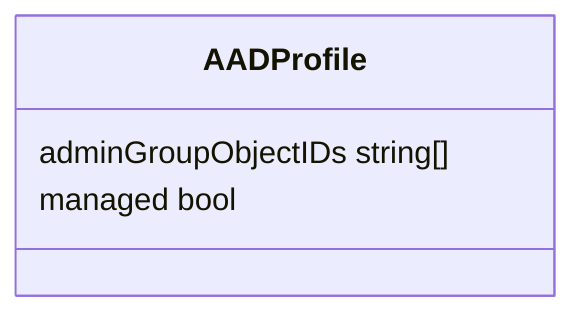

| Property            | Description                                                                          | Type                                 |
|---------------------|--------------------------------------------------------------------------------------|--------------------------------------|
| adminGroupObjectIDs | AdminGroupObjectIDs - AAD group object IDs that will have admin role of the cluster. | string[]<br/><small>Required</small> |
| managed             | Managed - Whether to enable managed AAD.                                             | bool<br/><small>Required</small>     |

<a id="AddonProfile"></a>AddonProfile
-------------------------------------

AddonProfile represents a managed cluster add-on.

Used by: [AzureManagedControlPlaneClassSpec](#AzureManagedControlPlaneClassSpec).

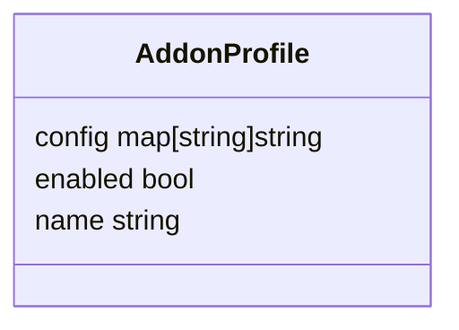

| Property | Description                                          | Type              |
|----------|------------------------------------------------------|-------------------|
| config   | Config - Key-value pairs for configuring the add-on. | map[string]string |
| enabled  | Enabled - Whether the add-on is enabled or not.      | bool              |
| name     | Name - The name of the managed cluster add-on.       | string            |

<a id="AddressRecord"></a>AddressRecord
---------------------------------------

AddressRecord specifies a DNS record mapping a hostname to an IPV4 or IPv6 address.

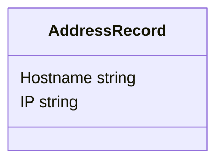

| Property | Description | Type   |
|----------|-------------|--------|
| Hostname |             | string |
| IP       |             | string |

<a id="AKSAssignedIdentity"></a>AKSAssignedIdentity
---------------------------------------------------

AKSAssignedIdentity defines the AKS assigned-identity of the aks marketplace extension, if configured.

Used by: [AKSExtension](#AKSExtension).

<a id="AKSExtension"></a>AKSExtension
-------------------------------------

AKSExtension represents the configuration for an AKS cluster extension. See also [AKS doc](https://learn.microsoft.com/en-us/azure/aks/cluster-extensions). <br/>

Used by: [AzureManagedControlPlaneClassSpec](#AzureManagedControlPlaneClassSpec).

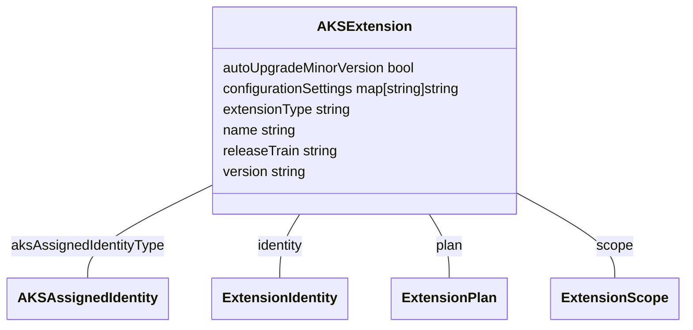

| Property                | Description                                                                                                                                                                                           | Type                                        |
|-------------------------|-------------------------------------------------------------------------------------------------------------------------------------------------------------------------------------------------------|---------------------------------------------|
| aksAssignedIdentityType | AKSAssignedIdentityType is the type of the AKS assigned identity.                                                                                                                                     | [AKSAssignedIdentity](#AKSAssignedIdentity) |
| autoUpgradeMinorVersion | AutoUpgradeMinorVersion is a flag to note if this extension participates in auto upgrade of minor version, or not.                                                                                    | bool                                        |
| configurationSettings   | ConfigurationSettings are the name-value pairs for configuring this extension.                                                                                                                        | map[string]string                           |
| extensionType           | ExtensionType is the type of the Extension of which this resource is an instance. It must be one of the Extension Types registered with Microsoft.KubernetesConfiguration by the Extension publisher. | string                                      |
| identity                | Identity is the identity type of the Extension resource in an AKS cluster.                                                                                                                            | [ExtensionIdentity](#ExtensionIdentity)     |
| name                    | Name is the name of the extension.                                                                                                                                                                    | string                                      |
| plan                    | Plan is the plan of the extension.                                                                                                                                                                    | [ExtensionPlan](#ExtensionPlan)             |
| releaseTrain            | ReleaseTrain is the release train this extension participates in for auto-upgrade (e.g. Stable, Preview, etc.) This is only used if autoUpgradeMinorVersion is ‘true’.                                | string                                      |
| scope                   | Scope is the scope at which this extension is enabled.                                                                                                                                                | [ExtensionScope](#ExtensionScope)           |
| version                 | Version is the version of the extension.                                                                                                                                                              | string                                      |

<a id="AKSSku"></a>AKSSku
-------------------------

AKSSku - AKS SKU.

Used by: [AzureManagedControlPlaneClassSpec](#AzureManagedControlPlaneClassSpec).

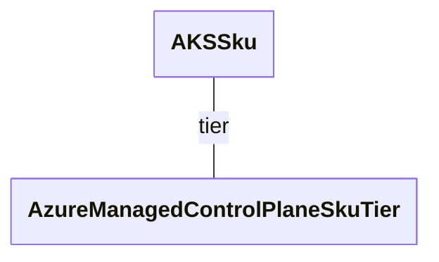

| Property | Description                    | Type                                                                |
|----------|--------------------------------|---------------------------------------------------------------------|
| tier     | Tier - Tier of an AKS cluster. | [AzureManagedControlPlaneSkuTier](#AzureManagedControlPlaneSkuTier) |

<a id="APIServerAccessProfile"></a>APIServerAccessProfile
---------------------------------------------------------

APIServerAccessProfile tunes the accessibility of the cluster's control plane. See also [AKS doc](https://learn.microsoft.com/azure/aks/api-server-authorized-ip-ranges). <br/>

Used by: [AzureManagedControlPlaneClassSpec](#AzureManagedControlPlaneClassSpec).

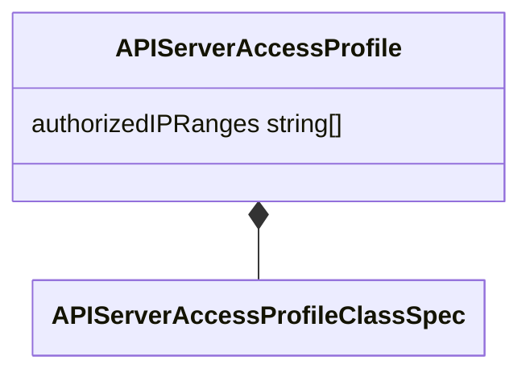

| Property                                                            | Description                                                         | Type     |
|---------------------------------------------------------------------|---------------------------------------------------------------------|----------|
| [APIServerAccessProfileClassSpec](#APIServerAccessProfileClassSpec) |                                                                     |          |
| authorizedIPRanges                                                  | AuthorizedIPRanges - Authorized IP Ranges to kubernetes API server. | string[] |

<a id="APIServerAccessProfileClassSpec"></a>APIServerAccessProfileClassSpec
---------------------------------------------------------------------------

APIServerAccessProfileClassSpec defines the APIServerAccessProfile properties that may be shared across several API server access profiles.

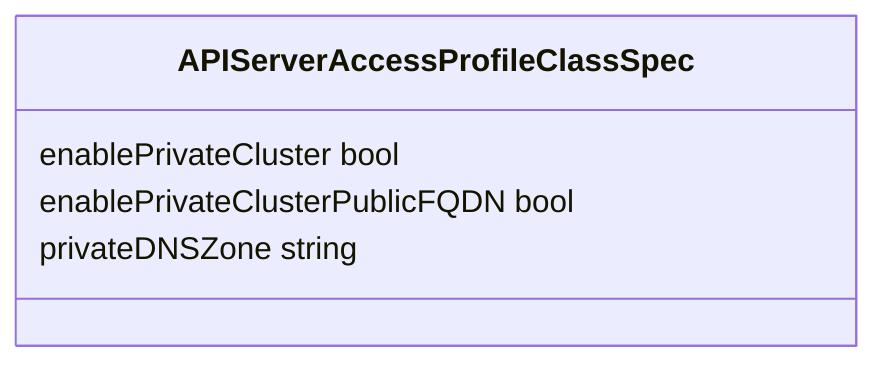

| Property                       | Description                                                                                                   | Type   |
|--------------------------------|---------------------------------------------------------------------------------------------------------------|--------|
| enablePrivateCluster           | EnablePrivateCluster indicates whether to create the cluster as a private cluster or not.                     | bool   |
| enablePrivateClusterPublicFQDN | EnablePrivateClusterPublicFQDN indicates whether to create additional public FQDN for private cluster or not. | bool   |
| privateDNSZone                 | PrivateDNSZone enables private dns zone mode for private cluster.                                             | string |

<a id="AutoScalerProfile"></a>AutoScalerProfile
-----------------------------------------------

AutoScalerProfile parameters to be applied to the cluster-autoscaler. See also [AKS doc](https://learn.microsoft.com/azure/aks/cluster-autoscaler#use-the-cluster-autoscaler-profile), [K8s doc](https://github.com/kubernetes/autoscaler/blob/master/cluster-autoscaler/FAQ.md#what-are-the-parameters-to-ca). <br/>

Used by: [AzureManagedControlPlaneClassSpec](#AzureManagedControlPlaneClassSpec).

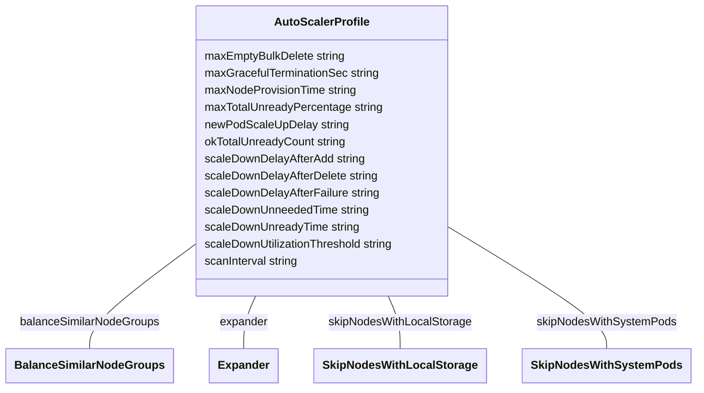

| Property                      | Description                                                                                                                                                                                                                                                                                                                                              | Type                                                    |
|-------------------------------|----------------------------------------------------------------------------------------------------------------------------------------------------------------------------------------------------------------------------------------------------------------------------------------------------------------------------------------------------------|---------------------------------------------------------|
| balanceSimilarNodeGroups      | BalanceSimilarNodeGroups - Valid values are 'true' and 'false'. The default is false.                                                                                                                                                                                                                                                                    | [BalanceSimilarNodeGroups](#BalanceSimilarNodeGroups)   |
| expander                      | Expander - If not specified, the default is 'random'. See [expanders](https://github.com/kubernetes/autoscaler/blob/master/cluster-autoscaler/FAQ.md#what-are-expanders) for more information.                                                                                                                                                           | [Expander](#Expander)                                   |
| maxEmptyBulkDelete            | MaxEmptyBulkDelete - The default is 10.                                                                                                                                                                                                                                                                                                                  | string                                                  |
| maxGracefulTerminationSec     | MaxGracefulTerminationSec - The default is 600.                                                                                                                                                                                                                                                                                                          | string                                                  |
| maxNodeProvisionTime          | MaxNodeProvisionTime - The default is '15m'. Values must be an integer followed by an 'm'. No unit of time other than minutes (m) is supported.                                                                                                                                                                                                          | string                                                  |
| maxTotalUnreadyPercentage     | MaxTotalUnreadyPercentage - The default is 45. The maximum is 100 and the minimum is 0.                                                                                                                                                                                                                                                                  | string                                                  |
| newPodScaleUpDelay            | NewPodScaleUpDelay - For scenarios like burst/batch scale where you don't want CA to act before the kubernetes scheduler could schedule all the pods, you can tell CA to ignore unscheduled pods before they're a certain age. The default is '0s'. Values must be an integer followed by a unit ('s' for seconds, 'm' for minutes, 'h' for hours, etc). | string                                                  |
| okTotalUnreadyCount           | OkTotalUnreadyCount - This must be an integer. The default is 3.                                                                                                                                                                                                                                                                                         | string                                                  |
| scaleDownDelayAfterAdd        | ScaleDownDelayAfterAdd - The default is '10m'. Values must be an integer followed by an 'm'. No unit of time other than minutes (m) is supported.                                                                                                                                                                                                        | string                                                  |
| scaleDownDelayAfterDelete     | ScaleDownDelayAfterDelete - The default is the scan-interval. Values must be an integer followed by an 's'. No unit of time other than seconds (s) is supported.                                                                                                                                                                                         | string                                                  |
| scaleDownDelayAfterFailure    | ScaleDownDelayAfterFailure - The default is '3m'. Values must be an integer followed by an 'm'. No unit of time other than minutes (m) is supported.                                                                                                                                                                                                     | string                                                  |
| scaleDownUnneededTime         | ScaleDownUnneededTime - The default is '10m'. Values must be an integer followed by an 'm'. No unit of time other than minutes (m) is supported.                                                                                                                                                                                                         | string                                                  |
| scaleDownUnreadyTime          | ScaleDownUnreadyTime - The default is '20m'. Values must be an integer followed by an 'm'. No unit of time other than minutes (m) is supported.                                                                                                                                                                                                          | string                                                  |
| scaleDownUtilizationThreshold | ScaleDownUtilizationThreshold - The default is '0.5'.                                                                                                                                                                                                                                                                                                    | string                                                  |
| scanInterval                  | ScanInterval - How often cluster is reevaluated for scale up or down. The default is '10s'.                                                                                                                                                                                                                                                              | string                                                  |
| skipNodesWithLocalStorage     | SkipNodesWithLocalStorage - The default is false.                                                                                                                                                                                                                                                                                                        | [SkipNodesWithLocalStorage](#SkipNodesWithLocalStorage) |
| skipNodesWithSystemPods       | SkipNodesWithSystemPods - The default is true.                                                                                                                                                                                                                                                                                                           | [SkipNodesWithSystemPods](#SkipNodesWithSystemPods)     |

<a id="AzureBastionTemplateSpec"></a>AzureBastionTemplateSpec
-------------------------------------------------------------

AzureBastionTemplateSpec specifies a template for an Azure Bastion host.

Used by: [BastionTemplateSpec](#BastionTemplateSpec).

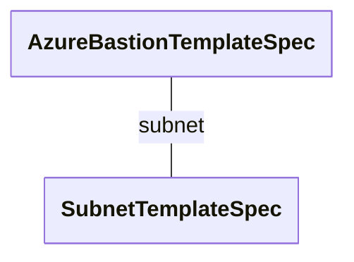

| Property | Description | Type                                      |
|----------|-------------|-------------------------------------------|
| subnet   |             | [SubnetTemplateSpec](#SubnetTemplateSpec) |

<a id="AzureCluster"></a>AzureCluster
-------------------------------------

<br/>AzureCluster is the Schema for the azureclusters API.

Used by: [AzureClusterList](#AzureClusterList).

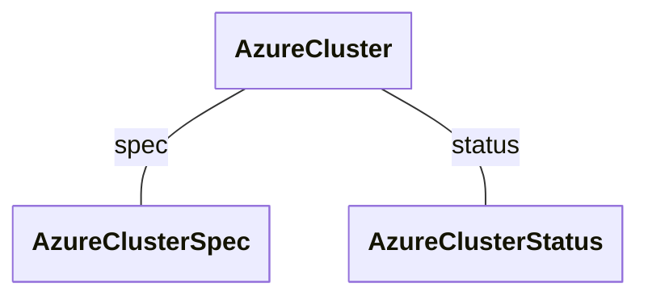

| Property                                                                                | Description | Type                                      |
|-----------------------------------------------------------------------------------------|-------------|-------------------------------------------|
| [metav1.TypeMeta](https://pkg.go.dev/k8s.io/apimachinery/pkg/apis/meta/v1#TypeMeta)     |             |                                           |
| [metav1.ObjectMeta](https://pkg.go.dev/k8s.io/apimachinery/pkg/apis/meta/v1#ObjectMeta) |             |                                           |
| spec                                                                                    |             | [AzureClusterSpec](#AzureClusterSpec)     |
| status                                                                                  |             | [AzureClusterStatus](#AzureClusterStatus) |

### <a id="AzureClusterSpec"></a>AzureClusterSpec

| Property                                        | Description                                                                                                                                                                                                                             | Type                                                                                         |
|-------------------------------------------------|-----------------------------------------------------------------------------------------------------------------------------------------------------------------------------------------------------------------------------------------|----------------------------------------------------------------------------------------------|
| [AzureClusterClassSpec](#AzureClusterClassSpec) |                                                                                                                                                                                                                                         |                                                                                              |
| bastionSpec                                     | BastionSpec encapsulates all things related to the Bastions in the cluster.                                                                                                                                                             | [BastionSpec](#BastionSpec)                                                                  |
| controlPlaneEndpoint                            | ControlPlaneEndpoint represents the endpoint used to communicate with the control plane. It is not recommended to set this when creating an AzureCluster as CAPZ will set this for you. However, if it is set, CAPZ will not change it. | [clusterv1.APIEndpoint](https://pkg.go.dev/sigs.k8s.io/cluster-api/api/v1beta11#APIEndpoint) |
| networkSpec                                     | NetworkSpec encapsulates all things related to Azure network.                                                                                                                                                                           | [NetworkSpec](#NetworkSpec)                                                                  |
| resourceGroup                                   |                                                                                                                                                                                                                                         | string                                                                                       |

### <a id="AzureClusterStatus"></a>AzureClusterStatus

| Property                   | Description                                                                                                                                                                                                                                                                                                                                                                                                                                                                                                              | Type                                                                                               |
|----------------------------|--------------------------------------------------------------------------------------------------------------------------------------------------------------------------------------------------------------------------------------------------------------------------------------------------------------------------------------------------------------------------------------------------------------------------------------------------------------------------------------------------------------------------|----------------------------------------------------------------------------------------------------|
| conditions                 | Conditions defines current service state of the AzureCluster.                                                                                                                                                                                                                                                                                                                                                                                                                                                            | [clusterv1.Conditions](https://pkg.go.dev/sigs.k8s.io/cluster-api/api/v1beta11#Conditions)         |
| failureDomains             | FailureDomains specifies the list of unique failure domains for the location/region of the cluster. A FailureDomain maps to Availability Zone with an Azure Region (if the region support them). An Availability Zone is a separate data center within a region and they can be used to ensure the cluster is more resilient to failure. See: <https://learn.microsoft.com/azure/reliability/availability-zones-overview> This list will be used by Cluster API to try and spread the machines across the failure domains. | [clusterv1.FailureDomains](https://pkg.go.dev/sigs.k8s.io/cluster-api/api/v1beta11#FailureDomains) |
| longRunningOperationStates | LongRunningOperationStates saves the states for Azure long-running operations so they can be continued on the next reconciliation loop.                                                                                                                                                                                                                                                                                                                                                                                  | Futures                                                                                            |
| ready                      | Ready is true when the provider resource is ready.                                                                                                                                                                                                                                                                                                                                                                                                                                                                       | bool                                                                                               |

<a id="AzureClusterClassSpec"></a>AzureClusterClassSpec
-------------------------------------------------------

AzureClusterClassSpec defines the AzureCluster properties that may be shared across several Azure clusters.

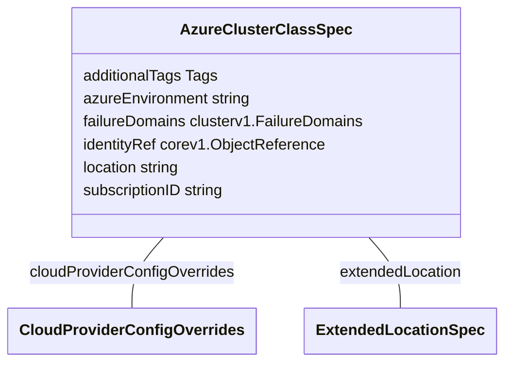

| Property                     | Description                                                                                                                                                                                                                                                                                                                                                                                                                                                                                                                                                                                                                                                                                                                                                                                                                                                                            | Type                                                                                               |
|------------------------------|----------------------------------------------------------------------------------------------------------------------------------------------------------------------------------------------------------------------------------------------------------------------------------------------------------------------------------------------------------------------------------------------------------------------------------------------------------------------------------------------------------------------------------------------------------------------------------------------------------------------------------------------------------------------------------------------------------------------------------------------------------------------------------------------------------------------------------------------------------------------------------------|----------------------------------------------------------------------------------------------------|
| additionalTags               | AdditionalTags is an optional set of tags to add to Azure resources managed by the Azure provider, in addition to the ones added by default.                                                                                                                                                                                                                                                                                                                                                                                                                                                                                                                                                                                                                                                                                                                                           | Tags                                                                                               |
| azureEnvironment             | AzureEnvironment is the name of the AzureCloud to be used. The default value that would be used by most users is "AzurePublicCloud", other values are: - ChinaCloud: "AzureChinaCloud" - GermanCloud: "AzureGermanCloud" - PublicCloud: "AzurePublicCloud" - USGovernmentCloud: "AzureUSGovernmentCloud" <br/>Note that values other than the default must also be accompanied by corresponding changes to the aso-controller-settings Secret to configure ASO to refer to the non-Public cloud. ASO currently does not support referring to multiple different clouds in a single installation. The following fields must be defined in the Secret: - AZURE_AUTHORITY_HOST - AZURE_RESOURCE_MANAGER_ENDPOINT - AZURE_RESOURCE_MANAGER_AUDIENCE <br/>See the [ASO docs](https://azure.github.io/azure-service-operator/guide/aso-controller-settings-options/) for more details. <br/> | string                                                                                             |
| cloudProviderConfigOverrides | CloudProviderConfigOverrides is an optional set of configuration values that can be overridden in azure cloud provider config. This is only a subset of options that are available in azure cloud provider config. Some values for the cloud provider config are inferred from other parts of cluster api provider azure spec, and may not be available for overrides. See: <https://cloud-provider-azure.sigs.k8s.io/install/configs> Note: All cloud provider config values can be customized by creating the secret beforehand. CloudProviderConfigOverrides is only used when the secret is managed by the Azure Provider.                                                                                                                                                                                                                                                           | [CloudProviderConfigOverrides](#CloudProviderConfigOverrides)                                      |
| extendedLocation             | ExtendedLocation is an optional set of ExtendedLocation properties for clusters on Azure public MEC.                                                                                                                                                                                                                                                                                                                                                                                                                                                                                                                                                                                                                                                                                                                                                                                   | [ExtendedLocationSpec](#ExtendedLocationSpec)                                                      |
| failureDomains               | FailureDomains is a list of failure domains in the cluster's region, used to restrict eligibility to host the control plane. A FailureDomain maps to an availability zone, which is a separated group of datacenters within a region. See: <https://learn.microsoft.com/azure/reliability/availability-zones-overview>                                                                                                                                                                                                                                                                                                                                                                                                                                                                                                                                                                   | [clusterv1.FailureDomains](https://pkg.go.dev/sigs.k8s.io/cluster-api/api/v1beta11#FailureDomains) |
| identityRef                  | IdentityRef is a reference to an AzureIdentity to be used when reconciling this cluster                                                                                                                                                                                                                                                                                                                                                                                                                                                                                                                                                                                                                                                                                                                                                                                                | [corev1.ObjectReference](https://pkg.go.dev/k8s.io/api/core/v1#ObjectReference)                    |
| location                     |                                                                                                                                                                                                                                                                                                                                                                                                                                                                                                                                                                                                                                                                                                                                                                                                                                                                                        | string                                                                                             |
| subscriptionID               |                                                                                                                                                                                                                                                                                                                                                                                                                                                                                                                                                                                                                                                                                                                                                                                                                                                                                        | string                                                                                             |

<a id="AzureClusterIdentity"></a>AzureClusterIdentity
-----------------------------------------------------

<br/>AzureClusterIdentity is the Schema for the azureclustersidentities API.

Used by: [AzureClusterIdentityList](#AzureClusterIdentityList).

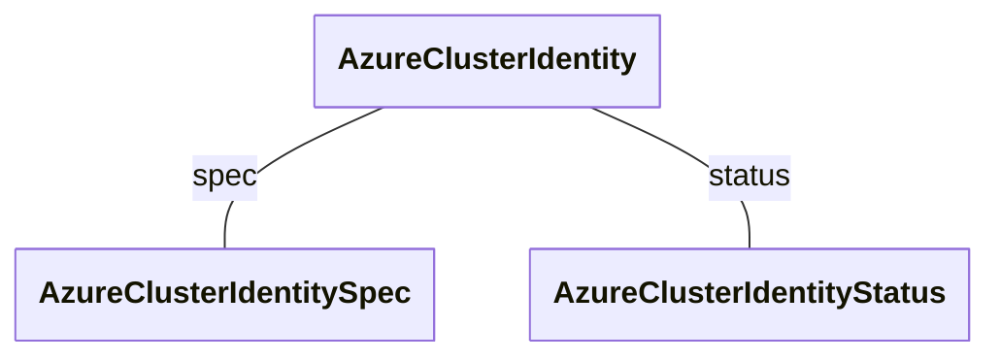

| Property                                                                                | Description | Type                                                      |
|-----------------------------------------------------------------------------------------|-------------|-----------------------------------------------------------|
| [metav1.TypeMeta](https://pkg.go.dev/k8s.io/apimachinery/pkg/apis/meta/v1#TypeMeta)     |             |                                                           |
| [metav1.ObjectMeta](https://pkg.go.dev/k8s.io/apimachinery/pkg/apis/meta/v1#ObjectMeta) |             |                                                           |
| spec                                                                                    |             | [AzureClusterIdentitySpec](#AzureClusterIdentitySpec)     |
| status                                                                                  |             | [AzureClusterIdentityStatus](#AzureClusterIdentityStatus) |

### <a id="AzureClusterIdentitySpec"></a>AzureClusterIdentitySpec

| Property          | Description                                                                                                                                                                                                                                                                                                                                                                                                                                                                                                         | Type                                                                            |
|-------------------|---------------------------------------------------------------------------------------------------------------------------------------------------------------------------------------------------------------------------------------------------------------------------------------------------------------------------------------------------------------------------------------------------------------------------------------------------------------------------------------------------------------------|---------------------------------------------------------------------------------|
| allowedNamespaces | AllowedNamespaces is used to identify the namespaces the clusters are allowed to use the identity from. Namespaces can be selected either using an array of namespaces or with label selector. An empty allowedNamespaces object indicates that AzureClusters can use this identity from any namespace. If this object is nil, no namespaces will be allowed (default behaviour, if this field is not provided) A namespace should be either in the NamespaceList or match with Selector to use the identity. <br/> | [AllowedNamespaces](#AllowedNamespaces)                                         |
| clientID          | ClientID is the service principal client ID. Both User Assigned MSI and SP can use this field.                                                                                                                                                                                                                                                                                                                                                                                                                      | string                                                                          |
| clientSecret      | ClientSecret is a secret reference which should contain either a Service Principal password or certificate secret.                                                                                                                                                                                                                                                                                                                                                                                                  | [corev1.SecretReference](https://pkg.go.dev/k8s.io/api/core/v1#SecretReference) |
| resourceID        | ResourceID is the Azure resource ID for the User Assigned MSI resource. Only applicable when type is UserAssignedMSI. <br/>Deprecated: This field no longer has any effect. <br/>                                                                                                                                                                                                                                                                                                                                   | string                                                                          |
| tenantID          | TenantID is the service principal primary tenant id.                                                                                                                                                                                                                                                                                                                                                                                                                                                                | string                                                                          |
| type              | Type is the type of Azure Identity used. ServicePrincipal, ServicePrincipalCertificate, UserAssignedMSI, ManualServicePrincipal or WorkloadIdentity.                                                                                                                                                                                                                                                                                                                                                                | [IdentityType](#IdentityType)                                                   |

### <a id="AzureClusterIdentityStatus"></a>AzureClusterIdentityStatus

| Property   | Description                                                           | Type                                                                                       |
|------------|-----------------------------------------------------------------------|--------------------------------------------------------------------------------------------|
| conditions | Conditions defines current service state of the AzureClusterIdentity. | [clusterv1.Conditions](https://pkg.go.dev/sigs.k8s.io/cluster-api/api/v1beta11#Conditions) |

<a id="AzureClusterIdentityList"></a>AzureClusterIdentityList
-------------------------------------------------------------

<br/>AzureClusterIdentityList contains a list of AzureClusterIdentity.

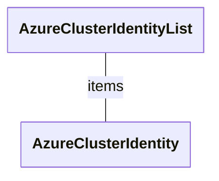

| Property                                                                            | Description | Type                                            |
|-------------------------------------------------------------------------------------|-------------|-------------------------------------------------|
| [metav1.TypeMeta](https://pkg.go.dev/k8s.io/apimachinery/pkg/apis/meta/v1#TypeMeta) |             |                                                 |
| [metav1.ListMeta](https://pkg.go.dev/k8s.io/apimachinery/pkg/apis/meta/v1#ListMeta) |             |                                                 |
| items                                                                               |             | [AzureClusterIdentity[]](#AzureClusterIdentity) |

<a id="AzureClusterList"></a>AzureClusterList
---------------------------------------------

<br/>AzureClusterList contains a list of AzureClusters.

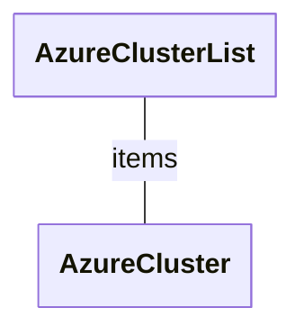

| Property                                                                            | Description | Type                            |
|-------------------------------------------------------------------------------------|-------------|---------------------------------|
| [metav1.TypeMeta](https://pkg.go.dev/k8s.io/apimachinery/pkg/apis/meta/v1#TypeMeta) |             |                                 |
| [metav1.ListMeta](https://pkg.go.dev/k8s.io/apimachinery/pkg/apis/meta/v1#ListMeta) |             |                                 |
| items                                                                               |             | [AzureCluster[]](#AzureCluster) |

<a id="AzureClusterTemplate"></a>AzureClusterTemplate
-----------------------------------------------------

<br/>AzureClusterTemplate is the Schema for the azureclustertemplates API.

Used by: [AzureClusterTemplateList](#AzureClusterTemplateList).

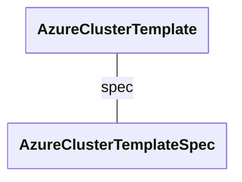

| Property                                                                                | Description | Type                                                  |
|-----------------------------------------------------------------------------------------|-------------|-------------------------------------------------------|
| [metav1.TypeMeta](https://pkg.go.dev/k8s.io/apimachinery/pkg/apis/meta/v1#TypeMeta)     |             |                                                       |
| [metav1.ObjectMeta](https://pkg.go.dev/k8s.io/apimachinery/pkg/apis/meta/v1#ObjectMeta) |             |                                                       |
| spec                                                                                    |             | [AzureClusterTemplateSpec](#AzureClusterTemplateSpec) |

<a id="AzureClusterTemplateList"></a>AzureClusterTemplateList
-------------------------------------------------------------

<br/>AzureClusterTemplateList contains a list of AzureClusterTemplate.

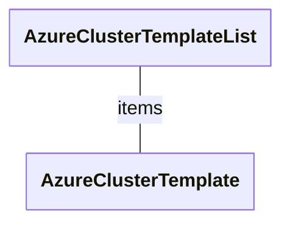

| Property                                                                            | Description | Type                                            |
|-------------------------------------------------------------------------------------|-------------|-------------------------------------------------|
| [metav1.TypeMeta](https://pkg.go.dev/k8s.io/apimachinery/pkg/apis/meta/v1#TypeMeta) |             |                                                 |
| [metav1.ListMeta](https://pkg.go.dev/k8s.io/apimachinery/pkg/apis/meta/v1#ListMeta) |             |                                                 |
| items                                                                               |             | [AzureClusterTemplate[]](#AzureClusterTemplate) |

<a id="AzureClusterTemplateResource"></a>AzureClusterTemplateResource
---------------------------------------------------------------------

AzureClusterTemplateResource describes the data needed to create an AzureCluster from a template.

Used by: [AzureClusterTemplateSpec](#AzureClusterTemplateSpec).

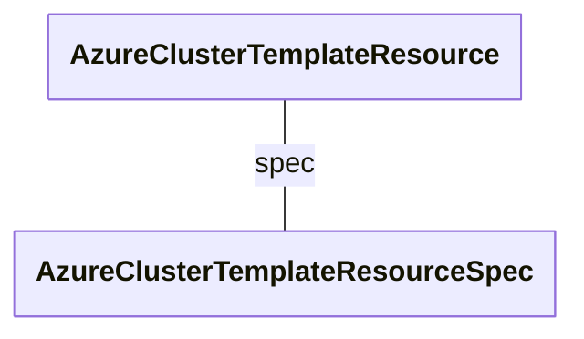

| Property | Description | Type                                                                  |
|----------|-------------|-----------------------------------------------------------------------|
| spec     |             | [AzureClusterTemplateResourceSpec](#AzureClusterTemplateResourceSpec) |

<a id="AzureClusterTemplateResourceSpec"></a>AzureClusterTemplateResourceSpec
-----------------------------------------------------------------------------

AzureClusterTemplateResourceSpec specifies an Azure cluster template resource.

Used by: [AzureClusterTemplateResource](#AzureClusterTemplateResource).

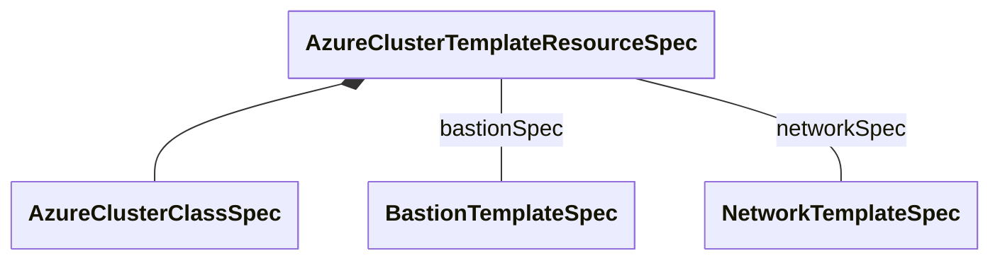

| Property                                        | Description                                                                 | Type                                        |
|-------------------------------------------------|-----------------------------------------------------------------------------|---------------------------------------------|
| [AzureClusterClassSpec](#AzureClusterClassSpec) |                                                                             |                                             |
| bastionSpec                                     | BastionSpec encapsulates all things related to the Bastions in the cluster. | [BastionTemplateSpec](#BastionTemplateSpec) |
| networkSpec                                     | NetworkSpec encapsulates all things related to Azure network.               | [NetworkTemplateSpec](#NetworkTemplateSpec) |

<a id="AzureClusterTemplateSpec"></a>AzureClusterTemplateSpec
-------------------------------------------------------------

AzureClusterTemplateSpec defines the desired state of AzureClusterTemplate.

Used by: [AzureClusterTemplate](#AzureClusterTemplate).

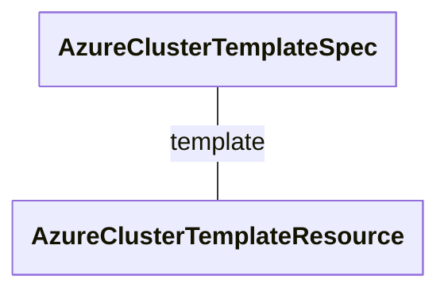

| Property | Description | Type                                                          |
|----------|-------------|---------------------------------------------------------------|
| template |             | [AzureClusterTemplateResource](#AzureClusterTemplateResource) |

<a id="AzureKeyVaultKms"></a>AzureKeyVaultKms
---------------------------------------------

AzureKeyVaultKms service settings for the security profile. See also [AKS doc](https://learn.microsoft.com/azure/aks/use-kms-etcd-encryption#update-key-vault-mode). <br/>

Used by: [ManagedClusterSecurityProfile](#ManagedClusterSecurityProfile).

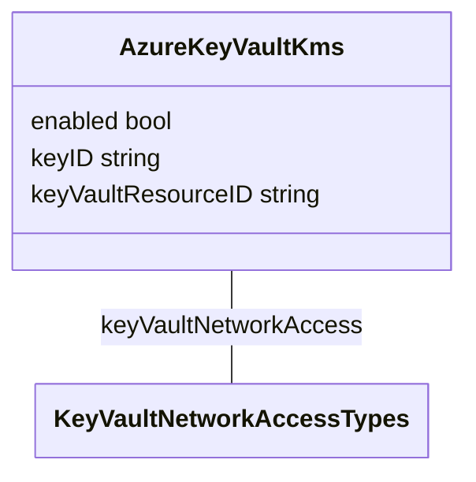

| Property              | Description                                                                                                                                                                                                                                                                             | Type                                                      |
|-----------------------|-----------------------------------------------------------------------------------------------------------------------------------------------------------------------------------------------------------------------------------------------------------------------------------------|-----------------------------------------------------------|
| enabled               | Enabled enables the Azure Key Vault key management service. The default is false.                                                                                                                                                                                                       | bool<br/><small>Required</small>                          |
| keyID                 | KeyID defines the Identifier of Azure Key Vault key. When Azure Key Vault key management service is enabled, this field is required and must be a valid key identifier.                                                                                                                 | string<br/><small>Required</small>                        |
| keyVaultNetworkAccess | KeyVaultNetworkAccess defines the network access of key vault. The possible values are Public and Private. Public means the key vault allows public access from all networks. Private means the key vault disables public access and enables private link. The default value is Public. | [KeyVaultNetworkAccessTypes](#KeyVaultNetworkAccessTypes) |
| keyVaultResourceID    | KeyVaultResourceID is the Resource ID of key vault. When keyVaultNetworkAccess is Private, this field is required and must be a valid resource ID.                                                                                                                                      | string                                                    |

<a id="AzureMachine"></a>AzureMachine
-------------------------------------

<br/>AzureMachine is the Schema for the azuremachines API.

Used by: [AzureMachineList](#AzureMachineList).

```mermaid
---
  config:
    class:
      hideEmptyMembersBox: true
---
classDiagram
class AzureMachine["AzureMachine"]
AzureMachine -- AzureMachineSpec : spec
AzureMachine -- AzureMachineStatus : status
class AzureMachineSpec["AzureMachineSpec"] 
class AzureMachineStatus["AzureMachineStatus"] 

```

| Property                                                                                | Description | Type                                      |
|-----------------------------------------------------------------------------------------|-------------|-------------------------------------------|
| [metav1.TypeMeta](https://pkg.go.dev/k8s.io/apimachinery/pkg/apis/meta/v1#TypeMeta)     |             |                                           |
| [metav1.ObjectMeta](https://pkg.go.dev/k8s.io/apimachinery/pkg/apis/meta/v1#ObjectMeta) |             |                                           |
| spec                                                                                    |             | [AzureMachineSpec](#AzureMachineSpec)     |
| status                                                                                  |             | [AzureMachineStatus](#AzureMachineStatus) |

### <a id="AzureMachineSpec"></a>AzureMachineSpec

| Property                   | Description                                                                                                                                                                                                                                                                                                                                                                                                                                                                                                                                                                                                                           | Type                                                      |
|----------------------------|---------------------------------------------------------------------------------------------------------------------------------------------------------------------------------------------------------------------------------------------------------------------------------------------------------------------------------------------------------------------------------------------------------------------------------------------------------------------------------------------------------------------------------------------------------------------------------------------------------------------------------------|-----------------------------------------------------------|
| acceleratedNetworking      | Deprecated: AcceleratedNetworking should be set in the networkInterfaces field.                                                                                                                                                                                                                                                                                                                                                                                                                                                                                                                                                       | bool                                                      |
| additionalCapabilities     | AdditionalCapabilities specifies additional capabilities enabled or disabled on the virtual machine.                                                                                                                                                                                                                                                                                                                                                                                                                                                                                                                                  | [AdditionalCapabilities](#AdditionalCapabilities)         |
| additionalTags             | AdditionalTags is an optional set of tags to add to an instance, in addition to the ones added by default by the Azure provider. If both the AzureCluster and the AzureMachine specify the same tag name with different values, the AzureMachine's value takes precedence.                                                                                                                                                                                                                                                                                                                                                            | Tags                                                      |
| allocatePublicIP           | AllocatePublicIP allows the ability to create dynamic public ips for machines where this value is true.                                                                                                                                                                                                                                                                                                                                                                                                                                                                                                                               | bool                                                      |
| capacityReservationGroupID | CapacityReservationGroupID specifies the capacity reservation group resource id that should be used for allocating the virtual machine. The field size should be greater than 0 and the field input must start with '/'. The input for capacityReservationGroupID must be similar to '/subscriptions/{subscriptionId}/resourceGroups/{resourceGroupName}/providers/Microsoft.Compute/capacityReservationGroups/{capacityReservationGroupName}'. The keys which are used should be among 'subscriptions', 'providers' and 'resourcegroups' followed by valid ID or names respectively. It is optional but may not be changed once set. | string                                                    |
| dataDisks                  | DataDisk specifies the parameters that are used to add one or more data disks to the machine                                                                                                                                                                                                                                                                                                                                                                                                                                                                                                                                          | [DataDisk[]](#DataDisk)                                   |
| diagnostics                | Diagnostics specifies the diagnostics settings for a virtual machine. If not specified then Boot diagnostics (Managed) will be enabled.                                                                                                                                                                                                                                                                                                                                                                                                                                                                                               | [Diagnostics](#Diagnostics)                               |
| disableExtensionOperations | DisableExtensionOperations specifies whether extension operations should be disabled on the virtual machine. Use this setting only if VMExtensions are not supported by your image, as it disables CAPZ bootstrapping extension used for detecting Kubernetes bootstrap failure. This may only be set to True when no extensions are configured on the virtual machine.                                                                                                                                                                                                                                                               | bool                                                      |
| dnsServers                 | DNSServers adds a list of DNS Server IP addresses to the VM NICs.                                                                                                                                                                                                                                                                                                                                                                                                                                                                                                                                                                     | string[]                                                  |
| enableIPForwarding         | EnableIPForwarding enables IP Forwarding in Azure which is required for some CNI's to send traffic from a pods on one machine to another. This is required for IpV6 with Calico in combination with User Defined Routes (set by the Azure Cloud Controller manager). Default is false for disabled.                                                                                                                                                                                                                                                                                                                                   | bool                                                      |
| failureDomain              | FailureDomain is the failure domain unique identifier this Machine should be attached to, as defined in Cluster API. This relates to an Azure Availability Zone                                                                                                                                                                                                                                                                                                                                                                                                                                                                       | string                                                    |
| identity                   | Identity is the type of identity used for the virtual machine. The type 'SystemAssigned' is an implicitly created identity. The generated identity will be assigned a Subscription contributor role. The type 'UserAssigned' is a standalone Azure resource provided by the user and assigned to the VM                                                                                                                                                                                                                                                                                                                               | [VMIdentity](#VMIdentity)                                 |
| image                      | Image is used to provide details of an image to use during VM creation. If image details are omitted the image will default the Azure Marketplace "capi" offer, which is based on Ubuntu.                                                                                                                                                                                                                                                                                                                                                                                                                                             | [Image](#Image)                                           |
| networkInterfaces          | NetworkInterfaces specifies a list of network interface configurations. If left unspecified, the VM will get a single network interface with a single IPConfig in the subnet specified in the cluster's node subnet field. The primary interface will be the first networkInterface specified (index 0) in the list.                                                                                                                                                                                                                                                                                                                  | [NetworkInterface[]](#NetworkInterface)                   |
| osDisk                     | OSDisk specifies the parameters for the operating system disk of the machine                                                                                                                                                                                                                                                                                                                                                                                                                                                                                                                                                          | [OSDisk](#OSDisk)                                         |
| providerID                 | ProviderID is the unique identifier as specified by the cloud provider.                                                                                                                                                                                                                                                                                                                                                                                                                                                                                                                                                               | string                                                    |
| roleAssignmentName         | Deprecated: RoleAssignmentName should be set in the systemAssignedIdentityRole field.                                                                                                                                                                                                                                                                                                                                                                                                                                                                                                                                                 | string                                                    |
| securityProfile            | SecurityProfile specifies the Security profile settings for a virtual machine.                                                                                                                                                                                                                                                                                                                                                                                                                                                                                                                                                        | [SecurityProfile](#SecurityProfile)                       |
| spotVMOptions              | SpotVMOptions allows the ability to specify the Machine should use a Spot VM                                                                                                                                                                                                                                                                                                                                                                                                                                                                                                                                                          | [SpotVMOptions](#SpotVMOptions)                           |
| sshPublicKey               | SSHPublicKey is the SSH public key string, base64-encoded to add to a Virtual Machine. Linux only. Refer to documentation on how to set up SSH access on Windows instances.                                                                                                                                                                                                                                                                                                                                                                                                                                                           | string                                                    |
| subnetName                 | Deprecated: SubnetName should be set in the networkInterfaces field.                                                                                                                                                                                                                                                                                                                                                                                                                                                                                                                                                                  | string                                                    |
| systemAssignedIdentityRole | SystemAssignedIdentityRole defines the role and scope to assign to the system-assigned identity.                                                                                                                                                                                                                                                                                                                                                                                                                                                                                                                                      | [SystemAssignedIdentityRole](#SystemAssignedIdentityRole) |
| userAssignedIdentities     | UserAssignedIdentities is a list of standalone Azure identities provided by the user The lifecycle of a user-assigned identity is managed separately from the lifecycle of the AzureMachine. See <https://learn.microsoft.com/azure/active-directory/managed-identities-azure-resources/how-to-manage-ua-identity-cli>                                                                                                                                                                                                                                                                                                                  | [UserAssignedIdentity[]](#UserAssignedIdentity)           |
| vmExtensions               | VMExtensions specifies a list of extensions to be added to the virtual machine.                                                                                                                                                                                                                                                                                                                                                                                                                                                                                                                                                       | [VMExtension[]](#VMExtension)                             |
| vmSize                     |                                                                                                                                                                                                                                                                                                                                                                                                                                                                                                                                                                                                                                       | string                                                    |

### <a id="AzureMachineStatus"></a>AzureMachineStatus

| Property                   | Description                                                                                                                                                                                                                                                                                                                                                                                                                                                                                                                                                                                                                                                                                                                                                                                                                                                                                   | Type                                                                                              |
|----------------------------|-----------------------------------------------------------------------------------------------------------------------------------------------------------------------------------------------------------------------------------------------------------------------------------------------------------------------------------------------------------------------------------------------------------------------------------------------------------------------------------------------------------------------------------------------------------------------------------------------------------------------------------------------------------------------------------------------------------------------------------------------------------------------------------------------------------------------------------------------------------------------------------------------|---------------------------------------------------------------------------------------------------|
| addresses                  | Addresses contains the Azure instance associated addresses.                                                                                                                                                                                                                                                                                                                                                                                                                                                                                                                                                                                                                                                                                                                                                                                                                                   | [corev1.NodeAddress[]](https://pkg.go.dev/k8s.io/api/core/v1#NodeAddress)                         |
| conditions                 | Conditions defines current service state of the AzureMachine.                                                                                                                                                                                                                                                                                                                                                                                                                                                                                                                                                                                                                                                                                                                                                                                                                                 | [clusterv1.Conditions](https://pkg.go.dev/sigs.k8s.io/cluster-api/api/v1beta11#Conditions)        |
| failureMessage             | ErrorMessage will be set in the event that there is a terminal problem reconciling the Machine and will contain a more verbose string suitable for logging and human consumption. <br/>This field should not be set for transitive errors that a controller faces that are expected to be fixed automatically over time (like service outages), but instead indicate that something is fundamentally wrong with the Machine's spec or the configuration of the controller, and that manual intervention is required. Examples of terminal errors would be invalid combinations of settings in the spec, values that are unsupported by the controller, or the responsible controller itself being critically misconfigured. <br/>Any transient errors that occur during the reconciliation of Machines can be added as events to the Machine object and/or logged in the controller's output. | string                                                                                            |
| failureReason              | ErrorReason will be set in the event that there is a terminal problem reconciling the Machine and will contain a succinct value suitable for machine interpretation. <br/>This field should not be set for transitive errors that a controller faces that are expected to be fixed automatically over time (like service outages), but instead indicate that something is fundamentally wrong with the Machine's spec or the configuration of the controller, and that manual intervention is required. Examples of terminal errors would be invalid combinations of settings in the spec, values that are unsupported by the controller, or the responsible controller itself being critically misconfigured. <br/>Any transient errors that occur during the reconciliation of Machines can be added as events to the Machine object and/or logged in the controller's output.              | [errors.MachineStatusError](https://pkg.go.dev/sigs.k8s.io/cluster-api/errors#MachineStatusError) |
| longRunningOperationStates | LongRunningOperationStates saves the states for Azure long-running operations so they can be continued on the next reconciliation loop.                                                                                                                                                                                                                                                                                                                                                                                                                                                                                                                                                                                                                                                                                                                                                       | Futures                                                                                           |
| ready                      | Ready is true when the provider resource is ready.                                                                                                                                                                                                                                                                                                                                                                                                                                                                                                                                                                                                                                                                                                                                                                                                                                            | bool                                                                                              |
| vmState                    | VMState is the provisioning state of the Azure virtual machine.                                                                                                                                                                                                                                                                                                                                                                                                                                                                                                                                                                                                                                                                                                                                                                                                                               | [ProvisioningState](#ProvisioningState)                                                           |

<a id="AzureMachineList"></a>AzureMachineList
---------------------------------------------

<br/>AzureMachineList contains a list of AzureMachine.

```mermaid
---
  config:
    class:
      hideEmptyMembersBox: true
---
classDiagram
class AzureMachineList["AzureMachineList"]
AzureMachineList -- AzureMachine : items
class AzureMachine["AzureMachine"] 

```

| Property                                                                            | Description | Type                            |
|-------------------------------------------------------------------------------------|-------------|---------------------------------|
| [metav1.TypeMeta](https://pkg.go.dev/k8s.io/apimachinery/pkg/apis/meta/v1#TypeMeta) |             |                                 |
| [metav1.ListMeta](https://pkg.go.dev/k8s.io/apimachinery/pkg/apis/meta/v1#ListMeta) |             |                                 |
| items                                                                               |             | [AzureMachine[]](#AzureMachine) |

<a id="AzureMachineTemplate"></a>AzureMachineTemplate
-----------------------------------------------------

<br/>AzureMachineTemplate is the Schema for the azuremachinetemplates API.

Used by: [AzureMachineTemplateList](#AzureMachineTemplateList).

```mermaid
---
  config:
    class:
      hideEmptyMembersBox: true
---
classDiagram
class AzureMachineTemplate["AzureMachineTemplate"]
AzureMachineTemplate -- AzureMachineTemplateSpec : spec
class AzureMachineTemplateSpec["AzureMachineTemplateSpec"] 

```

| Property                                                                                | Description | Type                                                  |
|-----------------------------------------------------------------------------------------|-------------|-------------------------------------------------------|
| [metav1.TypeMeta](https://pkg.go.dev/k8s.io/apimachinery/pkg/apis/meta/v1#TypeMeta)     |             |                                                       |
| [metav1.ObjectMeta](https://pkg.go.dev/k8s.io/apimachinery/pkg/apis/meta/v1#ObjectMeta) |             |                                                       |
| spec                                                                                    |             | [AzureMachineTemplateSpec](#AzureMachineTemplateSpec) |

<a id="AzureMachineTemplateList"></a>AzureMachineTemplateList
-------------------------------------------------------------

<br/>AzureMachineTemplateList contains a list of AzureMachineTemplates.

```mermaid
---
  config:
    class:
      hideEmptyMembersBox: true
---
classDiagram
class AzureMachineTemplateList["AzureMachineTemplateList"]
AzureMachineTemplateList -- AzureMachineTemplate : items
class AzureMachineTemplate["AzureMachineTemplate"] 

```

| Property                                                                            | Description | Type                                            |
|-------------------------------------------------------------------------------------|-------------|-------------------------------------------------|
| [metav1.TypeMeta](https://pkg.go.dev/k8s.io/apimachinery/pkg/apis/meta/v1#TypeMeta) |             |                                                 |
| [metav1.ListMeta](https://pkg.go.dev/k8s.io/apimachinery/pkg/apis/meta/v1#ListMeta) |             |                                                 |
| items                                                                               |             | [AzureMachineTemplate[]](#AzureMachineTemplate) |

<a id="AzureMachineTemplateResource"></a>AzureMachineTemplateResource
---------------------------------------------------------------------

AzureMachineTemplateResource describes the data needed to create an AzureMachine from a template.

Used by: [AzureMachineTemplateSpec](#AzureMachineTemplateSpec).

```mermaid
---
  config:
    class:
      hideEmptyMembersBox: true
---
classDiagram
class AzureMachineTemplateResource["AzureMachineTemplateResource"] {
    metadata clusterv1.ObjectMeta
}

AzureMachineTemplateResource -- AzureMachineSpec : spec
class AzureMachineSpec["AzureMachineSpec"] 

```

| Property | Description                                                       | Type                                                                                       |
|----------|-------------------------------------------------------------------|--------------------------------------------------------------------------------------------|
| metadata |                                                                   | [clusterv1.ObjectMeta](https://pkg.go.dev/sigs.k8s.io/cluster-api/api/v1beta11#ObjectMeta) |
| spec     | Spec is the specification of the desired behavior of the machine. | [AzureMachineSpec](#AzureMachineSpec)                                                      |

<a id="AzureMachineTemplateSpec"></a>AzureMachineTemplateSpec
-------------------------------------------------------------

AzureMachineTemplateSpec defines the desired state of AzureMachineTemplate.

Used by: [AzureMachineTemplate](#AzureMachineTemplate).

```mermaid
---
  config:
    class:
      hideEmptyMembersBox: true
---
classDiagram
class AzureMachineTemplateSpec["AzureMachineTemplateSpec"]
AzureMachineTemplateSpec -- AzureMachineTemplateResource : template
class AzureMachineTemplateResource["AzureMachineTemplateResource"] 

```

| Property | Description | Type                                                          |
|----------|-------------|---------------------------------------------------------------|
| template |             | [AzureMachineTemplateResource](#AzureMachineTemplateResource) |

<a id="azureMachineWebhook"></a>azureMachineWebhook
---------------------------------------------------

<br/>azureMachineWebhook implements a validating and defaulting webhook for AzureMachines.

```mermaid
---
  config:
    class:
      hideEmptyMembersBox: true
---
classDiagram
class azureMachineWebhook["azureMachineWebhook"] {
    Client client.Client
}


```

| Property | Description | Type                                                                                 |
|----------|-------------|--------------------------------------------------------------------------------------|
| Client   |             | [client.Client](https://pkg.go.dev/sigs.k8s.io/controller-runtime/pkg/client#Client) |

<a id="AzureManagedCluster"></a>AzureManagedCluster
---------------------------------------------------

<br/>AzureManagedCluster is the Schema for the azuremanagedclusters API.

Used by: [AzureManagedClusterList](#AzureManagedClusterList).

```mermaid
---
  config:
    class:
      hideEmptyMembersBox: true
---
classDiagram
class AzureManagedCluster["AzureManagedCluster"]
AzureManagedCluster -- AzureManagedClusterSpec : spec
AzureManagedCluster -- AzureManagedClusterStatus : status
class AzureManagedClusterSpec["AzureManagedClusterSpec"] 
class AzureManagedClusterStatus["AzureManagedClusterStatus"] 

```

| Property                                                                                | Description | Type                                                    |
|-----------------------------------------------------------------------------------------|-------------|---------------------------------------------------------|
| [metav1.TypeMeta](https://pkg.go.dev/k8s.io/apimachinery/pkg/apis/meta/v1#TypeMeta)     |             |                                                         |
| [metav1.ObjectMeta](https://pkg.go.dev/k8s.io/apimachinery/pkg/apis/meta/v1#ObjectMeta) |             |                                                         |
| spec                                                                                    |             | [AzureManagedClusterSpec](#AzureManagedClusterSpec)     |
| status                                                                                  |             | [AzureManagedClusterStatus](#AzureManagedClusterStatus) |

### <a id="AzureManagedClusterSpec"></a>AzureManagedClusterSpec

| Property             | Description                                                                                                                                                                                                                                                                                   | Type                                                                                         |
|----------------------|-----------------------------------------------------------------------------------------------------------------------------------------------------------------------------------------------------------------------------------------------------------------------------------------------|----------------------------------------------------------------------------------------------|
| controlPlaneEndpoint | ControlPlaneEndpoint represents the endpoint used to communicate with the control plane. Immutable, populated by the AKS API at create. Because this field is programmatically set by CAPZ after resource creation, we define it as +optional in the API schema to permit resource admission. | [clusterv1.APIEndpoint](https://pkg.go.dev/sigs.k8s.io/cluster-api/api/v1beta11#APIEndpoint) |

### <a id="AzureManagedClusterStatus"></a>AzureManagedClusterStatus

| Property | Description                                        | Type |
|----------|----------------------------------------------------|------|
| ready    | Ready is true when the provider resource is ready. | bool |

<a id="AzureManagedClusterList"></a>AzureManagedClusterList
-----------------------------------------------------------

<br/>AzureManagedClusterList contains a list of AzureManagedClusters.

```mermaid
---
  config:
    class:
      hideEmptyMembersBox: true
---
classDiagram
class AzureManagedClusterList["AzureManagedClusterList"]
AzureManagedClusterList -- AzureManagedCluster : items
class AzureManagedCluster["AzureManagedCluster"] 

```

| Property                                                                            | Description | Type                                          |
|-------------------------------------------------------------------------------------|-------------|-----------------------------------------------|
| [metav1.TypeMeta](https://pkg.go.dev/k8s.io/apimachinery/pkg/apis/meta/v1#TypeMeta) |             |                                               |
| [metav1.ListMeta](https://pkg.go.dev/k8s.io/apimachinery/pkg/apis/meta/v1#ListMeta) |             |                                               |
| items                                                                               |             | [AzureManagedCluster[]](#AzureManagedCluster) |

<a id="AzureManagedClusterTemplate"></a>AzureManagedClusterTemplate
-------------------------------------------------------------------

<br/>AzureManagedClusterTemplate is the Schema for the AzureManagedClusterTemplates API.

Used by: [AzureManagedClusterTemplateList](#AzureManagedClusterTemplateList).

```mermaid
---
  config:
    class:
      hideEmptyMembersBox: true
---
classDiagram
class AzureManagedClusterTemplate["AzureManagedClusterTemplate"]
AzureManagedClusterTemplate -- AzureManagedClusterTemplateSpec : spec
class AzureManagedClusterTemplateSpec["AzureManagedClusterTemplateSpec"] 

```

| Property                                                                                | Description | Type                                                                |
|-----------------------------------------------------------------------------------------|-------------|---------------------------------------------------------------------|
| [metav1.TypeMeta](https://pkg.go.dev/k8s.io/apimachinery/pkg/apis/meta/v1#TypeMeta)     |             |                                                                     |
| [metav1.ObjectMeta](https://pkg.go.dev/k8s.io/apimachinery/pkg/apis/meta/v1#ObjectMeta) |             |                                                                     |
| spec                                                                                    |             | [AzureManagedClusterTemplateSpec](#AzureManagedClusterTemplateSpec) |

<a id="AzureManagedClusterTemplateList"></a>AzureManagedClusterTemplateList
---------------------------------------------------------------------------

<br/>AzureManagedClusterTemplateList contains a list of AzureManagedClusterTemplates.

```mermaid
---
  config:
    class:
      hideEmptyMembersBox: true
---
classDiagram
class AzureManagedClusterTemplateList["AzureManagedClusterTemplateList"]
AzureManagedClusterTemplateList -- AzureManagedClusterTemplate : items
class AzureManagedClusterTemplate["AzureManagedClusterTemplate"] 

```

| Property                                                                            | Description | Type                                                          |
|-------------------------------------------------------------------------------------|-------------|---------------------------------------------------------------|
| [metav1.TypeMeta](https://pkg.go.dev/k8s.io/apimachinery/pkg/apis/meta/v1#TypeMeta) |             |                                                               |
| [metav1.ListMeta](https://pkg.go.dev/k8s.io/apimachinery/pkg/apis/meta/v1#ListMeta) |             |                                                               |
| items                                                                               |             | [AzureManagedClusterTemplate[]](#AzureManagedClusterTemplate) |

<a id="AzureManagedClusterTemplateResource"></a>AzureManagedClusterTemplateResource
-----------------------------------------------------------------------------------

AzureManagedClusterTemplateResource describes the data needed to create an AzureManagedCluster from a template.

Used by: [AzureManagedClusterTemplateSpec](#AzureManagedClusterTemplateSpec).

```mermaid
---
  config:
    class:
      hideEmptyMembersBox: true
---
classDiagram
class AzureManagedClusterTemplateResource["AzureManagedClusterTemplateResource"] {
    spec AzureManagedClusterTemplateResourceSpec
}


```

| Property | Description | Type                                    |
|----------|-------------|-----------------------------------------|
| spec     |             | AzureManagedClusterTemplateResourceSpec |

<a id="AzureManagedClusterTemplateSpec"></a>AzureManagedClusterTemplateSpec
---------------------------------------------------------------------------

AzureManagedClusterTemplateSpec defines the desired state of AzureManagedClusterTemplate.

Used by: [AzureManagedClusterTemplate](#AzureManagedClusterTemplate).

```mermaid
---
  config:
    class:
      hideEmptyMembersBox: true
---
classDiagram
class AzureManagedClusterTemplateSpec["AzureManagedClusterTemplateSpec"]
AzureManagedClusterTemplateSpec -- AzureManagedClusterTemplateResource : template
class AzureManagedClusterTemplateResource["AzureManagedClusterTemplateResource"] 

```

| Property | Description | Type                                                                        |
|----------|-------------|-----------------------------------------------------------------------------|
| template |             | [AzureManagedClusterTemplateResource](#AzureManagedClusterTemplateResource) |

<a id="AzureManagedControlPlane"></a>AzureManagedControlPlane
-------------------------------------------------------------

<br/>AzureManagedControlPlane is the Schema for the azuremanagedcontrolplanes API.

Used by: [AzureManagedControlPlaneList](#AzureManagedControlPlaneList).

```mermaid
---
  config:
    class:
      hideEmptyMembersBox: true
---
classDiagram
class AzureManagedControlPlane["AzureManagedControlPlane"]
AzureManagedControlPlane -- AzureManagedControlPlaneSpec : spec
AzureManagedControlPlane -- AzureManagedControlPlaneStatus : status
class AzureManagedControlPlaneSpec["AzureManagedControlPlaneSpec"] 
class AzureManagedControlPlaneStatus["AzureManagedControlPlaneStatus"] 

```

| Property                                                                                | Description | Type                                                              |
|-----------------------------------------------------------------------------------------|-------------|-------------------------------------------------------------------|
| [metav1.TypeMeta](https://pkg.go.dev/k8s.io/apimachinery/pkg/apis/meta/v1#TypeMeta)     |             |                                                                   |
| [metav1.ObjectMeta](https://pkg.go.dev/k8s.io/apimachinery/pkg/apis/meta/v1#ObjectMeta) |             |                                                                   |
| spec                                                                                    |             | [AzureManagedControlPlaneSpec](#AzureManagedControlPlaneSpec)     |
| status                                                                                  |             | [AzureManagedControlPlaneStatus](#AzureManagedControlPlaneStatus) |

### <a id="AzureManagedControlPlaneSpec"></a>AzureManagedControlPlaneSpec

| Property                                                                | Description                                                                                                                                                                                                   | Type                                                                                         |
|-------------------------------------------------------------------------|---------------------------------------------------------------------------------------------------------------------------------------------------------------------------------------------------------------|----------------------------------------------------------------------------------------------|
| [AzureManagedControlPlaneClassSpec](#AzureManagedControlPlaneClassSpec) |                                                                                                                                                                                                               |                                                                                              |
| controlPlaneEndpoint                                                    | ControlPlaneEndpoint represents the endpoint used to communicate with the control plane. Immutable, populated by the AKS API at create.                                                                       | [clusterv1.APIEndpoint](https://pkg.go.dev/sigs.k8s.io/cluster-api/api/v1beta11#APIEndpoint) |
| dnsPrefix                                                               | DNSPrefix allows the user to customize dns prefix. Immutable.                                                                                                                                                 | string                                                                                       |
| fleetsMember                                                            | FleetsMember is the spec for the fleet this cluster is a member of. See also [AKS doc](https://learn.microsoft.com/en-us/azure/templates/microsoft.containerservice/2023-03-15-preview/fleets/members). <br/> | [FleetsMember](#FleetsMember)                                                                |
| nodeResourceGroupName                                                   | NodeResourceGroupName is the name of the resource group containing cluster IaaS resources. Will be populated to default in webhook. Immutable.                                                                | string                                                                                       |
| sshPublicKey                                                            | SSHPublicKey is a string literal containing an ssh public key base64 encoded. Use empty string to autogenerate new key. Use null value to not set key. Immutable.                                             | string                                                                                       |

### <a id="AzureManagedControlPlaneStatus"></a>AzureManagedControlPlaneStatus

| Property                   | Description                                                                                                                                                                                               | Type                                                                                       |
|----------------------------|-----------------------------------------------------------------------------------------------------------------------------------------------------------------------------------------------------------|--------------------------------------------------------------------------------------------|
| autoUpgradeVersion         | AutoUpgradeVersion is the Kubernetes version populated after auto-upgrade based on the upgrade channel.                                                                                                   | string                                                                                     |
| conditions                 | Conditions defines current service state of the AzureManagedControlPlane.                                                                                                                                 | [clusterv1.Conditions](https://pkg.go.dev/sigs.k8s.io/cluster-api/api/v1beta11#Conditions) |
| initialized                | Initialized is true when the control plane is available for initial contact. This may occur before the control plane is fully ready. In the AzureManagedControlPlane implementation, these are identical. | bool                                                                                       |
| longRunningOperationStates | LongRunningOperationStates saves the states for Azure long-running operations so they can be continued on the next reconciliation loop.                                                                   | Futures                                                                                    |
| oidcIssuerProfile          | OIDCIssuerProfile is the OIDC issuer profile of the Managed Cluster.                                                                                                                                      | [OIDCIssuerProfileStatus](#OIDCIssuerProfileStatus)                                        |
| ready                      | Ready is true when the provider resource is ready.                                                                                                                                                        | bool                                                                                       |
| version                    | Version defines the Kubernetes version for the control plane instance.                                                                                                                                    | string                                                                                     |

<a id="AzureManagedControlPlaneClassSpec"></a>AzureManagedControlPlaneClassSpec
-------------------------------------------------------------------------------

AzureManagedControlPlaneClassSpec defines the AzureManagedControlPlane properties that may be shared across several azure managed control planes.

```mermaid
---
  config:
    class:
      hideEmptyMembersBox: true
---
classDiagram
class AzureManagedControlPlaneClassSpec["AzureManagedControlPlaneClassSpec"] {
    additionalTags Tags
    asoManagedClusterPatches string[]
    azureEnvironment string
    disableLocalAccounts bool
    dnsServiceIP string
    enablePreviewFeatures bool
    identityRef corev1.ObjectReference
    kubeletUserAssignedIdentity string
    loadBalancerSKU string
    location string
    machineTemplate AzureManagedControlPlaneTemplateMachineTemplate
    networkPlugin string
    networkPolicy string
    resourceGroupName string
    subscriptionID string
    version string
}

AzureManagedControlPlaneClassSpec -- AADProfile : aadProfile
AzureManagedControlPlaneClassSpec -- AddonProfile : addonProfiles
AzureManagedControlPlaneClassSpec -- APIServerAccessProfile : apiServerAccessProfile
AzureManagedControlPlaneClassSpec -- AutoScalerProfile : autoscalerProfile
AzureManagedControlPlaneClassSpec -- ManagedClusterAutoUpgradeProfile : autoUpgradeProfile
AzureManagedControlPlaneClassSpec -- AKSExtension : extensions
AzureManagedControlPlaneClassSpec -- FleetsMemberClassSpec : fleetsMember
AzureManagedControlPlaneClassSpec -- HTTPProxyConfig : httpProxyConfig
AzureManagedControlPlaneClassSpec -- Identity : identity
AzureManagedControlPlaneClassSpec -- LoadBalancerProfile : loadBalancerProfile
AzureManagedControlPlaneClassSpec -- NetworkDataplaneType : networkDataplane
AzureManagedControlPlaneClassSpec -- NetworkPluginMode : networkPluginMode
AzureManagedControlPlaneClassSpec -- OIDCIssuerProfile : oidcIssuerProfile
AzureManagedControlPlaneClassSpec -- ManagedControlPlaneOutboundType : outboundType
AzureManagedControlPlaneClassSpec -- ManagedClusterSecurityProfile : securityProfile
AzureManagedControlPlaneClassSpec -- AKSSku : sku
AzureManagedControlPlaneClassSpec -- ManagedControlPlaneVirtualNetwork : virtualNetwork
class AADProfile["AADProfile"] 
class AddonProfile["AddonProfile"] 
class APIServerAccessProfile["APIServerAccessProfile"] 
class AutoScalerProfile["AutoScalerProfile"] 
class ManagedClusterAutoUpgradeProfile["ManagedClusterAutoUpgradeProfile"] 
class AKSExtension["AKSExtension"] 
class FleetsMemberClassSpec["FleetsMemberClassSpec"] 
class HTTPProxyConfig["HTTPProxyConfig"] 
class Identity["Identity"] 
class LoadBalancerProfile["LoadBalancerProfile"] 
class NetworkDataplaneType["NetworkDataplaneType"] 
class NetworkPluginMode["NetworkPluginMode"] 
class OIDCIssuerProfile["OIDCIssuerProfile"] 
class ManagedControlPlaneOutboundType["ManagedControlPlaneOutboundType"] 
class ManagedClusterSecurityProfile["ManagedClusterSecurityProfile"] 
class AKSSku["AKSSku"] 
class ManagedControlPlaneVirtualNetwork["ManagedControlPlaneVirtualNetwork"] 

```

| Property                    | Description                                                                                                                                                                                                                                                                                                                                                                                                                                                                                                                                                                                                                                                                                                                                                                                                                                          | Type                                                                            |
|-----------------------------|------------------------------------------------------------------------------------------------------------------------------------------------------------------------------------------------------------------------------------------------------------------------------------------------------------------------------------------------------------------------------------------------------------------------------------------------------------------------------------------------------------------------------------------------------------------------------------------------------------------------------------------------------------------------------------------------------------------------------------------------------------------------------------------------------------------------------------------------------|---------------------------------------------------------------------------------|
| aadProfile                  | AadProfile is Azure Active Directory configuration to integrate with AKS for aad authentication.                                                                                                                                                                                                                                                                                                                                                                                                                                                                                                                                                                                                                                                                                                                                                     | [AADProfile](#AADProfile)                                                       |
| additionalTags              | AdditionalTags is an optional set of tags to add to Azure resources managed by the Azure provider, in addition to the ones added by default.                                                                                                                                                                                                                                                                                                                                                                                                                                                                                                                                                                                                                                                                                                         | Tags                                                                            |
| addonProfiles               | AddonProfiles are the profiles of managed cluster add-on.                                                                                                                                                                                                                                                                                                                                                                                                                                                                                                                                                                                                                                                                                                                                                                                            | [AddonProfile[]](#AddonProfile)                                                 |
| apiServerAccessProfile      | APIServerAccessProfile is the access profile for AKS API server. Immutable except for `authorizedIPRanges`.                                                                                                                                                                                                                                                                                                                                                                                                                                                                                                                                                                                                                                                                                                                                          | [APIServerAccessProfile](#APIServerAccessProfile)                               |
| asoManagedClusterPatches    | ASOManagedClusterPatches defines JSON merge patches to be applied to the generated ASO ManagedCluster resource. WARNING: This is meant to be used sparingly to enable features for development and testing that are not otherwise represented in the CAPZ API. Misconfiguration that conflicts with CAPZ's normal mode of operation is possible.                                                                                                                                                                                                                                                                                                                                                                                                                                                                                                     | string[]                                                                        |
| autoscalerProfile           | AutoscalerProfile is the parameters to be applied to the cluster-autoscaler when enabled                                                                                                                                                                                                                                                                                                                                                                                                                                                                                                                                                                                                                                                                                                                                                             | [AutoScalerProfile](#AutoScalerProfile)                                         |
| autoUpgradeProfile          | AutoUpgradeProfile defines the auto upgrade configuration.                                                                                                                                                                                                                                                                                                                                                                                                                                                                                                                                                                                                                                                                                                                                                                                           | [ManagedClusterAutoUpgradeProfile](#ManagedClusterAutoUpgradeProfile)           |
| azureEnvironment            | AzureEnvironment is the name of the AzureCloud to be used. The default value that would be used by most users is "AzurePublicCloud", other values are: - ChinaCloud: "AzureChinaCloud" - PublicCloud: "AzurePublicCloud" - USGovernmentCloud: "AzureUSGovernmentCloud" <br/>Note that values other than the default must also be accompanied by corresponding changes to the aso-controller-settings Secret to configure ASO to refer to the non-Public cloud. ASO currently does not support referring to multiple different clouds in a single installation. The following fields must be defined in the Secret: - AZURE_AUTHORITY_HOST - AZURE_RESOURCE_MANAGER_ENDPOINT - AZURE_RESOURCE_MANAGER_AUDIENCE <br/>See the [ASO docs](https://azure.github.io/azure-service-operator/guide/aso-controller-settings-options/) for more details. <br/> | string                                                                          |
| disableLocalAccounts        | DisableLocalAccounts disables getting static credentials for this cluster when set. Expected to only be used for AAD clusters.                                                                                                                                                                                                                                                                                                                                                                                                                                                                                                                                                                                                                                                                                                                       | bool                                                                            |
| dnsServiceIP                | DNSServiceIP is an IP address assigned to the Kubernetes DNS service. It must be within the Kubernetes service address range specified in serviceCidr. Immutable.                                                                                                                                                                                                                                                                                                                                                                                                                                                                                                                                                                                                                                                                                    | string                                                                          |
| enablePreviewFeatures       | EnablePreviewFeatures enables preview features for the cluster.                                                                                                                                                                                                                                                                                                                                                                                                                                                                                                                                                                                                                                                                                                                                                                                      | bool                                                                            |
| extensions                  | Extensions is a list of AKS extensions to be installed on the cluster.                                                                                                                                                                                                                                                                                                                                                                                                                                                                                                                                                                                                                                                                                                                                                                               | [AKSExtension[]](#AKSExtension)                                                 |
| fleetsMember                | FleetsMember is the spec for the fleet this cluster is a member of. See also [AKS doc](https://learn.microsoft.com/en-us/azure/templates/microsoft.containerservice/2023-03-15-preview/fleets/members). <br/>                                                                                                                                                                                                                                                                                                                                                                                                                                                                                                                                                                                                                                        | [FleetsMemberClassSpec](#FleetsMemberClassSpec)                                 |
| httpProxyConfig             | HTTPProxyConfig is the HTTP proxy configuration for the cluster. Immutable.                                                                                                                                                                                                                                                                                                                                                                                                                                                                                                                                                                                                                                                                                                                                                                          | [HTTPProxyConfig](#HTTPProxyConfig)                                             |
| identity                    | Identity configuration used by the AKS control plane.                                                                                                                                                                                                                                                                                                                                                                                                                                                                                                                                                                                                                                                                                                                                                                                                | [Identity](#Identity)                                                           |
| identityRef                 | IdentityRef is a reference to a AzureClusterIdentity to be used when reconciling this cluster                                                                                                                                                                                                                                                                                                                                                                                                                                                                                                                                                                                                                                                                                                                                                        | [corev1.ObjectReference](https://pkg.go.dev/k8s.io/api/core/v1#ObjectReference) |
| kubeletUserAssignedIdentity | KubeletUserAssignedIdentity is the user-assigned identity for kubelet. For authentication with Azure Container Registry.                                                                                                                                                                                                                                                                                                                                                                                                                                                                                                                                                                                                                                                                                                                             | string                                                                          |
| loadBalancerProfile         | LoadBalancerProfile is the profile of the cluster load balancer.                                                                                                                                                                                                                                                                                                                                                                                                                                                                                                                                                                                                                                                                                                                                                                                     | [LoadBalancerProfile](#LoadBalancerProfile)                                     |
| loadBalancerSKU             | LoadBalancerSKU is the SKU of the loadBalancer to be provisioned. Immutable.                                                                                                                                                                                                                                                                                                                                                                                                                                                                                                                                                                                                                                                                                                                                                                         | string                                                                          |
| location                    | Location is a string matching one of the canonical Azure region names. Examples: "westus2", "eastus".                                                                                                                                                                                                                                                                                                                                                                                                                                                                                                                                                                                                                                                                                                                                                | string                                                                          |
| machineTemplate             | MachineTemplate contains information about how machines should be shaped when creating or updating a control plane. For the AzureManagedControlPlaneTemplate, this field is used only to fulfill the CAPI contract.                                                                                                                                                                                                                                                                                                                                                                                                                                                                                                                                                                                                                                  | AzureManagedControlPlaneTemplateMachineTemplate                                 |
| networkDataplane            | NetworkDataplane is the dataplane used for building the Kubernetes network.                                                                                                                                                                                                                                                                                                                                                                                                                                                                                                                                                                                                                                                                                                                                                                          | [NetworkDataplaneType](#NetworkDataplaneType)                                   |
| networkPlugin               | NetworkPlugin used for building Kubernetes network.                                                                                                                                                                                                                                                                                                                                                                                                                                                                                                                                                                                                                                                                                                                                                                                                  | string                                                                          |
| networkPluginMode           | NetworkPluginMode is the mode the network plugin should use. Allowed value is "overlay".                                                                                                                                                                                                                                                                                                                                                                                                                                                                                                                                                                                                                                                                                                                                                             | [NetworkPluginMode](#NetworkPluginMode)                                         |
| networkPolicy               | NetworkPolicy used for building Kubernetes network.                                                                                                                                                                                                                                                                                                                                                                                                                                                                                                                                                                                                                                                                                                                                                                                                  | string                                                                          |
| oidcIssuerProfile           | OIDCIssuerProfile is the OIDC issuer profile of the Managed Cluster.                                                                                                                                                                                                                                                                                                                                                                                                                                                                                                                                                                                                                                                                                                                                                                                 | [OIDCIssuerProfile](#OIDCIssuerProfile)                                         |
| outboundType                | Outbound configuration used by Nodes.                                                                                                                                                                                                                                                                                                                                                                                                                                                                                                                                                                                                                                                                                                                                                                                                                | [ManagedControlPlaneOutboundType](#ManagedControlPlaneOutboundType)             |
| resourceGroupName           | ResourceGroupName is the name of the Azure resource group for this AKS Cluster. Immutable.                                                                                                                                                                                                                                                                                                                                                                                                                                                                                                                                                                                                                                                                                                                                                           | string                                                                          |
| securityProfile             | SecurityProfile defines the security profile for cluster.                                                                                                                                                                                                                                                                                                                                                                                                                                                                                                                                                                                                                                                                                                                                                                                            | [ManagedClusterSecurityProfile](#ManagedClusterSecurityProfile)                 |
| sku                         | SKU is the SKU of the AKS to be provisioned.                                                                                                                                                                                                                                                                                                                                                                                                                                                                                                                                                                                                                                                                                                                                                                                                         | [AKSSku](#AKSSku)                                                               |
| subscriptionID              | SubscriptionID is the GUID of the Azure subscription that owns this cluster.                                                                                                                                                                                                                                                                                                                                                                                                                                                                                                                                                                                                                                                                                                                                                                         | string                                                                          |
| version                     | Version defines the desired Kubernetes version.                                                                                                                                                                                                                                                                                                                                                                                                                                                                                                                                                                                                                                                                                                                                                                                                      | string                                                                          |
| virtualNetwork              | VirtualNetwork describes the virtual network for the AKS cluster. It will be created if it does not already exist.                                                                                                                                                                                                                                                                                                                                                                                                                                                                                                                                                                                                                                                                                                                                   | [ManagedControlPlaneVirtualNetwork](#ManagedControlPlaneVirtualNetwork)         |

<a id="AzureManagedControlPlaneList"></a>AzureManagedControlPlaneList
---------------------------------------------------------------------

<br/>AzureManagedControlPlaneList contains a list of AzureManagedControlPlane.

```mermaid
---
  config:
    class:
      hideEmptyMembersBox: true
---
classDiagram
class AzureManagedControlPlaneList["AzureManagedControlPlaneList"]
AzureManagedControlPlaneList -- AzureManagedControlPlane : items
class AzureManagedControlPlane["AzureManagedControlPlane"] 

```

| Property                                                                            | Description | Type                                                    |
|-------------------------------------------------------------------------------------|-------------|---------------------------------------------------------|
| [metav1.TypeMeta](https://pkg.go.dev/k8s.io/apimachinery/pkg/apis/meta/v1#TypeMeta) |             |                                                         |
| [metav1.ListMeta](https://pkg.go.dev/k8s.io/apimachinery/pkg/apis/meta/v1#ListMeta) |             |                                                         |
| items                                                                               |             | [AzureManagedControlPlane[]](#AzureManagedControlPlane) |

<a id="AzureManagedControlPlaneSkuTier"></a>AzureManagedControlPlaneSkuTier
---------------------------------------------------------------------------

AzureManagedControlPlaneSkuTier - Tier of a managed cluster SKU.

Used by: [AKSSku](#AKSSku).

<a id="AzureManagedControlPlaneTemplate"></a>AzureManagedControlPlaneTemplate
-----------------------------------------------------------------------------

<br/>AzureManagedControlPlaneTemplate is the Schema for the AzureManagedControlPlaneTemplates API.

Used by: [AzureManagedControlPlaneTemplateList](#AzureManagedControlPlaneTemplateList).

```mermaid
---
  config:
    class:
      hideEmptyMembersBox: true
---
classDiagram
class AzureManagedControlPlaneTemplate["AzureManagedControlPlaneTemplate"]
AzureManagedControlPlaneTemplate -- AzureManagedControlPlaneTemplateSpec : spec
class AzureManagedControlPlaneTemplateSpec["AzureManagedControlPlaneTemplateSpec"] 

```

| Property                                                                                | Description | Type                                                                          |
|-----------------------------------------------------------------------------------------|-------------|-------------------------------------------------------------------------------|
| [metav1.TypeMeta](https://pkg.go.dev/k8s.io/apimachinery/pkg/apis/meta/v1#TypeMeta)     |             |                                                                               |
| [metav1.ObjectMeta](https://pkg.go.dev/k8s.io/apimachinery/pkg/apis/meta/v1#ObjectMeta) |             |                                                                               |
| spec                                                                                    |             | [AzureManagedControlPlaneTemplateSpec](#AzureManagedControlPlaneTemplateSpec) |

<a id="AzureManagedControlPlaneTemplateList"></a>AzureManagedControlPlaneTemplateList
-------------------------------------------------------------------------------------

<br/>AzureManagedControlPlaneTemplateList contains a list of AzureManagedControlPlaneTemplates.

```mermaid
---
  config:
    class:
      hideEmptyMembersBox: true
---
classDiagram
class AzureManagedControlPlaneTemplateList["AzureManagedControlPlaneTemplateList"]
AzureManagedControlPlaneTemplateList -- AzureManagedControlPlaneTemplate : items
class AzureManagedControlPlaneTemplate["AzureManagedControlPlaneTemplate"] 

```

| Property                                                                            | Description | Type                                                                    |
|-------------------------------------------------------------------------------------|-------------|-------------------------------------------------------------------------|
| [metav1.TypeMeta](https://pkg.go.dev/k8s.io/apimachinery/pkg/apis/meta/v1#TypeMeta) |             |                                                                         |
| [metav1.ListMeta](https://pkg.go.dev/k8s.io/apimachinery/pkg/apis/meta/v1#ListMeta) |             |                                                                         |
| items                                                                               |             | [AzureManagedControlPlaneTemplate[]](#AzureManagedControlPlaneTemplate) |

<a id="AzureManagedControlPlaneTemplateResource"></a>AzureManagedControlPlaneTemplateResource
---------------------------------------------------------------------------------------------

AzureManagedControlPlaneTemplateResource describes the data needed to create an AzureManagedCluster from a template.

Used by: [AzureManagedControlPlaneTemplateSpec](#AzureManagedControlPlaneTemplateSpec).

```mermaid
---
  config:
    class:
      hideEmptyMembersBox: true
---
classDiagram
class AzureManagedControlPlaneTemplateResource["AzureManagedControlPlaneTemplateResource"]
AzureManagedControlPlaneTemplateResource -- AzureManagedControlPlaneTemplateResourceSpec : spec
class AzureManagedControlPlaneTemplateResourceSpec["AzureManagedControlPlaneTemplateResourceSpec"] 

```

| Property | Description | Type                                                                                          |
|----------|-------------|-----------------------------------------------------------------------------------------------|
| spec     |             | [AzureManagedControlPlaneTemplateResourceSpec](#AzureManagedControlPlaneTemplateResourceSpec) |

<a id="AzureManagedControlPlaneTemplateResourceSpec"></a>AzureManagedControlPlaneTemplateResourceSpec
-----------------------------------------------------------------------------------------------------

AzureManagedControlPlaneTemplateResourceSpec specifies an Azure managed control plane template resource.

Used by: [AzureManagedControlPlaneTemplateResource](#AzureManagedControlPlaneTemplateResource).

```mermaid
---
  config:
    class:
      hideEmptyMembersBox: true
---
classDiagram
class AzureManagedControlPlaneTemplateResourceSpec["AzureManagedControlPlaneTemplateResourceSpec"]
AzureManagedControlPlaneTemplateResourceSpec *-- AzureManagedControlPlaneClassSpec
class AzureManagedControlPlaneClassSpec["AzureManagedControlPlaneClassSpec"]

```

<a id="AzureManagedControlPlaneTemplateSpec"></a>AzureManagedControlPlaneTemplateSpec
-------------------------------------------------------------------------------------

AzureManagedControlPlaneTemplateSpec defines the desired state of AzureManagedControlPlaneTemplate.

Used by: [AzureManagedControlPlaneTemplate](#AzureManagedControlPlaneTemplate).

```mermaid
---
  config:
    class:
      hideEmptyMembersBox: true
---
classDiagram
class AzureManagedControlPlaneTemplateSpec["AzureManagedControlPlaneTemplateSpec"]
AzureManagedControlPlaneTemplateSpec -- AzureManagedControlPlaneTemplateResource : template
class AzureManagedControlPlaneTemplateResource["AzureManagedControlPlaneTemplateResource"] 

```

| Property | Description | Type                                                                                  |
|----------|-------------|---------------------------------------------------------------------------------------|
| template |             | [AzureManagedControlPlaneTemplateResource](#AzureManagedControlPlaneTemplateResource) |

<a id="azureManagedControlPlaneTemplateWebhook"></a>azureManagedControlPlaneTemplateWebhook
-------------------------------------------------------------------------------------------

<br/>

```mermaid
---
  config:
    class:
      hideEmptyMembersBox: true
---
classDiagram
class azureManagedControlPlaneTemplateWebhook["azureManagedControlPlaneTemplateWebhook"] {
    Client client.Client
}


```

| Property | Description | Type                                                                                 |
|----------|-------------|--------------------------------------------------------------------------------------|
| Client   |             | [client.Client](https://pkg.go.dev/sigs.k8s.io/controller-runtime/pkg/client#Client) |

<a id="azureManagedControlPlaneWebhook"></a>azureManagedControlPlaneWebhook
---------------------------------------------------------------------------

<br/>azureManagedControlPlaneWebhook implements a validating and defaulting webhook for AzureManagedControlPlane.

```mermaid
---
  config:
    class:
      hideEmptyMembersBox: true
---
classDiagram
class azureManagedControlPlaneWebhook["azureManagedControlPlaneWebhook"] {
    Client client.Client
}


```

| Property | Description | Type                                                                                 |
|----------|-------------|--------------------------------------------------------------------------------------|
| Client   |             | [client.Client](https://pkg.go.dev/sigs.k8s.io/controller-runtime/pkg/client#Client) |

<a id="AzureManagedMachinePool"></a>AzureManagedMachinePool
-----------------------------------------------------------

<br/>AzureManagedMachinePool is the Schema for the azuremanagedmachinepools API.

Used by: [AzureManagedMachinePoolList](#AzureManagedMachinePoolList).

```mermaid
---
  config:
    class:
      hideEmptyMembersBox: true
---
classDiagram
class AzureManagedMachinePool["AzureManagedMachinePool"]
AzureManagedMachinePool -- AzureManagedMachinePoolSpec : spec
AzureManagedMachinePool -- AzureManagedMachinePoolStatus : status
class AzureManagedMachinePoolSpec["AzureManagedMachinePoolSpec"] 
class AzureManagedMachinePoolStatus["AzureManagedMachinePoolStatus"] 

```

| Property                                                                                | Description | Type                                                            |
|-----------------------------------------------------------------------------------------|-------------|-----------------------------------------------------------------|
| [metav1.TypeMeta](https://pkg.go.dev/k8s.io/apimachinery/pkg/apis/meta/v1#TypeMeta)     |             |                                                                 |
| [metav1.ObjectMeta](https://pkg.go.dev/k8s.io/apimachinery/pkg/apis/meta/v1#ObjectMeta) |             |                                                                 |
| spec                                                                                    |             | [AzureManagedMachinePoolSpec](#AzureManagedMachinePoolSpec)     |
| status                                                                                  |             | [AzureManagedMachinePoolStatus](#AzureManagedMachinePoolStatus) |

### <a id="AzureManagedMachinePoolSpec"></a>AzureManagedMachinePoolSpec

| Property                                                              | Description                                                                 | Type     |
|-----------------------------------------------------------------------|-----------------------------------------------------------------------------|----------|
| [AzureManagedMachinePoolClassSpec](#AzureManagedMachinePoolClassSpec) |                                                                             |          |
| providerIDList                                                        | ProviderIDList is the unique identifier as specified by the cloud provider. | string[] |

### <a id="AzureManagedMachinePoolStatus"></a>AzureManagedMachinePoolStatus

| Property                   | Description                                                                                                                                                  | Type                                                                                                  |
|----------------------------|--------------------------------------------------------------------------------------------------------------------------------------------------------------|-------------------------------------------------------------------------------------------------------|
| conditions                 | Conditions defines current service state of the AzureManagedControlPlane.                                                                                    | [clusterv1.Conditions](https://pkg.go.dev/sigs.k8s.io/cluster-api/api/v1beta11#Conditions)            |
| errorMessage               | Any transient errors that occur during the reconciliation of Machines can be added as events to the Machine object and/or logged in the controller's output. | string                                                                                                |
| errorReason                | Any transient errors that occur during the reconciliation of Machines can be added as events to the Machine object and/or logged in the controller's output. | [capierrors.MachineStatusError](https://pkg.go.dev/sigs.k8s.io/cluster-api/errors#MachineStatusError) |
| longRunningOperationStates | LongRunningOperationStates saves the states for Azure long-running operations so they can be continued on the next reconciliation loop.                      | Futures                                                                                               |
| ready                      | Ready is true when the provider resource is ready.                                                                                                           | bool                                                                                                  |
| replicas                   | Replicas is the most recently observed number of replicas.                                                                                                   | int32                                                                                                 |

<a id="AzureManagedMachinePoolClassSpec"></a>AzureManagedMachinePoolClassSpec
-----------------------------------------------------------------------------

AzureManagedMachinePoolClassSpec defines the AzureManagedMachinePool properties that may be shared across several Azure managed machinepools.

```mermaid
---
config:
    class:
      hideEmptyMembersBox: true
---
classDiagram
class AzureManagedMachinePoolClassSpec["AzureManagedMachinePoolClassSpec"] {
    additionalTags Tags
    asoManagedClustersAgentPoolPatches string[]
    availabilityZones string[]
    enableEncryptionAtHost bool
    enableFIPS bool
    enableNodePublicIP bool
    enableUltraSSD bool
    maxPods int
    mode string
    name string
    nodeLabels map[string]string
    nodePublicIPPrefixID string
    osDiskSizeGB int
    osDiskType string
    osType string
    scaleDownMode string
    scaleSetPriority string
    sku string
    spotMaxPrice resource.Quantity
    subnetName string
    taints Taints
}

AzureManagedMachinePoolClassSpec -- KubeletConfig : kubeletConfig
AzureManagedMachinePoolClassSpec -- KubeletDiskType : kubeletDiskType
AzureManagedMachinePoolClassSpec -- LinuxOSConfig : linuxOSConfig
AzureManagedMachinePoolClassSpec -- ManagedMachinePoolScaling : scaling
class KubeletConfig["KubeletConfig"] 
class KubeletDiskType["KubeletDiskType"] 
class LinuxOSConfig["LinuxOSConfig"] 
class ManagedMachinePoolScaling["ManagedMachinePoolScaling"]
```

| Property                           | Description                                                                                                                                                                                                                                                                                                                                                          | Type                                                                                  |
|------------------------------------|----------------------------------------------------------------------------------------------------------------------------------------------------------------------------------------------------------------------------------------------------------------------------------------------------------------------------------------------------------------------|---------------------------------------------------------------------------------------|
| additionalTags                     | AdditionalTags is an optional set of tags to add to Azure resources managed by the Azure provider, in addition to the ones added by default.                                                                                                                                                                                                                         | Tags                                                                                  |
| asoManagedClustersAgentPoolPatches | ASOManagedClustersAgentPoolPatches defines JSON merge patches to be applied to the generated ASO ManagedClustersAgentPool resource. WARNING: This is meant to be used sparingly to enable features for development and testing that are not otherwise represented in the CAPZ API. Misconfiguration that conflicts with CAPZ's normal mode of operation is possible. | string[]                                                                              |
| availabilityZones                  | AvailabilityZones - Availability zones for nodes. Must use VirtualMachineScaleSets AgentPoolType. Immutable.                                                                                                                                                                                                                                                         | string[]                                                                              |
| enableEncryptionAtHost             | EnableEncryptionAtHost indicates whether host encryption is enabled on the node pool. Immutable. See also [AKS doc](https://learn.microsoft.com/en-us/azure/aks/enable-host-encryption). <br/>                                                                                                                                                                       | bool                                                                                  |
| enableFIPS                         | EnableFIPS indicates whether FIPS is enabled on the node pool. Immutable.                                                                                                                                                                                                                                                                                            | bool                                                                                  |
| enableNodePublicIP                 | EnableNodePublicIP controls whether or not nodes in the pool each have a public IP address. Immutable.                                                                                                                                                                                                                                                               | bool                                                                                  |
| enableUltraSSD                     | EnableUltraSSD enables the storage type UltraSSD_LRS for the agent pool. Immutable.                                                                                                                                                                                                                                                                                  | bool                                                                                  |
| kubeletConfig                      | KubeletConfig specifies the kubelet configurations for nodes. Immutable.                                                                                                                                                                                                                                                                                             | [KubeletConfig](#KubeletConfig)                                                       |
| kubeletDiskType                    | KubeletDiskType specifies the kubelet disk type. Default to OS. Possible values include: 'OS', 'Temporary'. Requires Microsoft.ContainerService/KubeletDisk preview feature to be set. Immutable. See also [AKS doc](https://learn.microsoft.com/rest/api/aks/agent-pools/create-or-update?tabs=HTTP#kubeletdisktype). <br/>                                         | [KubeletDiskType](#KubeletDiskType)                                                   |
| linuxOSConfig                      | LinuxOSConfig specifies the custom Linux OS settings and configurations. Immutable.                                                                                                                                                                                                                                                                                  | [LinuxOSConfig](#LinuxOSConfig)                                                       |
| maxPods                            | MaxPods specifies the kubelet `--max-pods` configuration for the node pool. Immutable. See also [AKS doc](https://learn.microsoft.com/azure/aks/configure-azure-cni#configure-maximum---new-clusters), [K8s doc](https://kubernetes.io/docs/reference/command-line-tools-reference/kubelet/). <br/>                                                                  | int                                                                                   |
| mode                               | Mode represents the mode of an agent pool. Possible values include: System, User.                                                                                                                                                                                                                                                                                    | string                                                                                |
| name                               | Name is the name of the agent pool. If not specified, CAPZ uses the name of the CR as the agent pool name. Immutable.                                                                                                                                                                                                                                                | string                                                                                |
| nodeLabels                         | Node labels represent the labels for all of the nodes present in node pool. See also [AKS doc](https://learn.microsoft.com/azure/aks/use-labels). <br/>                                                                                                                                                                                                              | map[string]string                                                                     |
| nodePublicIPPrefixID               | NodePublicIPPrefixID specifies the public IP prefix resource ID which VM nodes should use IPs from. Immutable.                                                                                                                                                                                                                                                       | string                                                                                |
| osDiskSizeGB                       | OSDiskSizeGB is the disk size for every machine in this agent pool. If you specify 0, it will apply the default osDisk size according to the vmSize specified. Immutable.                                                                                                                                                                                            | int                                                                                   |
| osDiskType                         | OsDiskType specifies the OS disk type for each node in the pool. Allowed values are 'Ephemeral' and 'Managed' (default). Immutable. See also [AKS doc](https://learn.microsoft.com/azure/aks/cluster-configuration#ephemeral-os). <br/>                                                                                                                              | string                                                                                |
| osType                             | OSType specifies the virtual machine operating system. Default to Linux. Possible values include: 'Linux', 'Windows'. 'Windows' requires the AzureManagedControlPlane's `spec.networkPlugin` to be `azure`. Immutable. See also [AKS doc](https://learn.microsoft.com/rest/api/aks/agent-pools/create-or-update?tabs=HTTP#ostype). <br/>                             | string                                                                                |
| scaleDownMode                      | ScaleDownMode affects the cluster autoscaler behavior. Default to Delete. Possible values include: 'Deallocate', 'Delete'                                                                                                                                                                                                                                            | string                                                                                |
| scaleSetPriority                   | ScaleSetPriority specifies the ScaleSetPriority value. Default to Regular. Possible values include: 'Regular', 'Spot' Immutable.                                                                                                                                                                                                                                     | string                                                                                |
| scaling                            | Scaling specifies the autoscaling parameters for the node pool.                                                                                                                                                                                                                                                                                                      | [ManagedMachinePoolScaling](#ManagedMachinePoolScaling)                               |
| sku                                | SKU is the size of the VMs in the node pool. Immutable.                                                                                                                                                                                                                                                                                                              | string                                                                                |
| spotMaxPrice                       | SpotMaxPrice defines max price to pay for spot instance. Possible values are any decimal value greater than zero or -1. If you set the max price to be -1, the VM won't be evicted based on price. The price for the VM will be the current price for spot or the price for a standard VM, which ever is less, as long as there's capacity and quota available.      | [resource.Quantity](https://pkg.go.dev/k8s.io/apimachinery/pkg/api/resource#Quantity) |
| subnetName                         | SubnetName specifies the Subnet where the MachinePool will be placed Immutable.                                                                                                                                                                                                                                                                                      | string                                                                                |
| taints                             | Taints specifies the taints for nodes present in this agent pool. See also [AKS doc](https://learn.microsoft.com/azure/aks/use-multiple-node-pools#setting-node-pool-taints). <br/>                                                                                                                                                                                  | Taints                                                                                |

<a id="AzureManagedMachinePoolList"></a>AzureManagedMachinePoolList
-------------------------------------------------------------------

<br/>AzureManagedMachinePoolList contains a list of AzureManagedMachinePools.

```mermaid
---
  config:
    class:
      hideEmptyMembersBox: true
---
classDiagram
class AzureManagedMachinePoolList["AzureManagedMachinePoolList"]
AzureManagedMachinePoolList -- AzureManagedMachinePool : items
class AzureManagedMachinePool["AzureManagedMachinePool"] 

```

| Property                                                                            | Description | Type                                                  |
|-------------------------------------------------------------------------------------|-------------|-------------------------------------------------------|
| [metav1.TypeMeta](https://pkg.go.dev/k8s.io/apimachinery/pkg/apis/meta/v1#TypeMeta) |             |                                                       |
| [metav1.ListMeta](https://pkg.go.dev/k8s.io/apimachinery/pkg/apis/meta/v1#ListMeta) |             |                                                       |
| items                                                                               |             | [AzureManagedMachinePool[]](#AzureManagedMachinePool) |

<a id="AzureManagedMachinePoolTemplate"></a>AzureManagedMachinePoolTemplate
---------------------------------------------------------------------------

<br/>AzureManagedMachinePoolTemplate is the Schema for the AzureManagedMachinePoolTemplates API.

Used by: [AzureManagedMachinePoolTemplateList](#AzureManagedMachinePoolTemplateList).

```mermaid
---
  config:
    class:
      hideEmptyMembersBox: true
---
classDiagram
class AzureManagedMachinePoolTemplate["AzureManagedMachinePoolTemplate"]
AzureManagedMachinePoolTemplate -- AzureManagedMachinePoolTemplateSpec : spec
class AzureManagedMachinePoolTemplateSpec["AzureManagedMachinePoolTemplateSpec"] 

```

| Property                                                                                | Description | Type                                                                        |
|-----------------------------------------------------------------------------------------|-------------|-----------------------------------------------------------------------------|
| [metav1.TypeMeta](https://pkg.go.dev/k8s.io/apimachinery/pkg/apis/meta/v1#TypeMeta)     |             |                                                                             |
| [metav1.ObjectMeta](https://pkg.go.dev/k8s.io/apimachinery/pkg/apis/meta/v1#ObjectMeta) |             |                                                                             |
| spec                                                                                    |             | [AzureManagedMachinePoolTemplateSpec](#AzureManagedMachinePoolTemplateSpec) |

<a id="AzureManagedMachinePoolTemplateList"></a>AzureManagedMachinePoolTemplateList
-----------------------------------------------------------------------------------

<br/>AzureManagedMachinePoolTemplateList contains a list of AzureManagedMachinePoolTemplates.

```mermaid
---
  config:
    class:
      hideEmptyMembersBox: true
---
classDiagram
class AzureManagedMachinePoolTemplateList["AzureManagedMachinePoolTemplateList"]
AzureManagedMachinePoolTemplateList -- AzureManagedMachinePoolTemplate : items
class AzureManagedMachinePoolTemplate["AzureManagedMachinePoolTemplate"] 

```

| Property                                                                            | Description | Type                                                                  |
|-------------------------------------------------------------------------------------|-------------|-----------------------------------------------------------------------|
| [metav1.TypeMeta](https://pkg.go.dev/k8s.io/apimachinery/pkg/apis/meta/v1#TypeMeta) |             |                                                                       |
| [metav1.ListMeta](https://pkg.go.dev/k8s.io/apimachinery/pkg/apis/meta/v1#ListMeta) |             |                                                                       |
| items                                                                               |             | [AzureManagedMachinePoolTemplate[]](#AzureManagedMachinePoolTemplate) |

<a id="AzureManagedMachinePoolTemplateResource"></a>AzureManagedMachinePoolTemplateResource
-------------------------------------------------------------------------------------------

AzureManagedMachinePoolTemplateResource describes the data needed to create an AzureManagedCluster from a template.

Used by: [AzureManagedMachinePoolTemplateSpec](#AzureManagedMachinePoolTemplateSpec).

```mermaid
---
  config:
    class:
      hideEmptyMembersBox: true
---
classDiagram
class AzureManagedMachinePoolTemplateResource["AzureManagedMachinePoolTemplateResource"]
AzureManagedMachinePoolTemplateResource -- AzureManagedMachinePoolTemplateResourceSpec : spec
class AzureManagedMachinePoolTemplateResourceSpec["AzureManagedMachinePoolTemplateResourceSpec"] 

```

| Property | Description | Type                                                                                        |
|----------|-------------|---------------------------------------------------------------------------------------------|
| spec     |             | [AzureManagedMachinePoolTemplateResourceSpec](#AzureManagedMachinePoolTemplateResourceSpec) |

<a id="AzureManagedMachinePoolTemplateResourceSpec"></a>AzureManagedMachinePoolTemplateResourceSpec
---------------------------------------------------------------------------------------------------

AzureManagedMachinePoolTemplateResourceSpec specifies an Azure managed control plane template resource.

Used by: [AzureManagedMachinePoolTemplateResource](#AzureManagedMachinePoolTemplateResource).

```mermaid
---
  config:
    class:
      hideEmptyMembersBox: true
---
classDiagram
class AzureManagedMachinePoolTemplateResourceSpec["AzureManagedMachinePoolTemplateResourceSpec"]
AzureManagedMachinePoolTemplateResourceSpec *-- AzureManagedMachinePoolClassSpec
class AzureManagedMachinePoolClassSpec["AzureManagedMachinePoolClassSpec"]

```

<a id="AzureManagedMachinePoolTemplateSpec"></a>AzureManagedMachinePoolTemplateSpec
-----------------------------------------------------------------------------------

AzureManagedMachinePoolTemplateSpec defines the desired state of AzureManagedMachinePoolTemplate.

Used by: [AzureManagedMachinePoolTemplate](#AzureManagedMachinePoolTemplate).

```mermaid
---
  config:
    class:
      hideEmptyMembersBox: true
---
classDiagram
class AzureManagedMachinePoolTemplateSpec["AzureManagedMachinePoolTemplateSpec"]
AzureManagedMachinePoolTemplateSpec -- AzureManagedMachinePoolTemplateResource : template
class AzureManagedMachinePoolTemplateResource["AzureManagedMachinePoolTemplateResource"] 

```

| Property | Description | Type                                                                                |
|----------|-------------|-------------------------------------------------------------------------------------|
| template |             | [AzureManagedMachinePoolTemplateResource](#AzureManagedMachinePoolTemplateResource) |

<a id="azureManagedMachinePoolTemplateWebhook"></a>azureManagedMachinePoolTemplateWebhook
-----------------------------------------------------------------------------------------

<br/>

```mermaid
---
  config:
    class:
      hideEmptyMembersBox: true
---
classDiagram
class azureManagedMachinePoolTemplateWebhook["azureManagedMachinePoolTemplateWebhook"] {
    Client client.Client
}


```

| Property | Description | Type                                                                                 |
|----------|-------------|--------------------------------------------------------------------------------------|
| Client   |             | [client.Client](https://pkg.go.dev/sigs.k8s.io/controller-runtime/pkg/client#Client) |

<a id="azureManagedMachinePoolWebhook"></a>azureManagedMachinePoolWebhook
-------------------------------------------------------------------------

<br/>azureManagedMachinePoolWebhook implements a validating and defaulting webhook for AzureManagedMachinePool.

```mermaid
---
  config:
    class:
      hideEmptyMembersBox: true
---
classDiagram
class azureManagedMachinePoolWebhook["azureManagedMachinePoolWebhook"] {
    Client client.Client
}


```

| Property | Description | Type                                                                                 |
|----------|-------------|--------------------------------------------------------------------------------------|
| Client   |             | [client.Client](https://pkg.go.dev/sigs.k8s.io/controller-runtime/pkg/client#Client) |

<a id="BackOffConfig"></a>BackOffConfig
---------------------------------------

BackOffConfig indicates the back-off config options.

Used by: [CloudProviderConfigOverrides](#CloudProviderConfigOverrides).

```mermaid
---
  config:
    class:
      hideEmptyMembersBox: true
---
classDiagram
class BackOffConfig["BackOffConfig"] {
    cloudProviderBackoff bool
    cloudProviderBackoffDuration int
    cloudProviderBackoffExponent resource.Quantity
    cloudProviderBackoffJitter resource.Quantity
    cloudProviderBackoffRetries int
}


```

| Property                     | Description | Type                                                                                  |
|------------------------------|-------------|---------------------------------------------------------------------------------------|
| cloudProviderBackoff         |             | bool                                                                                  |
| cloudProviderBackoffDuration |             | int                                                                                   |
| cloudProviderBackoffExponent |             | [resource.Quantity](https://pkg.go.dev/k8s.io/apimachinery/pkg/api/resource#Quantity) |
| cloudProviderBackoffJitter   |             | [resource.Quantity](https://pkg.go.dev/k8s.io/apimachinery/pkg/api/resource#Quantity) |
| cloudProviderBackoffRetries  |             | int                                                                                   |

<a id="BalanceSimilarNodeGroups"></a>BalanceSimilarNodeGroups
-------------------------------------------------------------

BalanceSimilarNodeGroups enumerates the values for BalanceSimilarNodeGroups.

Used by: [AutoScalerProfile](#AutoScalerProfile).

<a id="BastionTemplateSpec"></a>BastionTemplateSpec
---------------------------------------------------

BastionTemplateSpec specifies a template for a bastion host.

Used by: [AzureClusterTemplateResourceSpec](#AzureClusterTemplateResourceSpec).

```mermaid
---
  config:
    class:
      hideEmptyMembersBox: true
---
classDiagram
class BastionTemplateSpec["BastionTemplateSpec"]
BastionTemplateSpec -- AzureBastionTemplateSpec : azureBastion
class AzureBastionTemplateSpec["AzureBastionTemplateSpec"] 

```

| Property     | Description | Type                                                  |
|--------------|-------------|-------------------------------------------------------|
| azureBastion |             | [AzureBastionTemplateSpec](#AzureBastionTemplateSpec) |

<a id="BuildParams"></a>BuildParams
-----------------------------------

BuildParams is used to build tags around an azure resource.

```mermaid
---
  config:
    class:
      hideEmptyMembersBox: true
---
classDiagram
class BuildParams["BuildParams"] {
    Additional Tags
    ClusterName string
    Name string
    ResourceID string
    Role string
}

BuildParams -- ResourceLifecycle : Lifecycle
class ResourceLifecycle["ResourceLifecycle"] 

```

| Property    | Description                                                                | Type                                    |
|-------------|----------------------------------------------------------------------------|-----------------------------------------|
| Additional  | Any additional tags to be added to the resource.                           | Tags                                    |
| ClusterName | ClusterName is the cluster associated with the resource.                   | string                                  |
| Lifecycle   | Lifecycle determines the resource lifecycle.                               | [ResourceLifecycle](#ResourceLifecycle) |
| Name        | Name is the name of the resource, it's applied as the tag "Name" on Azure. | string                                  |
| ResourceID  | ResourceID is the unique identifier of the resource to be tagged.          | string                                  |
| Role        | Role is the role associated to the resource.                               | string                                  |

<a id="CloudProviderConfigOverrides"></a>CloudProviderConfigOverrides
---------------------------------------------------------------------

CloudProviderConfigOverrides represents the fields that can be overridden in azure cloud provider config.

Used by: [AzureClusterClassSpec](#AzureClusterClassSpec).

```mermaid
---
  config:
    class:
      hideEmptyMembersBox: true
---
classDiagram
class CloudProviderConfigOverrides["CloudProviderConfigOverrides"]
CloudProviderConfigOverrides -- BackOffConfig : backOffs
CloudProviderConfigOverrides -- RateLimitSpec : rateLimits
class BackOffConfig["BackOffConfig"] 
class RateLimitSpec["RateLimitSpec"] 

```

| Property   | Description | Type                              |
|------------|-------------|-----------------------------------|
| backOffs   |             | [BackOffConfig](#BackOffConfig)   |
| rateLimits |             | [RateLimitSpec[]](#RateLimitSpec) |

<a id="CPUManagerPolicy"></a>CPUManagerPolicy
---------------------------------------------

CPUManagerPolicy enumerates the values for KubeletConfig.CPUManagerPolicy.

Used by: [KubeletConfig](#KubeletConfig).

<a id="Expander"></a>Expander
-----------------------------

Expander enumerates the values for Expander.

Used by: [AutoScalerProfile](#AutoScalerProfile).

<a id="ExtendedLocationSpec"></a>ExtendedLocationSpec
-----------------------------------------------------

ExtendedLocationSpec defines the ExtendedLocation properties to enable CAPZ for Azure public MEC.

Used by: [AzureClusterClassSpec](#AzureClusterClassSpec).

```mermaid
---
  config:
    class:
      hideEmptyMembersBox: true
---
classDiagram
class ExtendedLocationSpec["ExtendedLocationSpec"] {
    name string
    type string
}


```

| Property | Description                                      | Type   |
|----------|--------------------------------------------------|--------|
| name     | Name defines the name for the extended location. | string |
| type     | Type defines the type for the extended location. | string |

<a id="ExtensionIdentity"></a>ExtensionIdentity
-----------------------------------------------

ExtensionIdentity defines the identity of the AKS marketplace extension, if configured.

Used by: [AKSExtension](#AKSExtension).

<a id="ExtensionPlan"></a>ExtensionPlan
---------------------------------------

ExtensionPlan represents the plan for an AKS marketplace extension.

Used by: [AKSExtension](#AKSExtension).

```mermaid
---
  config:
    class:
      hideEmptyMembersBox: true
---
classDiagram
class ExtensionPlan["ExtensionPlan"] {
    name string
    product string
    promotionCode string
    publisher string
    version string
}


```

| Property      | Description                                                                                                       | Type   |
|---------------|-------------------------------------------------------------------------------------------------------------------|--------|
| name          | Name is the user-defined name of the 3rd Party Artifact that is being procured.                                   | string |
| product       | Product is the name of the 3rd Party artifact that is being procured.                                             | string |
| promotionCode | PromotionCode is a publisher-provided promotion code as provisioned in Data Market for the said product/artifact. | string |
| publisher     | Publisher is the name of the publisher of the 3rd Party Artifact that is being bought.                            | string |
| version       | Version is the version of the plan.                                                                               | string |

<a id="ExtensionScope"></a>ExtensionScope
-----------------------------------------

ExtensionScope defines the scope of the AKS marketplace extension, if configured.

Used by: [AKSExtension](#AKSExtension).

```mermaid
---
  config:
    class:
      hideEmptyMembersBox: true
---
classDiagram
class ExtensionScope["ExtensionScope"] {
    releaseNamespace string
    targetNamespace string
}

ExtensionScope -- ExtensionScopeType : scopeType
class ExtensionScopeType["ExtensionScopeType"] 

```

| Property         | Description                                                                                                                                           | Type                                      |
|------------------|-------------------------------------------------------------------------------------------------------------------------------------------------------|-------------------------------------------|
| releaseNamespace | ReleaseNamespace is the namespace where the extension Release must be placed, for a Cluster-scoped extension. Required for Cluster-scoped extensions. | string                                    |
| scopeType        | ScopeType is the scope of the extension. It can be either Cluster or Namespace, but not both.                                                         | [ExtensionScopeType](#ExtensionScopeType) |
| targetNamespace  | TargetNamespace is the namespace where the extension will be created for a Namespace-scoped extension. Required for Namespace-scoped extensions.      | string                                    |

<a id="ExtensionScopeType"></a>ExtensionScopeType
-------------------------------------------------

ExtensionScopeType defines the scope type of the AKS marketplace extension, if configured.

Used by: [ExtensionScope](#ExtensionScope).

<a id="FleetsMemberClassSpec"></a>FleetsMemberClassSpec
-------------------------------------------------------

FleetsMemberClassSpec defines the FleetsMemberSpec properties that may be shared across several Azure clusters.

Used by: [AzureManagedControlPlaneClassSpec](#AzureManagedControlPlaneClassSpec).

```mermaid
---
  config:
    class:
      hideEmptyMembersBox: true
---
classDiagram
class FleetsMemberClassSpec["FleetsMemberClassSpec"] {
    group string
    managerName string
    managerResourceGroup string
}


```

| Property             | Description                                                                    | Type   |
|----------------------|--------------------------------------------------------------------------------|--------|
| group                | Group is the group this member belongs to for multi-cluster update management. | string |
| managerName          | ManagerName is the name of the fleet manager.                                  | string |
| managerResourceGroup | ManagerResourceGroup is the resource group of the fleet manager.               | string |

<a id="FrontendIPClass"></a>FrontendIPClass
-------------------------------------------

FrontendIPClass defines the FrontendIP properties that may be shared across several Azure clusters.

```mermaid
---
  config:
    class:
      hideEmptyMembersBox: true
---
classDiagram
class FrontendIPClass["FrontendIPClass"] {
    privateIP string
}


```

| Property  | Description | Type   |
|-----------|-------------|--------|
| privateIP |             | string |

<a id="Future"></a>Future
-------------------------

Future contains the data needed for an Azure long-running operation to continue across reconcile loops.

```mermaid
---
  config:
    class:
      hideEmptyMembersBox: true
---
classDiagram
class Future["Future"] {
    data string
    name string
    resourceGroup string
    serviceName string
    type string
}


```

| Property      | Description                                                                                                                            | Type   |
|---------------|----------------------------------------------------------------------------------------------------------------------------------------|--------|
| data          | Data is the base64 url encoded json Azure AutoRest Future.                                                                             | string |
| name          | Name is the name of the Azure resource. Together with the service name, this forms the unique identifier for the future.               | string |
| resourceGroup | ResourceGroup is the Azure resource group for the resource.                                                                            | string |
| serviceName   | ServiceName is the name of the Azure service. Together with the name of the resource, this forms the unique identifier for the future. | string |
| type          | Type describes the type of future, such as update, create, delete, etc.                                                                | string |

<a id="HTTPProxyConfig"></a>HTTPProxyConfig
-------------------------------------------

HTTPProxyConfig is the HTTP proxy configuration for the cluster.

Used by: [AzureManagedControlPlaneClassSpec](#AzureManagedControlPlaneClassSpec).

```mermaid
---
  config:
    class:
      hideEmptyMembersBox: true
---
classDiagram
class HTTPProxyConfig["HTTPProxyConfig"] {
    httpProxy string
    httpsProxy string
    noProxy string[]
    trustedCa string
}


```

| Property   | Description                                                                  | Type     |
|------------|------------------------------------------------------------------------------|----------|
| httpProxy  | HTTPProxy is the HTTP proxy server endpoint to use.                          | string   |
| httpsProxy | HTTPSProxy is the HTTPS proxy server endpoint to use.                        | string   |
| noProxy    | NoProxy indicates the endpoints that should not go through proxy.            | string[] |
| trustedCa  | TrustedCA is the alternative CA cert to use for connecting to proxy servers. | string   |

<a id="Identity"></a>Identity
-----------------------------

Identity represents the Identity configuration for an AKS control plane. See also [AKS doc](https://learn.microsoft.com/en-us/azure/aks/use-managed-identity). <br/>

Used by: [AzureManagedControlPlaneClassSpec](#AzureManagedControlPlaneClassSpec).

```mermaid
---
  config:
    class:
      hideEmptyMembersBox: true
---
classDiagram
class Identity["Identity"] {
    userAssignedIdentityResourceID string
}

Identity -- ManagedControlPlaneIdentityType : type
class ManagedControlPlaneIdentityType["ManagedControlPlaneIdentityType"] 

```

| Property                       | Description                                                                                  | Type                                                                |
|--------------------------------|----------------------------------------------------------------------------------------------|---------------------------------------------------------------------|
| type                           | Type - The Identity type to use.                                                             | [ManagedControlPlaneIdentityType](#ManagedControlPlaneIdentityType) |
| userAssignedIdentityResourceID | UserAssignedIdentityResourceID - Identity ARM resource ID when using user-assigned identity. | string                                                              |

<a id="KeyVaultNetworkAccessTypes"></a>KeyVaultNetworkAccessTypes
-----------------------------------------------------------------

KeyVaultNetworkAccessTypes defines the types of network access of key vault. The possible values are Public and Private. The default value is Public.

Used by: [AzureKeyVaultKms](#AzureKeyVaultKms).

<a id="KubeletConfig"></a>KubeletConfig
---------------------------------------

KubeletConfig defines the supported subset of kubelet configurations for nodes in pools. See also [AKS doc](https://learn.microsoft.com/azure/aks/custom-node-configuration), [K8s doc](https://kubernetes.io/docs/reference/config-api/kubelet-config.v1beta1/). <br/>

Used by: [AzureManagedMachinePoolClassSpec](#AzureManagedMachinePoolClassSpec).

```mermaid
---
  config:
    class:
      hideEmptyMembersBox: true
---
classDiagram
class KubeletConfig["KubeletConfig"] {
    allowedUnsafeSysctls string[]
    containerLogMaxFiles int
    containerLogMaxSizeMB int
    cpuCfsQuota bool
    cpuCfsQuotaPeriod string
    failSwapOn bool
    imageGcHighThreshold int
    imageGcLowThreshold int
    podMaxPids int
}

KubeletConfig -- CPUManagerPolicy : cpuManagerPolicy
KubeletConfig -- TopologyManagerPolicy : topologyManagerPolicy
class CPUManagerPolicy["CPUManagerPolicy"] 
class TopologyManagerPolicy["TopologyManagerPolicy"] 

```

| Property              | Description                                                                                                                                                                             | Type                                            |
|-----------------------|-----------------------------------------------------------------------------------------------------------------------------------------------------------------------------------------|-------------------------------------------------|
| allowedUnsafeSysctls  | AllowedUnsafeSysctls - Allowlist of unsafe sysctls or unsafe sysctl patterns (ending in `*`). Valid values match `kernel.shm*`, `kernel.msg*`, `kernel.sem`, `fs.mqueue.*`, or `net.*`. | string[]                                        |
| containerLogMaxFiles  | ContainerLogMaxFiles - The maximum number of container log files that can be present for a container. The number must be ≥ 2.                                                           | int                                             |
| containerLogMaxSizeMB | ContainerLogMaxSizeMB - The maximum size in MB of a container log file before it is rotated.                                                                                            | int                                             |
| cpuCfsQuota           | CPUCfsQuota - Enable CPU CFS quota enforcement for containers that specify CPU limits.                                                                                                  | bool                                            |
| cpuCfsQuotaPeriod     | CPUCfsQuotaPeriod - Sets CPU CFS quota period value. Must end in "ms", e.g. "100ms"                                                                                                     | string                                          |
| cpuManagerPolicy      | CPUManagerPolicy - CPU Manager policy to use.                                                                                                                                           | [CPUManagerPolicy](#CPUManagerPolicy)           |
| failSwapOn            | FailSwapOn - If set to true it will make the Kubelet fail to start if swap is enabled on the node.                                                                                      | bool                                            |
| imageGcHighThreshold  | ImageGcHighThreshold - The percent of disk usage after which image garbage collection is always run. Valid values are 0-100 (inclusive).                                                | int                                             |
| imageGcLowThreshold   | ImageGcLowThreshold - The percent of disk usage before which image garbage collection is never run. Valid values are 0-100 (inclusive) and must be less than `imageGcHighThreshold`.    | int                                             |
| podMaxPids            | PodMaxPids - The maximum number of processes per pod. Must not exceed kernel PID limit. -1 disables the limit.                                                                          | int                                             |
| topologyManagerPolicy | TopologyManagerPolicy - Topology Manager policy to use.                                                                                                                                 | [TopologyManagerPolicy](#TopologyManagerPolicy) |

<a id="KubeletDiskType"></a>KubeletDiskType
-------------------------------------------

KubeletDiskType enumerates the values for the agent pool's KubeletDiskType.

Used by: [AzureManagedMachinePoolClassSpec](#AzureManagedMachinePoolClassSpec).

<a id="LBType"></a>LBType
-------------------------

LBType defines an Azure load balancer Type.

Used by: [LoadBalancerClassSpec](#LoadBalancerClassSpec).

| Value      | Description |
|------------|-------------|
| "Internal" |             |
| "Public"   |             |

<a id="LinuxOSConfig"></a>LinuxOSConfig
---------------------------------------

LinuxOSConfig specifies the custom Linux OS settings and configurations. See also [AKS doc](https://learn.microsoft.com/azure/aks/custom-node-configuration#linux-os-custom-configuration). <br/>

Used by: [AzureManagedMachinePoolClassSpec](#AzureManagedMachinePoolClassSpec).

```mermaid
---
  config:
    class:
      hideEmptyMembersBox: true
---
classDiagram
class LinuxOSConfig["LinuxOSConfig"] {
    swapFileSizeMB int
}

LinuxOSConfig -- SysctlConfig : sysctls
LinuxOSConfig -- TransparentHugePageOption : transparentHugePageDefrag
LinuxOSConfig -- TransparentHugePageOption : transparentHugePageEnabled
class SysctlConfig["SysctlConfig"] 
class TransparentHugePageOption["TransparentHugePageOption"] 
class TransparentHugePageOption["TransparentHugePageOption"] 

```

| Property                   | Description                                                                                                                                                                                                                                                                                                                    | Type                                                    |
|----------------------------|--------------------------------------------------------------------------------------------------------------------------------------------------------------------------------------------------------------------------------------------------------------------------------------------------------------------------------|---------------------------------------------------------|
| swapFileSizeMB             | SwapFileSizeMB specifies size in MB of a swap file will be created on the agent nodes from this node pool. Max value of SwapFileSizeMB should be the size of temporary disk(/dev/sdb). Must be at least 1. See also [AKS doc](https://learn.microsoft.com/azure/virtual-machines/managed-disks-overview#temporary-disk). <br/> | int                                                     |
| sysctls                    | Sysctl specifies the settings for Linux agent nodes.                                                                                                                                                                                                                                                                           | [SysctlConfig](#SysctlConfig)                           |
| transparentHugePageDefrag  | TransparentHugePageDefrag specifies whether the kernel should make aggressive use of memory compaction to make more hugepages available. See also [Linux doc](<https://www.kernel.org/doc/html/latest/admin-guide/mm/transhuge.html#admin-guide-transhuge> for more details.). <br/>                                             | [TransparentHugePageOption](#TransparentHugePageOption) |
| transparentHugePageEnabled | TransparentHugePageEnabled specifies various modes of Transparent Hugepages. See also [Linux doc](<https://www.kernel.org/doc/html/latest/admin-guide/mm/transhuge.html#admin-guide-transhuge> for more details.). <br/>                                                                                                         | [TransparentHugePageOption](#TransparentHugePageOption) |

<a id="LoadBalancerClassSpec"></a>LoadBalancerClassSpec
-------------------------------------------------------

LoadBalancerClassSpec defines the LoadBalancerSpec properties that may be shared across several Azure clusters.

Used by: [NetworkTemplateSpec](#NetworkTemplateSpec), [NetworkTemplateSpec](#NetworkTemplateSpec), and [NetworkTemplateSpec](#NetworkTemplateSpec).

```mermaid
---
  config:
    class:
      hideEmptyMembersBox: true
---
classDiagram
class LoadBalancerClassSpec["LoadBalancerClassSpec"] {
    idleTimeoutInMinutes int32
}

LoadBalancerClassSpec -- SKU : sku
LoadBalancerClassSpec -- LBType : type
class SKU["SKU"] 
class LBType["LBType"] 

```

| Property             | Description                                                             | Type              |
|----------------------|-------------------------------------------------------------------------|-------------------|
| idleTimeoutInMinutes | IdleTimeoutInMinutes specifies the timeout for the TCP idle connection. | int32             |
| sku                  |                                                                         | [SKU](#SKU)       |
| type                 |                                                                         | [LBType](#LBType) |

<a id="LoadBalancerProfile"></a>LoadBalancerProfile
---------------------------------------------------

LoadBalancerProfile - Profile of the cluster load balancer. At most one of `managedOutboundIPs`, `outboundIPPrefixes`, or `outboundIPs` may be specified. See also [AKS doc](https://learn.microsoft.com/azure/aks/load-balancer-standard). <br/>

Used by: [AzureManagedControlPlaneClassSpec](#AzureManagedControlPlaneClassSpec).

```mermaid
---
  config:
    class:
      hideEmptyMembersBox: true
---
classDiagram
class LoadBalancerProfile["LoadBalancerProfile"] {
    allocatedOutboundPorts int
    idleTimeoutInMinutes int
    managedOutboundIPs int
    outboundIPPrefixes string[]
    outboundIPs string[]
}


```

| Property               | Description                                                                                                                                                                                                        | Type     |
|------------------------|--------------------------------------------------------------------------------------------------------------------------------------------------------------------------------------------------------------------|----------|
| allocatedOutboundPorts | AllocatedOutboundPorts - Desired number of allocated SNAT ports per VM. Allowed values must be in the range of 0 to 64000 (inclusive). The default value is 0 which results in Azure dynamically allocating ports. | int      |
| idleTimeoutInMinutes   | IdleTimeoutInMinutes - Desired outbound flow idle timeout in minutes. Allowed values must be in the range of 4 to 120 (inclusive). The default value is 30 minutes.                                                | int      |
| managedOutboundIPs     | ManagedOutboundIPs - Desired managed outbound IPs for the cluster load balancer.                                                                                                                                   | int      |
| outboundIPPrefixes     | OutboundIPPrefixes - Desired outbound IP Prefix resources for the cluster load balancer.                                                                                                                           | string[] |
| outboundIPs            | OutboundIPs - Desired outbound IP resources for the cluster load balancer.                                                                                                                                         | string[] |

<a id="ManagedClusterAutoUpgradeProfile"></a>ManagedClusterAutoUpgradeProfile
-----------------------------------------------------------------------------

ManagedClusterAutoUpgradeProfile defines the auto upgrade profile for a managed cluster.

Used by: [AzureManagedControlPlaneClassSpec](#AzureManagedControlPlaneClassSpec).

```mermaid
---
  config:
    class:
      hideEmptyMembersBox: true
---
classDiagram
class ManagedClusterAutoUpgradeProfile["ManagedClusterAutoUpgradeProfile"]
ManagedClusterAutoUpgradeProfile -- UpgradeChannel : upgradeChannel
class UpgradeChannel["UpgradeChannel"] 

```

| Property       | Description                                                                                    | Type                              |
|----------------|------------------------------------------------------------------------------------------------|-----------------------------------|
| upgradeChannel | UpgradeChannel determines the type of upgrade channel for automatically upgrading the cluster. | [UpgradeChannel](#UpgradeChannel) |

<a id="ManagedClusterSecurityProfile"></a>ManagedClusterSecurityProfile
-----------------------------------------------------------------------

ManagedClusterSecurityProfile defines the security profile for the cluster.

Used by: [AzureManagedControlPlaneClassSpec](#AzureManagedControlPlaneClassSpec).

```mermaid
---
  config:
    class:
      hideEmptyMembersBox: true
---
classDiagram
class ManagedClusterSecurityProfile["ManagedClusterSecurityProfile"]
ManagedClusterSecurityProfile -- AzureKeyVaultKms : azureKeyVaultKms
ManagedClusterSecurityProfile -- ManagedClusterSecurityProfileDefender : defender
ManagedClusterSecurityProfile -- ManagedClusterSecurityProfileImageCleaner : imageCleaner
ManagedClusterSecurityProfile -- ManagedClusterSecurityProfileWorkloadIdentity : workloadIdentity
class AzureKeyVaultKms["AzureKeyVaultKms"] 
class ManagedClusterSecurityProfileDefender["ManagedClusterSecurityProfileDefender"] 
class ManagedClusterSecurityProfileImageCleaner["ManagedClusterSecurityProfileImageCleaner"] 
class ManagedClusterSecurityProfileWorkloadIdentity["ManagedClusterSecurityProfileWorkloadIdentity"] 

```

| Property         | Description                                                                                                                                                            | Type                                                                                            |
|------------------|------------------------------------------------------------------------------------------------------------------------------------------------------------------------|-------------------------------------------------------------------------------------------------|
| azureKeyVaultKms | AzureKeyVaultKms defines Azure Key Vault Management Services Profile for the security profile.                                                                         | [AzureKeyVaultKms](#AzureKeyVaultKms)                                                           |
| defender         | Defender settings for the security profile.                                                                                                                            | [ManagedClusterSecurityProfileDefender](#ManagedClusterSecurityProfileDefender)                 |
| imageCleaner     | ImageCleaner settings for the security profile.                                                                                                                        | [ManagedClusterSecurityProfileImageCleaner](#ManagedClusterSecurityProfileImageCleaner)         |
| workloadIdentity | Workloadidentity enables Kubernetes applications to access Azure cloud resources securely with Azure AD. Ensure to enable OIDC issuer while enabling Workload Identity | [ManagedClusterSecurityProfileWorkloadIdentity](#ManagedClusterSecurityProfileWorkloadIdentity) |

<a id="ManagedClusterSecurityProfileDefender"></a>ManagedClusterSecurityProfileDefender
---------------------------------------------------------------------------------------

ManagedClusterSecurityProfileDefender defines Microsoft Defender settings for the security profile. See also [AKS doc](https://learn.microsoft.com/azure/defender-for-cloud/defender-for-containers-enable). <br/>

Used by: [ManagedClusterSecurityProfile](#ManagedClusterSecurityProfile).

```mermaid
---
  config:
    class:
      hideEmptyMembersBox: true
---
classDiagram
class ManagedClusterSecurityProfileDefender["ManagedClusterSecurityProfileDefender"] {
    logAnalyticsWorkspaceResourceID string
}

ManagedClusterSecurityProfileDefender -- ManagedClusterSecurityProfileDefenderSecurityMonitoring : securityMonitoring
class ManagedClusterSecurityProfileDefenderSecurityMonitoring["ManagedClusterSecurityProfileDefenderSecurityMonitoring"] 

```

| Property                        | Description                                                                                                                                                                                                                       | Type                                                                                                                                            |
|---------------------------------|-----------------------------------------------------------------------------------------------------------------------------------------------------------------------------------------------------------------------------------|-------------------------------------------------------------------------------------------------------------------------------------------------|
| logAnalyticsWorkspaceResourceID | LogAnalyticsWorkspaceResourceID is the ID of the Log Analytics workspace that has to be associated with Microsoft Defender. When Microsoft Defender is enabled, this field is required and must be a valid workspace resource ID. | string<br/><small>Required</small>                                                                                                              |
| securityMonitoring              | SecurityMonitoring profile defines the Microsoft Defender threat detection for Cloud settings for the security profile.                                                                                                           | [ManagedClusterSecurityProfileDefenderSecurityMonitoring](#ManagedClusterSecurityProfileDefenderSecurityMonitoring)<br/><small>Required</small> |

<a id="ManagedClusterSecurityProfileDefenderSecurityMonitoring"></a>ManagedClusterSecurityProfileDefenderSecurityMonitoring
---------------------------------------------------------------------------------------------------------------------------

ManagedClusterSecurityProfileDefenderSecurityMonitoring settings for the security profile threat detection.

Used by: [ManagedClusterSecurityProfileDefender](#ManagedClusterSecurityProfileDefender).

```mermaid
---
  config:
    class:
      hideEmptyMembersBox: true
---
classDiagram
class ManagedClusterSecurityProfileDefenderSecurityMonitoring["ManagedClusterSecurityProfileDefenderSecurityMonitoring"] {
    enabled bool
}


```

| Property | Description                               | Type                             |
|----------|-------------------------------------------|----------------------------------|
| enabled  | Enabled enables Defender threat detection | bool<br/><small>Required</small> |

<a id="ManagedClusterSecurityProfileImageCleaner"></a>ManagedClusterSecurityProfileImageCleaner
-----------------------------------------------------------------------------------------------

ManagedClusterSecurityProfileImageCleaner removes unused images from nodes, freeing up disk space and helping to reduce attack surface area. See also [AKS doc](https://learn.microsoft.com/azure/aks/image-cleaner). <br/>

Used by: [ManagedClusterSecurityProfile](#ManagedClusterSecurityProfile).

```mermaid
---
  config:
    class:
      hideEmptyMembersBox: true
---
classDiagram
class ManagedClusterSecurityProfileImageCleaner["ManagedClusterSecurityProfileImageCleaner"] {
    enabled bool
    intervalHours int
}


```

| Property      | Description                                                                                | Type                             |
|---------------|--------------------------------------------------------------------------------------------|----------------------------------|
| enabled       | Enabled enables the Image Cleaner on AKS cluster.                                          | bool<br/><small>Required</small> |
| intervalHours | IntervalHours defines Image Cleaner scanning interval in hours. Default value is 24 hours. | int                              |

<a id="ManagedClusterSecurityProfileWorkloadIdentity"></a>ManagedClusterSecurityProfileWorkloadIdentity
-------------------------------------------------------------------------------------------------------

ManagedClusterSecurityProfileWorkloadIdentity settings for the security profile. See also [AKS doc](https://learn.microsoft.com/azure/defender-for-cloud/defender-for-containers-enable). <br/>

Used by: [ManagedClusterSecurityProfile](#ManagedClusterSecurityProfile).

```mermaid
---
  config:
    class:
      hideEmptyMembersBox: true
---
classDiagram
class ManagedClusterSecurityProfileWorkloadIdentity["ManagedClusterSecurityProfileWorkloadIdentity"] {
    enabled bool
}


```

| Property | Description                            | Type                             |
|----------|----------------------------------------|----------------------------------|
| enabled  | Enabled enables the workload identity. | bool<br/><small>Required</small> |

<a id="ManagedControlPlaneIdentityType"></a>ManagedControlPlaneIdentityType
---------------------------------------------------------------------------

ManagedControlPlaneIdentityType enumerates the values for managed control plane identity type.

Used by: [Identity](#Identity).

<a id="ManagedControlPlaneOutboundType"></a>ManagedControlPlaneOutboundType
---------------------------------------------------------------------------

ManagedControlPlaneOutboundType enumerates the values for the managed control plane OutboundType.

Used by: [AzureManagedControlPlaneClassSpec](#AzureManagedControlPlaneClassSpec).

<a id="ManagedControlPlaneSubnet"></a>ManagedControlPlaneSubnet
---------------------------------------------------------------

ManagedControlPlaneSubnet describes a subnet for an AKS cluster.

Used by: [ManagedControlPlaneVirtualNetworkClassSpec](#ManagedControlPlaneVirtualNetworkClassSpec).

```mermaid
---
  config:
    class:
      hideEmptyMembersBox: true
---
classDiagram
class ManagedControlPlaneSubnet["ManagedControlPlaneSubnet"] {
    cidrBlock string
    name string
    privateEndpoints PrivateEndpoints
    serviceEndpoints ServiceEndpoints
}


```

| Property         | Description                                                                                 | Type             |
|------------------|---------------------------------------------------------------------------------------------|------------------|
| cidrBlock        |                                                                                             | string           |
| name             |                                                                                             | string           |
| privateEndpoints | PrivateEndpoints is a slice of Virtual Network private endpoints to create for the subnets. | PrivateEndpoints |
| serviceEndpoints | ServiceEndpoints is a slice of Virtual Network service endpoints to enable for the subnets. | ServiceEndpoints |

<a id="ManagedControlPlaneVirtualNetwork"></a>ManagedControlPlaneVirtualNetwork
-------------------------------------------------------------------------------

ManagedControlPlaneVirtualNetwork describes a virtual network required to provision AKS clusters.

Used by: [AzureManagedControlPlaneClassSpec](#AzureManagedControlPlaneClassSpec).

```mermaid
---
  config:
    class:
      hideEmptyMembersBox: true
---
classDiagram
class ManagedControlPlaneVirtualNetwork["ManagedControlPlaneVirtualNetwork"] {
    name string
    resourceGroup string
}

ManagedControlPlaneVirtualNetwork *-- ManagedControlPlaneVirtualNetworkClassSpec
class ManagedControlPlaneVirtualNetworkClassSpec["ManagedControlPlaneVirtualNetworkClassSpec"]

```

| Property                                                                                  | Description                                                                    | Type   |
|-------------------------------------------------------------------------------------------|--------------------------------------------------------------------------------|--------|
| [ManagedControlPlaneVirtualNetworkClassSpec](#ManagedControlPlaneVirtualNetworkClassSpec) |                                                                                |        |
| name                                                                                      | Name is the name of the virtual network.                                       | string |
| resourceGroup                                                                             | ResourceGroup is the name of the Azure resource group for the VNet and Subnet. | string |

<a id="ManagedControlPlaneVirtualNetworkClassSpec"></a>ManagedControlPlaneVirtualNetworkClassSpec
-------------------------------------------------------------------------------------------------

ManagedControlPlaneVirtualNetworkClassSpec defines the ManagedControlPlaneVirtualNetwork properties that may be shared across several managed control plane vnets.

```mermaid
---
  config:
    class:
      hideEmptyMembersBox: true
---
classDiagram
class ManagedControlPlaneVirtualNetworkClassSpec["ManagedControlPlaneVirtualNetworkClassSpec"] {
    cidrBlock string
}

ManagedControlPlaneVirtualNetworkClassSpec -- ManagedControlPlaneSubnet : subnet
class ManagedControlPlaneSubnet["ManagedControlPlaneSubnet"] 

```

| Property  | Description | Type                                                    |
|-----------|-------------|---------------------------------------------------------|
| cidrBlock |             | string                                                  |
| subnet    |             | [ManagedControlPlaneSubnet](#ManagedControlPlaneSubnet) |

<a id="ManagedMachinePoolScaling"></a>ManagedMachinePoolScaling
---------------------------------------------------------------

ManagedMachinePoolScaling specifies scaling options.

Used by: [AzureManagedMachinePoolClassSpec](#AzureManagedMachinePoolClassSpec).

```mermaid
---
  config:
    class:
      hideEmptyMembersBox: true
---
classDiagram
class ManagedMachinePoolScaling["ManagedMachinePoolScaling"] {
    maxSize int
    minSize int
}


```

| Property | Description                                              | Type |
|----------|----------------------------------------------------------|------|
| maxSize  | MaxSize is the maximum number of nodes for auto-scaling. | int  |
| minSize  | MinSize is the minimum number of nodes for auto-scaling. | int  |

<a id="mockClient"></a>mockClient
---------------------------------

```mermaid
---
  config:
    class:
      hideEmptyMembersBox: true
---
classDiagram
class mockClient["mockClient"] {
    ReturnError bool
}


```

| Property                                                                             | Description | Type |
|--------------------------------------------------------------------------------------|-------------|------|
| [client.Client](https://pkg.go.dev/sigs.k8s.io/controller-runtime/pkg/client#Client) |             |      |
| ReturnError                                                                          |             | bool |

<a id="mockDefaultClient"></a>mockDefaultClient
-----------------------------------------------

```mermaid
---
  config:
    class:
      hideEmptyMembersBox: true
---
classDiagram
class mockDefaultClient["mockDefaultClient"] {
    SubscriptionID string
}


```

| Property                                                                             | Description | Type   |
|--------------------------------------------------------------------------------------|-------------|--------|
| [client.Client](https://pkg.go.dev/sigs.k8s.io/controller-runtime/pkg/client#Client) |             |        |
| SubscriptionID                                                                       |             | string |

<a id="NatGatewayClassSpec"></a>NatGatewayClassSpec
---------------------------------------------------

NatGatewayClassSpec defines a NAT gateway class specification.

Used by: [SubnetTemplateSpec](#SubnetTemplateSpec).

```mermaid
---
  config:
    class:
      hideEmptyMembersBox: true
---
classDiagram
class NatGatewayClassSpec["NatGatewayClassSpec"] {
    name string
}


```

| Property | Description | Type   |
|----------|-------------|--------|
| name     |             | string |

<a id="NetworkClassSpec"></a>NetworkClassSpec
---------------------------------------------

NetworkClassSpec defines the NetworkSpec properties that may be shared across several Azure clusters.

```mermaid
---
  config:
    class:
      hideEmptyMembersBox: true
---
classDiagram
class NetworkClassSpec["NetworkClassSpec"] {
    privateDNSZoneName string
}


```

| Property           | Description                                                         | Type   |
|--------------------|---------------------------------------------------------------------|--------|
| privateDNSZoneName | PrivateDNSZoneName defines the zone name for the Azure Private DNS. | string |

<a id="NetworkDataplaneType"></a>NetworkDataplaneType
-----------------------------------------------------

NetworkDataplaneType is the type of network dataplane to use.

Used by: [AzureManagedControlPlaneClassSpec](#AzureManagedControlPlaneClassSpec).

<a id="NetworkPluginMode"></a>NetworkPluginMode
-----------------------------------------------

NetworkPluginMode is the mode the network plugin should use.

Used by: [AzureManagedControlPlaneClassSpec](#AzureManagedControlPlaneClassSpec).

<a id="NetworkTemplateSpec"></a>NetworkTemplateSpec
---------------------------------------------------

NetworkTemplateSpec specifies a network template.

Used by: [AzureClusterTemplateResourceSpec](#AzureClusterTemplateResourceSpec).

```mermaid
---
  config:
    class:
      hideEmptyMembersBox: true
---
classDiagram
class NetworkTemplateSpec["NetworkTemplateSpec"] {
    subnets SubnetTemplatesSpec
}

NetworkTemplateSpec *-- NetworkClassSpec
class NetworkClassSpec["NetworkClassSpec"]
NetworkTemplateSpec -- LoadBalancerClassSpec : apiServerLB
NetworkTemplateSpec -- LoadBalancerClassSpec : controlPlaneOutboundLB
NetworkTemplateSpec -- LoadBalancerClassSpec : nodeOutboundLB
NetworkTemplateSpec -- VnetTemplateSpec : vnet
class LoadBalancerClassSpec["LoadBalancerClassSpec"] 
class LoadBalancerClassSpec["LoadBalancerClassSpec"] 
class LoadBalancerClassSpec["LoadBalancerClassSpec"] 
class VnetTemplateSpec["VnetTemplateSpec"] 

```

| Property                              | Description                                                                                                                                                                                                    | Type                                            |
|---------------------------------------|----------------------------------------------------------------------------------------------------------------------------------------------------------------------------------------------------------------|-------------------------------------------------|
| [NetworkClassSpec](#NetworkClassSpec) |                                                                                                                                                                                                                |                                                 |
| apiServerLB                           | APIServerLB is the configuration for the control-plane load balancer.                                                                                                                                          | [LoadBalancerClassSpec](#LoadBalancerClassSpec) |
| controlPlaneOutboundLB                | ControlPlaneOutboundLB is the configuration for the control-plane outbound load balancer. This is different from APIServerLB, and is used only in private clusters (optionally) for enabling outbound traffic. | [LoadBalancerClassSpec](#LoadBalancerClassSpec) |
| nodeOutboundLB                        | NodeOutboundLB is the configuration for the node outbound load balancer.                                                                                                                                       | [LoadBalancerClassSpec](#LoadBalancerClassSpec) |
| subnets                               | Subnets is the configuration for the control-plane subnet and the node subnet.                                                                                                                                 | SubnetTemplatesSpec                             |
| vnet                                  | Vnet is the configuration for the Azure virtual network.                                                                                                                                                       | [VnetTemplateSpec](#VnetTemplateSpec)           |

<a id="NodePoolMode"></a>NodePoolMode
-------------------------------------

NodePoolMode enumerates the values for agent pool mode.

<a id="OIDCIssuerProfile"></a>OIDCIssuerProfile
-----------------------------------------------

OIDCIssuerProfile is the OIDC issuer profile of the Managed Cluster. See also [AKS doc](https://learn.microsoft.com/en-us/azure/aks/use-oidc-issuer). <br/>

Used by: [AzureManagedControlPlaneClassSpec](#AzureManagedControlPlaneClassSpec).

```mermaid
---
  config:
    class:
      hideEmptyMembersBox: true
---
classDiagram
class OIDCIssuerProfile["OIDCIssuerProfile"] {
    enabled bool
}


```

| Property | Description                                    | Type |
|----------|------------------------------------------------|------|
| enabled  | Enabled is whether the OIDC issuer is enabled. | bool |

<a id="OrchestrationModeType"></a>OrchestrationModeType
-------------------------------------------------------

OrchestrationModeType represents the orchestration mode for a Virtual Machine Scale Set backing an AzureMachinePool.

<a id="osDiskTestInput"></a>osDiskTestInput
-------------------------------------------

```mermaid
---
  config:
    class:
      hideEmptyMembersBox: true
---
classDiagram
class osDiskTestInput["osDiskTestInput"] {
    name string
    wantErr bool
}

osDiskTestInput -- OSDisk : osDisk
class OSDisk["OSDisk"] 

```

| Property | Description | Type              |
|----------|-------------|-------------------|
| name     |             | string            |
| osDisk   |             | [OSDisk](#OSDisk) |
| wantErr  |             | bool              |

<a id="PrivateEndpointSpec"></a>PrivateEndpointSpec
---------------------------------------------------

PrivateEndpointSpec configures an Azure Private Endpoint.

```mermaid
---
  config:
    class:
      hideEmptyMembersBox: true
---
classDiagram
class PrivateEndpointSpec["PrivateEndpointSpec"] {
    applicationSecurityGroups string[]
    customNetworkInterfaceName string
    location string
    manualApproval bool
    name string
    privateIPAddresses string[]
}

PrivateEndpointSpec -- PrivateLinkServiceConnection : privateLinkServiceConnections
class PrivateLinkServiceConnection["PrivateLinkServiceConnection"] 

```

| Property                      | Description                                                                                                                                                                                                     | Type                                                            |
|-------------------------------|-----------------------------------------------------------------------------------------------------------------------------------------------------------------------------------------------------------------|-----------------------------------------------------------------|
| applicationSecurityGroups     | ApplicationSecurityGroups specifies the Application security group in which the private endpoint IP configuration is included.                                                                                  | string[]                                                        |
| customNetworkInterfaceName    | CustomNetworkInterfaceName specifies the network interface name associated with the private endpoint.                                                                                                           | string                                                          |
| location                      | Location specifies the region to create the private endpoint.                                                                                                                                                   | string                                                          |
| manualApproval                | ManualApproval specifies if the connection approval needs to be done manually or not. Set it true when the network admin does not have access to approve connections to the remote resource. Defaults to false. | bool                                                            |
| name                          | Name specifies the name of the private endpoint.                                                                                                                                                                | string                                                          |
| privateIPAddresses            | PrivateIPAddresses specifies the IP addresses for the network interface associated with the private endpoint. They have to be part of the subnet where the private endpoint is linked.                          | string[]                                                        |
| privateLinkServiceConnections | PrivateLinkServiceConnections specifies Private Link Service Connections of the private endpoint.                                                                                                               | [PrivateLinkServiceConnection[]](#PrivateLinkServiceConnection) |

<a id="PrivateLinkServiceConnection"></a>PrivateLinkServiceConnection
---------------------------------------------------------------------

PrivateLinkServiceConnection defines the specification for a private link service connection associated with a private endpoint.

Used by: [PrivateEndpointSpec](#PrivateEndpointSpec).

```mermaid
---
  config:
    class:
      hideEmptyMembersBox: true
---
classDiagram
class PrivateLinkServiceConnection["PrivateLinkServiceConnection"] {
    groupIDs string[]
    name string
    privateLinkServiceID string
    requestMessage string
}


```

| Property             | Description                                                                                                                  | Type     |
|----------------------|------------------------------------------------------------------------------------------------------------------------------|----------|
| groupIDs             | GroupIDs specifies the ID(s) of the group(s) obtained from the remote resource that this private endpoint should connect to. | string[] |
| name                 | Name specifies the name of the private link service.                                                                         | string   |
| privateLinkServiceID | PrivateLinkServiceID specifies the resource ID of the private link service.                                                  | string   |
| requestMessage       | RequestMessage specifies a message passed to the owner of the remote resource with the private endpoint connection request.  | string   |

<a id="RateLimitConfig"></a>RateLimitConfig
-------------------------------------------

RateLimitConfig indicates the rate limit config options.

Used by: [RateLimitSpec](#RateLimitSpec).

```mermaid
---
  config:
    class:
      hideEmptyMembersBox: true
---
classDiagram
class RateLimitConfig["RateLimitConfig"] {
    cloudProviderRateLimit bool
    cloudProviderRateLimitBucket int
    cloudProviderRateLimitBucketWrite int
    cloudProviderRateLimitQPS resource.Quantity
    cloudProviderRateLimitQPSWrite resource.Quantity
}


```

| Property                          | Description | Type                                                                                  |
|-----------------------------------|-------------|---------------------------------------------------------------------------------------|
| cloudProviderRateLimit            |             | bool                                                                                  |
| cloudProviderRateLimitBucket      |             | int                                                                                   |
| cloudProviderRateLimitBucketWrite |             | int                                                                                   |
| cloudProviderRateLimitQPS         |             | [resource.Quantity](https://pkg.go.dev/k8s.io/apimachinery/pkg/api/resource#Quantity) |
| cloudProviderRateLimitQPSWrite    |             | [resource.Quantity](https://pkg.go.dev/k8s.io/apimachinery/pkg/api/resource#Quantity) |

<a id="RateLimitSpec"></a>RateLimitSpec
---------------------------------------

RateLimitSpec represents the rate limit configuration for a particular kind of resource. Eg. loadBalancerRateLimit is used to configure rate limits for load balancers. This eventually gets converted to CloudProviderRateLimitConfig that cloud-provider-azure expects. See: <https://github.com/kubernetes-sigs/cloud-provider-azure/blob/d585c2031925b39c925624302f22f8856e29e352/pkg/provider/azure_ratelimit.go#L25> We cannot use CloudProviderRateLimitConfig directly because floating point values are not supported in controller-tools. See: <https://github.com/kubernetes-sigs/controller-tools/issues/245>

Used by: [CloudProviderConfigOverrides](#CloudProviderConfigOverrides).

```mermaid
---
  config:
    class:
      hideEmptyMembersBox: true
---
classDiagram
class RateLimitSpec["RateLimitSpec"] {
    name string
}

RateLimitSpec -- RateLimitConfig : config
class RateLimitConfig["RateLimitConfig"] 

```

| Property | Description                              | Type                                |
|----------|------------------------------------------|-------------------------------------|
| config   |                                          | [RateLimitConfig](#RateLimitConfig) |
| name     | Name is the name of the rate limit spec. | string                              |

<a id="ResourceLifecycle"></a>ResourceLifecycle
-----------------------------------------------

ResourceLifecycle configures the lifecycle of a resource.

Used by: [BuildParams](#BuildParams).

| Value    | Description |
|----------|-------------|
| "owned"  |             |
| "shared" |             |

<a id="SecurityGroupClass"></a>SecurityGroupClass
-------------------------------------------------

SecurityGroupClass defines the SecurityGroup properties that may be shared across several Azure clusters.

Used by: [SubnetTemplateSpec](#SubnetTemplateSpec).

```mermaid
---
  config:
    class:
      hideEmptyMembersBox: true
---
classDiagram
class SecurityGroupClass["SecurityGroupClass"] {
    securityRules SecurityRules
    tags Tags
}


```

| Property      | Description | Type          |
|---------------|-------------|---------------|
| securityRules |             | SecurityRules |
| tags          |             | Tags          |

<a id="SecurityGroupProtocol"></a>SecurityGroupProtocol
-------------------------------------------------------

SecurityGroupProtocol defines the protocol type for a security group rule.

Used by: [SecurityRule](#SecurityRule).

| Value  | Description |
|--------|-------------|
| "*"    |             |
| "Tcp"  |             |
| "Udp"  |             |
| "Icmp" |             |

<a id="SecurityRule"></a>SecurityRule
-------------------------------------

SecurityRule defines an Azure security rule for security groups.

```mermaid
---
  config:
    class:
      hideEmptyMembersBox: true
---
classDiagram
class SecurityRule["SecurityRule"] {
    description string
    destination string
    destinationPorts string
    name string
    priority int32
    source string
    sourcePorts string
    sources string[]
}

SecurityRule -- SecurityRuleAccess : action
SecurityRule -- SecurityRuleDirection : direction
SecurityRule -- SecurityGroupProtocol : protocol
class SecurityRuleAccess["SecurityRuleAccess"] 
class SecurityRuleDirection["SecurityRuleDirection"] 
class SecurityGroupProtocol["SecurityGroupProtocol"] 

```

| Property         | Description                                                                                                                                                                                                                                                                  | Type                                            |
|------------------|------------------------------------------------------------------------------------------------------------------------------------------------------------------------------------------------------------------------------------------------------------------------------|-------------------------------------------------|
| action           | Action specifies whether network traffic is allowed or denied. Can either be "Allow" or "Deny". Defaults to "Allow".                                                                                                                                                         | [SecurityRuleAccess](#SecurityRuleAccess)       |
| description      | A description for this rule. Restricted to 140 chars.                                                                                                                                                                                                                        | string                                          |
| destination      | Destination is the destination address prefix. CIDR or destination IP range. Asterix '*' can also be used to match all source IPs. Default tags such as 'VirtualNetwork', 'AzureLoadBalancer' and 'Internet' can also be used.                                               | string                                          |
| destinationPorts | DestinationPorts specifies the destination port or range. Integer or range between 0 and 65535. Asterix '*' can also be used to match all ports.                                                                                                                             | string                                          |
| direction        | Direction indicates whether the rule applies to inbound, or outbound traffic. "Inbound" or "Outbound".                                                                                                                                                                       | [SecurityRuleDirection](#SecurityRuleDirection) |
| name             | Name is a unique name within the network security group.                                                                                                                                                                                                                     | string                                          |
| priority         | Priority is a number between 100 and 4096. Each rule should have a unique value for priority. Rules are processed in priority order, with lower numbers processed before higher numbers. Once traffic matches a rule, processing stops.                                      | int32                                           |
| protocol         | Protocol specifies the protocol type. "Tcp", "Udp", "Icmp", or "*".                                                                                                                                                                                                          | [SecurityGroupProtocol](#SecurityGroupProtocol) |
| source           | Source specifies the CIDR or source IP range. Asterix '*' can also be used to match all source IPs. Default tags such as 'VirtualNetwork', 'AzureLoadBalancer' and 'Internet' can also be used. If this is an ingress rule, specifies where network traffic originates from. | string                                          |
| sourcePorts      | SourcePorts specifies source port or range. Integer or range between 0 and 65535. Asterix '*' can also be used to match all ports.                                                                                                                                           | string                                          |
| sources          | Sources specifies The CIDR or source IP ranges.                                                                                                                                                                                                                              | string[]                                        |

<a id="SecurityRuleAccess"></a>SecurityRuleAccess
-------------------------------------------------

SecurityRuleAccess defines the action type for a security group rule.

Used by: [SecurityRule](#SecurityRule).

<a id="SecurityRuleDirection"></a>SecurityRuleDirection
-------------------------------------------------------

SecurityRuleDirection defines the direction type for a security group rule.

Used by: [SecurityRule](#SecurityRule).

| Value      | Description |
|------------|-------------|
| "Inbound"  |             |
| "Outbound" |             |

<a id="ServiceEndpointSpec"></a>ServiceEndpointSpec
---------------------------------------------------

ServiceEndpointSpec configures an Azure Service Endpoint.

```mermaid
---
  config:
    class:
      hideEmptyMembersBox: true
---
classDiagram
class ServiceEndpointSpec["ServiceEndpointSpec"] {
    locations string[]
    service string
}


```

| Property  | Description | Type     |
|-----------|-------------|----------|
| locations |             | string[] |
| service   |             | string   |

<a id="SkipNodesWithLocalStorage"></a>SkipNodesWithLocalStorage
---------------------------------------------------------------

SkipNodesWithLocalStorage enumerates the values for SkipNodesWithLocalStorage.

Used by: [AutoScalerProfile](#AutoScalerProfile).

<a id="SkipNodesWithSystemPods"></a>SkipNodesWithSystemPods
-----------------------------------------------------------

SkipNodesWithSystemPods enumerates the values for SkipNodesWithSystemPods.

Used by: [AutoScalerProfile](#AutoScalerProfile).

<a id="SKU"></a>SKU
-------------------

SKU defines an Azure load balancer SKU.

Used by: [LoadBalancerClassSpec](#LoadBalancerClassSpec).

| Value      | Description |
|------------|-------------|
| "Standard" |             |

<a id="SubnetClassSpec"></a>SubnetClassSpec
-------------------------------------------

SubnetClassSpec defines the SubnetSpec properties that may be shared across several Azure clusters.

```mermaid
---
  config:
    class:
      hideEmptyMembersBox: true
---
classDiagram
class SubnetClassSpec["SubnetClassSpec"] {
    cidrBlocks string[]
    name string
    privateEndpoints PrivateEndpoints
    serviceEndpoints ServiceEndpoints
}

SubnetClassSpec -- SubnetRole : role
class SubnetRole["SubnetRole"] 

```

| Property         | Description                                                                                                | Type                      |
|------------------|------------------------------------------------------------------------------------------------------------|---------------------------|
| cidrBlocks       | CIDRBlocks defines the subnet's address space, specified as one or more address prefixes in CIDR notation. | string[]                  |
| name             | Name defines a name for the subnet resource.                                                               | string                    |
| privateEndpoints | PrivateEndpoints defines a list of private endpoints that should be attached to this subnet.               | PrivateEndpoints          |
| role             | Role defines the subnet role (eg. Node, ControlPlane)                                                      | [SubnetRole](#SubnetRole) |
| serviceEndpoints | ServiceEndpoints is a slice of Virtual Network service endpoints to enable for the subnets.                | ServiceEndpoints          |

<a id="SubnetRole"></a>SubnetRole
---------------------------------

SubnetRole defines the unique role of a subnet.

Used by: [SubnetClassSpec](#SubnetClassSpec).

<a id="SubnetTemplateSpec"></a>SubnetTemplateSpec
-------------------------------------------------

SubnetTemplateSpec specifies a template for a subnet.

Used by: [AzureBastionTemplateSpec](#AzureBastionTemplateSpec).

```mermaid
---
  config:
    class:
      hideEmptyMembersBox: true
---
classDiagram
class SubnetTemplateSpec["SubnetTemplateSpec"]
SubnetTemplateSpec *-- SubnetClassSpec
class SubnetClassSpec["SubnetClassSpec"]
SubnetTemplateSpec -- NatGatewayClassSpec : natGateway
SubnetTemplateSpec -- SecurityGroupClass : securityGroup
class NatGatewayClassSpec["NatGatewayClassSpec"] 
class SecurityGroupClass["SecurityGroupClass"] 

```

| Property                            | Description                                                                                    | Type                                        |
|-------------------------------------|------------------------------------------------------------------------------------------------|---------------------------------------------|
| [SubnetClassSpec](#SubnetClassSpec) |                                                                                                |                                             |
| natGateway                          | NatGateway associated with this subnet.                                                        | [NatGatewayClassSpec](#NatGatewayClassSpec) |
| securityGroup                       | SecurityGroup defines the NSG (network security group) that should be attached to this subnet. | [SecurityGroupClass](#SecurityGroupClass)   |

<a id="SysctlConfig"></a>SysctlConfig
-------------------------------------

SysctlConfig specifies the settings for Linux agent nodes.

Used by: [LinuxOSConfig](#LinuxOSConfig).

```mermaid
---
  config:
    class:
      hideEmptyMembersBox: true
---
classDiagram
class SysctlConfig["SysctlConfig"] {
    fsAioMaxNr int
    fsFileMax int
    fsInotifyMaxUserWatches int
    fsNrOpen int
    kernelThreadsMax int
    netCoreNetdevMaxBacklog int
    netCoreOptmemMax int
    netCoreRmemDefault int
    netCoreRmemMax int
    netCoreSomaxconn int
    netCoreWmemDefault int
    netCoreWmemMax int
    netIpv4IPLocalPortRange string
    netIpv4NeighDefaultGcThresh1 int
    netIpv4NeighDefaultGcThresh2 int
    netIpv4NeighDefaultGcThresh3 int
    netIpv4TCPFinTimeout int
    netIpv4TCPkeepaliveIntvl int
    netIpv4TCPKeepaliveProbes int
    netIpv4TCPKeepaliveTime int
    netIpv4TCPMaxSynBacklog int
    netIpv4TCPMaxTwBuckets int
    netIpv4TCPTwReuse bool
    netNetfilterNfConntrackBuckets int
    netNetfilterNfConntrackMax int
    vmMaxMapCount int
    vmSwappiness int
    vmVfsCachePressure int
}


```

| Property                       | Description                                                                                                                                                                                                                                                                                                                                                                                                                                | Type   |
|--------------------------------|--------------------------------------------------------------------------------------------------------------------------------------------------------------------------------------------------------------------------------------------------------------------------------------------------------------------------------------------------------------------------------------------------------------------------------------------|--------|
| fsAioMaxNr                     | FsAioMaxNr specifies the maximum number of system-wide asynchronous io requests. Valid values are 65536-6553500 (inclusive). Maps to fs.aio-max-nr.                                                                                                                                                                                                                                                                                        | int    |
| fsFileMax                      | FsFileMax specifies the max number of file-handles that the Linux kernel will allocate, by increasing increases the maximum number of open files permitted. Valid values are 8192-12000500 (inclusive). Maps to fs.file-max.                                                                                                                                                                                                               | int    |
| fsInotifyMaxUserWatches        | FsInotifyMaxUserWatches specifies the number of file watches allowed by the system. Each watch is roughly 90 bytes on a 32-bit kernel, and roughly 160 bytes on a 64-bit kernel. Valid values are 781250-2097152 (inclusive). Maps to fs.inotify.max_user_watches.                                                                                                                                                                         | int    |
| fsNrOpen                       | FsNrOpen specifies the maximum number of file-handles a process can allocate. Valid values are 8192-20000500 (inclusive). Maps to fs.nr_open.                                                                                                                                                                                                                                                                                              | int    |
| kernelThreadsMax               | KernelThreadsMax specifies the maximum number of all threads that can be created. Valid values are 20-513785 (inclusive). Maps to kernel.threads-max.                                                                                                                                                                                                                                                                                      | int    |
| netCoreNetdevMaxBacklog        | NetCoreNetdevMaxBacklog specifies maximum number of packets, queued on the INPUT side, when the interface receives packets faster than kernel can process them. Valid values are 1000-3240000 (inclusive). Maps to net.core.netdev_max_backlog.                                                                                                                                                                                            | int    |
| netCoreOptmemMax               | NetCoreOptmemMax specifies the maximum ancillary buffer size (option memory buffer) allowed per socket. Socket option memory is used in a few cases to store extra structures relating to usage of the socket. Valid values are 20480-4194304 (inclusive). Maps to net.core.optmem_max.                                                                                                                                                    | int    |
| netCoreRmemDefault             | NetCoreRmemDefault specifies the default receive socket buffer size in bytes. Valid values are 212992-134217728 (inclusive). Maps to net.core.rmem_default.                                                                                                                                                                                                                                                                                | int    |
| netCoreRmemMax                 | NetCoreRmemMax specifies the maximum receive socket buffer size in bytes. Valid values are 212992-134217728 (inclusive). Maps to net.core.rmem_max.                                                                                                                                                                                                                                                                                        | int    |
| netCoreSomaxconn               | NetCoreSomaxconn specifies maximum number of connection requests that can be queued for any given listening socket. An upper limit for the value of the backlog parameter passed to the listen(2)(<https://man7.org/linux/man-pages/man2/listen.2.html>) function. If the backlog argument is greater than the somaxconn, then it's silently truncated to this limit. Valid values are 4096-3240000 (inclusive). Maps to net.core.somaxconn. | int    |
| netCoreWmemDefault             | NetCoreWmemDefault specifies the default send socket buffer size in bytes. Valid values are 212992-134217728 (inclusive). Maps to net.core.wmem_default.                                                                                                                                                                                                                                                                                   | int    |
| netCoreWmemMax                 | NetCoreWmemMax specifies the maximum send socket buffer size in bytes. Valid values are 212992-134217728 (inclusive). Maps to net.core.wmem_max.                                                                                                                                                                                                                                                                                           | int    |
| netIpv4IPLocalPortRange        | NetIpv4IPLocalPortRange is used by TCP and UDP traffic to choose the local port on the agent node. PortRange should be specified in the format "first last". First, being an integer, must be between [1024 - 60999]. Last, being an integer, must be between [32768 - 65000]. Maps to net.ipv4.ip_local_port_range.                                                                                                                       | string |
| netIpv4NeighDefaultGcThresh1   | NetIpv4NeighDefaultGcThresh1 specifies the minimum number of entries that may be in the ARP cache. Garbage collection won't be triggered if the number of entries is below this setting. Valid values are 128-80000 (inclusive). Maps to net.ipv4.neigh.default.gc_thresh1.                                                                                                                                                                | int    |
| netIpv4NeighDefaultGcThresh2   | NetIpv4NeighDefaultGcThresh2 specifies soft maximum number of entries that may be in the ARP cache. ARP garbage collection will be triggered about 5 seconds after reaching this soft maximum. Valid values are 512-90000 (inclusive). Maps to net.ipv4.neigh.default.gc_thresh2.                                                                                                                                                          | int    |
| netIpv4NeighDefaultGcThresh3   | NetIpv4NeighDefaultGcThresh3 specified hard maximum number of entries in the ARP cache. Valid values are 1024-100000 (inclusive). Maps to net.ipv4.neigh.default.gc_thresh3.                                                                                                                                                                                                                                                               | int    |
| netIpv4TCPFinTimeout           | NetIpv4TCPFinTimeout specifies the length of time an orphaned connection will remain in the FIN_WAIT_2 state before it's aborted at the local end. Valid values are 5-120 (inclusive). Maps to net.ipv4.tcp_fin_timeout.                                                                                                                                                                                                                   | int    |
| netIpv4TCPkeepaliveIntvl       | NetIpv4TCPkeepaliveIntvl specifies the frequency of the probes sent out. Multiplied by tcpKeepaliveprobes, it makes up the time to kill a connection that isn't responding, after probes started. Valid values are 1-75 (inclusive). Maps to net.ipv4.tcp_keepalive_intvl.                                                                                                                                                                 | int    |
| netIpv4TCPKeepaliveProbes      | NetIpv4TCPKeepaliveProbes specifies the number of keepalive probes TCP sends out, until it decides the connection is broken. Valid values are 1-15 (inclusive). Maps to net.ipv4.tcp_keepalive_probes.                                                                                                                                                                                                                                     | int    |
| netIpv4TCPKeepaliveTime        | NetIpv4TCPKeepaliveTime specifies the rate at which TCP sends out a keepalive message when keepalive is enabled. Valid values are 30-432000 (inclusive). Maps to net.ipv4.tcp_keepalive_time.                                                                                                                                                                                                                                              | int    |
| netIpv4TCPMaxSynBacklog        | NetIpv4TCPMaxSynBacklog specifies the maximum number of queued connection requests that have still not received an acknowledgment from the connecting client. If this number is exceeded, the kernel will begin dropping requests. Valid values are 128-3240000 (inclusive). Maps to net.ipv4.tcp_max_syn_backlog.                                                                                                                         | int    |
| netIpv4TCPMaxTwBuckets         | NetIpv4TCPMaxTwBuckets specifies maximal number of timewait sockets held by system simultaneously. If this number is exceeded, time-wait socket is immediately destroyed and warning is printed. Valid values are 8000-1440000 (inclusive). Maps to net.ipv4.tcp_max_tw_buckets.                                                                                                                                                           | int    |
| netIpv4TCPTwReuse              | NetIpv4TCPTwReuse is used to allow to reuse TIME-WAIT sockets for new connections when it's safe from protocol viewpoint. Maps to net.ipv4.tcp_tw_reuse.                                                                                                                                                                                                                                                                                   | bool   |
| netNetfilterNfConntrackBuckets | NetNetfilterNfConntrackBuckets specifies the size of hash table used by nf_conntrack module to record the established connection record of the TCP protocol. Valid values are 65536-147456 (inclusive). Maps to net.netfilter.nf_conntrack_buckets.                                                                                                                                                                                        | int    |
| netNetfilterNfConntrackMax     | NetNetfilterNfConntrackMax specifies the maximum number of connections supported by the nf_conntrack module or the size of connection tracking table. Valid values are 131072-1048576 (inclusive). Maps to net.netfilter.nf_conntrack_max.                                                                                                                                                                                                 | int    |
| vmMaxMapCount                  | VMMaxMapCount specifies the maximum number of memory map areas a process may have. Maps to vm.max_map_count. Valid values are 65530-262144 (inclusive).                                                                                                                                                                                                                                                                                    | int    |
| vmSwappiness                   | VMSwappiness specifies aggressiveness of the kernel in swapping memory pages. Higher values will increase aggressiveness, lower values decrease the amount of swap. Valid values are 0-100 (inclusive). Maps to vm.swappiness.                                                                                                                                                                                                             | int    |
| vmVfsCachePressure             | VMVfsCachePressure specifies the percentage value that controls tendency of the kernel to reclaim the memory, which is used for caching of directory and inode objects. Valid values are 1-500 (inclusive). Maps to vm.vfs_cache_pressure.                                                                                                                                                                                                 | int    |

<a id="Taint"></a>Taint
-----------------------

Taint represents a Kubernetes taint.

```mermaid
---
  config:
    class:
      hideEmptyMembersBox: true
---
classDiagram
class Taint["Taint"] {
    key string
    value string
}

Taint -- TaintEffect : effect
class TaintEffect["TaintEffect"] 

```

| Property | Description                               | Type                        |
|----------|-------------------------------------------|-----------------------------|
| effect   | Effect specifies the effect for the taint | [TaintEffect](#TaintEffect) |
| key      | Key is the key of the taint               | string                      |
| value    | Value is the value of the taint           | string                      |

<a id="TaintEffect"></a>TaintEffect
-----------------------------------

TaintEffect is the effect for a Kubernetes taint.

Used by: [Taint](#Taint).

<a id="TopologyManagerPolicy"></a>TopologyManagerPolicy
-------------------------------------------------------

TopologyManagerPolicy enumerates the values for KubeletConfig.TopologyManagerPolicy.

Used by: [KubeletConfig](#KubeletConfig).

<a id="TransparentHugePageOption"></a>TransparentHugePageOption
---------------------------------------------------------------

TransparentHugePageOption enumerates the values for various modes of Transparent Hugepages.

Used by: [LinuxOSConfig](#LinuxOSConfig), and [LinuxOSConfig](#LinuxOSConfig).

<a id="UpgradeChannel"></a>UpgradeChannel
-----------------------------------------

UpgradeChannel determines the type of upgrade channel for automatically upgrading the cluster. See also [AKS doc](https://learn.microsoft.com/en-us/azure/aks/auto-upgrade-cluster). <br/>

Used by: [ManagedClusterAutoUpgradeProfile](#ManagedClusterAutoUpgradeProfile).

<a id="VMState"></a>VMState
---------------------------

VMState describes the state of an Azure virtual machine. Deprecated: use ProvisioningState.

<a id="VnetClassSpec"></a>VnetClassSpec
---------------------------------------

VnetClassSpec defines the VnetSpec properties that may be shared across several Azure clusters.

```mermaid
---
  config:
    class:
      hideEmptyMembersBox: true
---
classDiagram
class VnetClassSpec["VnetClassSpec"] {
    cidrBlocks string[]
    tags Tags
}


```

| Property   | Description                                                                                                         | Type     |
|------------|---------------------------------------------------------------------------------------------------------------------|----------|
| cidrBlocks | CIDRBlocks defines the virtual network's address space, specified as one or more address prefixes in CIDR notation. | string[] |
| tags       | Tags is a collection of tags describing the resource.                                                               | Tags     |

<a id="VnetPeeringClassSpec"></a>VnetPeeringClassSpec
-----------------------------------------------------

VnetPeeringClassSpec specifies a virtual network peering class.

```mermaid
---
  config:
    class:
      hideEmptyMembersBox: true
---
classDiagram
class VnetPeeringClassSpec["VnetPeeringClassSpec"] {
    remoteVnetName string
    resourceGroup string
}

VnetPeeringClassSpec -- VnetPeeringProperties : forwardPeeringProperties
VnetPeeringClassSpec -- VnetPeeringProperties : reversePeeringProperties
class VnetPeeringProperties["VnetPeeringProperties"] 
class VnetPeeringProperties["VnetPeeringProperties"] 

```

| Property                 | Description                                                                                                                            | Type                                            |
|--------------------------|----------------------------------------------------------------------------------------------------------------------------------------|-------------------------------------------------|
| forwardPeeringProperties | ForwardPeeringProperties specifies VnetPeeringProperties for peering from the cluster's virtual network to the remote virtual network. | [VnetPeeringProperties](#VnetPeeringProperties) |
| remoteVnetName           | RemoteVnetName defines name of the remote virtual network.                                                                             | string                                          |
| resourceGroup            | ResourceGroup is the resource group name of the remote virtual network.                                                                | string                                          |
| reversePeeringProperties | ReversePeeringProperties specifies VnetPeeringProperties for peering from the remote virtual network to the cluster's virtual network. | [VnetPeeringProperties](#VnetPeeringProperties) |

<a id="VnetPeeringProperties"></a>VnetPeeringProperties
-------------------------------------------------------

VnetPeeringProperties specifies virtual network peering properties.

Used by: [VnetPeeringClassSpec](#VnetPeeringClassSpec), and [VnetPeeringClassSpec](#VnetPeeringClassSpec).

```mermaid
---
  config:
    class:
      hideEmptyMembersBox: true
---
classDiagram
class VnetPeeringProperties["VnetPeeringProperties"] {
    allowForwardedTraffic bool
    allowGatewayTransit bool
    allowVirtualNetworkAccess bool
    useRemoteGateways bool
}


```

| Property                  | Description                                                                                                                                                                                                                                                                                                                                                                            | Type |
|---------------------------|----------------------------------------------------------------------------------------------------------------------------------------------------------------------------------------------------------------------------------------------------------------------------------------------------------------------------------------------------------------------------------------|------|
| allowForwardedTraffic     | AllowForwardedTraffic specifies whether the forwarded traffic from the VMs in the local virtual network will be allowed/disallowed in remote virtual network.                                                                                                                                                                                                                          | bool |
| allowGatewayTransit       | AllowGatewayTransit specifies if gateway links can be used in remote virtual networking to link to this virtual network.                                                                                                                                                                                                                                                               | bool |
| allowVirtualNetworkAccess | AllowVirtualNetworkAccess specifies whether the VMs in the local virtual network space would be able to access the VMs in remote virtual network space.                                                                                                                                                                                                                                | bool |
| useRemoteGateways         | UseRemoteGateways specifies if remote gateways can be used on this virtual network. If the flag is set to true, and allowGatewayTransit on remote peering is also set to true, the virtual network will use the gateways of the remote virtual network for transit. Only one peering can have this flag set to true. This flag cannot be set if virtual network already has a gateway. | bool |

<a id="VnetPeeringSpec"></a>VnetPeeringSpec
-------------------------------------------

VnetPeeringSpec specifies an existing remote virtual network to peer with the AzureCluster's virtual network.

```mermaid
---
  config:
    class:
      hideEmptyMembersBox: true
---
classDiagram
class VnetPeeringSpec["VnetPeeringSpec"]
VnetPeeringSpec *-- VnetPeeringClassSpec
class VnetPeeringClassSpec["VnetPeeringClassSpec"]

```

<a id="VnetTemplateSpec"></a>VnetTemplateSpec
---------------------------------------------

VnetTemplateSpec defines the desired state of a virtual network.

Used by: [NetworkTemplateSpec](#NetworkTemplateSpec).

```mermaid
---
  config:
    class:
      hideEmptyMembersBox: true
---
classDiagram
class VnetTemplateSpec["VnetTemplateSpec"] {
    peerings VnetPeeringsTemplateSpec
}

VnetTemplateSpec *-- VnetClassSpec
class VnetClassSpec["VnetClassSpec"]

```

| Property                        | Description                                                                                              | Type                     |
|---------------------------------|----------------------------------------------------------------------------------------------------------|--------------------------|
| [VnetClassSpec](#VnetClassSpec) |                                                                                                          |                          |
| peerings                        | Peerings defines a list of peerings of the newly created virtual network with existing virtual networks. | VnetPeeringsTemplateSpec |

<a id="AzureClusterIdentitySpec"></a>AzureClusterIdentitySpec
-------------------------------------------------------------

AzureClusterIdentitySpec defines the parameters that are used to create an AzureIdentity.

Used by: [AzureClusterIdentity](#AzureClusterIdentity).

```mermaid
---
  config:
    class:
      hideEmptyMembersBox: true
---
classDiagram
class AzureClusterIdentitySpec["AzureClusterIdentitySpec"] {
    clientID string
    clientSecret corev1.SecretReference
    resourceID string
    tenantID string
}

AzureClusterIdentitySpec -- AllowedNamespaces : allowedNamespaces
AzureClusterIdentitySpec -- IdentityType : type
class AllowedNamespaces["AllowedNamespaces"] 
class IdentityType["IdentityType"] 

```

| Property          | Description                                                                                                                                                                                                                                                                                                                                                                                                                                                                                                         | Type                                                                            |
|-------------------|---------------------------------------------------------------------------------------------------------------------------------------------------------------------------------------------------------------------------------------------------------------------------------------------------------------------------------------------------------------------------------------------------------------------------------------------------------------------------------------------------------------------|---------------------------------------------------------------------------------|
| allowedNamespaces | AllowedNamespaces is used to identify the namespaces the clusters are allowed to use the identity from. Namespaces can be selected either using an array of namespaces or with label selector. An empty allowedNamespaces object indicates that AzureClusters can use this identity from any namespace. If this object is nil, no namespaces will be allowed (default behaviour, if this field is not provided) A namespace should be either in the NamespaceList or match with Selector to use the identity. <br/> | [AllowedNamespaces](#AllowedNamespaces)                                         |
| clientID          | ClientID is the service principal client ID. Both User Assigned MSI and SP can use this field.                                                                                                                                                                                                                                                                                                                                                                                                                      | string                                                                          |
| clientSecret      | ClientSecret is a secret reference which should contain either a Service Principal password or certificate secret.                                                                                                                                                                                                                                                                                                                                                                                                  | [corev1.SecretReference](https://pkg.go.dev/k8s.io/api/core/v1#SecretReference) |
| resourceID        | ResourceID is the Azure resource ID for the User Assigned MSI resource. Only applicable when type is UserAssignedMSI. <br/>Deprecated: This field no longer has any effect. <br/>                                                                                                                                                                                                                                                                                                                                   | string                                                                          |
| tenantID          | TenantID is the service principal primary tenant id.                                                                                                                                                                                                                                                                                                                                                                                                                                                                | string                                                                          |
| type              | Type is the type of Azure Identity used. ServicePrincipal, ServicePrincipalCertificate, UserAssignedMSI, ManualServicePrincipal or WorkloadIdentity.                                                                                                                                                                                                                                                                                                                                                                | [IdentityType](#IdentityType)                                                   |

<a id="AzureClusterIdentityStatus"></a>AzureClusterIdentityStatus
-----------------------------------------------------------------

AzureClusterIdentityStatus defines the observed state of AzureClusterIdentity.

Used by: [AzureClusterIdentity](#AzureClusterIdentity).

```mermaid
---
  config:
    class:
      hideEmptyMembersBox: true
---
classDiagram
class AzureClusterIdentityStatus["AzureClusterIdentityStatus"] {
    conditions clusterv1.Conditions
}


```

| Property   | Description                                                           | Type                                                                                       |
|------------|-----------------------------------------------------------------------|--------------------------------------------------------------------------------------------|
| conditions | Conditions defines current service state of the AzureClusterIdentity. | [clusterv1.Conditions](https://pkg.go.dev/sigs.k8s.io/cluster-api/api/v1beta11#Conditions) |

<a id="AzureClusterSpec"></a>AzureClusterSpec
---------------------------------------------

AzureClusterSpec defines the desired state of AzureCluster.

Used by: [AzureCluster](#AzureCluster).

```mermaid
---
  config:
    class:
      hideEmptyMembersBox: true
---
classDiagram
class AzureClusterSpec["AzureClusterSpec"] {
    controlPlaneEndpoint clusterv1.APIEndpoint
    resourceGroup string
}

AzureClusterSpec *-- AzureClusterClassSpec
class AzureClusterClassSpec["AzureClusterClassSpec"]
AzureClusterSpec -- BastionSpec : bastionSpec
AzureClusterSpec -- NetworkSpec : networkSpec
class BastionSpec["BastionSpec"] 
class NetworkSpec["NetworkSpec"] 

```

| Property                                        | Description                                                                                                                                                                                                                             | Type                                                                                         |
|-------------------------------------------------|-----------------------------------------------------------------------------------------------------------------------------------------------------------------------------------------------------------------------------------------|----------------------------------------------------------------------------------------------|
| [AzureClusterClassSpec](#AzureClusterClassSpec) |                                                                                                                                                                                                                                         |                                                                                              |
| bastionSpec                                     | BastionSpec encapsulates all things related to the Bastions in the cluster.                                                                                                                                                             | [BastionSpec](#BastionSpec)                                                                  |
| controlPlaneEndpoint                            | ControlPlaneEndpoint represents the endpoint used to communicate with the control plane. It is not recommended to set this when creating an AzureCluster as CAPZ will set this for you. However, if it is set, CAPZ will not change it. | [clusterv1.APIEndpoint](https://pkg.go.dev/sigs.k8s.io/cluster-api/api/v1beta11#APIEndpoint) |
| networkSpec                                     | NetworkSpec encapsulates all things related to Azure network.                                                                                                                                                                           | [NetworkSpec](#NetworkSpec)                                                                  |
| resourceGroup                                   |                                                                                                                                                                                                                                         | string                                                                                       |

<a id="AzureClusterStatus"></a>AzureClusterStatus
-------------------------------------------------

AzureClusterStatus defines the observed state of AzureCluster.

Used by: [AzureCluster](#AzureCluster).

```mermaid
---
  config:
    class:
      hideEmptyMembersBox: true
---
classDiagram
class AzureClusterStatus["AzureClusterStatus"] {
    conditions clusterv1.Conditions
    failureDomains clusterv1.FailureDomains
    longRunningOperationStates Futures
    ready bool
}


```

| Property                   | Description                                                                                                                                                                                                                                                                                                                                                                                                                                                                                                              | Type                                                                                               |
|----------------------------|--------------------------------------------------------------------------------------------------------------------------------------------------------------------------------------------------------------------------------------------------------------------------------------------------------------------------------------------------------------------------------------------------------------------------------------------------------------------------------------------------------------------------|----------------------------------------------------------------------------------------------------|
| conditions                 | Conditions defines current service state of the AzureCluster.                                                                                                                                                                                                                                                                                                                                                                                                                                                            | [clusterv1.Conditions](https://pkg.go.dev/sigs.k8s.io/cluster-api/api/v1beta11#Conditions)         |
| failureDomains             | FailureDomains specifies the list of unique failure domains for the location/region of the cluster. A FailureDomain maps to Availability Zone with an Azure Region (if the region support them). An Availability Zone is a separate data center within a region and they can be used to ensure the cluster is more resilient to failure. See: <https://learn.microsoft.com/azure/reliability/availability-zones-overview> This list will be used by Cluster API to try and spread the machines across the failure domains. | [clusterv1.FailureDomains](https://pkg.go.dev/sigs.k8s.io/cluster-api/api/v1beta11#FailureDomains) |
| longRunningOperationStates | LongRunningOperationStates saves the states for Azure long-running operations so they can be continued on the next reconciliation loop.                                                                                                                                                                                                                                                                                                                                                                                  | Futures                                                                                            |
| ready                      | Ready is true when the provider resource is ready.                                                                                                                                                                                                                                                                                                                                                                                                                                                                       | bool                                                                                               |

<a id="AzureMachineSpec"></a>AzureMachineSpec
---------------------------------------------

AzureMachineSpec defines the desired state of AzureMachine.

Used by: [AzureMachine](#AzureMachine), and [AzureMachineTemplateResource](#AzureMachineTemplateResource).

```mermaid
---
  config:
    class:
      hideEmptyMembersBox: true
---
classDiagram
class AzureMachineSpec["AzureMachineSpec"] {
    acceleratedNetworking bool
    additionalTags Tags
    allocatePublicIP bool
    capacityReservationGroupID string
    disableExtensionOperations bool
    dnsServers string[]
    enableIPForwarding bool
    failureDomain string
    providerID string
    roleAssignmentName string
    sshPublicKey string
    subnetName string
    vmSize string
}

AzureMachineSpec -- AdditionalCapabilities : additionalCapabilities
AzureMachineSpec -- DataDisk : dataDisks
AzureMachineSpec -- Diagnostics : diagnostics
AzureMachineSpec -- VMIdentity : identity
AzureMachineSpec -- Image : image
AzureMachineSpec -- NetworkInterface : networkInterfaces
AzureMachineSpec -- OSDisk : osDisk
AzureMachineSpec -- SecurityProfile : securityProfile
AzureMachineSpec -- SpotVMOptions : spotVMOptions
AzureMachineSpec -- SystemAssignedIdentityRole : systemAssignedIdentityRole
AzureMachineSpec -- UserAssignedIdentity : userAssignedIdentities
AzureMachineSpec -- VMExtension : vmExtensions
class AdditionalCapabilities["AdditionalCapabilities"] 
class DataDisk["DataDisk"] 
class Diagnostics["Diagnostics"] 
class VMIdentity["VMIdentity"] 
class Image["Image"] 
class NetworkInterface["NetworkInterface"] 
class OSDisk["OSDisk"] 
class SecurityProfile["SecurityProfile"] 
class SpotVMOptions["SpotVMOptions"] 
class SystemAssignedIdentityRole["SystemAssignedIdentityRole"] 
class UserAssignedIdentity["UserAssignedIdentity"] 
class VMExtension["VMExtension"] 

```

| Property                   | Description                                                                                                                                                                                                                                                                                                                                                                                                                                                                                                                                                                                                                           | Type                                                      |
|----------------------------|---------------------------------------------------------------------------------------------------------------------------------------------------------------------------------------------------------------------------------------------------------------------------------------------------------------------------------------------------------------------------------------------------------------------------------------------------------------------------------------------------------------------------------------------------------------------------------------------------------------------------------------|-----------------------------------------------------------|
| acceleratedNetworking      | Deprecated: AcceleratedNetworking should be set in the networkInterfaces field.                                                                                                                                                                                                                                                                                                                                                                                                                                                                                                                                                       | bool                                                      |
| additionalCapabilities     | AdditionalCapabilities specifies additional capabilities enabled or disabled on the virtual machine.                                                                                                                                                                                                                                                                                                                                                                                                                                                                                                                                  | [AdditionalCapabilities](#AdditionalCapabilities)         |
| additionalTags             | AdditionalTags is an optional set of tags to add to an instance, in addition to the ones added by default by the Azure provider. If both the AzureCluster and the AzureMachine specify the same tag name with different values, the AzureMachine's value takes precedence.                                                                                                                                                                                                                                                                                                                                                            | Tags                                                      |
| allocatePublicIP           | AllocatePublicIP allows the ability to create dynamic public ips for machines where this value is true.                                                                                                                                                                                                                                                                                                                                                                                                                                                                                                                               | bool                                                      |
| capacityReservationGroupID | CapacityReservationGroupID specifies the capacity reservation group resource id that should be used for allocating the virtual machine. The field size should be greater than 0 and the field input must start with '/'. The input for capacityReservationGroupID must be similar to '/subscriptions/{subscriptionId}/resourceGroups/{resourceGroupName}/providers/Microsoft.Compute/capacityReservationGroups/{capacityReservationGroupName}'. The keys which are used should be among 'subscriptions', 'providers' and 'resourcegroups' followed by valid ID or names respectively. It is optional but may not be changed once set. | string                                                    |
| dataDisks                  | DataDisk specifies the parameters that are used to add one or more data disks to the machine                                                                                                                                                                                                                                                                                                                                                                                                                                                                                                                                          | [DataDisk[]](#DataDisk)                                   |
| diagnostics                | Diagnostics specifies the diagnostics settings for a virtual machine. If not specified then Boot diagnostics (Managed) will be enabled.                                                                                                                                                                                                                                                                                                                                                                                                                                                                                               | [Diagnostics](#Diagnostics)                               |
| disableExtensionOperations | DisableExtensionOperations specifies whether extension operations should be disabled on the virtual machine. Use this setting only if VMExtensions are not supported by your image, as it disables CAPZ bootstrapping extension used for detecting Kubernetes bootstrap failure. This may only be set to True when no extensions are configured on the virtual machine.                                                                                                                                                                                                                                                               | bool                                                      |
| dnsServers                 | DNSServers adds a list of DNS Server IP addresses to the VM NICs.                                                                                                                                                                                                                                                                                                                                                                                                                                                                                                                                                                     | string[]                                                  |
| enableIPForwarding         | EnableIPForwarding enables IP Forwarding in Azure which is required for some CNI's to send traffic from a pods on one machine to another. This is required for IpV6 with Calico in combination with User Defined Routes (set by the Azure Cloud Controller manager). Default is false for disabled.                                                                                                                                                                                                                                                                                                                                   | bool                                                      |
| failureDomain              | FailureDomain is the failure domain unique identifier this Machine should be attached to, as defined in Cluster API. This relates to an Azure Availability Zone                                                                                                                                                                                                                                                                                                                                                                                                                                                                       | string                                                    |
| identity                   | Identity is the type of identity used for the virtual machine. The type 'SystemAssigned' is an implicitly created identity. The generated identity will be assigned a Subscription contributor role. The type 'UserAssigned' is a standalone Azure resource provided by the user and assigned to the VM                                                                                                                                                                                                                                                                                                                               | [VMIdentity](#VMIdentity)                                 |
| image                      | Image is used to provide details of an image to use during VM creation. If image details are omitted the image will default the Azure Marketplace "capi" offer, which is based on Ubuntu.                                                                                                                                                                                                                                                                                                                                                                                                                                             | [Image](#Image)                                           |
| networkInterfaces          | NetworkInterfaces specifies a list of network interface configurations. If left unspecified, the VM will get a single network interface with a single IPConfig in the subnet specified in the cluster's node subnet field. The primary interface will be the first networkInterface specified (index 0) in the list.                                                                                                                                                                                                                                                                                                                  | [NetworkInterface[]](#NetworkInterface)                   |
| osDisk                     | OSDisk specifies the parameters for the operating system disk of the machine                                                                                                                                                                                                                                                                                                                                                                                                                                                                                                                                                          | [OSDisk](#OSDisk)                                         |
| providerID                 | ProviderID is the unique identifier as specified by the cloud provider.                                                                                                                                                                                                                                                                                                                                                                                                                                                                                                                                                               | string                                                    |
| roleAssignmentName         | Deprecated: RoleAssignmentName should be set in the systemAssignedIdentityRole field.                                                                                                                                                                                                                                                                                                                                                                                                                                                                                                                                                 | string                                                    |
| securityProfile            | SecurityProfile specifies the Security profile settings for a virtual machine.                                                                                                                                                                                                                                                                                                                                                                                                                                                                                                                                                        | [SecurityProfile](#SecurityProfile)                       |
| spotVMOptions              | SpotVMOptions allows the ability to specify the Machine should use a Spot VM                                                                                                                                                                                                                                                                                                                                                                                                                                                                                                                                                          | [SpotVMOptions](#SpotVMOptions)                           |
| sshPublicKey               | SSHPublicKey is the SSH public key string, base64-encoded to add to a Virtual Machine. Linux only. Refer to documentation on how to set up SSH access on Windows instances.                                                                                                                                                                                                                                                                                                                                                                                                                                                           | string                                                    |
| subnetName                 | Deprecated: SubnetName should be set in the networkInterfaces field.                                                                                                                                                                                                                                                                                                                                                                                                                                                                                                                                                                  | string                                                    |
| systemAssignedIdentityRole | SystemAssignedIdentityRole defines the role and scope to assign to the system-assigned identity.                                                                                                                                                                                                                                                                                                                                                                                                                                                                                                                                      | [SystemAssignedIdentityRole](#SystemAssignedIdentityRole) |
| userAssignedIdentities     | UserAssignedIdentities is a list of standalone Azure identities provided by the user The lifecycle of a user-assigned identity is managed separately from the lifecycle of the AzureMachine. See <https://learn.microsoft.com/azure/active-directory/managed-identities-azure-resources/how-to-manage-ua-identity-cli>                                                                                                                                                                                                                                                                                                                  | [UserAssignedIdentity[]](#UserAssignedIdentity)           |
| vmExtensions               | VMExtensions specifies a list of extensions to be added to the virtual machine.                                                                                                                                                                                                                                                                                                                                                                                                                                                                                                                                                       | [VMExtension[]](#VMExtension)                             |
| vmSize                     |                                                                                                                                                                                                                                                                                                                                                                                                                                                                                                                                                                                                                                       | string                                                    |

<a id="AzureMachineStatus"></a>AzureMachineStatus
-------------------------------------------------

AzureMachineStatus defines the observed state of AzureMachine.

Used by: [AzureMachine](#AzureMachine).

```mermaid
---
  config:
    class:
      hideEmptyMembersBox: true
---
classDiagram
class AzureMachineStatus["AzureMachineStatus"] {
    addresses corev1.NodeAddress[]
    conditions clusterv1.Conditions
    failureMessage string
    failureReason errors.MachineStatusError
    longRunningOperationStates Futures
    ready bool
}

AzureMachineStatus -- ProvisioningState : vmState
class ProvisioningState["ProvisioningState"] 

```

| Property                   | Description                                                                                                                                                                                                                                                                                                                                                                                                                                                                                                                                                                                                                                                                                                                                                                                                                                                                                   | Type                                                                                              |
|----------------------------|-----------------------------------------------------------------------------------------------------------------------------------------------------------------------------------------------------------------------------------------------------------------------------------------------------------------------------------------------------------------------------------------------------------------------------------------------------------------------------------------------------------------------------------------------------------------------------------------------------------------------------------------------------------------------------------------------------------------------------------------------------------------------------------------------------------------------------------------------------------------------------------------------|---------------------------------------------------------------------------------------------------|
| addresses                  | Addresses contains the Azure instance associated addresses.                                                                                                                                                                                                                                                                                                                                                                                                                                                                                                                                                                                                                                                                                                                                                                                                                                   | [corev1.NodeAddress[]](https://pkg.go.dev/k8s.io/api/core/v1#NodeAddress)                         |
| conditions                 | Conditions defines current service state of the AzureMachine.                                                                                                                                                                                                                                                                                                                                                                                                                                                                                                                                                                                                                                                                                                                                                                                                                                 | [clusterv1.Conditions](https://pkg.go.dev/sigs.k8s.io/cluster-api/api/v1beta11#Conditions)        |
| failureMessage             | ErrorMessage will be set in the event that there is a terminal problem reconciling the Machine and will contain a more verbose string suitable for logging and human consumption. <br/>This field should not be set for transitive errors that a controller faces that are expected to be fixed automatically over time (like service outages), but instead indicate that something is fundamentally wrong with the Machine's spec or the configuration of the controller, and that manual intervention is required. Examples of terminal errors would be invalid combinations of settings in the spec, values that are unsupported by the controller, or the responsible controller itself being critically misconfigured. <br/>Any transient errors that occur during the reconciliation of Machines can be added as events to the Machine object and/or logged in the controller's output. | string                                                                                            |
| failureReason              | ErrorReason will be set in the event that there is a terminal problem reconciling the Machine and will contain a succinct value suitable for machine interpretation. <br/>This field should not be set for transitive errors that a controller faces that are expected to be fixed automatically over time (like service outages), but instead indicate that something is fundamentally wrong with the Machine's spec or the configuration of the controller, and that manual intervention is required. Examples of terminal errors would be invalid combinations of settings in the spec, values that are unsupported by the controller, or the responsible controller itself being critically misconfigured. <br/>Any transient errors that occur during the reconciliation of Machines can be added as events to the Machine object and/or logged in the controller's output.              | [errors.MachineStatusError](https://pkg.go.dev/sigs.k8s.io/cluster-api/errors#MachineStatusError) |
| longRunningOperationStates | LongRunningOperationStates saves the states for Azure long-running operations so they can be continued on the next reconciliation loop.                                                                                                                                                                                                                                                                                                                                                                                                                                                                                                                                                                                                                                                                                                                                                       | Futures                                                                                           |
| ready                      | Ready is true when the provider resource is ready.                                                                                                                                                                                                                                                                                                                                                                                                                                                                                                                                                                                                                                                                                                                                                                                                                                            | bool                                                                                              |
| vmState                    | VMState is the provisioning state of the Azure virtual machine.                                                                                                                                                                                                                                                                                                                                                                                                                                                                                                                                                                                                                                                                                                                                                                                                                               | [ProvisioningState](#ProvisioningState)                                                           |

<a id="AzureManagedClusterSpec"></a>AzureManagedClusterSpec
-----------------------------------------------------------

AzureManagedClusterSpec defines the desired state of AzureManagedCluster.

Used by: [AzureManagedCluster](#AzureManagedCluster).

```mermaid
---
  config:
    class:
      hideEmptyMembersBox: true
---
classDiagram
class AzureManagedClusterSpec["AzureManagedClusterSpec"] {
    controlPlaneEndpoint clusterv1.APIEndpoint
}


```

| Property             | Description                                                                                                                                                                                                                                                                                   | Type                                                                                         |
|----------------------|-----------------------------------------------------------------------------------------------------------------------------------------------------------------------------------------------------------------------------------------------------------------------------------------------|----------------------------------------------------------------------------------------------|
| controlPlaneEndpoint | ControlPlaneEndpoint represents the endpoint used to communicate with the control plane. Immutable, populated by the AKS API at create. Because this field is programmatically set by CAPZ after resource creation, we define it as +optional in the API schema to permit resource admission. | [clusterv1.APIEndpoint](https://pkg.go.dev/sigs.k8s.io/cluster-api/api/v1beta11#APIEndpoint) |

<a id="AzureManagedClusterStatus"></a>AzureManagedClusterStatus
---------------------------------------------------------------

AzureManagedClusterStatus defines the observed state of AzureManagedCluster.

Used by: [AzureManagedCluster](#AzureManagedCluster).

```mermaid
---
  config:
    class:
      hideEmptyMembersBox: true
---
classDiagram
class AzureManagedClusterStatus["AzureManagedClusterStatus"] {
    ready bool
}


```

| Property | Description                                        | Type |
|----------|----------------------------------------------------|------|
| ready    | Ready is true when the provider resource is ready. | bool |

<a id="AzureManagedControlPlaneSpec"></a>AzureManagedControlPlaneSpec
---------------------------------------------------------------------

AzureManagedControlPlaneSpec defines the desired state of AzureManagedControlPlane.

Used by: [AzureManagedControlPlane](#AzureManagedControlPlane).

```mermaid
---
  config:
    class:
      hideEmptyMembersBox: true
---
classDiagram
class AzureManagedControlPlaneSpec["AzureManagedControlPlaneSpec"] {
    controlPlaneEndpoint clusterv1.APIEndpoint
    dnsPrefix string
    nodeResourceGroupName string
    sshPublicKey string
}

AzureManagedControlPlaneSpec *-- AzureManagedControlPlaneClassSpec
class AzureManagedControlPlaneClassSpec["AzureManagedControlPlaneClassSpec"]
AzureManagedControlPlaneSpec -- FleetsMember : fleetsMember
class FleetsMember["FleetsMember"] 

```

| Property                                                                | Description                                                                                                                                                                                                   | Type                                                                                         |
|-------------------------------------------------------------------------|---------------------------------------------------------------------------------------------------------------------------------------------------------------------------------------------------------------|----------------------------------------------------------------------------------------------|
| [AzureManagedControlPlaneClassSpec](#AzureManagedControlPlaneClassSpec) |                                                                                                                                                                                                               |                                                                                              |
| controlPlaneEndpoint                                                    | ControlPlaneEndpoint represents the endpoint used to communicate with the control plane. Immutable, populated by the AKS API at create.                                                                       | [clusterv1.APIEndpoint](https://pkg.go.dev/sigs.k8s.io/cluster-api/api/v1beta11#APIEndpoint) |
| dnsPrefix                                                               | DNSPrefix allows the user to customize dns prefix. Immutable.                                                                                                                                                 | string                                                                                       |
| fleetsMember                                                            | FleetsMember is the spec for the fleet this cluster is a member of. See also [AKS doc](https://learn.microsoft.com/en-us/azure/templates/microsoft.containerservice/2023-03-15-preview/fleets/members). <br/> | [FleetsMember](#FleetsMember)                                                                |
| nodeResourceGroupName                                                   | NodeResourceGroupName is the name of the resource group containing cluster IaaS resources. Will be populated to default in webhook. Immutable.                                                                | string                                                                                       |
| sshPublicKey                                                            | SSHPublicKey is a string literal containing an ssh public key base64 encoded. Use empty string to autogenerate new key. Use null value to not set key. Immutable.                                             | string                                                                                       |

<a id="AzureManagedControlPlaneStatus"></a>AzureManagedControlPlaneStatus
-------------------------------------------------------------------------

AzureManagedControlPlaneStatus defines the observed state of AzureManagedControlPlane.

Used by: [AzureManagedControlPlane](#AzureManagedControlPlane).

```mermaid
---
  config:
    class:
      hideEmptyMembersBox: true
---
classDiagram
class AzureManagedControlPlaneStatus["AzureManagedControlPlaneStatus"] {
    autoUpgradeVersion string
    conditions clusterv1.Conditions
    initialized bool
    longRunningOperationStates Futures
    ready bool
    version string
}

AzureManagedControlPlaneStatus -- OIDCIssuerProfileStatus : oidcIssuerProfile
class OIDCIssuerProfileStatus["OIDCIssuerProfileStatus"] 

```

| Property                   | Description                                                                                                                                                                                               | Type                                                                                       |
|----------------------------|-----------------------------------------------------------------------------------------------------------------------------------------------------------------------------------------------------------|--------------------------------------------------------------------------------------------|
| autoUpgradeVersion         | AutoUpgradeVersion is the Kubernetes version populated after auto-upgrade based on the upgrade channel.                                                                                                   | string                                                                                     |
| conditions                 | Conditions defines current service state of the AzureManagedControlPlane.                                                                                                                                 | [clusterv1.Conditions](https://pkg.go.dev/sigs.k8s.io/cluster-api/api/v1beta11#Conditions) |
| initialized                | Initialized is true when the control plane is available for initial contact. This may occur before the control plane is fully ready. In the AzureManagedControlPlane implementation, these are identical. | bool                                                                                       |
| longRunningOperationStates | LongRunningOperationStates saves the states for Azure long-running operations so they can be continued on the next reconciliation loop.                                                                   | Futures                                                                                    |
| oidcIssuerProfile          | OIDCIssuerProfile is the OIDC issuer profile of the Managed Cluster.                                                                                                                                      | [OIDCIssuerProfileStatus](#OIDCIssuerProfileStatus)                                        |
| ready                      | Ready is true when the provider resource is ready.                                                                                                                                                        | bool                                                                                       |
| version                    | Version defines the Kubernetes version for the control plane instance.                                                                                                                                    | string                                                                                     |

<a id="AzureManagedMachinePoolSpec"></a>AzureManagedMachinePoolSpec
-------------------------------------------------------------------

AzureManagedMachinePoolSpec defines the desired state of AzureManagedMachinePool.

Used by: [AzureManagedMachinePool](#AzureManagedMachinePool).

```mermaid
---
  config:
    class:
      hideEmptyMembersBox: true
---
classDiagram
class AzureManagedMachinePoolSpec["AzureManagedMachinePoolSpec"] {
    providerIDList string[]
}

AzureManagedMachinePoolSpec *-- AzureManagedMachinePoolClassSpec
class AzureManagedMachinePoolClassSpec["AzureManagedMachinePoolClassSpec"]

```

| Property                                                              | Description                                                                 | Type     |
|-----------------------------------------------------------------------|-----------------------------------------------------------------------------|----------|
| [AzureManagedMachinePoolClassSpec](#AzureManagedMachinePoolClassSpec) |                                                                             |          |
| providerIDList                                                        | ProviderIDList is the unique identifier as specified by the cloud provider. | string[] |

<a id="AzureManagedMachinePoolStatus"></a>AzureManagedMachinePoolStatus
-----------------------------------------------------------------------

AzureManagedMachinePoolStatus defines the observed state of AzureManagedMachinePool.

Used by: [AzureManagedMachinePool](#AzureManagedMachinePool).

```mermaid
---
  config:
    class:
      hideEmptyMembersBox: true
---
classDiagram
class AzureManagedMachinePoolStatus["AzureManagedMachinePoolStatus"] {
    conditions clusterv1.Conditions
    errorMessage string
    errorReason capierrors.MachineStatusError
    longRunningOperationStates Futures
    ready bool
    replicas int32
}


```

| Property                   | Description                                                                                                                                                  | Type                                                                                                  |
|----------------------------|--------------------------------------------------------------------------------------------------------------------------------------------------------------|-------------------------------------------------------------------------------------------------------|
| conditions                 | Conditions defines current service state of the AzureManagedControlPlane.                                                                                    | [clusterv1.Conditions](https://pkg.go.dev/sigs.k8s.io/cluster-api/api/v1beta11#Conditions)            |
| errorMessage               | Any transient errors that occur during the reconciliation of Machines can be added as events to the Machine object and/or logged in the controller's output. | string                                                                                                |
| errorReason                | Any transient errors that occur during the reconciliation of Machines can be added as events to the Machine object and/or logged in the controller's output. | [capierrors.MachineStatusError](https://pkg.go.dev/sigs.k8s.io/cluster-api/errors#MachineStatusError) |
| longRunningOperationStates | LongRunningOperationStates saves the states for Azure long-running operations so they can be continued on the next reconciliation loop.                      | Futures                                                                                               |
| ready                      | Ready is true when the provider resource is ready.                                                                                                           | bool                                                                                                  |
| replicas                   | Replicas is the most recently observed number of replicas.                                                                                                   | int32                                                                                                 |

<a id="AdditionalCapabilities"></a>AdditionalCapabilities
---------------------------------------------------------

AdditionalCapabilities enables or disables a capability on the virtual machine.

Used by: [AzureMachineSpec](#AzureMachineSpec).

```mermaid
---
  config:
    class:
      hideEmptyMembersBox: true
---
classDiagram
class AdditionalCapabilities["AdditionalCapabilities"] {
    ultraSSDEnabled bool
}


```

| Property        | Description                                                                                                                                                                                       | Type |
|-----------------|---------------------------------------------------------------------------------------------------------------------------------------------------------------------------------------------------|------|
| ultraSSDEnabled | UltraSSDEnabled enables or disables Azure UltraSSD capability for the virtual machine. Defaults to true if Ultra SSD data disks are specified, otherwise it doesn't set the capability on the VM. | bool |

<a id="AllowedNamespaces"></a>AllowedNamespaces
-----------------------------------------------

AllowedNamespaces defines the namespaces the clusters are allowed to use the identity from NamespaceList takes precedence over the Selector.

Used by: [AzureClusterIdentitySpec](#AzureClusterIdentitySpec).

```mermaid
---
  config:
    class:
      hideEmptyMembersBox: true
---
classDiagram
class AllowedNamespaces["AllowedNamespaces"] {
    list string[]
    selector metav1.LabelSelector
}


```

| Property | Description                                                                                                                                                                                                                                                                                                                                        | Type                                                                                          |
|----------|----------------------------------------------------------------------------------------------------------------------------------------------------------------------------------------------------------------------------------------------------------------------------------------------------------------------------------------------------|-----------------------------------------------------------------------------------------------|
| list     | A nil or empty list indicates that AzureCluster cannot use the identity from any namespace. <br/>                                                                                                                                                                                                                                                  | string[]                                                                                      |
| selector | Selector is a selector of namespaces that AzureCluster can use this Identity from. This is a standard Kubernetes LabelSelector, a label query over a set of resources. The result of matchLabels and matchExpressions are ANDed. <br/>A nil or empty selector indicates that AzureCluster cannot use this AzureClusterIdentity from any namespace. | [metav1.LabelSelector](https://pkg.go.dev/k8s.io/apimachinery/pkg/apis/meta/v1#LabelSelector) |

<a id="BastionSpec"></a>BastionSpec
-----------------------------------

BastionSpec specifies how the Bastion feature should be set up for the cluster.

Used by: [AzureClusterSpec](#AzureClusterSpec).

```mermaid
---
  config:
    class:
      hideEmptyMembersBox: true
---
classDiagram
class BastionSpec["BastionSpec"]
BastionSpec -- AzureBastion : azureBastion
class AzureBastion["AzureBastion"] 

```

| Property     | Description | Type                          |
|--------------|-------------|-------------------------------|
| azureBastion |             | [AzureBastion](#AzureBastion) |

<a id="DataDisk"></a>DataDisk
-----------------------------

DataDisk specifies the parameters that are used to add one or more data disks to the machine.

Used by: [AzureMachineSpec](#AzureMachineSpec).

```mermaid
---
  config:
    class:
      hideEmptyMembersBox: true
---
classDiagram
class DataDisk["DataDisk"] {
    cachingType string
    diskSizeGB int32
    lun int32
    nameSuffix string
}

DataDisk -- ManagedDiskParameters : managedDisk
class ManagedDiskParameters["ManagedDiskParameters"] 

```

| Property    | Description                                                                                                                                                                                                           | Type                                            |
|-------------|-----------------------------------------------------------------------------------------------------------------------------------------------------------------------------------------------------------------------|-------------------------------------------------|
| cachingType | CachingType specifies the caching requirements.                                                                                                                                                                       | string                                          |
| diskSizeGB  | DiskSizeGB is the size in GB to assign to the data disk.                                                                                                                                                              | int32                                           |
| lun         | Lun Specifies the logical unit number of the data disk. This value is used to identify data disks within the VM and therefore must be unique for each data disk attached to a VM. The value must be between 0 and 63. | int32                                           |
| managedDisk | ManagedDisk specifies the Managed Disk parameters for the data disk.                                                                                                                                                  | [ManagedDiskParameters](#ManagedDiskParameters) |
| nameSuffix  | NameSuffix is the suffix to be appended to the machine name to generate the disk name. Each disk name will be in format <machineName>\_<nameSuffix>.                                                                  | string                                          |

<a id="Diagnostics"></a>Diagnostics
-----------------------------------

Diagnostics is used to configure the diagnostic settings of the virtual machine.

Used by: [AzureMachineSpec](#AzureMachineSpec).

```mermaid
---
  config:
    class:
      hideEmptyMembersBox: true
---
classDiagram
class Diagnostics["Diagnostics"]
Diagnostics -- BootDiagnostics : boot
class BootDiagnostics["BootDiagnostics"] 

```

| Property | Description                                                                                                                                                                                                                                                                            | Type                                |
|----------|----------------------------------------------------------------------------------------------------------------------------------------------------------------------------------------------------------------------------------------------------------------------------------------|-------------------------------------|
| boot     | Boot configures the boot diagnostics settings for the virtual machine. This allows to configure capturing serial output from the virtual machine on boot. This is useful for debugging software based launch issues. If not specified then Boot diagnostics (Managed) will be enabled. | [BootDiagnostics](#BootDiagnostics) |

<a id="FleetsMember"></a>FleetsMember
-------------------------------------

FleetsMember defines the fleets member configuration. See also [AKS doc](https://learn.microsoft.com/en-us/azure/templates/microsoft.containerservice/2023-03-15-preview/fleets/members). <br/>

Used by: [AzureManagedControlPlaneSpec](#AzureManagedControlPlaneSpec).

```mermaid
---
  config:
    class:
      hideEmptyMembersBox: true
---
classDiagram
class FleetsMember["FleetsMember"] {
    name string
}

FleetsMember *-- FleetsMemberClassSpec
class FleetsMemberClassSpec["FleetsMemberClassSpec"]

```

| Property                                        | Description                     | Type   |
|-------------------------------------------------|---------------------------------|--------|
| [FleetsMemberClassSpec](#FleetsMemberClassSpec) |                                 |        |
| name                                            | Name is the name of the member. | string |

<a id="IdentityType"></a>IdentityType
-------------------------------------

IdentityType represents different types of identities.

Used by: [AzureClusterIdentitySpec](#AzureClusterIdentitySpec).

<a id="Image"></a>Image
-----------------------

Image defines information about the image to use for VM creation. There are three ways to specify an image: by ID, Marketplace Image or SharedImageGallery One of ID, SharedImage or Marketplace should be set.

Used by: [AzureMachineSpec](#AzureMachineSpec).

```mermaid
---
  config:
    class:
      hideEmptyMembersBox: true
---
classDiagram
class Image["Image"] {
    id string
}

Image -- AzureComputeGalleryImage : computeGallery
Image -- AzureMarketplaceImage : marketplace
Image -- AzureSharedGalleryImage : sharedGallery
class AzureComputeGalleryImage["AzureComputeGalleryImage"] 
class AzureMarketplaceImage["AzureMarketplaceImage"] 
class AzureSharedGalleryImage["AzureSharedGalleryImage"] 

```

| Property       | Description                                                                                                        | Type                                                  |
|----------------|--------------------------------------------------------------------------------------------------------------------|-------------------------------------------------------|
| computeGallery | ComputeGallery specifies an image to use from the Azure Compute Gallery                                            | [AzureComputeGalleryImage](#AzureComputeGalleryImage) |
| id             | ID specifies an image to use by ID                                                                                 | string                                                |
| marketplace    | Marketplace specifies an image to use from the Azure Marketplace                                                   | [AzureMarketplaceImage](#AzureMarketplaceImage)       |
| sharedGallery  | SharedGallery specifies an image to use from an Azure Shared Image Gallery Deprecated: use ComputeGallery instead. | [AzureSharedGalleryImage](#AzureSharedGalleryImage)   |

<a id="NetworkInterface"></a>NetworkInterface
---------------------------------------------

NetworkInterface defines a network interface.

Used by: [AzureMachineSpec](#AzureMachineSpec).

```mermaid
---
  config:
    class:
      hideEmptyMembersBox: true
---
classDiagram
class NetworkInterface["NetworkInterface"] {
    acceleratedNetworking bool
    privateIPConfigs int
    subnetName string
}


```

| Property              | Description                                                                                                                                                                                                                                                                           | Type   |
|-----------------------|---------------------------------------------------------------------------------------------------------------------------------------------------------------------------------------------------------------------------------------------------------------------------------------|--------|
| acceleratedNetworking | AcceleratedNetworking enables or disables Azure accelerated networking. If omitted, it will be set based on whether the requested VMSize supports accelerated networking. If AcceleratedNetworking is set to true with a VMSize that does not support it, Azure will return an error. | bool   |
| privateIPConfigs      | PrivateIPConfigs specifies the number of private IP addresses to attach to the interface. Defaults to 1 if not specified.                                                                                                                                                             | int    |
| subnetName            | SubnetName specifies the subnet in which the new network interface will be placed.                                                                                                                                                                                                    | string |

<a id="NetworkSpec"></a>NetworkSpec
-----------------------------------

NetworkSpec specifies what the Azure networking resources should look like.

Used by: [AzureClusterSpec](#AzureClusterSpec).

```mermaid
---
  config:
    class:
      hideEmptyMembersBox: true
---
classDiagram
class NetworkSpec["NetworkSpec"] {
    subnets Subnets
}

NetworkSpec *-- NetworkClassSpec
class NetworkClassSpec["NetworkClassSpec"]
NetworkSpec -- LoadBalancerSpec : apiServerLB
NetworkSpec -- LoadBalancerSpec : controlPlaneOutboundLB
NetworkSpec -- LoadBalancerSpec : nodeOutboundLB
NetworkSpec -- VnetSpec : vnet
class LoadBalancerSpec["LoadBalancerSpec"] 
class LoadBalancerSpec["LoadBalancerSpec"] 
class LoadBalancerSpec["LoadBalancerSpec"] 
class VnetSpec["VnetSpec"] 

```

| Property                              | Description                                                                                                                                                                                                    | Type                                  |
|---------------------------------------|----------------------------------------------------------------------------------------------------------------------------------------------------------------------------------------------------------------|---------------------------------------|
| [NetworkClassSpec](#NetworkClassSpec) |                                                                                                                                                                                                                |                                       |
| apiServerLB                           | APIServerLB is the configuration for the control-plane load balancer.                                                                                                                                          | [LoadBalancerSpec](#LoadBalancerSpec) |
| controlPlaneOutboundLB                | ControlPlaneOutboundLB is the configuration for the control-plane outbound load balancer. This is different from APIServerLB, and is used only in private clusters (optionally) for enabling outbound traffic. | [LoadBalancerSpec](#LoadBalancerSpec) |
| nodeOutboundLB                        | NodeOutboundLB is the configuration for the node outbound load balancer.                                                                                                                                       | [LoadBalancerSpec](#LoadBalancerSpec) |
| subnets                               | Subnets is the configuration for the control-plane subnet and the node subnet.                                                                                                                                 | Subnets                               |
| vnet                                  | Vnet is the configuration for the Azure virtual network.                                                                                                                                                       | [VnetSpec](#VnetSpec)                 |

<a id="OIDCIssuerProfileStatus"></a>OIDCIssuerProfileStatus
-----------------------------------------------------------

OIDCIssuerProfileStatus is the OIDC issuer profile of the Managed Cluster.

Used by: [AzureManagedControlPlaneStatus](#AzureManagedControlPlaneStatus).

```mermaid
---
  config:
    class:
      hideEmptyMembersBox: true
---
classDiagram
class OIDCIssuerProfileStatus["OIDCIssuerProfileStatus"] {
    issuerURL string
}


```

| Property  | Description                                              | Type   |
|-----------|----------------------------------------------------------|--------|
| issuerURL | IssuerURL is the OIDC issuer url of the Managed Cluster. | string |

<a id="OSDisk"></a>OSDisk
-------------------------

OSDisk defines the operating system disk for a VM. <br/>WARNING: this requires any updates to ManagedDisk to be manually converted. This is due to the odd issue with conversion-gen where the warning message generated uses a relative directory import rather than the fully qualified import when generating outside of the GOPATH.

Used by: [AzureMachineSpec](#AzureMachineSpec), and [osDiskTestInput](#osDiskTestInput).

```mermaid
---
  config:
    class:
      hideEmptyMembersBox: true
---
classDiagram
class OSDisk["OSDisk"] {
    cachingType string
    diskSizeGB int32
    osType string
}

OSDisk -- DiffDiskSettings : diffDiskSettings
OSDisk -- ManagedDiskParameters : managedDisk
class DiffDiskSettings["DiffDiskSettings"] 
class ManagedDiskParameters["ManagedDiskParameters"] 

```

| Property         | Description                                                                                        | Type                                            |
|------------------|----------------------------------------------------------------------------------------------------|-------------------------------------------------|
| cachingType      | CachingType specifies the caching requirements.                                                    | string                                          |
| diffDiskSettings |                                                                                                    | [DiffDiskSettings](#DiffDiskSettings)           |
| diskSizeGB       | DiskSizeGB is the size in GB to assign to the OS disk. Will have a default of 30GB if not provided | int32                                           |
| managedDisk      | ManagedDisk specifies the Managed Disk parameters for the OS disk.                                 | [ManagedDiskParameters](#ManagedDiskParameters) |
| osType           |                                                                                                    | string                                          |

<a id="ProvisioningState"></a>ProvisioningState
-----------------------------------------------

ProvisioningState describes the provisioning state of an Azure resource.

Used by: [AzureMachineStatus](#AzureMachineStatus).

<a id="SecurityProfile"></a>SecurityProfile
-------------------------------------------

SecurityProfile specifies the Security profile settings for a virtual machine or virtual machine scale set.

Used by: [AzureMachineSpec](#AzureMachineSpec).

```mermaid
---
  config:
    class:
      hideEmptyMembersBox: true
---
classDiagram
class SecurityProfile["SecurityProfile"] {
    encryptionAtHost bool
}

SecurityProfile -- SecurityTypes : securityType
SecurityProfile -- UefiSettings : uefiSettings
class SecurityTypes["SecurityTypes"] 
class UefiSettings["UefiSettings"] 

```

| Property         | Description                                                                                                                                                                                                                             | Type                            |
|------------------|-----------------------------------------------------------------------------------------------------------------------------------------------------------------------------------------------------------------------------------------|---------------------------------|
| encryptionAtHost | This field indicates whether Host Encryption should be enabled or disabled for a virtual machine or virtual machine scale set. This should be disabled when SecurityEncryptionType is set to DiskWithVMGuestState. Default is disabled. | bool                            |
| securityType     | SecurityType specifies the SecurityType of the virtual machine. It has to be set to any specified value to enable UefiSettings. The default behavior is: UefiSettings will not be enabled unless this property is set.                  | [SecurityTypes](#SecurityTypes) |
| uefiSettings     | UefiSettings specifies the security settings like secure boot and vTPM used while creating the virtual machine.                                                                                                                         | [UefiSettings](#UefiSettings)   |

<a id="SpotVMOptions"></a>SpotVMOptions
---------------------------------------

SpotVMOptions defines the options relevant to running the Machine on Spot VMs.

Used by: [AzureMachineSpec](#AzureMachineSpec).

```mermaid
---
  config:
    class:
      hideEmptyMembersBox: true
---
classDiagram
class SpotVMOptions["SpotVMOptions"] {
    maxPrice resource.Quantity
}

SpotVMOptions -- SpotEvictionPolicy : evictionPolicy
class SpotEvictionPolicy["SpotEvictionPolicy"] 

```

| Property       | Description                                                                                                           | Type                                                                                  |
|----------------|-----------------------------------------------------------------------------------------------------------------------|---------------------------------------------------------------------------------------|
| evictionPolicy | EvictionPolicy defines the behavior of the virtual machine when it is evicted. It can be either Delete or Deallocate. | [SpotEvictionPolicy](#SpotEvictionPolicy)                                             |
| maxPrice       | MaxPrice defines the maximum price the user is willing to pay for Spot VM instances                                   | [resource.Quantity](https://pkg.go.dev/k8s.io/apimachinery/pkg/api/resource#Quantity) |

<a id="SystemAssignedIdentityRole"></a>SystemAssignedIdentityRole
-----------------------------------------------------------------

SystemAssignedIdentityRole defines the role and scope to assign to the system assigned identity.

Used by: [AzureMachineSpec](#AzureMachineSpec).

```mermaid
---
  config:
    class:
      hideEmptyMembersBox: true
---
classDiagram
class SystemAssignedIdentityRole["SystemAssignedIdentityRole"] {
    definitionID string
    name string
    scope string
}


```

| Property     | Description                                                                                                                                                                                                                                          | Type   |
|--------------|------------------------------------------------------------------------------------------------------------------------------------------------------------------------------------------------------------------------------------------------------|--------|
| definitionID | DefinitionID is the ID of the role definition to create for a system assigned identity. It can be an Azure built-in role or a custom role. Refer to built-in roles: <https://learn.microsoft.com/en-us/azure/role-based-access-control/built-in-roles> | string |
| name         | Name is the name of the role assignment to create for a system assigned identity. It can be any valid UUID. If not specified, a random UUID will be generated.                                                                                       | string |
| scope        | Scope is the scope that the role assignment or definition applies to. The scope can be any REST resource instance. If not specified, the scope will be the subscription.                                                                             | string |

<a id="UserAssignedIdentity"></a>UserAssignedIdentity
-----------------------------------------------------

UserAssignedIdentity defines the user-assigned identities provided by the user to be assigned to Azure resources.

Used by: [AzureMachineSpec](#AzureMachineSpec).

```mermaid
---
  config:
    class:
      hideEmptyMembersBox: true
---
classDiagram
class UserAssignedIdentity["UserAssignedIdentity"] {
    providerID string
}


```

| Property   | Description                                                                                                                                                                                                                                             | Type   |
|------------|---------------------------------------------------------------------------------------------------------------------------------------------------------------------------------------------------------------------------------------------------------|--------|
| providerID | ProviderID is the identification ID of the user-assigned Identity, the format of an identity is: 'azure:///subscriptions/{subscriptionId}/resourceGroups/{resourceGroupName}/providers/Microsoft.ManagedIdentity/userAssignedIdentities/{identityName}' | string |

<a id="VMExtension"></a>VMExtension
-----------------------------------

VMExtension specifies the parameters for a custom VM extension.

Used by: [AzureMachineSpec](#AzureMachineSpec).

```mermaid
---
  config:
    class:
      hideEmptyMembersBox: true
---
classDiagram
class VMExtension["VMExtension"] {
    name string
    protectedSettings Tags
    publisher string
    settings Tags
    version string
}


```

| Property          | Description                                                                 | Type   |
|-------------------|-----------------------------------------------------------------------------|--------|
| name              | Name is the name of the extension.                                          | string |
| protectedSettings | ProtectedSettings is a JSON formatted protected settings for the extension. | Tags   |
| publisher         | Publisher is the name of the extension handler publisher.                   | string |
| settings          | Settings is a JSON formatted public settings for the extension.             | Tags   |
| version           | Version specifies the version of the script handler.                        | string |

<a id="VMIdentity"></a>VMIdentity
---------------------------------

VMIdentity defines the identity of the virtual machine, if configured.

Used by: [AzureMachineSpec](#AzureMachineSpec).

<a id="AzureBastion"></a>AzureBastion
-------------------------------------

AzureBastion specifies how the Azure Bastion cloud component should be configured.

Used by: [BastionSpec](#BastionSpec).

```mermaid
---
  config:
    class:
      hideEmptyMembersBox: true
---
classDiagram
class AzureBastion["AzureBastion"] {
    enableTunneling bool
    name string
}

AzureBastion -- PublicIPSpec : publicIP
AzureBastion -- BastionHostSkuName : sku
AzureBastion -- SubnetSpec : subnet
class PublicIPSpec["PublicIPSpec"] 
class BastionHostSkuName["BastionHostSkuName"] 
class SubnetSpec["SubnetSpec"] 

```

| Property        | Description                                                                                                           | Type                                      |
|-----------------|-----------------------------------------------------------------------------------------------------------------------|-------------------------------------------|
| enableTunneling | EnableTunneling enables the native client support feature for the Azure Bastion Host. Defaults to false.              | bool                                      |
| name            |                                                                                                                       | string                                    |
| publicIP        |                                                                                                                       | [PublicIPSpec](#PublicIPSpec)             |
| sku             | BastionHostSkuName configures the tier of the Azure Bastion Host. Can be either Basic or Standard. Defaults to Basic. | [BastionHostSkuName](#BastionHostSkuName) |
| subnet          |                                                                                                                       | [SubnetSpec](#SubnetSpec)                 |

<a id="AzureComputeGalleryImage"></a>AzureComputeGalleryImage
-------------------------------------------------------------

AzureComputeGalleryImage defines an image in the Azure Compute Gallery to use for VM creation.

Used by: [Image](#Image).

```mermaid
---
  config:
    class:
      hideEmptyMembersBox: true
---
classDiagram
class AzureComputeGalleryImage["AzureComputeGalleryImage"] {
    gallery string
    name string
    resourceGroup string
    subscriptionID string
    version string
}

AzureComputeGalleryImage -- ImagePlan : plan
class ImagePlan["ImagePlan"] 

```

| Property       | Description                                                                                                                                                                                                                                                                                                                                                                  | Type                    |
|----------------|------------------------------------------------------------------------------------------------------------------------------------------------------------------------------------------------------------------------------------------------------------------------------------------------------------------------------------------------------------------------------|-------------------------|
| gallery        | Gallery specifies the name of the compute image gallery that contains the image                                                                                                                                                                                                                                                                                              | string                  |
| name           | Name is the name of the image                                                                                                                                                                                                                                                                                                                                                | string                  |
| plan           | Plan contains plan information.                                                                                                                                                                                                                                                                                                                                              | [ImagePlan](#ImagePlan) |
| resourceGroup  | ResourceGroup specifies the resource group containing the private compute gallery.                                                                                                                                                                                                                                                                                           | string                  |
| subscriptionID | SubscriptionID is the identifier of the subscription that contains the private compute gallery.                                                                                                                                                                                                                                                                              | string                  |
| version        | Version specifies the version of the marketplace image. The allowed formats are Major.Minor.Build or 'latest'. Major, Minor, and Build are decimal numbers. Specify 'latest' to use the latest version of an image available at deploy time. Even if you use 'latest', the VM image will not automatically update after deploy time even if a new version becomes available. | string                  |

<a id="AzureMarketplaceImage"></a>AzureMarketplaceImage
-------------------------------------------------------

AzureMarketplaceImage defines an image in the Azure Marketplace to use for VM creation.

Used by: [Image](#Image).

```mermaid
---
  config:
    class:
      hideEmptyMembersBox: true
---
classDiagram
class AzureMarketplaceImage["AzureMarketplaceImage"] {
    thirdPartyImage bool
    version string
}

AzureMarketplaceImage *-- ImagePlan
class ImagePlan["ImagePlan"]

```

| Property                | Description                                                                                                                                                                                                                                                                                                                                                         | Type   |
|-------------------------|---------------------------------------------------------------------------------------------------------------------------------------------------------------------------------------------------------------------------------------------------------------------------------------------------------------------------------------------------------------------|--------|
| [ImagePlan](#ImagePlan) |                                                                                                                                                                                                                                                                                                                                                                     |        |
| thirdPartyImage         | ThirdPartyImage indicates the image is published by a third party publisher and a Plan will be generated for it.                                                                                                                                                                                                                                                    | bool   |
| version                 | Version specifies the version of an image sku. The allowed formats are Major.Minor.Build or 'latest'. Major, Minor, and Build are decimal numbers. Specify 'latest' to use the latest version of an image available at deploy time. Even if you use 'latest', the VM image will not automatically update after deploy time even if a new version becomes available. | string |

<a id="AzureSharedGalleryImage"></a>AzureSharedGalleryImage
-----------------------------------------------------------

AzureSharedGalleryImage defines an image in a Shared Image Gallery to use for VM creation.

Used by: [Image](#Image).

```mermaid
---
  config:
    class:
      hideEmptyMembersBox: true
---
classDiagram
class AzureSharedGalleryImage["AzureSharedGalleryImage"] {
    gallery string
    name string
    offer string
    publisher string
    resourceGroup string
    sku string
    subscriptionID string
    version string
}


```

| Property       | Description                                                                                                                                                                                                                                                                                                                                                                  | Type   |
|----------------|------------------------------------------------------------------------------------------------------------------------------------------------------------------------------------------------------------------------------------------------------------------------------------------------------------------------------------------------------------------------------|--------|
| gallery        | Gallery specifies the name of the shared image gallery that contains the image                                                                                                                                                                                                                                                                                               | string |
| name           | Name is the name of the image                                                                                                                                                                                                                                                                                                                                                | string |
| offer          | Offer specifies the name of a group of related images created by the publisher. For example, UbuntuServer, WindowsServer This value will be used to add a `Plan` in the API request when creating the VM/VMSS resource. This is needed when the source image from which this SIG image was built requires the `Plan` to be used.                                             | string |
| publisher      | Publisher is the name of the organization that created the image. This value will be used to add a `Plan` in the API request when creating the VM/VMSS resource. This is needed when the source image from which this SIG image was built requires the `Plan` to be used.                                                                                                    | string |
| resourceGroup  | ResourceGroup specifies the resource group containing the shared image gallery                                                                                                                                                                                                                                                                                               | string |
| sku            | SKU specifies an instance of an offer, such as a major release of a distribution. For example, 18.04-LTS, 2019-Datacenter This value will be used to add a `Plan` in the API request when creating the VM/VMSS resource. This is needed when the source image from which this SIG image was built requires the `Plan` to be used.                                            | string |
| subscriptionID | SubscriptionID is the identifier of the subscription that contains the shared image gallery                                                                                                                                                                                                                                                                                  | string |
| version        | Version specifies the version of the marketplace image. The allowed formats are Major.Minor.Build or 'latest'. Major, Minor, and Build are decimal numbers. Specify 'latest' to use the latest version of an image available at deploy time. Even if you use 'latest', the VM image will not automatically update after deploy time even if a new version becomes available. | string |

<a id="BootDiagnostics"></a>BootDiagnostics
-------------------------------------------

BootDiagnostics configures the boot diagnostics settings for the virtual machine. This allows you to configure capturing serial output from the virtual machine on boot. This is useful for debugging software based launch issues.

Used by: [Diagnostics](#Diagnostics).

```mermaid
---
  config:
    class:
      hideEmptyMembersBox: true
---
classDiagram
class BootDiagnostics["BootDiagnostics"]
BootDiagnostics -- BootDiagnosticsStorageAccountType : storageAccountType
BootDiagnostics -- UserManagedBootDiagnostics : userManaged
class BootDiagnosticsStorageAccountType["BootDiagnosticsStorageAccountType"] 
class UserManagedBootDiagnostics["UserManagedBootDiagnostics"] 

```

| Property           | Description                                                                                                                                                                       | Type                                                                                                |
|--------------------|-----------------------------------------------------------------------------------------------------------------------------------------------------------------------------------|-----------------------------------------------------------------------------------------------------|
| storageAccountType | StorageAccountType determines if the storage account for storing the diagnostics data should be disabled (Disabled), provisioned by Azure (Managed) or by the user (UserManaged). | [BootDiagnosticsStorageAccountType](#BootDiagnosticsStorageAccountType)<br/><small>Required</small> |
| userManaged        | UserManaged provides a reference to the user-managed storage account.                                                                                                             | [UserManagedBootDiagnostics](#UserManagedBootDiagnostics)                                           |

<a id="DiffDiskSettings"></a>DiffDiskSettings
---------------------------------------------

DiffDiskSettings describe ephemeral disk settings for the os disk.

Used by: [OSDisk](#OSDisk).

```mermaid
---
  config:
    class:
      hideEmptyMembersBox: true
---
classDiagram
class DiffDiskSettings["DiffDiskSettings"] {
    option string
}

DiffDiskSettings -- DiffDiskPlacement : placement
class DiffDiskPlacement["DiffDiskPlacement"] 

```

| Property  | Description                                                                                                                                | Type                                    |
|-----------|--------------------------------------------------------------------------------------------------------------------------------------------|-----------------------------------------|
| option    | Option enables ephemeral OS when set to "Local" See <https://learn.microsoft.com/azure/virtual-machines/ephemeral-os-disks> for full details | string                                  |
| placement | Placement specifies the ephemeral disk placement for operating system disk. If placement is specified, Option must be set to "Local".      | [DiffDiskPlacement](#DiffDiskPlacement) |

<a id="LoadBalancerSpec"></a>LoadBalancerSpec
---------------------------------------------

LoadBalancerSpec defines an Azure load balancer.

Used by: [NetworkSpec](#NetworkSpec), [NetworkSpec](#NetworkSpec), and [NetworkSpec](#NetworkSpec).

```mermaid
---
  config:
    class:
      hideEmptyMembersBox: true
---
classDiagram
class LoadBalancerSpec["LoadBalancerSpec"] {
    frontendIPsCount int32
    id string
    name string
}

LoadBalancerSpec *-- LoadBalancerClassSpec
class LoadBalancerClassSpec["LoadBalancerClassSpec"]
LoadBalancerSpec -- BackendPool : backendPool
LoadBalancerSpec -- FrontendIP : frontendIPs
class BackendPool["BackendPool"] 
class FrontendIP["FrontendIP"] 

```

| Property                                        | Description                                                                           | Type                        |
|-------------------------------------------------|---------------------------------------------------------------------------------------|-----------------------------|
| [LoadBalancerClassSpec](#LoadBalancerClassSpec) |                                                                                       |                             |
| backendPool                                     | BackendPool describes the backend pool of the load balancer.                          | [BackendPool](#BackendPool) |
| frontendIPs                                     |                                                                                       | [FrontendIP[]](#FrontendIP) |
| frontendIPsCount                                | FrontendIPsCount specifies the number of frontend IP addresses for the load balancer. | int32                       |
| id                                              | ID is the Azure resource ID of the load balancer. READ-ONLY                           | string                      |
| name                                            |                                                                                       | string                      |

<a id="ManagedDiskParameters"></a>ManagedDiskParameters
-------------------------------------------------------

ManagedDiskParameters defines the parameters of a managed disk.

Used by: [DataDisk](#DataDisk), and [OSDisk](#OSDisk).

```mermaid
---
  config:
    class:
      hideEmptyMembersBox: true
---
classDiagram
class ManagedDiskParameters["ManagedDiskParameters"] {
    storageAccountType string
}

ManagedDiskParameters -- DiskEncryptionSetParameters : diskEncryptionSet
ManagedDiskParameters -- VMDiskSecurityProfile : securityProfile
class DiskEncryptionSetParameters["DiskEncryptionSetParameters"] 
class VMDiskSecurityProfile["VMDiskSecurityProfile"] 

```

| Property           | Description                                                                                            | Type                                                        |
|--------------------|--------------------------------------------------------------------------------------------------------|-------------------------------------------------------------|
| diskEncryptionSet  | DiskEncryptionSet specifies the customer-managed disk encryption set resource id for the managed disk. | [DiskEncryptionSetParameters](#DiskEncryptionSetParameters) |
| securityProfile    | SecurityProfile specifies the security profile for the managed disk.                                   | [VMDiskSecurityProfile](#VMDiskSecurityProfile)             |
| storageAccountType |                                                                                                        | string                                                      |

<a id="SecurityTypes"></a>SecurityTypes
---------------------------------------

SecurityTypes represents the SecurityType of the virtual machine.

Used by: [SecurityProfile](#SecurityProfile).

<a id="SpotEvictionPolicy"></a>SpotEvictionPolicy
-------------------------------------------------

SpotEvictionPolicy defines the eviction policy for spot VMs, if configured.

Used by: [SpotVMOptions](#SpotVMOptions).

<a id="UefiSettings"></a>UefiSettings
-------------------------------------

UefiSettings specifies the security settings like secure boot and vTPM used while creating the virtual machine.

Used by: [SecurityProfile](#SecurityProfile).

```mermaid
---
  config:
    class:
      hideEmptyMembersBox: true
---
classDiagram
class UefiSettings["UefiSettings"] {
    secureBootEnabled bool
    vTpmEnabled bool
}


```

| Property          | Description                                                                                                                                                                                                                                                                                                                                                                                                                                                                                                                                        | Type |
|-------------------|----------------------------------------------------------------------------------------------------------------------------------------------------------------------------------------------------------------------------------------------------------------------------------------------------------------------------------------------------------------------------------------------------------------------------------------------------------------------------------------------------------------------------------------------------|------|
| secureBootEnabled | SecureBootEnabled specifies whether secure boot should be enabled on the virtual machine. Secure Boot verifies the digital signature of all boot components and halts the boot process if signature verification fails. If omitted, the platform chooses a default, which is subject to change over time, currently that default is false.                                                                                                                                                                                                         | bool |
| vTpmEnabled       | VTpmEnabled specifies whether vTPM should be enabled on the virtual machine. When true it enables the virtualized trusted platform module measurements to create a known good boot integrity policy baseline. The integrity policy baseline is used for comparison with measurements from subsequent VM boots to determine if anything has changed. This is required to be set to Enabled if SecurityEncryptionType is defined. If omitted, the platform chooses a default, which is subject to change over time, currently that default is false. | bool |

<a id="VnetSpec"></a>VnetSpec
-----------------------------

VnetSpec configures an Azure virtual network.

Used by: [NetworkSpec](#NetworkSpec).

```mermaid
---
  config:
    class:
      hideEmptyMembersBox: true
---
classDiagram
class VnetSpec["VnetSpec"] {
    id string
    name string
    peerings VnetPeerings
    resourceGroup string
}

VnetSpec *-- VnetClassSpec
class VnetClassSpec["VnetClassSpec"]

```

| Property                        | Description                                                                                                                                              | Type         |
|---------------------------------|----------------------------------------------------------------------------------------------------------------------------------------------------------|--------------|
| [VnetClassSpec](#VnetClassSpec) |                                                                                                                                                          |              |
| id                              | ID is the Azure resource ID of the virtual network. READ-ONLY                                                                                            | string       |
| name                            | Name defines a name for the virtual network resource.                                                                                                    | string       |
| peerings                        | Peerings defines a list of peerings of the newly created virtual network with existing virtual networks.                                                 | VnetPeerings |
| resourceGroup                   | ResourceGroup is the name of the resource group of the existing virtual network or the resource group where a managed virtual network should be created. | string       |

<a id="BackendPool"></a>BackendPool
-----------------------------------

BackendPool describes the backend pool of the load balancer.

Used by: [LoadBalancerSpec](#LoadBalancerSpec).

```mermaid
---
  config:
    class:
      hideEmptyMembersBox: true
---
classDiagram
class BackendPool["BackendPool"] {
    name string
}


```

| Property | Description                                                                                                                                         | Type   |
|----------|-----------------------------------------------------------------------------------------------------------------------------------------------------|--------|
| name     | Name specifies the name of backend pool for the load balancer. If not specified, the default name will be set, depending on the load balancer role. | string |

<a id="BastionHostSkuName"></a>BastionHostSkuName
-------------------------------------------------

BastionHostSkuName is the name of the SKU used to specify the tier of Azure Bastion Host.

Used by: [AzureBastion](#AzureBastion).

<a id="BootDiagnosticsStorageAccountType"></a>BootDiagnosticsStorageAccountType
-------------------------------------------------------------------------------

BootDiagnosticsStorageAccountType defines the list of valid storage account types for the boot diagnostics.

Used by: [BootDiagnostics](#BootDiagnostics).

<a id="DiffDiskPlacement"></a>DiffDiskPlacement
-----------------------------------------------

DiffDiskPlacement - Specifies the ephemeral disk placement for operating system disk. This property can be used by user in the request to choose the location i.e, cache disk, resource disk or nvme disk space for Ephemeral OS disk provisioning. For more information on Ephemeral OS disk size requirements, please refer Ephemeral OS disk size requirements for Windows VM at <https://docs.microsoft.com/azure/virtual-machines/windows/ephemeral-os-disks#size-requirements> and Linux VM at <https://docs.microsoft.com/azure/virtual-machines/linux/ephemeral-os-disks#size-requirements>.

Used by: [DiffDiskSettings](#DiffDiskSettings).

<a id="DiskEncryptionSetParameters"></a>DiskEncryptionSetParameters
-------------------------------------------------------------------

DiskEncryptionSetParameters defines disk encryption options.

Used by: [ManagedDiskParameters](#ManagedDiskParameters), and [VMDiskSecurityProfile](#VMDiskSecurityProfile).

```mermaid
---
  config:
    class:
      hideEmptyMembersBox: true
---
classDiagram
class DiskEncryptionSetParameters["DiskEncryptionSetParameters"] {
    id string
}


```

| Property | Description                                                                               | Type   |
|----------|-------------------------------------------------------------------------------------------|--------|
| id       | ID defines resourceID for diskEncryptionSet resource. It must be in the same subscription | string |

<a id="FrontendIP"></a>FrontendIP
---------------------------------

FrontendIP defines a load balancer frontend IP configuration.

Used by: [LoadBalancerSpec](#LoadBalancerSpec).

```mermaid
---
  config:
    class:
      hideEmptyMembersBox: true
---
classDiagram
class FrontendIP["FrontendIP"] {
    name string
}

FrontendIP *-- FrontendIPClass
class FrontendIPClass["FrontendIPClass"]
FrontendIP -- PublicIPSpec : publicIP
class PublicIPSpec["PublicIPSpec"] 

```

| Property                            | Description | Type                          |
|-------------------------------------|-------------|-------------------------------|
| [FrontendIPClass](#FrontendIPClass) |             |                               |
| name                                |             | string                        |
| publicIP                            |             | [PublicIPSpec](#PublicIPSpec) |

<a id="ImagePlan"></a>ImagePlan
-------------------------------

ImagePlan contains plan information for marketplace images.

Used by: [AzureComputeGalleryImage](#AzureComputeGalleryImage).

```mermaid
---
  config:
    class:
      hideEmptyMembersBox: true
---
classDiagram
class ImagePlan["ImagePlan"] {
    offer string
    publisher string
    sku string
}


```

| Property  | Description                                                                                                               | Type   |
|-----------|---------------------------------------------------------------------------------------------------------------------------|--------|
| offer     | Offer specifies the name of a group of related images created by the publisher. For example, UbuntuServer, WindowsServer  | string |
| publisher | Publisher is the name of the organization that created the image                                                          | string |
| sku       | SKU specifies an instance of an offer, such as a major release of a distribution. For example, 18.04-LTS, 2019-Datacenter | string |

<a id="PublicIPSpec"></a>PublicIPSpec
-------------------------------------

PublicIPSpec defines the inputs to create an Azure public IP address.

Used by: [AzureBastion](#AzureBastion), [FrontendIP](#FrontendIP), and [NatGateway](#NatGateway).

```mermaid
---
  config:
    class:
      hideEmptyMembersBox: true
---
classDiagram
class PublicIPSpec["PublicIPSpec"] {
    dnsName string
    name string
}

PublicIPSpec -- IPTag : ipTags
class IPTag["IPTag"] 

```

| Property | Description | Type              |
|----------|-------------|-------------------|
| dnsName  |             | string            |
| ipTags   |             | [IPTag[]](#IPTag) |
| name     |             | string            |

<a id="SubnetSpec"></a>SubnetSpec
---------------------------------

SubnetSpec configures an Azure subnet.

Used by: [AzureBastion](#AzureBastion).

```mermaid
---
  config:
    class:
      hideEmptyMembersBox: true
---
classDiagram
class SubnetSpec["SubnetSpec"] {
    id string
}

SubnetSpec *-- SubnetClassSpec
class SubnetClassSpec["SubnetClassSpec"]
SubnetSpec -- NatGateway : natGateway
SubnetSpec -- RouteTable : routeTable
SubnetSpec -- SecurityGroup : securityGroup
class NatGateway["NatGateway"] 
class RouteTable["RouteTable"] 
class SecurityGroup["SecurityGroup"] 

```

| Property                            | Description                                                                                    | Type                            |
|-------------------------------------|------------------------------------------------------------------------------------------------|---------------------------------|
| [SubnetClassSpec](#SubnetClassSpec) |                                                                                                |                                 |
| id                                  | ID is the Azure resource ID of the subnet. READ-ONLY                                           | string                          |
| natGateway                          | NatGateway associated with this subnet.                                                        | [NatGateway](#NatGateway)       |
| routeTable                          | RouteTable defines the route table that should be attached to this subnet.                     | [RouteTable](#RouteTable)       |
| securityGroup                       | SecurityGroup defines the NSG (network security group) that should be attached to this subnet. | [SecurityGroup](#SecurityGroup) |

<a id="UserManagedBootDiagnostics"></a>UserManagedBootDiagnostics
-----------------------------------------------------------------

UserManagedBootDiagnostics provides a reference to a user-managed storage account.

Used by: [BootDiagnostics](#BootDiagnostics).

```mermaid
---
  config:
    class:
      hideEmptyMembersBox: true
---
classDiagram
class UserManagedBootDiagnostics["UserManagedBootDiagnostics"] {
    storageAccountURI string
}


```

| Property          | Description                                                                                                                                                                                                                                                                                                                                                                                                                                                                                 | Type                               |
|-------------------|---------------------------------------------------------------------------------------------------------------------------------------------------------------------------------------------------------------------------------------------------------------------------------------------------------------------------------------------------------------------------------------------------------------------------------------------------------------------------------------------|------------------------------------|
| storageAccountURI | StorageAccountURI is the URI of the user-managed storage account. The URI typically will be `https://<mystorageaccountname>.blob.core.windows.net/` but may differ if you are using Azure DNS zone endpoints. You can find the correct endpoint by looking for the Blob Primary Endpoint in the endpoints tab in the Azure console or with the CLI by issuing `az storage account list --query='[].{name: name, "resource group": resourceGroup, "blob endpoint": primaryEndpoints.blob}'`. | string<br/><small>Required</small> |

<a id="VMDiskSecurityProfile"></a>VMDiskSecurityProfile
-------------------------------------------------------

VMDiskSecurityProfile specifies the security profile settings for the managed disk. It can be set only for Confidential VMs.

Used by: [ManagedDiskParameters](#ManagedDiskParameters).

```mermaid
---
  config:
    class:
      hideEmptyMembersBox: true
---
classDiagram
class VMDiskSecurityProfile["VMDiskSecurityProfile"]
VMDiskSecurityProfile -- DiskEncryptionSetParameters : diskEncryptionSet
VMDiskSecurityProfile -- SecurityEncryptionType : securityEncryptionType
class DiskEncryptionSetParameters["DiskEncryptionSetParameters"] 
class SecurityEncryptionType["SecurityEncryptionType"] 

```

| Property               | Description                                                                                                                                                                                                                                                                                                                                                                                                                                                                                                                 | Type                                                        |
|------------------------|-----------------------------------------------------------------------------------------------------------------------------------------------------------------------------------------------------------------------------------------------------------------------------------------------------------------------------------------------------------------------------------------------------------------------------------------------------------------------------------------------------------------------------|-------------------------------------------------------------|
| diskEncryptionSet      | DiskEncryptionSet specifies the customer-managed disk encryption set resource id for the managed disk that is used for Customer Managed Key encrypted ConfidentialVM OS Disk and VMGuest blob.                                                                                                                                                                                                                                                                                                                              | [DiskEncryptionSetParameters](#DiskEncryptionSetParameters) |
| securityEncryptionType | SecurityEncryptionType specifies the encryption type of the managed disk. It is set to DiskWithVMGuestState to encrypt the managed disk along with the VMGuestState blob, and to VMGuestStateOnly to encrypt the VMGuestState blob only. When set to VMGuestStateOnly, VirtualizedTrustedPlatformModule should be set to Enabled. When set to DiskWithVMGuestState, EncryptionAtHost should be disabled, SecureBoot and VirtualizedTrustedPlatformModule should be set to Enabled. It can be set only for Confidential VMs. | [SecurityEncryptionType](#SecurityEncryptionType)           |

<a id="IPTag"></a>IPTag
-----------------------

IPTag contains the IpTag associated with the object.

Used by: [PublicIPSpec](#PublicIPSpec).

```mermaid
---
  config:
    class:
      hideEmptyMembersBox: true
---
classDiagram
class IPTag["IPTag"] {
    tag string
    type string
}


```

| Property | Description                                                                        | Type   |
|----------|------------------------------------------------------------------------------------|--------|
| tag      | Tag specifies the value of the IP tag associated with the public IP. Example: SQL. | string |
| type     | Type specifies the IP tag type. Example: FirstPartyUsage.                          | string |

<a id="NatGateway"></a>NatGateway
---------------------------------

NatGateway defines an Azure NAT gateway. NAT gateway resources are part of Vnet NAT and provide outbound Internet connectivity for subnets of a virtual network.

Used by: [SubnetSpec](#SubnetSpec).

```mermaid
---
  config:
    class:
      hideEmptyMembersBox: true
---
classDiagram
class NatGateway["NatGateway"] {
    id string
}

NatGateway *-- NatGatewayClassSpec
class NatGatewayClassSpec["NatGatewayClassSpec"]
NatGateway -- PublicIPSpec : ip
class PublicIPSpec["PublicIPSpec"] 

```

| Property                                    | Description                                               | Type                          |
|---------------------------------------------|-----------------------------------------------------------|-------------------------------|
| [NatGatewayClassSpec](#NatGatewayClassSpec) |                                                           |                               |
| id                                          | ID is the Azure resource ID of the NAT gateway. READ-ONLY | string                        |
| ip                                          |                                                           | [PublicIPSpec](#PublicIPSpec) |

<a id="RouteTable"></a>RouteTable
---------------------------------

RouteTable defines an Azure route table.

Used by: [SubnetSpec](#SubnetSpec).

```mermaid
---
  config:
    class:
      hideEmptyMembersBox: true
---
classDiagram
class RouteTable["RouteTable"] {
    id string
    name string
}


```

| Property | Description                                               | Type   |
|----------|-----------------------------------------------------------|--------|
| id       | ID is the Azure resource ID of the route table. READ-ONLY | string |
| name     |                                                           | string |

<a id="SecurityEncryptionType"></a>SecurityEncryptionType
---------------------------------------------------------

SecurityEncryptionType represents the Encryption Type when the virtual machine is a Confidential VM.

Used by: [VMDiskSecurityProfile](#VMDiskSecurityProfile).

<a id="SecurityGroup"></a>SecurityGroup
---------------------------------------

SecurityGroup defines an Azure security group.

Used by: [SubnetSpec](#SubnetSpec).

```mermaid
---
  config:
    class:
      hideEmptyMembersBox: true
---
classDiagram
class SecurityGroup["SecurityGroup"] {
    id string
    name string
}

SecurityGroup *-- SecurityGroupClass
class SecurityGroupClass["SecurityGroupClass"]

```

| Property                                  | Description                                                  | Type   |
|-------------------------------------------|--------------------------------------------------------------|--------|
| [SecurityGroupClass](#SecurityGroupClass) |                                                              |        |
| id                                        | ID is the Azure resource ID of the security group. READ-ONLY | string |
| name                                      |                                                              | string |
